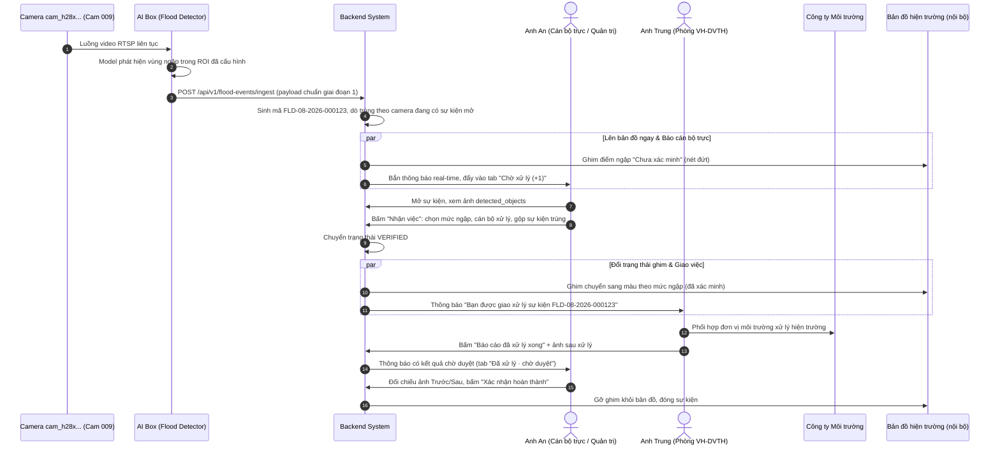
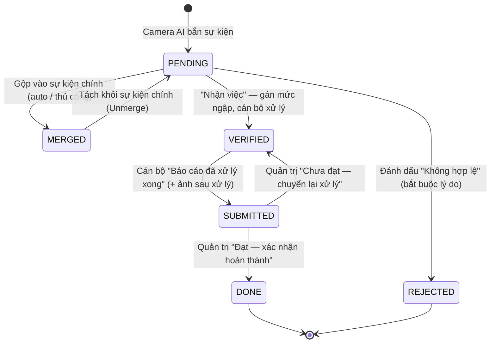
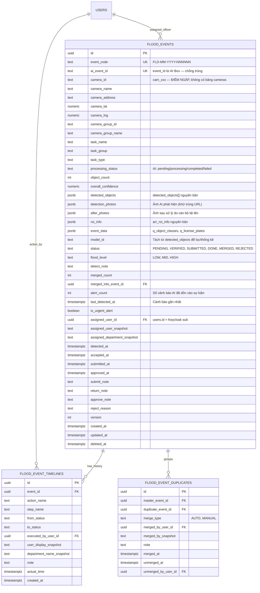
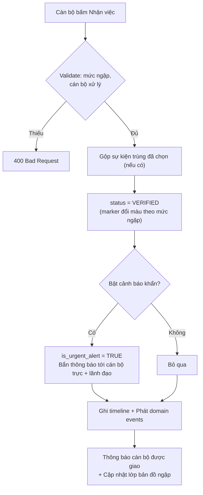
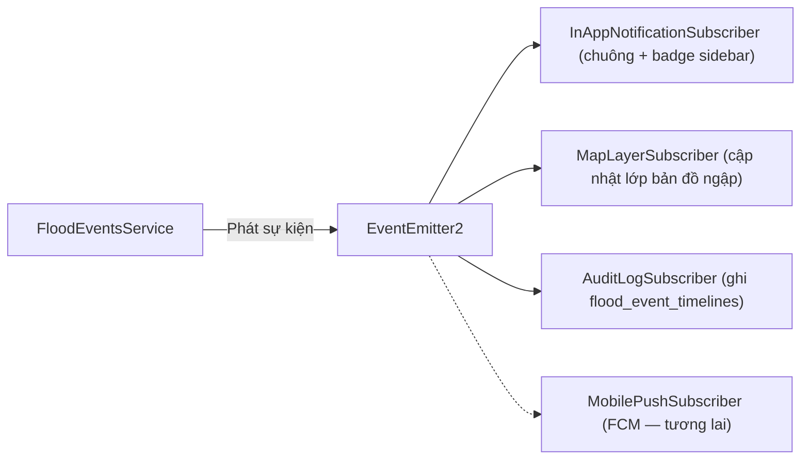

# TÀI LIỆU THIẾT KẾ KỸ THUẬT CHI TIẾT

# PHÂN HỆ: QUẢN LÝ NGẬP ÚNG (FLOOD MANAGEMENT)

> Phạm vi: Tiếp nhận sự kiện ngập từ Camera AI → Cán bộ nhận việc → Xử lý hiện trường → Báo cáo kết quả → Quản trị duyệt hoàn thành.
>
> **Các quyết định thiết kế nền tảng:**
>
> 1. **Không thiết kế bảng `cameras`**. Camera là dữ liệu của hệ thống AI Box/CMS bên ngoài; phân hệ ngập úng chỉ lưu **mã tham chiếu** (`camera_id` dạng `cam_xxx`) và **snapshot** thông tin hiển thị lấy từ payload.
> 2. **Điểm ngập chính là vị trí camera**. Không có danh mục điểm ngập riêng — mỗi camera giám sát ngập tương đương một điểm ngập, tọa độ lấy từ `camera.lat` / `camera.lng` trong payload.
> 3. **Toàn bộ khóa chính dùng `UUID`** (`gen_random_uuid()`). Đây là **sai lệch có chủ ý** so với `BaseEntity` của repo (auto-increment integer) — xem mục 6.4.
> 4. **Một mã nghiệp vụ duy nhất** `FLD-MM-YYYY-NNNNNN` cho toàn vòng đời sự kiện.
> 5. Cấu trúc dữ liệu tiếp nhận bám sát **tài liệu API giai đoạn 1** (`giai-doan-1/Tai_lieu_mo_ta_API_full.md`).

---

## MỤC LỤC

1. [Ví dụ minh họa thực tế ngoài đời thực (Real-world Simulations)](#1-ví-dụ-minh-họa-thực-tế-ngoài-đời-thực-real-world-simulations)
2. [Nghiệp vụ hệ thống & Mô hình trạng thái (Business Flow & State Machine)](#2-nghiệp-vụ-hệ-thống--mô-hình-trạng-thái-business-flow--state-machine)
3. [Thiết kế Cơ sở dữ liệu (Database Schema & Entity Relationship)](#3-thiết-kế-cơ-sở-dữ-liệu-database-schema--entity-relationship)
4. [Thuật toán & Cơ chế kỹ thuật đặc thù (Specialized Mechanisms & Algorithms)](#4-thuật-toán--cơ-chế-kỹ-thuật-đặc-thù-specialized-mechanisms--algorithms)
5. [Danh mục Thiết kế RESTful API Contracts](#5-danh-mục-thiết-kế-restful-api-contracts)
6. [Chuẩn triển khai trong repo backend](#6-chuẩn-triển-khai-trong-repo-backend)

---

## 1. VÍ DỤ MINH HỌA THỰC TẾ NGOÀI ĐỜI THỰC (REAL-WORLD SIMULATIONS)

### 1.1. Luồng chuẩn mực (Happy Case) — Ngập ngã tư Bà Triệu sau cơn mưa lớn

#### 👥 Các nhân vật tham gia:

- **Camera `cam_h28xUnSIzHY3TrF6tmsGo` (Cam 009)**: Camera AI giám sát nút giao Bà Triệu — **đồng thời là điểm ngập** trong hệ thống.
- **Anh Nguyễn Văn An**: Quản trị hệ thống / Cán bộ trực điều hành (người trực hàng đợi sự kiện ngập).
- **Anh Nguyễn Thành Trung**: Phó Trưởng phòng — Phòng Văn hóa & Dịch vụ Tổng hợp (cán bộ nhận việc xử lý).
- **Công ty Môi trường Phố Hiến**: Đơn vị phối hợp mang xe bơm ra hiện trường.

---



---

#### ⏱️ Diễn biến chi tiết từng bước:

- **08:41:00 — Camera AI phát hiện ngập**:
  Camera `cam_h28xUnSIzHY3TrF6tmsGo` (Cam 009) tại ngã tư Bà Triệu ghi nhận vùng nước ngập nằm trong ROI đã cấu hình. AI Box đóng gói payload gồm `camera`, `detected_objects` (đối tượng `flood` kèm `bounding_box` và `media_identifier` trỏ tới ảnh trên S3), `arr_roi_info`, `overall_confidence = 0.91`, `task_type = flood_detection`, gọi API `ingest` về Backend.
- **08:41:02 — Hệ thống tiếp nhận sự kiện**:
  1. Backend kiểm tra `event_id` của AI đã tồn tại chưa (chống trùng khi AI Box retry) → chưa có, tạo bản ghi mới với `id` dạng UUID.
  2. Cấp mã nghiệp vụ `FLD-08-2026-000123` (theo tháng/năm tiếp nhận).
  3. Snapshot thông tin camera (`id`, `name`, `address`, `lat`, `lng`, `group`) vào sự kiện — **đây chính là điểm ngập**, không cần tra cứu danh mục nào khác.
  4. Thuật toán dò trùng kiểm tra camera này có sự kiện nào đang mở (`PENDING`/`VERIFIED`) không → không có.
  5. Trạng thái khởi tạo `PENDING`. **Điểm ngập được ghim lên bản đồ hiện trường ngay lập tức** với marker "Chưa xác minh" (nét đứt, màu xám) — không chờ cán bộ nhận việc.
  6. Phát sự kiện `FloodEventDetectedEvent` → chuông thông báo của Anh An nhảy `(+1)`, sidebar "Ngập úng" hiển thị badge số sự kiện chờ.
- **08:44:00 — Cán bộ trực xác minh nhanh**:
  - Anh An mở hàng đợi tab **"Chờ xử lý"**, thấy dòng `FLD-08-2026-000123 · Cam 009 · Ngã tư Bà Triệu · chờ 3 phút · 2 ảnh`.
  - Xem 2 ảnh AI đã cắt kèm khung `bounding_box` để xác nhận đúng là ngập thật. _(Chức năng xem camera trực tiếp sẽ bổ sung ở giai đoạn sau.)_
- **08:45:00 — Nhận việc & Giao xử lý**:
  - Bấm **[Nhận việc xử lý]**, form hiện ra:
    - **Phân loại mức ngập**: `Ngập nặng`.
    - **Điểm ngập**: hiển thị sẵn `Cam 009 — Ngã tư Bà Triệu` (không cần chọn, lấy từ camera).
    - **Cán bộ nhận việc**: `Nguyễn Thành Trung - Phó Trưởng phòng - Phòng Văn hóa & Dịch vụ Tổng hợp`.
    - **Trùng sự kiện**: hệ thống gợi ý sự kiện đang mở của cùng camera (chọn tối đa một sự kiện để gộp).
    - **Phát cảnh báo khẩn**: bật `ON` (mưa lớn, nút giao đông xe).
  - Bấm **[Nhận việc & phát cảnh báo khẩn]**.
  - Backend: chuyển trạng thái `PENDING → VERIFIED`; marker trên bản đồ **chuyển từ "Chưa xác minh" sang màu theo mức ngập**, đồng thời gửi cảnh báo khẩn tới cán bộ trực & lãnh đạo.
  - Timeline ghi 1 mốc: _"Đã nhận việc"_ (`PENDING → VERIFIED`).
- **09:05:00 — Phối hợp xử lý hiện trường**:
  - Anh Trung phối hợp với `Công ty Môi trường Phố Hiến` bơm cưỡng bức tại hiện trường.
- **10:20:00 — Báo cáo kết quả**:
  - Anh Trung bấm **[Báo cáo đã xử lý xong]**, nhập kết quả: _"Đã bơm cưỡng bức, mặt đường khô, thu dọn rào chắn"_, tải **2 ảnh sau xử lý**.
  - Trạng thái `VERIFIED → SUBMITTED` (Đã xử lý · chờ duyệt). Thông báo bắn về Quản trị.
- **10:35:00 — Quản trị duyệt & Đóng sự kiện**:
  - Anh An mở tab **"Đã xử lý · chờ duyệt (1)"**, đối chiếu ảnh AI phát hiện và ảnh sau xử lý.
  - Chọn **"Đạt — xác nhận hoàn thành"**, ghi chú _"Kiểm tra ảnh hiện trường đạt yêu cầu"_.
  - Trạng thái `SUBMITTED → DONE`, hệ thống **gỡ ghim khỏi bản đồ**, dừng đồng hồ, ghi nhận tổng thời gian xử lý `1 giờ 54 phút`.

---

### 1.2. Các tình huống thực tế đặc thù (Edge Cases)

#### Case 2: Một camera bắn liên tiếp nhiều cảnh báo cho cùng đợt ngập (Gộp trùng)

- **Tình huống**: Camera `cam_01kz5yvxcszc25jn13qbyrv17t` bắn cảnh báo lúc 08:14, 08:16, 08:18 và 08:20 trong cùng đợt mưa tại cổng chợ Phố Hiến.
- **Xử lý Backend**: Vì camera đã có sự kiện `PENDING` đang mở, 3 cảnh báo sau **tự động gộp** vào sự kiện đầu tiên (`status = MERGED`), ghi bản ghi `flood_event_duplicates`. Sự kiện chính cập nhật `alert_count = 4`, `last_detected_at = 08:20`, nối ảnh mới vào `detection_photos` — hàng đợi hiện badge _"Đang tiếp diễn · 4 cảnh báo"_ để cán bộ thấy đợt ngập đang kéo dài chứ không đứng yên.
- **Giao diện**: Cán bộ cũng có thể gộp thủ công — chọn một sự kiện trong hàng đợi rồi bấm **[Gộp vào sự kiện khác]** và chỉ định sự kiện chính. Mỗi thao tác gộp **một** sự kiện; muốn gộp nhiều thì lặp lại thao tác.

#### Case 3: Cảnh báo sai do bóng cây / vệt nước nhỏ (Không hợp lệ)

- **Tình huống**: Camera bắn cảnh báo với `overall_confidence = 0.66`, thực tế là bóng cây che ống kính.
- **Xử lý Backend**: Cán bộ bấm **[Không hợp lệ]**, nhập lý do bắt buộc: _"Cảnh báo sai do bóng cây che ống kính"_ → trạng thái `REJECTED`, marker "Chưa xác minh" tự động biến mất khỏi bản đồ.
- **Giá trị dữ liệu**: Toàn bộ sự kiện `REJECTED` kèm lý do, `model_id` và `overall_confidence` được tổng hợp làm **tập dữ liệu phản hồi** để đội AI tinh chỉnh ngưỡng model và ROI theo từng camera.

#### Case 4: Quản trị duyệt "Chưa đạt" — trả lại xử lý

- **Tình huống**: Cán bộ báo hoàn thành nhưng ảnh vẫn còn đọng nước tại vỉa hè.
- **Xử lý Backend**: Quản trị chọn **"Chưa đạt — chuyển lại xử lý"**, nhập lý do bắt buộc → trạng thái `SUBMITTED → VERIFIED`, xóa `submit_note` cũ, ghi mốc timeline _"Quản trị chuyển lại xử lý"_, sự kiện **vẫn hiển thị trên bản đồ** (vì quay lại `VERIFIED`).

#### Case 5: Tách sự kiện khỏi nhóm gộp (Unmerge)

- **Tình huống**: Sau khi ra hiện trường, xác định cảnh báo lúc 08:16 là đợt ngập độc lập ở làn đường đối diện, cần xử lý riêng.
- **Xử lý Backend**: Bấm **[Tách khỏi sự kiện chính]** → sự kiện con quay lại trạng thái `PENDING`, xóa liên kết `merged_into_event_id`, cập nhật lại `merged_count` của sự kiện cha, ghi log audit.

---

## 2. NGHIỆP VỤ HỆ THỐNG & MÔ HÌNH TRẠNG THÁI (BUSINESS FLOW & STATE MACHINE)

### 2.1. Sơ đồ luồng tổng quan (Core Flow Diagram)



**Ánh xạ Tab giao diện ↔ Trạng thái:**

| Tab hàng đợi         | Trạng thái  | Ý nghĩa                                     |
| :------------------- | :---------- | :------------------------------------------ |
| Chờ xử lý            | `PENDING`   | Sự kiện mới từ camera, chưa ai nhận việc    |
| Đang xử lý           | `VERIFIED`  | Đã nhận việc, đang xử lý hiện trường        |
| Đã xử lý · chờ duyệt | `SUBMITTED` | Cán bộ báo xong, chờ quản trị kiểm tra      |
| Hoàn thành           | `DONE`      | Quản trị đã xác nhận, đóng sự kiện          |
| Sự kiện trùng        | `MERGED`    | Đã gộp vào sự kiện chính                    |
| Không hợp lệ         | `REJECTED`  | Cảnh báo sai / không đạt tiêu chí điểm ngập |

---

### 2.2. Bảng chuyển đổi trạng thái & Điều kiện bảo vệ (State Transitions & Guards)

| Trạng thái nguồn | Hành động (Action) | Trạng thái đích | Quyền thực hiện (`Role`)     | Điều kiện kiểm tra (Guards)                                                                                |
| :--------------- | :----------------- | :-------------- | :--------------------------- | :--------------------------------------------------------------------------------------------------------- |
| `[START]`        | `INGEST_EVENT`     | `PENDING`       | Service Account (AI Box)     | Payload có `camera.id`, `camera.lat/lng`, `event_id` chưa tồn tại, `overall_confidence ≥ ngưỡng cấu hình`. |
| `PENDING`        | `ACCEPT_EVENT`     | `VERIFIED`      | Cán bộ trực / Quản trị       | Bắt buộc: `flood_level`, `assigned_user_id`. Điểm ngập lấy từ camera, không cần nhập.                      |
| `PENDING`        | `REJECT_EVENT`     | `REJECTED`      | Cán bộ trực / Quản trị       | Bắt buộc `reject_reason` ≥ 10 ký tự.                                                                       |
| `PENDING`        | `MERGE_EVENT`      | `MERGED`        | Cán bộ trực / Hệ thống       | `merged_into_event_id` phải tồn tại và **không** ở trạng thái `MERGED` (chống gộp lồng nhau).              |
| `MERGED`         | `UNMERGE_EVENT`    | `PENDING`       | Cán bộ trực / Quản trị       | Sự kiện cha còn tồn tại; ghi lại người thao tác & thời điểm.                                               |
| `VERIFIED`       | `SUBMIT_RESULT`    | `SUBMITTED`     | Cán bộ được giao             | Bắt buộc `submit_note` và **`after_photos` có ít nhất 1 ảnh**.                                             |
| `SUBMITTED`      | `APPROVE_RESULT`   | `DONE`          | Quản trị hệ thống / Lãnh đạo | Đóng sự kiện, marker tự rời bản đồ (do đổi trạng thái), dừng đồng hồ xử lý.                                |
| `SUBMITTED`      | `RETURN_RESULT`    | `VERIFIED`      | Quản trị hệ thống / Lãnh đạo | Bắt buộc `return_note`; điểm ngập vẫn nằm trên bản đồ.                                                     |

---

### 2.3. Ma trận Phân quyền RBAC (Role-Based Access Control)

Mapping chuẩn theo hệ thống Keycloak client `phohien-backend`:

| Hành động nghiệp vụ                                       | Vai trò Keycloak (`Composite Role`) | Action Role được kiểm tra (`@RequireRole`) |
| :-------------------------------------------------------- | :---------------------------------- | :----------------------------------------- |
| AI Box đẩy sự kiện ngập vào hệ thống (**nguồn duy nhất**) | Service Account (`svc-ai-ingest`)   | `flood.event.ingest`                       |
| Xem hàng đợi, bộ lọc, chi tiết sự kiện                    | Tất cả cán bộ                       | `flood.event.view` / `staff-base`          |
| Nhận việc, phân mức ngập, giao cán bộ                     | Cán bộ trực / Quản trị hệ thống     | `flood.event.manage`                       |
| Đánh dấu không hợp lệ                                     | Cán bộ trực / Quản trị hệ thống     | `flood.event.manage`                       |
| Gộp / tách sự kiện trùng                                  | Cán bộ trực / Quản trị hệ thống     | `flood.event.manage`                       |
| Báo cáo đã xử lý xong (+ ảnh sau xử lý)                   | Cán bộ được giao                    | `flood.case.process`                       |
| Duyệt kết quả / Chuyển lại xử lý                          | Quản trị hệ thống / Lãnh đạo        | `flood.case.approve`                       |

---

## 3. THIẾT KẾ CƠ SỞ DỮ LIỆU (DATABASE SCHEMA & ENTITY RELATIONSHIP)

### 3.1. Sơ đồ quan hệ thực thể (ERD)



---

### 3.2. Ánh xạ payload AI giai đoạn 1 → Cột dữ liệu

Payload tiếp nhận **giữ nguyên cấu trúc** đã mô tả trong `giai-doan-1/Tai_lieu_mo_ta_API_full.md`. Bảng ánh xạ:

| Trường payload                                            | Cột lưu trữ                                   | Ghi chú                                                                                                                                                   |
| :-------------------------------------------------------- | :-------------------------------------------- | :-------------------------------------------------------------------------------------------------------------------------------------------------------- |
| `event_id`                                                | `flood_events.ai_event_id`                    | **UNIQUE** — khóa chống trùng khi AI Box gửi lại.                                                                                                         |
| `camera.id`                                               | `flood_events.camera_id`                      | **Chính là định danh điểm ngập.** Không FK, không có bảng `cameras`.                                                                                      |
| `camera.name` / `camera.address`                          | `camera_name` / `camera_address`              | Snapshot để hiển thị lịch sử đúng khi CMS đổi tên.                                                                                                        |
| `camera.lat` / `camera.lng`                               | `camera_lat` / `camera_lng`                   | Tọa độ ghim bản đồ hiện trường.                                                                                                                           |
| `camera.group_id` / `camera.group.name`                   | `camera_group_id` / `camera_group_name`       | Dùng để lọc & thống kê theo cụm camera.                                                                                                                   |
| `camera.username` / `camera.stream_url`                   | **Không lưu**                                 | Theo khuyến nghị mục 8 tài liệu API — tránh lộ thông tin kết nối. Chức năng xem camera trực tiếp chưa nằm trong phạm vi tài liệu này.                     |
| `detected_objects[]`                                      | `flood_events.detected_objects` (JSONB)       | Lưu **nguyên mảng**. Chỉ dùng để vẽ overlay `bounding_box` lên ảnh và đối soát với AI Box — không có truy vấn nghiệp vụ nào theo từng đối tượng.          |
| `detected_objects[].model_id`                             | `flood_events.model_id`                       | Tách riêng ra cột để thống kê tỷ lệ cảnh báo sai theo phiên bản model. Lấy `model_id` của đối tượng đầu tiên (một sự kiện chỉ do một model sinh).         |
| `detected_objects[].media_identifier`                     | `flood_events.detection_photos` (JSONB array) | Gom URL ảnh AI cắt ra, **khử trùng lặp** vì nhiều đối tượng thường trỏ cùng một ảnh. Khi gộp trùng, ảnh của cảnh báo sau được nối thêm vào đây (xem 4.2). |
| `arr_roi_info`                                            | `flood_events.roi_info` (JSONB)               | Lưu nguyên bản, phục vụ hiển thị overlay và đối soát cấu hình — không truy vấn.                                                                           |
| `event_data`                                              | `flood_events.event_data` (JSONB)             | Giữ nguyên `q_object_classes`, `q_license_plates`.                                                                                                        |
| `object_count`, `overall_confidence`, `processing_status` | Cột cùng tên                                  | `overall_confidence` dùng cho ngưỡng lọc & phân tích chất lượng model.                                                                                    |
| `task_name`, `task_group`, `task_type`                    | Cột cùng tên                                  | `task_type` xác định đây là sự kiện ngập; các `task_type` khác định tuyến sang phân hệ tương ứng.                                                         |

> **Về trường thời gian**: payload giai đoạn 1 chưa có trường thời điểm phát hiện ở cấp sự kiện (chỉ `camera.group.created_at`). Backend tạm dùng **thời điểm nhận request** làm `detected_at`. **Kiến nghị AI Box bổ sung `event_time` (Unix timestamp millisecond)** để lịch sử phản ánh đúng thời điểm ngập thực tế khi hàng đợi AI bị trễ; khi có trường này, Backend ưu tiên dùng nó.

---

### 3.3. Chi tiết DDL các bảng nghiệp vụ ngập úng

Tuân thủ quy ước trong `quan-ly-hien-truong-be/AGENT.md`:

- Khóa chính dùng **UUID** sinh bởi `gen_random_uuid()` — hàm này nằm sẵn trong PostgreSQL 13+ nên **không cần tạo extension**, đúng quy ước "migration không tạo extension". Đây là sai lệch có chủ ý so với `BaseEntity`, ghi ở mục 6.4.
- `users.id` cũng là **UUID** (Keycloak `sub`) nên FK trỏ tới người dùng đồng kiểu, không cần chuyển đổi.
- PostgreSQL 14, không PostGIS → toạ độ lưu bằng hai cột `numeric`, không dùng kiểu không gian.
- Tên ràng buộc/index theo mẫu `fk_`, `idx_`, `uq_`, `chk_` + tên bảng + cột.
- Schema chỉ vào database qua migration; `synchronize` luôn tắt.

```sql
-- =====================================================================
-- 1. Bảng chính: Sự kiện ngập
--    Điểm ngập = camera (camera_id). Không có bảng cameras, không có
--    bảng danh mục điểm ngập.
-- =====================================================================
CREATE TABLE flood_events (
    id UUID PRIMARY KEY DEFAULT gen_random_uuid(),
    event_code TEXT NOT NULL,                    -- 'FLD-08-2026-000123' — mã duy nhất toàn vòng đời
    ai_event_id TEXT NOT NULL,                   -- 'event_id' từ AI Box — mọi sự kiện đều đến từ camera

    -- ĐIỂM NGẬP = CAMERA (snapshot từ payload, không FK)
    camera_id TEXT NOT NULL,                     -- 'cam_h28xUnSIzHY3TrF6tmsGo'
    camera_name TEXT,                            -- 'Cam 009'
    camera_address TEXT,                         -- 'Ngã tư Bà Triệu'
    camera_lat NUMERIC(10, 7) NOT NULL,
    camera_lng NUMERIC(10, 7) NOT NULL,
    camera_group_id TEXT,
    camera_group_name TEXT,

    -- Metadata tác vụ AI
    task_name TEXT,
    task_group TEXT,
    task_type TEXT,                              -- 'flood_detection'
    processing_status TEXT,                      -- 'pending','processing','completed','failed'
    object_count INT NOT NULL DEFAULT 0,
    overall_confidence NUMERIC(6, 5),            -- 0.91000
    model_id TEXT,                               -- 'ANS_Flood_v3 v1.0' — tách ra để thống kê theo model
    detected_objects JSONB,                      -- detected_objects[] nguyên bản (bounding_box, tracking_id, attributes...)

    -- Ảnh: lưu trực tiếp dạng mảng JSONB, không tách bảng riêng
    detection_photos JSONB NOT NULL DEFAULT '[]'::jsonb,
        -- [{ "url": "https://.../20260806_084100_1.jpg", "capturedAt": "2026-08-06T08:41:00+07:00" }]
    after_photos JSONB NOT NULL DEFAULT '[]'::jsonb,
        -- [{ "url": "https://.../result_1.jpg", "uploadedBy": "<uuid>", "uploadedAt": "..." }]
    roi_info JSONB,                              -- arr_roi_info nguyên bản
    event_data JSONB,                            -- q_object_classes, q_license_plates

    -- Trạng thái & phân loại nghiệp vụ
    status TEXT NOT NULL DEFAULT 'PENDING',
        -- 'PENDING','VERIFIED','SUBMITTED','DONE','MERGED','REJECTED'
    flood_level TEXT,                            -- 'LOW' (nhẹ), 'MID' (trung bình), 'HIGH' (nặng)
    detect_note TEXT,

    -- Gộp trùng & diễn biến leo thang
    merged_count INT NOT NULL DEFAULT 0,
    merged_into_event_id UUID,
    alert_count INT NOT NULL DEFAULT 1,          -- Tổng số cảnh báo AI đã dồn vào sự kiện này (kể cả cảnh báo đầu)
    last_detected_at TIMESTAMPTZ NOT NULL,       -- Thời điểm cảnh báo GẦN NHẤT — sự kiện càng mới càng nổi lên đầu hàng đợi

    -- Cảnh báo khẩn (việc hiển thị trên bản đồ suy ra từ status, không lưu cờ riêng)
    is_urgent_alert BOOLEAN NOT NULL DEFAULT FALSE,

    -- Giao việc. Chưa có bảng departments trong hệ thống nên phòng ban chỉ
    -- lưu dạng snapshot văn bản; thay bằng FK khi bảng đó ra đời.
    assigned_user_id UUID,
    assigned_user_snapshot TEXT,
    assigned_department_snapshot TEXT,

    -- Mốc thời gian nghiệp vụ
    detected_at TIMESTAMPTZ NOT NULL,
    accepted_at TIMESTAMPTZ,
    submitted_at TIMESTAMPTZ,
    approved_at TIMESTAMPTZ,

    -- Nội dung nghiệp vụ
    submit_note TEXT,
    return_note TEXT,
    approve_note TEXT,
    reject_reason TEXT,

    version INT NOT NULL DEFAULT 1,              -- @VersionColumn — optimistic lock

    -- Khai báo tường minh: entity không kế thừa BaseEntity (xem mục 6.4)
    created_at TIMESTAMPTZ NOT NULL DEFAULT NOW(),
    updated_at TIMESTAMPTZ NOT NULL DEFAULT NOW(),
    deleted_at TIMESTAMPTZ,

    CONSTRAINT uq_flood_events_event_code UNIQUE (event_code),
    CONSTRAINT uq_flood_events_ai_event_id UNIQUE (ai_event_id),
    CONSTRAINT fk_flood_events_merged_into_event_id
        FOREIGN KEY (merged_into_event_id) REFERENCES flood_events(id) ON DELETE SET NULL,
    CONSTRAINT fk_flood_events_assigned_user_id
        FOREIGN KEY (assigned_user_id) REFERENCES users(id) ON DELETE SET NULL,
    CONSTRAINT chk_flood_events_status
        CHECK (status IN ('PENDING','VERIFIED','SUBMITTED','DONE','MERGED','REJECTED')),
    CONSTRAINT chk_flood_events_flood_level
        CHECK (flood_level IS NULL OR flood_level IN ('LOW','MID','HIGH')),
    CONSTRAINT chk_flood_events_merge_self
        CHECK (merged_into_event_id IS NULL OR merged_into_event_id <> id)
);

CREATE INDEX idx_flood_events_status ON flood_events(status);
CREATE INDEX idx_flood_events_camera_id ON flood_events(camera_id);
CREATE INDEX idx_flood_events_camera_group_id ON flood_events(camera_group_id);
CREATE INDEX idx_flood_events_model_id ON flood_events(model_id);
CREATE INDEX idx_flood_events_detected_at ON flood_events(detected_at DESC);
CREATE INDEX idx_flood_events_last_detected_at ON flood_events(last_detected_at DESC);
CREATE INDEX idx_flood_events_assigned_user_id ON flood_events(assigned_user_id);

-- Index cốt lõi cho dò trùng: tìm nhanh sự kiện ĐANG MỞ của một camera
CREATE INDEX idx_flood_events_open_by_camera ON flood_events(camera_id, detected_at)
    WHERE status IN ('PENDING','VERIFIED') AND deleted_at IS NULL;

-- Index cho tab "Chờ xử lý"
CREATE INDEX idx_flood_events_pending ON flood_events(detected_at)
    WHERE status = 'PENDING' AND deleted_at IS NULL;

-- Index cho lớp bản đồ hiện trường: các sự kiện chưa đóng đều hiển thị
CREATE INDEX idx_flood_events_on_map ON flood_events(camera_id)
    WHERE status IN ('PENDING','VERIFIED','SUBMITTED') AND deleted_at IS NULL;

-- =====================================================================
-- 2. Nhật ký tiến trình (Audit Trail — chỉ INSERT)
--    Là NGUỒN DUY NHẤT dựng dải "Tiến độ xử lý" trên giao diện.
--    MỖI DÒNG = MỘT LẦN CHUYỂN TRẠNG THÁI.
-- =====================================================================
CREATE TABLE flood_event_timelines (
    id UUID PRIMARY KEY DEFAULT gen_random_uuid(),
    event_id UUID NOT NULL,
    action_name TEXT NOT NULL,                   -- 'ACCEPT_EVENT', 'SUBMIT_RESULT', 'APPROVE_RESULT'...
    step_name TEXT NOT NULL,                     -- 'Đã nhận việc', 'Quản trị xác nhận hoàn thành'
    from_status TEXT,
    to_status TEXT NOT NULL,
    executed_by_user_id UUID,
    user_display_snapshot TEXT,
    department_name_snapshot TEXT,
    note TEXT,
    actual_time TIMESTAMPTZ NOT NULL DEFAULT NOW(),

    created_at TIMESTAMPTZ NOT NULL DEFAULT NOW(),
    updated_at TIMESTAMPTZ NOT NULL DEFAULT NOW(),
    deleted_at TIMESTAMPTZ,

    CONSTRAINT fk_flood_event_timelines_event_id
        FOREIGN KEY (event_id) REFERENCES flood_events(id) ON DELETE CASCADE,
    CONSTRAINT fk_flood_event_timelines_executed_by_user_id
        FOREIGN KEY (executed_by_user_id) REFERENCES users(id) ON DELETE SET NULL,
    CONSTRAINT chk_flood_event_timelines_status_changed
        CHECK (from_status IS NULL OR from_status <> to_status)
);

CREATE INDEX idx_flood_event_timelines_event_id ON flood_event_timelines(event_id, actual_time ASC);

-- =====================================================================
-- 3. Liên kết sự kiện trùng (hỗ trợ gộp & tách)
-- =====================================================================
CREATE TABLE flood_event_duplicates (
    id UUID PRIMARY KEY DEFAULT gen_random_uuid(),
    master_event_id UUID NOT NULL,
    duplicate_event_id UUID NOT NULL,
    merge_type TEXT NOT NULL DEFAULT 'MANUAL',   -- 'AUTO', 'MANUAL'
    merged_by_user_id UUID,
    merged_by_snapshot TEXT,
    note TEXT,
    merged_at TIMESTAMPTZ NOT NULL DEFAULT NOW(),
    unmerged_at TIMESTAMPTZ,
    unmerged_by_user_id UUID,

    created_at TIMESTAMPTZ NOT NULL DEFAULT NOW(),
    updated_at TIMESTAMPTZ NOT NULL DEFAULT NOW(),
    deleted_at TIMESTAMPTZ,

    CONSTRAINT fk_flood_event_duplicates_master_event_id
        FOREIGN KEY (master_event_id) REFERENCES flood_events(id) ON DELETE CASCADE,
    CONSTRAINT fk_flood_event_duplicates_duplicate_event_id
        FOREIGN KEY (duplicate_event_id) REFERENCES flood_events(id) ON DELETE CASCADE,
    CONSTRAINT fk_flood_event_duplicates_merged_by_user_id
        FOREIGN KEY (merged_by_user_id) REFERENCES users(id) ON DELETE SET NULL,
    CONSTRAINT fk_flood_event_duplicates_unmerged_by_user_id
        FOREIGN KEY (unmerged_by_user_id) REFERENCES users(id) ON DELETE SET NULL,
    CONSTRAINT uq_flood_event_duplicates_pair UNIQUE (master_event_id, duplicate_event_id),
    CONSTRAINT chk_flood_event_duplicates_self CHECK (master_event_id <> duplicate_event_id),
    CONSTRAINT chk_flood_event_duplicates_merge_type CHECK (merge_type IN ('AUTO','MANUAL'))
);

CREATE INDEX idx_flood_event_duplicates_master_event_id
    ON flood_event_duplicates(master_event_id)
    WHERE unmerged_at IS NULL;
```

#### Thứ tự migration

Mỗi bảng một migration, tên PascalCase mở đầu bằng động từ hợp lệ:

```bash
pnpm run db:generate CreateFloodEventsTable
pnpm run db:generate CreateFloodEventTimelinesTable
pnpm run db:generate CreateFloodEventDuplicatesTable
pnpm run db:migrate && pnpm run db:revert && pnpm run db:migrate
```

#### Tham số cấu hình (biến môi trường, không lưu DB)

Khai báo trong `src/config/env.validation.ts`, đọc qua `ConfigService`, thêm giá trị local vào `.env.example`:

| Biến                       | Mặc định          | Ý nghĩa                                                      |
| :------------------------- | :---------------- | :----------------------------------------------------------- |
| `FLOOD_AI_MIN_CONFIDENCE`  | `0.65`            | `overall_confidence` tối thiểu để nhận sự kiện từ AI Box     |
| `FLOOD_AUTO_MERGE_ENABLED` | `true`            | Tự động gộp cảnh báo mới vào sự kiện đang mở của cùng camera |
| `FLOOD_TASK_TYPES`         | `flood_detection` | Danh sách `task_type` được định tuyến vào phân hệ ngập úng   |

---

### 3.4. Hệ quả của việc dùng camera làm điểm ngập

Thiết kế **không có bảng danh mục điểm ngập**. Các nhu cầu nghiệp vụ được đáp ứng như sau:

| Nhu cầu nghiệp vụ                   | Cách đáp ứng                                                                                                   |
| :---------------------------------- | :------------------------------------------------------------------------------------------------------------- |
| Hiển thị tên điểm ngập              | `camera_name` + `camera_address` (snapshot từ payload)                                                         |
| Ghim vị trí trên bản đồ             | `camera_lat` / `camera_lng`                                                                                    |
| Bộ lọc "Điểm ngập" trên hàng đợi    | Dropdown sinh từ `SELECT DISTINCT camera_id, camera_name FROM flood_events` (hoặc gọi danh sách camera từ CMS) |
| Thống kê theo điểm ngập             | `GROUP BY camera_id`                                                                                           |
| Nhóm nhiều camera thành một khu vực | `camera_group_id` / `camera_group_name` có sẵn trong payload                                                   |
| Dò trùng                            | Đối chiếu trực tiếp `camera_id` — không cần bán kính, không cần Haversine                                      |

> **Điểm cần lưu ý khi vận hành**: vì điểm ngập gắn với camera, việc **di dời hoặc thay thế camera** sẽ tạo ra một điểm ngập mới trong thống kê dù thực địa không đổi. Nếu phường cần theo dõi điểm ngập xuyên suốt qua các lần thay thiết bị, giải pháp là gom theo `camera_group_id` — đặt các camera cùng soi một vị trí vào chung một nhóm trên CMS.

---

## 4. THUẬT TOÁN & CƠ CHẾ KỸ THUẬT ĐẶC THÙ (SPECIALIZED MECHANISMS & ALGORITHMS)

### 4.1. Cơ chế sinh mã sự kiện duy nhất

Hệ thống dùng **một mã duy nhất** cho toàn bộ vòng đời, cấp ngay tại thời điểm tiếp nhận và **không đổi** qua các trạng thái:

| Quy chuẩn                          | Ví dụ                | Thời điểm sinh                           |
| :--------------------------------- | :------------------- | :--------------------------------------- |
| `FLD-<Tháng>-<Năm>-<STT 6 chữ số>` | `FLD-08-2026-000123` | Ngay khi AI Box đẩy sự kiện vào hàng đợi |

- Khóa chính `id` là UUID, chỉ dùng nội bộ và cho các khóa ngoại. **API định danh sự kiện bằng `event_code`** — mã nghiệp vụ cán bộ đọc và trao đổi được.
- **Thống kê số vụ xử lý thực tế**: lọc theo trạng thái, ví dụ `COUNT(*) WHERE status IN ('VERIFIED','SUBMITTED','DONE')` — loại trừ `REJECTED` (cảnh báo sai) và `MERGED` (trùng lặp).

```typescript
@Injectable()
export class FloodCodeGeneratorService {
  constructor(private readonly redisService: RedisService) {}

  async generateEventCode(detectedAt: Date): Promise<string> {
    const mm = dayjs(detectedAt).format('MM');
    const yyyy = dayjs(detectedAt).format('YYYY');
    const key = `seq:flood_event:${yyyy}${mm}`;
    const seq = await this.redisService.incr(key); // INCR atomic — chống race condition
    if (seq === 1) await this.redisService.expire(key, 60 * 60 * 24 * 40);
    return `FLD-${mm}-${yyyy}-${String(seq).padStart(6, '0')}`;
  }
}
```

> **Fallback khi Redis mất kết nối**: dùng bảng `flood_code_sequences(scope_key, current_value)` với `UPDATE ... RETURNING` trong transaction để giữ tính duy nhất.

---

### 4.2. Thuật toán gộp sự kiện trùng (Dedup theo camera)

Vì **điểm ngập chính là camera**, việc dò trùng trở nên đơn giản và chính xác tuyệt đối — không cần tính khoảng cách:

```
Cảnh báo mới B là trùng của sự kiện A khi:
  A.camera_id = B.camera_id                    (cùng camera → cùng điểm ngập)
VÀ A.status ∈ {PENDING, VERIFIED}              (sự kiện chính còn đang mở)
VÀ A.merged_into_event_id IS NULL              (không gộp lồng nhau)
```

> **Không dùng cửa sổ thời gian**: chừng nào điểm ngập chưa được xử lý xong (`DONE`), mọi cảnh báo mới từ camera đó đều thuộc **cùng một đợt ngập** — kể cả khi cách nhau vài giờ do mưa kéo dài. Ranh giới đóng/mở của sự kiện chính chính là ranh giới gom trùng, tránh việc một đợt ngập kéo dài bị xé thành hàng chục sự kiện rời rạc.

#### Gộp trùng phải giữ được diễn biến leo thang

Gộp im lặng sẽ **che mất tình huống nước dâng**: sự kiện nằm ở `PENDING` từ 08:41, camera bắn thêm lúc 09:10 · 09:30 · 10:00 với mực nước cao dần, nhưng cả ba đều biến khỏi hàng đợi và cán bộ mở hồ sơ vẫn chỉ thấy ảnh lúc 08:41. Vì vậy mỗi lần gộp, sự kiện chính được **làm giàu** thay vì chỉ đếm:

| Cập nhật trên sự kiện chính                    | Tác dụng                                                                                    |
| :--------------------------------------------- | :------------------------------------------------------------------------------------------ |
| `alert_count += 1`                             | Hàng đợi hiện badge _"Đang tiếp diễn · 4 cảnh báo"_ — cường độ nhìn thấy được ngay          |
| `last_detected_at = cảnh báo mới nhất`         | Sắp xếp mặc định theo cột này, sự kiện đang leo thang nổi lên đầu                           |
| Nối ảnh của sự kiện con vào `detection_photos` | Cán bộ xem chuỗi ảnh 08:41 → 10:00, tự đánh giá nước dâng bao nhiêu trước khi chọn mức ngập |
| `overall_confidence = MAX(cũ, mới)`            | Giữ độ tin cậy cao nhất của cả đợt, không kẹt ở giá trị thấp của cảnh báo đầu               |

`detection_photos` giới hạn **10 ảnh gần nhất** để cột JSONB không phình theo một đợt mưa kéo dài; ảnh cũ hơn vẫn truy được qua sự kiện con đã gộp.

```typescript
@Injectable()
export class FloodDeduplicationService {
  /** Tìm sự kiện đang mở của cùng camera. Ưu tiên sự kiện mở sớm nhất. */
  async findMasterCandidate(cameraId: string, excludeId?: string): Promise<FloodEvent | null> {
    return this.repo.findOne({
      where: {
        cameraId,
        status: In(['PENDING', 'VERIFIED']),
        mergedIntoEventId: IsNull(),
        deletedAt: IsNull(),
        ...(excludeId ? { id: Not(excludeId) } : {}),
      },
      order: { detectedAt: 'ASC' },
    });
  }

  /**
   * Merge a duplicate into its master.
   *
   * The duplicate keeps its own AI payload untouched. The master absorbs the
   * escalation signals so a rising flood stays visible while nobody has picked
   * the event up yet.
   */
  async merge(
    master: FloodEvent,
    duplicate: FloodEvent,
    actor: UserContext,
    type: 'AUTO' | 'MANUAL',
  ) {
    if (duplicate.status === 'MERGED') throw new ConflictException('Sự kiện đã được gộp trước đó.');
    if (master.mergedIntoEventId)
      throw new ConflictException('Không gộp vào một sự kiện đã bị gộp.');

    duplicate.status = 'MERGED';
    duplicate.mergedIntoEventId = master.id;

    master.mergedCount = (await this.countChildren(master.id)) + 1;
    master.alertCount += 1;
    master.lastDetectedAt = maxDate(master.lastDetectedAt, duplicate.detectedAt);
    master.overallConfidence = Math.max(
      master.overallConfidence ?? 0,
      duplicate.overallConfidence ?? 0,
    );
    master.detectionPhotos = mergePhotos(
      master.detectionPhotos,
      duplicate.detectionPhotos,
      MAX_DETECTION_PHOTOS, // keep the 10 most recent
    );

    await this.duplicateRepo.save({
      masterEventId: master.id,
      duplicateEventId: duplicate.id,
      mergeType: type,
      mergedByUserId: actor.userId,
      mergedBySnapshot: actor.displayName,
    });
  }
}
```

**Tách khỏi nhóm (Unmerge)**: cập nhật `flood_event_duplicates.unmerged_at`, đưa sự kiện con về `PENDING`, `merged_into_event_id = NULL`, tính lại `merged_count` và `alert_count` của sự kiện cha, gỡ ảnh của sự kiện con khỏi `detection_photos` của cha, và ghi mốc audit — **không xóa bản ghi lịch sử gộp**.

**Gộp thủ công liên camera**: hai camera kề nhau cùng soi một đoạn đường ngập vẫn có thể gộp bằng tay từ hàng đợi — mỗi lần một sự kiện. Khi đó `merge_type = 'MANUAL'`, sự kiện chính giữ camera của chính nó, sự kiện con vẫn lưu camera gốc để không mất dấu nguồn phát hiện.

---

### 4.3. Hiển thị điểm ngập trên bản đồ & Cảnh báo khẩn

#### a) Điểm ngập lên bản đồ ngay từ lúc AI bắn về

Bản đồ ngập úng **không có cờ riêng** — việc hiển thị **suy ra trực tiếp từ `status`**, nên không bao giờ lệch giữa hàng đợi và bản đồ:

| Trạng thái                     | Hiển thị trên bản đồ hiện trường                                                      |
| :----------------------------- | :------------------------------------------------------------------------------------ |
| `PENDING`                      | **Ghim nét đứt, màu xám — "Chưa xác minh"**. Có ngay khi AI bắn về, không chờ cán bộ. |
| `VERIFIED`                     | Ghim đặc, tô màu theo mức ngập: vàng (nhẹ) / cam (trung bình) / đỏ (nặng)             |
| `SUBMITTED`                    | Ghim đặc + badge "Chờ duyệt"                                                          |
| `DONE` / `REJECTED` / `MERGED` | Không hiển thị (đã đóng hoặc gộp vào sự kiện chính)                                   |

Lý do ghim ngay ở `PENDING`: sự kiện có thể nằm chờ cán bộ xác minh khá lâu — nếu đợi cán bộ nhận việc mới ghim thì suốt quãng đó bản đồ không phản ánh thực tế đang ngập. Bản đồ là **công cụ nội bộ của cán bộ**, nên hiển thị cả cảnh báo chưa xác minh là có lợi; nhãn "Chưa xác minh" đủ để người xem không nhầm với điểm đã kiểm chứng.

#### b) Luồng khi cán bộ bấm "Nhận việc"

Thực hiện trong **một transaction**:



- **Cảnh báo khẩn (`is_urgent_alert`)** là tùy chọn ngay trên form Nhận việc, chỉ dùng khi tình huống nguy cấp: bắn thông báo tức thì tới **cán bộ trực + lãnh đạo**, sự kiện hiển thị badge đỏ _"Đã phát cảnh báo"_. Cờ này chỉ đặt **một lần tại thời điểm nhận việc**, không có thao tác phát cảnh báo bổ sung về sau.
- **Khi `APPROVE_RESULT`**: trạng thái sang `DONE` → marker **tự rời bản đồ** (không cần cập nhật cờ nào).
- **Khi `RETURN_RESULT`** (chưa đạt): quay về `VERIFIED` → marker **vẫn còn trên bản đồ**.

---

### 4.4. Kiến trúc thông báo tách rời (Decoupled Notification Architecture)



| Domain Event                      | Thời điểm phát                 | Người nhận thông báo                                                                         |
| :-------------------------------- | :----------------------------- | :------------------------------------------------------------------------------------------- |
| `flood.event.detected`            | AI Box đẩy sự kiện mới         | Cán bộ trực (`flood.event.manage`) — badge tab "Chờ xử lý" + ghim "Chưa xác minh" lên bản đồ |
| `flood.event.accepted`            | Nhận việc, giao cán bộ xử lý   | Cán bộ được giao + lớp bản đồ                                                                |
| `flood.event.urgent_alert`        | Nhận việc có bật cảnh báo khẩn | Toàn bộ cán bộ trực + Lãnh đạo                                                               |
| `flood.event.merged` / `unmerged` | Gộp / tách sự kiện             | Cán bộ đang giữ sự kiện chính                                                                |
| `flood.event.submitted`           | Cán bộ báo xong                | Quản trị hệ thống (tab "Chờ duyệt")                                                          |
| `flood.event.approved`            | Quản trị duyệt đạt             | Cán bộ xử lý + lớp bản đồ (marker rời bản đồ)                                                |
| `flood.event.returned`            | Quản trị trả lại               | Cán bộ xử lý                                                                                 |

```typescript
export class FloodEventAcceptedEvent {
  constructor(
    public readonly eventId: string, // UUID
    public readonly eventCode: string,
    public readonly cameraName: string,
    public readonly floodLevel: 'LOW' | 'MID' | 'HIGH',
    public readonly assignedUserId: string,
    public readonly isUrgentAlert: boolean,
  ) {}
}

@Injectable()
export class FloodNotificationSubscriber {
  constructor(private readonly inApp: InAppNotificationService) {}

  @OnEvent('flood.event.detected')
  async onDetected(e: FloodEventDetectedEvent) {
    await this.inApp.sendToRole({
      role: 'flood.event.manage',
      title: 'Sự kiện ngập mới cần xử lý',
      body: `${e.eventCode} · ${e.cameraName} · ${e.cameraAddress}`,
      link: `/flood-events?code=${e.eventCode}`,
    });
  }

  @OnEvent('flood.event.accepted')
  async onAccepted(e: FloodEventAcceptedEvent) {
    await this.inApp.sendToUser({
      userId: e.assignedUserId,
      title: 'Bạn được giao xử lý sự kiện ngập',
      body: `Sự kiện ${e.eventCode} tại ${e.cameraName} (${e.floodLevel}).`,
      link: `/flood-events/${e.eventCode}`,
    });
    if (e.isUrgentAlert) {
      await this.inApp.sendToRole({
        role: 'flood.event.manage',
        title: '⚠ CẢNH BÁO NGẬP KHẨN',
        body: `${e.eventCode} — ${e.cameraName}. Đề nghị các bộ phận phối hợp xử lý ngay.`,
      });
    }
  }
}
```

---

## 5. DANH MỤC THIẾT KẾ RESTFUL API CONTRACTS

### 5.1. API tiếp nhận từ AI Box (Service-to-Service)

#### Đẩy sự kiện ngập từ Camera AI

- **Endpoint**: `POST /api/v1/flood-events/ingest`
- **Auth**: Service Account — `@RequireRole('flood.event.ingest')`
- **Request Body**: **giữ nguyên schema payload giai đoạn 1**, không yêu cầu AI Box đổi format:
  ```json
  {
    "camera": {
      "id": "cam_h28xUnSIzHY3TrF6tmsGo",
      "name": "Cam 009",
      "address": "Ngã tư Bà Triệu",
      "lat": 20.654312,
      "lng": 106.052145,
      "group_id": "cg_uzNWenG0PkaY5z89vANkW",
      "group": {
        "id": "cg_uzNWenG0PkaY5z89vANkW",
        "created_at": 1785124559595,
        "updated_at": 1785124559595,
        "name": "Cam W1",
        "description": "Tất cả các camera W1"
      }
    },
    "detected_objects": [
      {
        "object_id": "5-flood",
        "class_label": "flood",
        "confidence_score": 0.91,
        "bounding_box": { "left": 566, "top": 380, "right": 1655, "bottom": 718 },
        "tracking_id": 5,
        "media_identifier": "https://aibox-cm-events.s3.vn1.aiboxvision.com/image/20260806_084100_1.jpg",
        "model_id": "ANS_Flood_v3 v1.0"
      }
    ],
    "event_data": { "q_license_plates": [], "q_object_classes": ["flood"] },
    "arr_roi_info": [
      {
        "roi_points": [
          { "x": 265, "y": 325 },
          { "x": 1269, "y": 560 },
          { "x": 96, "y": 720 }
        ],
        "roi_match": "Centre Point",
        "option": "Inside ROI",
        "name": "Polygon 1",
        "roi_type": "Generic",
        "custom_model_roi": false,
        "original_image_size": 2688
      }
    ],
    "event_id": "6a72fe1e25c71dcf3db2cb4b",
    "object_count": 1,
    "overall_confidence": 0.91,
    "processing_status": "completed",
    "task_name": "Phat hien ngap - Nga tu Ba Trieu",
    "task_group": "urban_management",
    "task_type": "flood_detection"
  }
  ```
- **Response `201 Created`**:
  ```json
  {
    "success": true,
    "data": {
      "id": "0f9a6c2e-73b8-4f21-9c0e-2b6d9a41c8d3",
      "eventCode": "FLD-08-2026-000123",
      "status": "PENDING",
      "statusLabel": "Chờ xử lý",
      "cameraId": "cam_h28xUnSIzHY3TrF6tmsGo",
      "cameraName": "Cam 009",
      "autoMerged": false,
      "mergedIntoEventCode": null
    }
  }
  ```
- **Các nhánh phản hồi khác**:
  - Tự động gộp trùng (camera đã có sự kiện đang mở): `status = "MERGED"`, `autoMerged = true`, `mergedIntoEventCode = "FLD-08-2026-000121"`.
  - `event_id` đã tồn tại: trả `200 OK` kèm bản ghi cũ (**idempotent**), không tạo mới.
  - `overall_confidence < FLOOD_AI_MIN_CONFIDENCE`: `422 Unprocessable Entity`, không tạo bản ghi.
  - `task_type` không nằm trong `FLOOD_TASK_TYPES`: `400 Bad Request` — sai phân hệ.

---

### 5.2. Nhóm API dành cho Cán bộ & Quản trị

> **Quy ước định danh trên API**: **không dùng path param**. API `POST` truyền `eventCode` trong **request body**; API `GET` truyền `code` qua **query params**.

| Method | Endpoint                          | Body / Query                                                                          | Mô tả                                                                                                                                                                                            |
| :----- | :-------------------------------- | :------------------------------------------------------------------------------------ | :----------------------------------------------------------------------------------------------------------------------------------------------------------------------------------------------- |
| `GET`  | `/api/v1/flood-events`            | `page, limit, tab, q, cameraId, cameraGroupId, fromDate, toDate`                      | Hàng đợi phân trang theo tab (`pending`, `verified`, `submitted`, `done`, `merged`, `rejected`). Sắp xếp mặc định `last_detected_at DESC` để sự kiện đang leo thang nổi lên đầu.                 |
| `GET`  | `/api/v1/flood-events/stats`      | `fromDate, toDate`                                                                    | Đếm số sự kiện theo từng tab (badge).                                                                                                                                                            |
| `GET`  | `/api/v1/flood-events/cameras`    | `{}`                                                                                  | Danh sách camera (điểm ngập) đã từng phát sinh sự kiện — đổ vào bộ lọc "Điểm ngập".                                                                                                              |
| `GET`  | `/api/v1/flood-events/detail`     | `code` (Query)                                                                        | Chi tiết: thông tin camera, đối tượng AI, ảnh, dải tiến độ (timelines), sự kiện trùng, sự kiện cha.                                                                                              |
| `POST` | `/api/v1/flood-events/accept`     | `{ eventCode, floodLevel, assignedUserId, duplicateEventCode?, isUrgentAlert, note }` | **Nhận việc**: gán mức ngập/cán bộ, gộp trùng, tùy chọn phát cảnh báo khẩn; marker đổi sang trạng thái đã xác minh.                                                                              |
| `POST` | `/api/v1/flood-events/reject`     | `{ eventCode, reason }`                                                               | Đánh dấu **Không hợp lệ** (bắt buộc lý do).                                                                                                                                                      |
| `POST` | `/api/v1/flood-events/merge`      | `{ masterEventCode, duplicateEventCode, note }`                                       | Gộp **một** sự kiện vào một sự kiện chính.                                                                                                                                                       |
| `POST` | `/api/v1/flood-events/unmerge`    | `{ eventCode }`                                                                       | Tách sự kiện khỏi nhóm gộp, đưa về `PENDING`.                                                                                                                                                    |
| `POST` | `/api/v1/flood-events/submit`     | `{ eventCode, submitNote, reportedByUserId, afterPhotoUrls[] }`                       | **Báo cáo đã xử lý xong** (bắt buộc ≥1 ảnh sau xử lý).                                                                                                                                           |
| `POST` | `/api/v1/flood-events/approve`    | `{ eventCode, approveNote }`                                                          | **Xác nhận hoàn thành**, marker rời bản đồ.                                                                                                                                                      |
| `POST` | `/api/v1/flood-events/return`     | `{ eventCode, returnNote }`                                                           | **Chuyển lại cán bộ xử lý** (bắt buộc lý do).                                                                                                                                                    |
| `GET`  | `/api/v1/flood-map/active-points` | `{}`                                                                                  | Lớp bản đồ hiện trường: mọi sự kiện `status IN ('PENDING','VERIFIED','SUBMITTED')`, gom theo `camera_id`. Payload rút gọn (tọa độ, tên camera, mức ngập, trạng thái xác minh), không phân trang. |
| `GET`  | `/api/v1/flood-reports/summary`   | `fromDate, toDate, cameraId, cameraGroupId`                                           | Báo cáo: số sự kiện theo camera/mức ngập, tỷ lệ cảnh báo sai theo camera.                                                                                                                        |

---

## 6. CHUẨN TRIỂN KHAI TRONG REPO BACKEND

Phần này ràng buộc tài liệu với `quan-ly-hien-truong-be/AGENT.md`. Đọc trước khi viết dòng code đầu tiên.

### 6.1. Cấu trúc module

Module đặt tại `src/modules/flood-events/` (tên thư mục số nhiều, viết thường). Các tệp cùng tên module:

| Tệp                            | Vai trò                                                                                          |
| :----------------------------- | :----------------------------------------------------------------------------------------------- |
| `flood-events.module.ts`       | Khai báo module, đăng ký entity                                                                  |
| `flood-events.controller.ts`   | Parse request, gọi service, mang decorator route. **Không** chứa logic nghiệp vụ hay truy vấn DB |
| `flood-events.service.ts`      | Toàn bộ quy tắc nghiệp vụ, transaction, orchestration repository                                 |
| `flood-events.dto.ts`          | DTO vào/ra, validate bằng class-validator                                                        |
| `flood-events.entity.ts`       | `FloodEvent`, `FloodEventTimeline`, `FloodEventDuplicate`                                        |
| `flood-events.service.spec.ts` | Unit test cho service                                                                            |

Quy tắc bắt buộc:

- Entity **không** kế thừa `BaseEntity` (vì khóa chính là UUID) — tự khai báo `@PrimaryGeneratedColumn('uuid')` cùng `@CreateDateColumn` / `@UpdateDateColumn` / `@DeleteDateColumn` đúng như `BaseEntity` định nghĩa, để hành vi timestamp và soft delete không lệch. Quan hệ khai báo `eager: false`, load tường minh nơi cần.
- Cột optimistic lock dùng `@VersionColumn`.
- Thao tác ghi nhiều bảng (nhận việc + ghi timeline + gộp trùng) đi qua **transaction helper** trong `src/database`.
- Không import repository của module khác; cần thông tin người dùng thì gọi `UsersService`.
- Ảnh sau xử lý dùng **module `uploads`** sẵn có để lấy URL, phân hệ ngập chỉ lưu URL vào `after_photos`.
- Toàn bộ code và comment viết bằng **tiếng Anh**; tiếng Việt chỉ xuất hiện ở nội dung cán bộ đọc.

### 6.2. Phân quyền — cần bổ sung realm

Realm hiện chỉ đặt chỗ **`flood.point.manage`** và composite **`flood-manager`**. Các action role dưới đây **chưa tồn tại**, phải thêm vào `keycloak/realm-phohien.json`, mirror sang `src/modules/auth/auth.constants.ts` (test so hai bên như hai tập hợp), rồi chạy `pnpm run keycloak:apply` — sửa file realm thôi không có tác dụng.

| Action role           | Dùng cho                                   |
| :-------------------- | :----------------------------------------- |
| `flood.event.ingest`  | Service account AI Box đẩy sự kiện         |
| `flood.event.view`    | Xem hàng đợi, chi tiết, bản đồ, báo cáo    |
| `flood.event.manage`  | Nhận việc, đánh dấu không hợp lệ, gộp/tách |
| `flood.event.process` | Báo cáo đã xử lý xong                      |
| `flood.event.approve` | Duyệt kết quả / chuyển lại xử lý           |

Composite theo đúng mẫu các phân hệ khác, mỗi composite **phải chứa `staff-base`**, lồng đúng một cấp, và mọi action role cũng thuộc `admin`:

`flood-receiver` · `flood-handler` · `flood-approver` · `flood-manager`

Guard chỉ kiểm tra **action role**, không kiểm tra composite. Hai quy tắc không hệ phân quyền nào diễn đạt được, viết trong service: **chỉ cán bộ được giao mới thao tác được hồ sơ của mình**, và **chỉ cho phép chuyển trạng thái hợp lệ từ trạng thái hiện tại**.

### 6.3. Hợp đồng API

- Prefix `/api/v1`, resource số nhiều `/flood-events`.
- Endpoint danh sách nhận `page`, `limit` qua `PaginationDto` (trần 100 enforce ở tầng validate).
- Mọi body/query không tầm thường đều có DTO; thuộc tính lạ bị global pipe từ chối.
- Response dùng đúng một khuôn trong `src/base/response.type.ts` (`buildSuccess` / `buildPaginate`). Service ném exception của Nest, global filter định hình lỗi — **không try/catch trong controller**.
- Sau mỗi lần đổi DTO: chạy `pnpm run openapi:export` và commit `openapi.json`, nếu không CI đỏ.

### 6.4. Sai lệch có chủ ý so với AGENT.md

Ghi rõ để reviewer không coi là lỗi, và nên bổ sung vào mục _Known deviations_ của AGENT.md:

- **Khóa chính là UUID, không phải auto-increment integer.** AGENT.md nêu `BaseEntity` với khóa số tự tăng và coi `users` là ngoại lệ duy nhất. Ba bảng của phân hệ ngập dùng UUID theo yêu cầu thiết kế, nên không kế thừa `BaseEntity` mà khai báo lại đúng bốn cột của nó. Không có bảng nào ngoài phân hệ này trỏ khóa ngoại vào đây, nên khác kiểu khóa không lan sang phần còn lại của hệ thống.
- **Không dùng path param.** AGENT.md quy định `GET /resources/:id` và `POST /resources/:id/action-name`. Phân hệ ngập định danh bằng `event_code` (mã nghiệp vụ cán bộ đọc), truyền qua **body với `POST`** và **query với `GET`**. Kéo theo không dùng `ParseIntPipe` cho route param.

### 6.5. Cổng chất lượng

Chạy đủ trước mỗi commit, CI chạy đúng bộ này:

```bash
pnpm run lint:check
pnpm run format:check
pnpm run typecheck
pnpm test
pnpm run openapi:check
pnpm run build
```

Test cần phủ: khuôn response, hình dạng lỗi, validate, hành vi 401/403, chuyển trạng thái không hợp lệ, dò trùng theo camera, idempotency khi AI Box gửi lại cùng `event_id`, và rollback transaction.
