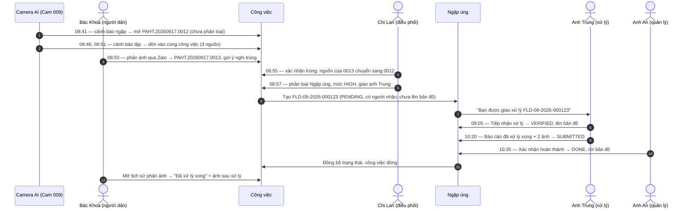
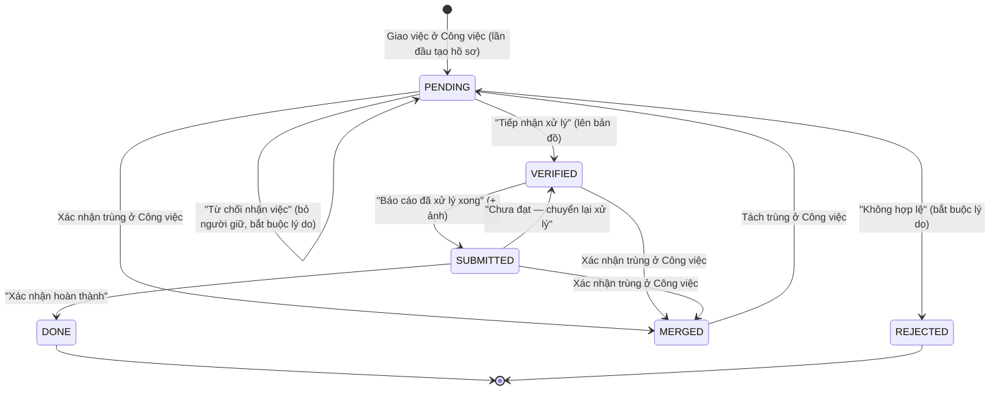
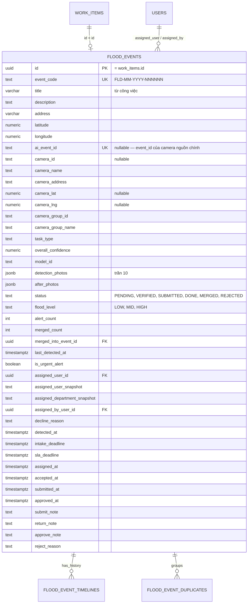

# TÀI LIỆU THIẾT KẾ KỸ THUẬT

# PHÂN HỆ QUẢN LÝ NGẬP ÚNG — XỬ LÝ SỰ VỤ NGẬP

### Phường Phố Hiến — Giai đoạn 2

**Phân hệ này làm gì:** nhận các sự vụ ngập đã được cán bộ điều phối phân loại và giao việc ở màn **Công việc**, rồi quản lý phần xử lý: cán bộ hiện trường tiếp nhận, xử lý, báo cáo kèm ảnh; quản lý duyệt và đóng. Điểm ngập đang xử lý hiện trên bản đồ hiện trường cho tới khi xong. Người dân đã phản ánh xem được kết quả trong lịch sử phản ánh.

## Lịch sử thay đổi

| Ngày       | Phiên bản | Nội dung                                                                                                                                                                                                                                                                                                                        |
| ---------- | --------- | ------------------------------------------------------------------------------------------------------------------------------------------------------------------------------------------------------------------------------------------------------------------------------------------------------------------------------- |
| 2026-08    | v1        | Camera AI đẩy cảnh báo thẳng vào Ngập úng; tự gộp theo camera; cán bộ trực xác minh, giao việc và gộp/tách ngay trên màn Ngập úng.                                                                                                                                                                                              |
| 2026-09-17 | v2        | **Tích hợp Công việc.** Mọi nguồn (camera, người dân, cán bộ tuần tra) vào Công việc; gộp trùng, phân loại, giao việc làm ở Công việc. Hồ sơ Ngập úng chỉ được tạo khi giao việc. Gỡ ingest tạo sự kiện, tự gộp theo camera, ngưỡng độ tin cậy, API `assign`/`merge`/`unmerge`. Lịch sử phản ánh của người dân đọc mọi phân hệ. |

---

## MỤC LỤC

1. [Nghiệp vụ](#1-nghiệp-vụ)
2. [Trạng thái & quy tắc](#2-trạng-thái--quy-tắc)
3. [Hướng dẫn FE](#3-hướng-dẫn-fe)
4. [Danh mục API](#4-danh-mục-api)
5. [Cơ sở dữ liệu](#5-cơ-sở-dữ-liệu)
6. [Các cơ chế đặc thù](#6-các-cơ-chế-đặc-thù)
7. [Chuẩn triển khai trong repo backend](#7-chuẩn-triển-khai-trong-repo-backend)

---

## 1. NGHIỆP VỤ

### 1.1. Luồng tổng thể

```
Người dân (Zalo Mini App) ─┐
Cán bộ tuần tra ───────────┼─► CÔNG VIỆC ─► gộp trùng ─► phân loại "Ngập úng" + mức ngập ─► giao 1 cán bộ
Camera AI ─────────────────┘                                                                     │
                                                                                                 ▼
          NGẬP ÚNG: Chờ xử lý ─► Đang xử lý ─► Đã xử lý · chờ duyệt ─► quản lý duyệt ─► Hoàn thành
                                                                                                 │
          Lịch sử phản ánh (nhúng trong Zalo Mini App) ◄── người dân thấy kết quả ◄──────────────┘
```

### 1.2. Các quyết định nghiệp vụ

- **Công việc là cổng vào duy nhất.** Camera, người dân, cán bộ tuần tra đều tạo công việc. Camera **không** tự gắn phân hệ: cán bộ điều phối phân loại từng công việc. Không lọc cảnh báo camera theo độ tin cậy.
- **Gộp trùng chỉ làm ở Công việc.** Cảnh báo lặp của cùng một camera tự dồn vào một công việc; trùng giữa các nguồn khác nhau do cán bộ xác nhận. Màn chi tiết Ngập úng vẫn xem được mọi nguồn phản ánh và các công việc đã gộp.
- **Một lĩnh vực, một người chịu trách nhiệm.** Ngập úng chỉ có lĩnh vực `NGAP_UNG`; mỗi sự vụ giao đúng một cán bộ.
- **Mức ngập chọn lúc phân loại.** `LOW` / `MID` / `HIGH` quyết định hạn xử lý.
- **Một mã hồ sơ `FLD-MM-YYYY-NNNNNN`** cấp khi giao việc lần đầu, không đổi suốt vòng đời. Người dân chỉ biết mã công việc `PAHT.YYYYMMDD.NNNN`.
- **Điểm ngập chưa có người tiếp nhận không lên bản đồ.** Bản đồ chỉ hiện điểm đang được xử lý.
- **Không gửi thông báo đẩy cho người dân.** Người dân xem kết quả trong lịch sử phản ánh; lý do từ chối chỉ hiện khi cán bộ chọn thông báo.

### 1.3. Một ngày làm việc bình thường

Nhân vật: **chị Lan** — điều phối ở màn Công việc. **Anh Trung** — cán bộ xử lý hiện trường. **Anh An** — quản lý Ngập úng.



### 1.4. Các tình huống thực tế

**(1) Mưa kéo dài, camera bắn liên tục.** Công việc đang mở của camera nhận thêm nguồn thay vì mở công việc mới. Nếu đã có hồ sơ Ngập úng, hồ sơ được **làm giàu**: `alert_count` tăng, `last_detected_at` cập nhật, ảnh mới nối vào `detection_photos` (giữ 10 ảnh gần nhất). Khi hồ sơ kết thúc (`DONE`, `REJECTED`, `MERGED`), cảnh báo tiếp theo của camera mở một công việc mới.

**(2) Cảnh báo sai.** Chưa giao thì cán bộ điều phối từ chối ở màn Công việc. Đã giao mà chưa ai tiếp nhận thì quản lý bấm **[Không hợp lệ]** ở Ngập úng, lý do bắt buộc, tùy chọn _Thông báo cho người phản ánh_.

**(3) Cán bộ được giao không đi được.** Trên hồ sơ `PENDING` anh Trung có ba lựa chọn:

- **[Tiếp nhận xử lý]** → `VERIFIED`, lên bản đồ, người điều phối nhận thông báo.
- **[Từ chối nhận việc]** kèm lý do → hồ sơ về `PENDING` không người giữ; màn Công việc hiện **Chưa giao** để chị Lan giao lại người khác.
- **[Chuyển xử lý]** cho đồng nghiệp kèm lý do → đổi người giữ, vẫn `PENDING`; người mới và người điều phối đều nhận thông báo.

Đã tiếp nhận thì không từ chối hay chuyển được nữa, và màn Công việc cũng không giao đè được.

**(4) Quản lý duyệt "Chưa đạt".** **[Chuyển lại xử lý]** kèm lý do → `SUBMITTED → VERIFIED`, xóa `submit_note` cũ, vẫn trên bản đồ.

**(5) Hai hồ sơ Ngập úng hóa ra là một.** Cán bộ điều phối xác nhận trùng ở Công việc. Hồ sơ phụ chuyển `MERGED`, bỏ người giữ, nguồn và ảnh dồn về hồ sơ gốc. Tách trùng ở Công việc đưa hồ sơ phụ về `PENDING` chờ giao lại.

---

## 2. TRẠNG THÁI & QUY TẮC

### 2.1. Mô hình trạng thái



`DONE`, `REJECTED`, `MERGED` là trạng thái kết thúc.

| Tab hàng đợi         | `tab`       | Trạng thái   | Trên bản đồ                                                     |
| :------------------- | :---------- | :----------- | :-------------------------------------------------------------- |
| Chờ xử lý            | `pending`   | `PENDING`    | Không — kể cả đã giao mà chưa tiếp nhận                         |
| Sắp đến hạn          | `soon`      | Mọi hồ sơ mở | Theo trạng thái của từng hồ sơ                                  |
| Đang xử lý           | `verified`  | `VERIFIED`   | Ghim đặc, màu theo mức ngập: vàng `LOW` / cam `MID` / đỏ `HIGH` |
| Đã xử lý · chờ duyệt | `submitted` | `SUBMITTED`  | Ghim đặc + badge "Chờ duyệt"                                    |
| Hoàn thành           | `done`      | `DONE`       | Không                                                           |
| Sự kiện trùng        | `merged`    | `MERGED`     | Không                                                           |
| Không hợp lệ         | `rejected`  | `REJECTED`   | Không                                                           |

Hồ sơ `PENDING` có ba dạng, FE phân biệt bằng `assigned_user_snapshot` và `decline_reason`:

| `assigned_user_snapshot` | `decline_reason` | Hiển thị                                    |
| :----------------------- | :--------------- | :------------------------------------------ |
| Có tên                   | `null`           | _Đã giao · chờ tiếp nhận_                   |
| `null`                   | Có lý do         | _Bị từ chối · chờ giao lại ở Công việc_     |
| `null`                   | `null`           | _Chờ giao lại ở Công việc_ (sau tách trùng) |

### 2.2. Bảng chuyển trạng thái & điều kiện

| Từ                               | Hành động (`action_name`) | Sang        | Ở đâu / ai làm                             | Điều kiện                                                                                                                                               |
| :------------------------------- | :------------------------ | :---------- | :----------------------------------------- | :------------------------------------------------------------------------------------------------------------------------------------------------------ |
| —                                | `INGEST_EVENT`            | `PENDING`   | Công việc — giao việc lần đầu              | Công việc đã phân loại `FLOOD_EVENTS` / `NGAP_UNG`, có `flood_level`, giao đúng 1 cán bộ                                                                |
| `PENDING`                        | `ASSIGN_EVENT`            | `PENDING`   | Công việc — giao việc / giao lại           | Ghi người giữ, `assigned_by_user_id`, `assigned_at`, `sla_deadline` theo mức ngập; xóa `decline_reason`. Đã `VERIFIED` trở đi → `409`                   |
| `PENDING`                        | `ACCEPT_EVENT`            | `VERIFIED`  | Ngập úng — cán bộ được giao                | `409` nếu chưa giao ai; `403` nếu không phải người được giao                                                                                            |
| `PENDING`                        | `DECLINE_EVENT`           | `PENDING`   | Ngập úng hoặc Công việc — cán bộ được giao | Lý do bắt buộc; bỏ người giữ, giữ `flood_level`, ghi `decline_reason`                                                                                   |
| `PENDING`                        | `TRANSFER_EVENT`          | `PENDING`   | Ngập úng — cán bộ được giao                | Lý do ≥ 10 ký tự; người nhận phải tồn tại (`404`) và thuộc một phòng ban (`409`); không chuyển cho chính mình (`409`); giữ nguyên `assigned_by_user_id` |
| `PENDING`                        | `REJECT_EVENT`            | `REJECTED`  | Ngập úng — quản lý                         | Lý do ≥ 10 ký tự; `notify_reporter` tùy chọn                                                                                                            |
| `PENDING`/`VERIFIED`/`SUBMITTED` | `MERGE_EVENT`             | `MERGED`    | Công việc — xác nhận trùng                 | Cả hai công việc đã có hồ sơ Ngập úng; không gộp lồng                                                                                                   |
| `MERGED`                         | `UNMERGE_EVENT`           | `PENDING`   | Công việc — tách trùng                     | Hồ sơ gốc còn tồn tại                                                                                                                                   |
| `VERIFIED`                       | `SUBMIT_RESULT`           | `SUBMITTED` | Ngập úng — cán bộ được giao                | `submit_note` và ≥ 1 ảnh sau xử lý; `403` nếu không phải người được giao                                                                                |
| `SUBMITTED`                      | `APPROVE_RESULT`          | `DONE`      | Ngập úng — quản lý                         | Đóng hồ sơ, đóng công việc                                                                                                                              |
| `SUBMITTED`                      | `RETURN_RESULT`           | `VERIFIED`  | Ngập úng — quản lý                         | `return_note` ≥ 10 ký tự                                                                                                                                |

Mọi chuyển trạng thái không có trong bảng trả `409`.

### 2.3. Phân quyền

Các route Ngập úng hiện chỉ yêu cầu đăng nhập, chưa kiểm tra action role. Realm mới đặt chỗ `flood.point.manage` và composite `flood-manager`. Hai quy tắc được kiểm tra trong service: **chỉ cán bộ đang được giao mới tiếp nhận, từ chối, chuyển xử lý hoặc báo cáo kết quả**, và **chỉ cho phép chuyển trạng thái hợp lệ từ trạng thái hiện tại**.

---

## 3. HƯỚNG DẪN FE

### 3.1. Việc cần sửa ở màn Ngập úng

| Hiện tại                                                         | Cần đổi                                                                                                                                                                |
| :--------------------------------------------------------------- | :--------------------------------------------------------------------------------------------------------------------------------------------------------------------- |
| Form **Xác minh & Giao việc** gọi `POST /flood-events/assign`    | **Gỡ.** Phân loại và giao việc làm ở màn Công việc (§3.2)                                                                                                              |
| Nút **Gộp** / **Tách** gọi `POST /flood-events/merge`, `unmerge` | **Gỡ.** Xác nhận/tách trùng làm ở màn Công việc                                                                                                                        |
| Chi tiết đọc `duplicates`                                        | Trường đã gỡ. Dùng `sources` (nguồn phản ánh) và `merged_work_items` (công việc đã gộp); hiện `work_item_code`                                                         |
| Hiển thị sự kiện theo camera                                     | `camera_id`, `camera_name`, `camera_lat`, `camera_lng` có thể `null` (sự vụ từ người dân/cán bộ). Tiêu đề dùng `title`, vị trí dùng `address`, `latitude`, `longitude` |
| Nút **Chuyển cho người khác**                                    | Đổi nhãn **Chuyển xử lý**. Bỏ ô chọn phòng ban: `assigned_department_snapshot` không còn dùng, BE lấy phòng ban của người nhận                                         |
| Nút **Không hợp lệ**                                             | Thêm checkbox _Thông báo cho người phản ánh_ → `notify_reporter`                                                                                                       |
| Nhãn hồ sơ `PENDING` chưa có người giữ                           | Hướng người dùng về màn Công việc để giao lại (§2.1)                                                                                                                   |
| Bộ lọc camera                                                    | `GET /flood-events/cameras` chỉ trả camera thật; ô tìm kiếm `q` tìm cả tiêu đề và địa chỉ                                                                              |
| Báo cáo theo camera                                              | Có thể có một dòng `camera_id = null` gom các sự vụ không đến từ camera                                                                                                |

Các thao tác còn lại giữ nguyên: danh sách, thống kê, tiếp nhận, từ chối nhận việc, báo cáo kết quả, duyệt, chuyển lại, bản đồ.

### 3.2. Màn Công việc — phần dành cho Ngập úng

1. Danh sách: `GET /work-items?module_code=FLOOD_EVENTS`. Trạng thái lọc lấy từ `GET /work-items/module-statuses?module_code=FLOOD_EVENTS` (gồm `UNASSIGNED` + các trạng thái §2.1 kèm nhãn). Công việc đã có hồ sơ có `module_record_code = FLD-…` để mở màn Ngập úng.
2. Dropdown nền tảng: `GET /work-items/modules`; lĩnh vực: `GET /work-items/categories?module_code=FLOOD_EVENTS` → chỉ `NGAP_UNG`.
3. Phân loại — khi chọn Ngập úng, form **bắt buộc chọn mức ngập** và có tùy chọn cảnh báo khẩn:

   ```json
   POST /work-items/classify
   {
     "work_item_id": "…",
     "module_code": "FLOOD_EVENTS",
     "category_code": "NGAP_UNG",
     "priority": "HIGH",
     "module_payload": { "flood_level": "HIGH", "is_urgent_alert": false }
   }
   ```

   Thiếu hoặc sai `flood_level` trả `409`, `message` nêu `module_payload.flood_level`.

4. Giao việc — **chỉ cho chọn một cán bộ**, cán bộ phải thuộc một trong các phòng ban chọn:

   ```json
   POST /work-items/assign
   {
     "work_item_id": "…",
     "department_ids": ["…"],
     "assigned_user_ids": ["…"],
     "note": "…"
   }
   ```

   Nhiều hơn một cán bộ trả `409`. Hồ sơ đã được tiếp nhận thì giao lại trả `409`.

5. Nghi trùng: `GET /work-items/duplicate-candidates`, `POST /work-items/duplicates/confirm|dismiss|unlink`.
6. Từ chối trước khi giao: `POST /work-items/reject` `{ work_item_id, reason, notify_reporter }`.

### 3.3. Lịch sử phản ánh của người dân

`GET /work-items/citizen-reports/tracking?report_code=|phone=` và `GET /work-items/citizen-reports/mine?reporter_phone=&page=&limit=` (token đối tác). Hai API đọc trên Công việc nên thấy phản ánh ở mọi phân hệ. `status` là trạng thái dành cho người dân:

| `status`      | `status_label` | Khi nào                                         | Hiện thêm         |
| :------------ | :------------- | :---------------------------------------------- | :---------------- |
| `RECEIVED`    | Đã tiếp nhận   | Chưa có ai giữ                                  | Ảnh người dân gửi |
| `IN_PROGRESS` | Đang xử lý     | Đã giao, kể cả chờ duyệt hoặc bị trả lại        | Ảnh người dân gửi |
| `COMPLETED`   | Đã xử lý xong  | Quản lý đã duyệt                                | Ảnh sau xử lý     |
| `REJECTED`    | Bị từ chối     | Bị từ chối **và** cán bộ chọn `notify_reporter` | `reject_reason`   |
| `CLOSED`      | Đã đóng        | Bị từ chối, cán bộ không chọn thông báo         | —                 |

- Phản ánh đã gộp trùng theo trạng thái công việc gốc, kèm `merged_into_report_code`.
- Tra theo số điện thoại lấy phản ánh qua app và hotline. `attachments` chỉ gồm ảnh do người dân gửi (`phase = BEFORE_PROCESSING`) và ảnh sau xử lý khi `COMPLETED` (`phase = AFTER_PROCESSING`); không trả ảnh camera hay ảnh cán bộ.
- Giá trị `status` trước đây là trạng thái nội bộ của Dịch vụ đô thị số (`WAITING`, `PENDING_APPROVAL`…) — giao diện dựa vào giá trị cũ phải cập nhật.

### 3.4. Khi sự vụ xử lý xong, "trả lời" nằm ở đâu

**Không có màn hình hay bước "trả lời" riêng cho cán bộ.** Câu trả lời cho người dân được tạo tự động từ chính các thao tác xử lý ở màn Ngập úng:

| Bước ở màn Ngập úng                               | Trở thành gì trong câu trả lời cho người dân                          |
| :------------------------------------------------ | :-------------------------------------------------------------------- |
| **Báo cáo đã xử lý xong**: `submit_note`          | **Không trả cho người dân** — ghi chú nội bộ, chỉ xem ở màn Ngập úng  |
| **Báo cáo đã xử lý xong**: `after_photo_urls`     | `attachments` với `phase = AFTER_PROCESSING` — người dân xem được     |
| **Xác nhận hoàn thành** (quản lý duyệt)           | Chỉ từ lúc này người dân mới thấy `COMPLETED` và ảnh sau xử lý        |
| **Chuyển lại xử lý**                              | Người dân vẫn thấy `IN_PROGRESS`, chưa thấy ảnh sau xử lý             |
| **Không hợp lệ** + _Thông báo cho người phản ánh_ | `REJECTED` + `reject_reason`; không tích thì `CLOSED`, không lộ lý do |

Kết quả người dân nhận là **trạng thái "Đã xử lý xong" và ảnh sau xử lý**; nội dung cán bộ viết khi báo cáo không bao giờ được trả ra. Form **Báo cáo đã xử lý xong** nên ghi cho cán bộ: _"Ảnh sau xử lý sẽ hiển thị cho người dân sau khi được duyệt"_. Riêng lý do **Không hợp lệ** được trả nguyên văn khi cán bộ tích _Thông báo cho người phản ánh_, nên ô này cần nhắc cán bộ viết lời có thể gửi người dân.

Ba màn hình và vai trò:

| Màn hình                                         | Ai dùng               | Nội dung                                                                                                                                                                     | API                                                    |
| :----------------------------------------------- | :-------------------- | :--------------------------------------------------------------------------------------------------------------------------------------------------------------------------- | :----------------------------------------------------- |
| **Ngập úng** — chi tiết hồ sơ                    | Cán bộ xử lý, quản lý | Nhập và xem đầy đủ kết quả xử lý, ảnh trước/sau, duyệt, tiến độ, nguồn phản ánh, sự vụ đã gộp                                                                                | `GET /flood-events/detail`, các `POST /flood-events/*` |
| **Công việc** — danh sách                        | Cán bộ điều phối      | Chỉ trạng thái rút gọn (`module_status_label`, hạn, đã đóng, lý do từ chối) và `module_record_code = FLD-…` để mở sang Ngập úng. Không có nội dung kết quả hay ảnh sau xử lý | `GET /work-items`                                      |
| **Lịch sử phản ánh** — nhúng trong Zalo Mini App | Người dân             | **Màn hình trả lời:** trạng thái, ảnh trước/sau, lý do từ chối khi được thông báo (§3.3)                                                                                     | `GET /work-items/citizen-reports/tracking`, `/mine`    |

Với sự vụ bị gộp trùng: chỉ hồ sơ Ngập úng của **công việc gốc** được xử lý. Mọi người đã phản ánh (kể cả ở công việc bị gộp) nhận **cùng một câu trả lời** của công việc gốc. Tra theo mã công việc bị gộp vẫn ra kết quả của công việc gốc, kèm `merged_into_report_code`.

### 3.5. Xem các sự vụ đã gộp ở màn Ngập úng

Màn chi tiết hồ sơ (`GET /flood-events/detail`) có đủ dữ liệu, FE cần thêm hai khối:

**Khối "Nguồn phản ánh"** — `sources[]`, mỗi dòng là một lần báo: camera, người dân, cán bộ tuần tra.

| Hiển thị          | Trường                                                                                    |
| :---------------- | :---------------------------------------------------------------------------------------- |
| Loại nguồn (icon) | `source_type`: `CAMERA` / `CITIZEN` / `HOTLINE` / `OFFICER` / `INTEGRATION`               |
| Tên               | `camera_name` với camera; `reporter_name` với người báo (`null` = _Ẩn danh_)              |
| Thời điểm         | `occurred_at`                                                                             |
| Nhãn _"Gộp từ …"_ | `origin_work_item_code` khác `null` — nguồn này ban đầu thuộc một công việc đã bị gộp vào |

**Khối "Sự vụ đã gộp"** — `merged_work_items[]`, mỗi dòng là một công việc đã xác nhận trùng vào sự vụ này: `work_item_code`, `title`, `first_reported_at`. Đếm số lượng bằng độ dài mảng này, **không dùng `merged_count`** (`merged_count` chỉ đếm hồ sơ Ngập úng đã gộp, bỏ sót công việc bị gộp trước khi được giao). Hiện chưa có API chi tiết một công việc, nên dòng này chỉ hiển thị, chưa mở được.

Chiều ngược lại, khi mở một hồ sơ đã bị gộp (tab **Sự kiện trùng**, `status = MERGED`): hiện _"Đã gộp vào `merged_into_event_code`"_ và cho bấm mở hồ sơ gốc.

Ở hàng đợi, badge số lượt báo dùng `alert_count`.

---

## 4. DANH MỤC API

Prefix `/api/v1`. Response theo khuôn `src/base/response.type.ts`. Không dùng path param: `POST` truyền định danh trong body, `GET` qua query. Tên trường là `snake_case`.

### 4.1. Tiếp nhận cảnh báo từ AI Box

`POST /flood-events/ingest` giữ đường dẫn và body để AI Box không phải đổi cấu hình, nhưng route thuộc module `work-items` và **không tạo hồ sơ Ngập úng**:

```json
{
  "camera": {
    "id": "cam_h28xUnSIzHY3TrF6tmsGo",
    "name": "Cam 009",
    "address": "Ngã tư Bà Triệu",
    "lat": 20.654312,
    "lng": 106.052145,
    "group_id": "cg_uzNWenG0PkaY5z89vANkW",
    "group": { "id": "cg_uzNWenG0PkaY5z89vANkW", "name": "Cam W1" }
  },
  "detected_objects": [
    {
      "class_label": "flood",
      "confidence_score": 0.91,
      "media_identifier": "https://aibox-cm-events.s3.vn1.aiboxvision.com/image/20260806_084100_1.jpg",
      "model_id": "ANS_Flood_v3 v1.0"
    }
  ],
  "arr_roi_info": [{ "name": "Polygon 1", "roi_match": "Centre Point", "option": "Inside ROI" }],
  "event_id": "6a72fe1e25c71dcf3db2cb4b",
  "object_count": 1,
  "overall_confidence": 0.91,
  "processing_status": "completed",
  "task_type": "flood_detection"
}
```

| Tình huống                                                  | Mã    | Nội dung                                                |
| :---------------------------------------------------------- | :---- | :------------------------------------------------------ |
| Mở công việc mới, hoặc dồn vào công việc đang mở của camera | `201` | `WorkItemMutationDto`: `id`, `code`, `module_status`, … |
| `event_id` đã nhận (kể cả qua `/work-items/camera-events`)  | `200` | Công việc đã có, không ghi thêm                         |
| Thiếu `camera.id` hoặc body sai                             | `400` |                                                         |
| Chưa đăng nhập                                              | `401` |                                                         |

Không lọc `overall_confidence`; `task_type` bắt buộc có nhưng nhận mọi giá trị. Tọa độ ngoài phạm vi bị bỏ qua. `camera.username`, `camera.stream_url` không được lưu.

### 4.2. API Ngập úng

| Method | Endpoint                   | Body / Query                                                          | Mô tả                                                                                                                                                                                                                                |
| :----- | :------------------------- | :-------------------------------------------------------------------- | :----------------------------------------------------------------------------------------------------------------------------------------------------------------------------------------------------------------------------------- |
| `GET`  | `/flood-events`            | `page, limit, tab, q, camera_id, camera_group_id, from_date, to_date` | Hàng đợi theo tab (§2.1). `q` tìm mã, tên camera, tiêu đề, địa chỉ. `from_date`/`to_date` là ngày lịch, bao trọn hai ngày. Tab `soon` sắp theo hạn gần nhất; tab khác theo `last_detected_at DESC`                                   |
| `GET`  | `/flood-events/stats`      | `from_date, to_date`                                                  | Đếm theo tab; `assigned` là phần của `pending` đã giao chưa tiếp nhận                                                                                                                                                                |
| `GET`  | `/flood-events/cameras`    | —                                                                     | Camera đã phát sinh hồ sơ, cho bộ lọc                                                                                                                                                                                                |
| `GET`  | `/flood-events/detail`     | `code`                                                                | Chi tiết §4.3                                                                                                                                                                                                                        |
| `POST` | `/flood-events/accept`     | `{ event_code, note? }`                                               | Tiếp nhận xử lý                                                                                                                                                                                                                      |
| `POST` | `/flood-events/decline`    | `{ event_code, reason }`                                              | Từ chối nhận việc, lý do ≥ 10 ký tự                                                                                                                                                                                                  |
| `POST` | `/flood-events/transfer`   | `{ event_code, assigned_user_id, reason }`                            | Chuyển xử lý, lý do ≥ 10 ký tự. `assigned_department_snapshot` bị bỏ qua                                                                                                                                                             |
| `POST` | `/flood-events/reject`     | `{ event_code, reason, notify_reporter? }`                            | Không hợp lệ, lý do ≥ 10 ký tự; `notify_reporter` mặc định `false`                                                                                                                                                                   |
| `POST` | `/flood-events/submit`     | `{ event_code, submit_note, after_photo_urls[] }`                     | Báo cáo đã xử lý xong, ≥ 1 URL ảnh (upload qua module `uploads`)                                                                                                                                                                     |
| `POST` | `/flood-events/approve`    | `{ event_code, approve_note? }`                                       | Xác nhận hoàn thành                                                                                                                                                                                                                  |
| `POST` | `/flood-events/return`     | `{ event_code, return_note }`                                         | Chuyển lại xử lý, lý do ≥ 10 ký tự                                                                                                                                                                                                   |
| `GET`  | `/flood-map/active-points` | —                                                                     | Điểm `VERIFIED`/`SUBMITTED`: một ghim mỗi camera (hồ sơ mới nhất), hồ sơ không camera là một ghim riêng, hồ sơ không có tọa độ bị bỏ. Trả `event_code, title, camera_id, camera_name, camera_address, lat, lng, status, flood_level` |
| `GET`  | `/flood-reports/summary`   | `from_date, to_date, camera_id, camera_group_id`                      | Theo camera: tổng, số theo mức ngập, số không hợp lệ, `false_alarm_rate`. Một dòng `camera_id = null` gom sự vụ không có camera                                                                                                      |

Các mutation trả `{ event_code, status, status_label, flood_level }`.

**Đã gỡ:** `POST /flood-events/assign` → `POST /work-items/classify` + `POST /work-items/assign`; `POST /flood-events/merge` → `POST /work-items/duplicates/confirm`; `POST /flood-events/unmerge` → `POST /work-items/duplicates/unlink`.

### 4.3. Chi tiết hồ sơ

`GET /flood-events/detail?code=FLD-09-2026-000123`:

| Nhóm                   | Trường                                                                                                                                                                                                                                                                                                                      |
| :--------------------- | :-------------------------------------------------------------------------------------------------------------------------------------------------------------------------------------------------------------------------------------------------------------------------------------------------------------------------- |
| Định danh              | `id` (= id công việc), `event_code`, `work_item_code`, `status`, `status_label`, `flood_level`                                                                                                                                                                                                                              |
| Sự vụ                  | `title`, `description`, `address`, `latitude`, `longitude`                                                                                                                                                                                                                                                                  |
| Camera (có thể `null`) | `camera_id`, `camera_name`, `camera_address`, `camera_lat`, `camera_lng`, `camera_group_id`, `camera_group_name`, `model_id`, `overall_confidence`                                                                                                                                                                          |
| Ảnh                    | `detection_photos[] { url, captured_at }`, `after_photos[] { url, uploaded_by, uploaded_at }`                                                                                                                                                                                                                               |
| Diễn biến              | `alert_count`, `merged_count`, `is_urgent_alert`, `merged_into_event_code`                                                                                                                                                                                                                                                  |
| Giao việc              | `assigned_user_id`, `assigned_user_snapshot`, `assigned_department_snapshot`, `assigned_by_user_id`, `decline_reason`, `assigned_at`, `accepted_at`                                                                                                                                                                         |
| Kết quả                | `submit_note`, `return_note`, `approve_note`, `reject_reason`, `submitted_at`, `approved_at`                                                                                                                                                                                                                                |
| Hạn                    | `detected_at`, `intake_deadline`, `sla_deadline`, `deadline_type`, `deadline_status`, `overdue_minutes`                                                                                                                                                                                                                     |
| Tiến độ                | `timeline[] { action_name, step_name, from_status, to_status, user_display_snapshot, department_name_snapshot, note, actual_time }`                                                                                                                                                                                         |
| Nguồn phản ánh         | `sources[] { source_type, source_system, reporter_name, camera_id, camera_name, occurred_at, origin_work_item_code }` — `source_type`: `CAMERA`, `CITIZEN`, `OFFICER`, `HOTLINE`, `INTEGRATION`. Không trả số điện thoại; ẩn danh thì `reporter_name = null`; `origin_work_item_code` có giá trị khi nguồn đến từ gộp trùng |
| Công việc đã gộp       | `merged_work_items[] { work_item_id, work_item_code, title, first_reported_at }`                                                                                                                                                                                                                                            |

`detected_objects` và `roi_info` luôn `null` với hồ sơ tạo từ Công việc.

---

## 5. CƠ SỞ DỮ LIỆU

**Ba bảng của phân hệ**: `flood_events`, `flood_event_timelines` (chỉ INSERT), `flood_event_duplicates` (liên kết gộp/tách). Nguồn phản ánh, ảnh gốc và lịch sử giao việc nằm ở các bảng `work_item_*` của lõi Công việc — xem `work_items_workflow_technical_design.md`.

### 5.1. Sơ đồ quan hệ



`flood_event_timelines` và `flood_event_duplicates` giữ nguyên cấu trúc v1. Các cột `created_at` / `updated_at` / `deleted_at` có ở cả ba bảng.

### 5.2. Hồ sơ lấy dữ liệu từ đâu khi giao việc

| Cột                                                                      | Nguồn                                                                 |
| :----------------------------------------------------------------------- | :-------------------------------------------------------------------- |
| `id`                                                                     | `work_items.id`                                                       |
| `title`, `description`, `address`, `latitude`, `longitude`               | Công việc; thiếu tọa độ/địa chỉ thì lấy của camera                    |
| `ai_event_id`, `camera_*`, `task_type`, `model_id`, `overall_confidence` | Nguồn đầu tiên nếu là camera, ngược lại `null`                        |
| `detection_photos`                                                       | Ảnh đính kèm của công việc                                            |
| `alert_count`, `detected_at`, `last_detected_at`                         | `source_count`, `first_reported_at`, `last_reported_at` của công việc |
| `flood_level`, `is_urgent_alert`                                         | `module_payload` của công việc                                        |
| `assigned_department_snapshot`                                           | Phòng ban của cán bộ được giao                                        |
| `sla_deadline`                                                           | Thời điểm giao + `processing_hours` của `sla_policies` theo mức ngập  |

`intake_deadline` để `null`: hạn tiếp nhận thuộc Công việc.

### 5.3. Migration

| Migration                                                                                     | Nội dung                                                                                                        |
| :-------------------------------------------------------------------------------------------- | :-------------------------------------------------------------------------------------------------------------- |
| `CreateFloodEventsTable`, `CreateFloodEventTimelinesTable`, `CreateFloodEventDuplicatesTable` | Ba bảng v1                                                                                                      |
| `DropFloodEventsVersionColumn`                                                                | Bỏ `version`, chuyển sang khóa hàng                                                                             |
| `AddFloodEventsDeclineColumns`                                                                | `assigned_by_user_id`, `decline_reason`                                                                         |
| `DropFloodEventTimelinesStatusChangedCheck`                                                   | Cho phép dòng timeline không đổi trạng thái                                                                     |
| `AddFloodEventsAssignedAt`                                                                    | `assigned_at`                                                                                                   |
| `AddFloodEventsDeadlines`                                                                     | `intake_deadline`, `sla_deadline`                                                                               |
| `AlterFloodEventsCameraColumnsNullable`                                                       | `ai_event_id`, `camera_id`, `camera_lat`, `camera_lng` cho phép `NULL`. Revert lỗi nếu đã có hồ sơ không camera |
| `AddFloodEventsIncidentColumns`                                                               | `title`, `description`, `address`, `latitude`, `longitude` + `chk_flood_events_coordinates`                     |
| `BackfillFloodEventsIncidentColumns`                                                          | Điền từ snapshot camera cho dữ liệu cũ; `title` bắt buộc                                                        |
| `AddFloodEventsWorkItemForeignKey`                                                            | `fk_flood_events_id` → `work_items.id`, `NOT VALID` để dữ liệu ingest cũ không chặn migration                   |
| `DropFloodEventsOpenByCameraIndex`                                                            | Bỏ index phục vụ tự gộp theo camera                                                                             |
| `AddWorkItemsRejectionNotifiesReporter`                                                       | `work_items.rejection_notifies_reporter`                                                                        |
| `BackfillWorkItemsRejectionNotifiesReporter`                                                  | `true` cho hồ sơ Dịch vụ đô thị số đã từ chối, giữ việc lý do từng được công khai                               |

Dữ liệu `flood_events` tạo bởi ingest v1 không được chuyển sang Công việc. Sau khi xóa dữ liệu cũ nên chạy `ALTER TABLE flood_events VALIDATE CONSTRAINT fk_flood_events_id`.

```bash
pnpm run db:migrate && pnpm run db:revert && pnpm run db:migrate   # kiểm tra trên máy dev
```

---

## 6. CÁC CƠ CHẾ ĐẶC THÙ

### 6.1. Sinh mã hồ sơ

`FLD-<Tháng>-<Năm>-<STT 6 chữ số>`, tháng/năm theo `first_reported_at` của công việc. `FloodCodeGeneratorService` lấy advisory lock theo tháng rồi đếm số hồ sơ cùng tiền tố trong transaction.

### 6.2. Đồng bộ với Công việc

Hồ sơ Ngập úng là bản xử lý của một công việc; danh sách Công việc hiển thị bản chụp trạng thái của nó.

| Chiều                        | Khi nào                                                                                | Cách làm                                                                                                                                                                          |
| :--------------------------- | :------------------------------------------------------------------------------------- | :-------------------------------------------------------------------------------------------------------------------------------------------------------------------------------- |
| Công việc → Ngập úng         | Giao việc, giao lại, từ chối nhận việc ở Công việc, nguồn đến sau, xác nhận/tách trùng | `FloodEventsWorkItemAdapter` gọi service Ngập úng trong cùng transaction; adapter trả snapshot để Công việc tự ghi                                                                |
| Ngập úng → Công việc         | Mọi thao tác ở màn Ngập úng                                                            | `WorkItemModuleProjectionService.synchronize` trong cùng transaction: `module_status`, `processing_deadline`, `completed_at`, lý do từ chối, cờ `notify_reporter`, liên kết trùng |
| Ngập úng → lịch sử giao việc | Tiếp nhận, từ chối nhận việc, chuyển xử lý                                             | `WorkItemAssignmentLedgerService`: đánh dấu đã tiếp nhận / giải phóng / thay người giữ (nguồn `TRANSFER`)                                                                         |

- `PENDING` không người giữ hiển thị ở Công việc là **Chưa giao** (`module_status = null`).
- Khi hồ sơ kết thúc, cửa sổ tương quan camera đóng: cảnh báo tiếp theo mở công việc mới.
- Nguồn đến sau: `alert_count += 1`, `last_detected_at` lấy mốc mới hơn, ảnh nối vào `detection_photos` (khử trùng URL, giữ 10 ảnh gần nhất).
- Xác nhận trùng khi cả hai đã có hồ sơ: hồ sơ phụ `MERGED`, bỏ người giữ; số lượt không cộng ở bước gộp vì nguồn được chuyển riêng từng cái qua `appendSource`. Một cặp từng bị tách được gộp lại dùng lại dòng `flood_event_duplicates` cũ.

### 6.3. Thông báo nội bộ

`FloodNotificationFactory` dựng thông báo, `NotificationPublisher.publish()` ghi trong cùng transaction, `broadcast()` qua WebSocket **sau khi commit**. Với thao tác bắt đầu từ Công việc, adapter đăng ký broadcast qua `onCommitted` để lõi chạy sau commit.

| Domain event               | Thời điểm                                      | Người nhận                         |
| :------------------------- | :--------------------------------------------- | :--------------------------------- |
| `flood.event.assigned`     | Giao việc / giao lại / người nhận chuyển xử lý | Cán bộ được giao                   |
| `flood.event.urgent-alert` | Như trên, khi `is_urgent_alert = true`         | Cán bộ được giao (mức URGENT)      |
| `flood.event.accepted`     | Tiếp nhận xử lý                                | Người điều phối đã giao            |
| `flood.event.declined`     | Từ chối nhận việc (ở Ngập úng hoặc Công việc)  | Người điều phối đã giao, kèm lý do |
| `flood.event.transferred`  | Chuyển xử lý                                   | Người điều phối đã giao            |
| `flood.event.approved`     | Xác nhận hoàn thành                            | Cán bộ xử lý                       |
| `flood.event.returned`     | Chuyển lại xử lý                               | Cán bộ xử lý                       |

Khóa idempotency của `assigned`, `accepted`, `declined`, `transferred` gắn với `id` dòng timeline, vì giao → từ chối → giao lại có thể lặp. `flood.event.detected` đã gỡ; chưa có thông báo khi cảnh báo ngập mới vào Công việc.

### 6.4. Khóa hàng khi thao tác đồng thời

Mọi thao tác ghi dùng `SELECT … FOR UPDATE`. Thao tác ở Ngập úng **khóa công việc trước, rồi mới khóa hồ sơ** — cùng thứ tự với giao việc ở Công việc — để hai bên không deadlock. Thao tác trên hai hồ sơ (gộp/tách) khóa cả cặp theo thứ tự `id`.

### 6.5. Hạn xử lý

`sla_deadline` = thời điểm giao + `processing_hours` của `sla_policies` (`FLOOD` / mức ngập). Hạn lưu trên hồ sơ, sửa cấu hình không làm xê dịch hồ sơ đã có hạn. Ngưỡng "sắp đến hạn" đọc từ cấu hình lúc hiển thị; bảng rỗng dùng `FLOOD_SLA_FALLBACK`. Tab `soon` gom hồ sơ mở sắp đến hạn hoặc đã quá hạn, ngưỡng theo mức ngập.

### 6.6. Thanh tiến độ

`flood_event_timelines` là nguồn duy nhất dựng dải "Tiến độ xử lý". Mỗi dòng chốt sẵn `step_name`, `user_display_snapshot` (tên - chức danh), `department_name_snapshot`, `note`.

| `action_name`    | `step_name`                  | `note`                                        |
| :--------------- | :--------------------------- | :-------------------------------------------- |
| `INGEST_EVENT`   | Tiếp nhận sự kiện            | `Tiếp nhận từ công việc PAHT.…`               |
| `ASSIGN_EVENT`   | Đã xác minh & giao việc      | `Giao cho <Tên - Chức danh>`                  |
| `ACCEPT_EVENT`   | Cán bộ tiếp nhận xử lý       | Ghi chú tùy chọn                              |
| `DECLINE_EVENT`  | Cán bộ từ chối nhận việc     | Lý do                                         |
| `TRANSFER_EVENT` | Chuyển xử lý                 | `Chuyển việc cho <Tên>. <lý do>`              |
| `REJECT_EVENT`   | Đánh dấu không hợp lệ        | Lý do                                         |
| `MERGE_EVENT`    | Gộp vào sự kiện chính        | `Gộp vào FLD-…`                               |
| `UNMERGE_EVENT`  | Tách khỏi sự kiện chính      | `Tách khỏi FLD-…` (người thực hiện: Hệ thống) |
| `SUBMIT_RESULT`  | Báo cáo đã xử lý xong        | `submit_note`                                 |
| `APPROVE_RESULT` | Quản trị xác nhận hoàn thành | `approve_note`                                |
| `RETURN_RESULT`  | Quản trị chuyển lại xử lý    | `return_note`                                 |

Dòng không có người thực hiện để trống hai cột snapshot; giao diện hiển thị "Hệ thống".

---

## 7. CHUẨN TRIỂN KHAI TRONG REPO BACKEND

### 7.1. Cấu trúc module

| Tệp                                                                   | Vai trò                                                        |
| :-------------------------------------------------------------------- | :------------------------------------------------------------- |
| `flood-events/flood-events.controller.ts`                             | Route §4.2; không chứa logic                                   |
| `flood-events/flood-events.service.ts`                                | Quy tắc nghiệp vụ, transaction, các hàm nhận việc từ Công việc |
| `flood-events/flood-events-work-item.adapter.ts`                      | Cài đặt `WorkItemModuleAdapter` cho `FLOOD_EVENTS`             |
| `flood-events/flood-work-item-snapshot.ts`                            | Hàm thuần: hồ sơ → snapshot đồng bộ về Công việc               |
| `flood-events/flood-deduplication.service.ts`                         | Ghi/gỡ liên kết trùng do Công việc xác nhận                    |
| `flood-events/flood-code-generator.service.ts`                        | Sinh `event_code`                                              |
| `flood-events/flood-notification.factory.ts`                          | Dựng thông báo, không chạm DB                                  |
| `flood-events/flood-events.deadline.ts`, `flood-timeline-snapshot.ts` | Hàm thuần: trạng thái hạn, nhãn timeline                       |
| `work-items/work-items-flood-ingest.controller.ts`                    | Route `POST /flood-events/ingest` (§4.1)                       |
| `work-items/work-item-citizen-reports.service.ts`                     | Lịch sử phản ánh người dân (§3.3)                              |

`FloodEventsModule` import `WorkItemsCoreModule` (projection, ledger, trace); `WorkItemsModule` import `FloodEventsModule` để đăng ký adapter. Hai module không import ngược nhau.

### 7.2. Sai lệch có chủ ý so với AGENT.md

- **Khóa chính UUID tự khai báo**, không kế thừa `BaseEntity`; `flood_events.id` dùng lại id công việc.
- **Không dùng path param**: định danh bằng `event_code` qua body (`POST`) hoặc query (`GET`).

### 7.3. Kiểm thử

| Nhóm              | Ca kiểm thử                                                                                                                           | Trạng thái      |
| :---------------- | :------------------------------------------------------------------------------------------------------------------------------------ | :-------------- |
| Adapter           | `canAccept` (lĩnh vực, mức ngập, 1 người), trạng thái kết thúc/từ chối, danh mục, dữ liệu camera, ảnh, nguồn đến sau, xác nhận trùng  | Unit            |
| Đồng bộ           | Chưa giao ↔ `null`, `DONE` có `completed_at`, lý do chỉ khi `REJECTED`, liên kết trùng chỉ khi `MERGED`, cửa sổ tương quan            | Unit            |
| Gộp/tách          | Không cộng số lượt, bỏ người giữ, dùng lại dòng liên kết, chống gộp lồng                                                              | Unit            |
| Ingest            | Cùng nguồn với `camera-events`, không lọc độ tin cậy, không lưu `stream_url`, bỏ tọa độ sai, thiếu `camera.id` → `400`                | Unit            |
| Lịch sử người dân | Năm trạng thái, ẩn lý do khi không thông báo, ảnh sau xử lý chỉ khi xong, ẩn ảnh camera, theo công việc gốc khi đã gộp                | Unit            |
| Luồng đầu–cuối    | Camera → Công việc → phân loại → giao → tiếp nhận → báo cáo → duyệt → người dân tra cứu; từ chối nhận việc rồi giao lại; chuyển xử lý | **Chưa có e2e** |
| Migration         | Lên → rollback → lên lại                                                                                                              | **Chưa chạy**   |
