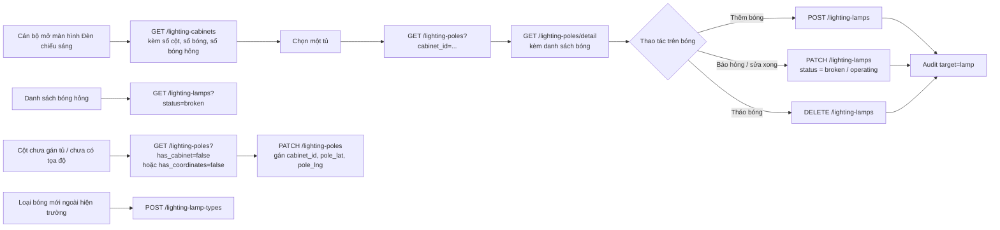

# TÀI LIỆU THIẾT KẾ KỸ THUẬT — LỚP DỮ LIỆU ĐÈN CHIẾU SÁNG (GIS)

---

## 📋 LỊCH SỬ THAY ĐỔI (CHANGELOG)

> Mỗi thay đổi nghiệp vụ hoặc hợp đồng tích hợp so với bản thiết kế gốc được ghi tại đây và đánh dấu **tại chỗ** bằng khối trích dẫn `> 🔄 CẬP NHẬT [ngày]` hoặc `> 🆕 MỚI [ngày]`, để FE/BE dễ dàng đối chiếu.

| Ngày       | Nội dung thay đổi                                                                                                                                                                                                                                                                                                                                                                                                                                                                                                                                                                    | Mục liên quan          |
| :--------- | :----------------------------------------------------------------------------------------------------------------------------------------------------------------------------------------------------------------------------------------------------------------------------------------------------------------------------------------------------------------------------------------------------------------------------------------------------------------------------------------------------------------------------------------------------------------------------------- | :--------------------- |
| 2026-09-04 | **Khởi tạo**: tách lớp Đèn chiếu sáng khỏi bảng vị trí generic `map_layer_items` (đã bị xóa, xem `map_layers_technical_design.md`), triển khai bảng nghiệp vụ riêng (tủ điều khiển + cột đèn) theo `docs/driver/Thuyet_minh_giai_phap_CSDL.docx` Mục I, có nhật ký thay đổi field-level.                                                                                                                                                                                                                                                                                             | Toàn bộ                |
| 2026-09-11 | **Mô hình ba cấp tủ → cột → bóng.** Thêm `lighting_lamps` (mỗi dòng **một bóng**, theo dõi hỏng/sửa từng bóng) và `lighting_lamp_types` (danh mục loại bóng **do cán bộ tự thêm**, không cần migration). **Bỏ** 5 cột đếm và `total_lamps` khỏi `lighting_cabinets`: số bóng của tủ luôn đếm từ cột và bóng. **Bỏ** `lamp_type`, `lamp_count`, `power_w`, `last_replaced_at` khỏi `lighting_poles`. Cột đèn: `pole_code` **bắt buộc**; `cabinet_id` và tọa độ **điền sau được**. Xóa cột bị chặn khi còn bóng. Nhật ký thêm `target = lamp`; `cabinet_id` của nhật ký cho phép rỗng. | §1, §2, §3, §4, §5, §8 |

---

## MỤC LỤC

1. [Phạm vi](#1-phạm-vi)
2. [Quyết định thiết kế](#2-quyết-định-thiết-kế)
   - [2.1. Ba cấp đối tượng: tủ → cột → bóng](#21-ba-cấp-đối-tượng-tủ--cột--bóng)
   - [2.2. Một dòng là một bóng](#22-một-dòng-là-một-bóng)
   - [2.3. Loại bóng là danh mục do cán bộ quản lý](#23-loại-bóng-là-danh-mục-do-cán-bộ-quản-lý)
   - [2.4. Tủ không lưu số bóng — luôn đếm từ cột và bóng](#24-tủ-không-lưu-số-bóng--luôn-đếm-từ-cột-và-bóng)
   - [2.5. Cột đèn: số hiệu bắt buộc, tủ và tọa độ điền sau](#25-cột-đèn-số-hiệu-bắt-buộc-tủ-và-tọa-độ-điền-sau)
   - [2.6. Loại bóng đại diện của một cột](#26-loại-bóng-đại-diện-của-một-cột)
   - [2.7. Liên kết với danh mục lớp bản đồ (`map_layers`)](#27-liên-kết-với-danh-mục-lớp-bản-đồ-map_layers)
   - [2.8. Nhật ký thay đổi field-level dùng chung cho tủ, cột và bóng](#28-nhật-ký-thay-đổi-field-level-dùng-chung-cho-tủ-cột-và-bóng)
   - [2.9. Quy tắc dữ liệu](#29-quy-tắc-dữ-liệu)
3. [Luồng nghiệp vụ](#3-luồng-nghiệp-vụ)
4. [Thiết kế cơ sở dữ liệu](#4-thiết-kế-cơ-sở-dữ-liệu)
   - [4.1. `lighting_lamp_types`](#41-lighting_lamp_types)
   - [4.2. `lighting_cabinets`](#42-lighting_cabinets)
   - [4.3. `lighting_poles`](#43-lighting_poles)
   - [4.4. `lighting_lamps`](#44-lighting_lamps)
   - [4.5. `lighting_audit_logs`](#45-lighting_audit_logs)
   - [4.6. Truy vấn tổng hợp số bóng](#46-truy-vấn-tổng-hợp-số-bóng)
   - [4.7. Migration và chuyển dữ liệu cũ](#47-migration-và-chuyển-dữ-liệu-cũ)
5. [Danh mục thiết kế RESTful API contracts và bảng tham số chi tiết](#5-danh-mục-thiết-kế-restful-api-contracts-và-bảng-tham-số-chi-tiết)
   - [5.1. Quy chuẩn dùng chung](#51-quy-chuẩn-dùng-chung)
   - [5.2. API danh mục loại bóng — `/api/v1/lighting-lamp-types`](#52-api-danh-mục-loại-bóng--apiv1lighting-lamp-types)
   - [5.3. API quản lý tủ điều khiển — `/api/v1/lighting-cabinets`](#53-api-quản-lý-tủ-điều-khiển--apiv1lighting-cabinets)
   - [5.4. API quản lý cột đèn — `/api/v1/lighting-poles`](#54-api-quản-lý-cột-đèn--apiv1lighting-poles)
   - [5.5. API quản lý bóng đèn — `/api/v1/lighting-lamps`](#55-api-quản-lý-bóng-đèn--apiv1lighting-lamps)
6. [Phân quyền](#6-phân-quyền)
7. [Ranh giới với `map_layers` và các lớp khác](#7-ranh-giới-với-map_layers-và-các-lớp-khác)
8. [Triển khai và kiểm thử](#8-triển-khai-và-kiểm-thử)

## 1. Phạm vi

> 🔄 CẬP NHẬT 2026-09-11: thêm cấp bóng đèn và danh mục loại bóng; tủ không còn lưu khối lượng đèn.

Phân hệ này quản lý dữ liệu của lớp bản đồ **Đèn chiếu sáng** (`map_layers.code = LYR_LIGHT`):

1. **Quản lý tủ điều khiển chiếu sáng**: CRUD tủ, vị trí lắp đặt, chiều dài đường dây, trạng thái bàn giao/vận hành. Số cột và số bóng của tủ được **đếm**, không nhập tay.
2. **Quản lý cột đèn**: CRUD cột đèn, số hiệu cột, tủ cấp nguồn và tọa độ (điền sau được), chiều cao, ngày dựng cột, tình trạng cột.
3. **Quản lý bóng đèn**: CRUD từng bóng trên cột — loại bóng, vị trí trên cột, công suất, ngày lắp/thay, **đang sáng hay hỏng**.
4. **Danh mục loại bóng**: cán bộ tự thêm, sửa, ngừng dùng loại bóng.
5. **Nhật ký thay đổi**: ghi vết từng trường dữ liệu bị thay đổi trên tủ, cột và bóng, phân biệt bằng cột `target`.

Module này **không** quản lý danh mục lớp bản đồ (`map_layers` — xem `map_layers_technical_design.md`) và không có khóa ngoại tới bảng đó; quan hệ giữa hai module là một ánh xạ cố định theo `code`, resolve ở tầng `MapLayersService` (xem [§2.7](#27-liên-kết-với-danh-mục-lớp-bản-đồ-map_layers)).

Import hàng loạt từ Excel **chưa được triển khai** ở đợt này — xem [§8](#8-triển-khai-và-kiểm-thử).

## 2. Quyết định thiết kế

### 2.1. Ba cấp đối tượng: tủ → cột → bóng

> 🔄 CẬP NHẬT 2026-09-11: từ hai cấp (tủ, cột) lên ba cấp (tủ, cột, bóng).

```
lighting_lamp_types   danh mục loại bóng
lighting_cabinets     tủ điều khiển
  └── lighting_poles  cột đèn           (cabinet_id điền sau được)
        └── lighting_lamps  bóng đèn    (mỗi dòng một bóng)
lighting_audit_logs   nhật ký cho cả tủ, cột, bóng
```

| Bảng                  | Mỗi dòng là                  | Ai tạo                   |
| :-------------------- | :--------------------------- | :----------------------- |
| `lighting_lamp_types` | Một loại bóng (LED, Sodium…) | Cán bộ, qua API danh mục |
| `lighting_cabinets`   | Một tủ điều khiển            | Cán bộ                   |
| `lighting_poles`      | Một cột đèn ngoài thực địa   | Cán bộ / khảo sát        |
| `lighting_lamps`      | **Một bóng** trên một cột    | Cán bộ / khảo sát        |
| `lighting_audit_logs` | Một trường bị thay đổi       | Service, tự động         |

Danh mục đóng về trạng thái (`handover_status`, `status` của tủ; `status` của cột; `status` của bóng) vẫn ràng buộc bằng `CHECK`. Chỉ **loại bóng** là danh mục mở, vì chỉ nó có nhu cầu thêm giá trị mới mà không qua đội phát triển (§2.3).

### 2.2. Một dòng là một bóng

> 🆕 MỚI 2026-09-11

Yêu cầu nghiệp vụ là **theo dõi đến từng bóng: bóng nào hỏng, đã sửa chưa**. Vì vậy `lighting_lamps` không có cột số lượng: cột mang 2 bóng LED là 2 dòng.

- `position_no` là vị trí của bóng trên cột (1, 2, 3…) — thứ thợ sửa dùng để tìm đúng bóng ngoài hiện trường. Duy nhất trong các bóng **chưa xóa** của một cột (partial unique index), nên tháo một bóng thì vị trí đó dùng lại được.
- `status` chỉ có hai giá trị: `operating` (đang sáng), `broken` (hỏng, chờ sửa). Sửa xong là chuyển về `operating`; ai báo hỏng, ai sửa, lúc nào nằm trong nhật ký (§2.8).
- Công suất, ngày lắp, ngày thay gần nhất là **thuộc tính của bóng**, không phải của cột — một cột có thể mang bóng Sodium 250W cạnh bóng LED 150W thay sau.
- Bóng không chuyển sang cột khác: `pole_id` không sửa được. Tháo bóng khỏi cột này rồi thêm bóng mới ở cột kia.

**Hệ quả**: tình trạng của **cột** (`lighting_poles.status`) chỉ còn mô tả bản thân cột — đang dùng, hỏng (gãy, nghiêng…), đã tháo dỡ — không còn dùng để báo bóng tắt.

### 2.3. Loại bóng là danh mục do cán bộ quản lý

> 🆕 MỚI 2026-09-11

Khi ngoài hiện trường xuất hiện loại bóng chưa có trong hệ thống (ví dụ khi bóc tách nhóm "Đèn khác"), **cán bộ tự thêm** trên màn hình quản trị, không phải chờ đội phát triển viết migration và deploy. Vì vậy loại bóng là bảng `lighting_lamp_types`, không phải `CHECK`.

- `code` là khóa ổn định mà FE và luồng nhập Excel sau này dựa vào: chữ thường, số, gạch dưới, bắt đầu bằng chữ (`led`, `sodium`, `led_solar`). **Không sửa được** sau khi tạo.
- `name_vi` là tên hiển thị, sửa được, duy nhất.
- `sort_order` là thứ tự hiển thị, đồng thời là tiêu chí phân xử khi một cột có số bóng hai loại bằng nhau (§2.6).
- **Không xóa loại bóng.** Loại không dùng nữa thì `is_active = false`: không gán được cho bóng mới, bóng đã ghi nhận vẫn giữ nguyên. Không có API xóa; khóa ngoại từ `lighting_lamps` là `ON DELETE RESTRICT`.

Migration khởi tạo sẵn 5 loại đang có trong hồ sơ: `led`, `sodium`, `metal_halide`, `mercury`, `other`.

### 2.4. Tủ không lưu số bóng — luôn đếm từ cột và bóng

> 🔄 CẬP NHẬT 2026-09-11: thay thế quyết định cũ "khối lượng đèn theo hồ sơ lưu trên tủ".

`lighting_cabinets` không còn `sodium_count`, `led_count`, `metal_halide_count`, `mercury_count`, `other_count`, `total_lamps`. Số cột và số bóng của tủ trong mọi response đều được **đếm tại thời điểm đọc** (§4.6). Chỉ có một con số, không có chuyện hai nguồn lệch nhau.

Quy tắc đếm cho tủ:

- Chỉ đếm bóng **chưa xóa** trên cột **chưa xóa**.
- **Không đếm cột đã tháo dỡ** (`status = 'dismantled'`) và bóng trên cột đó — cột đã tháo thì bóng không còn ngoài đường. Điều kiện viết là `status IS DISTINCT FROM 'dismantled'`, không phải `<>`, vì `status` cho phép rỗng và `<>` sẽ loại luôn cột chưa ghi tình trạng.
- Cột **chưa gán tủ** không nằm trong tổng của tủ nào; lọc riêng bằng `has_cabinet=false` (§5.4.1).

**Hệ quả đã chấp nhận:**

- Bảng khối lượng của đơn vị vận hành (7.431 bộ theo hồ sơ) **không được lưu** trong hệ thống. Trước khi khảo sát cột, mọi tủ hiển thị 0 bóng.
- Hệ thống **không biết khảo sát đã đủ hay chưa**: tủ khảo sát được 56 bóng thì hiển thị 56, không có con số hồ sơ để so. Việc đối chiếu với bảng khối lượng (nếu cần) làm ngoài hệ thống.

### 2.5. Cột đèn: số hiệu bắt buộc, tủ và tọa độ điền sau

> 🔄 CẬP NHẬT 2026-09-11: đảo ngược quy tắc cũ (tọa độ và tủ bắt buộc, số hiệu tùy chọn).

Khảo sát 4.000 cột không đi kèm tọa độ và tủ ngay từ đầu, nên:

- `pole_code` **bắt buộc** và duy nhất toàn hệ thống (tính cả cột đã xóa mềm). Một cột chưa có tủ, chưa có tọa độ vẫn phải tìm lại được ngoài đường và phân biệt được với một bản ghi trùng — số hiệu trên thân cột là thứ duy nhất làm được việc đó.
- `cabinet_id` **cho phép rỗng**: cột chưa xác định tủ cấp nguồn. Gán hoặc bỏ gán bằng `PATCH`.
- `pole_lat`/`pole_lng` **cho phép rỗng**, nhưng phải **đủ cặp**: có cả hai hoặc trống cả hai (`CHECK chk_lighting_poles_coordinate_pair`). Cột chưa có tọa độ không lên bản đồ, chỉ thấy trong danh sách (lọc `has_coordinates=false`).

### 2.6. Loại bóng đại diện của một cột

> 🆕 MỚI 2026-09-11

Bản đồ tô màu cột theo loại bóng. Cột mang nhiều loại bóng được hiển thị **giống hệt cột một loại**, dùng loại đại diện `primary_lamp_type`:

1. Loại có **nhiều bóng nhất** trên cột (đếm bóng chưa xóa, không phân biệt đang sáng hay hỏng).
2. Bằng nhau thì lấy loại có `sort_order` **nhỏ hơn**; vẫn bằng thì theo `code`.

Thứ tự khởi tạo: `led` (10) → `sodium` (20) → `metal_halide` (30) → `mercury` (40) → `other` (50). Cột chưa có bóng thì `primary_lamp_type = null`.

### 2.7. Liên kết với danh mục lớp bản đồ (`map_layers`)

Tương tự Cây xanh: không có cột `map_layer_id` hay khóa ngoại nào từ các bảng đèn về `map_layers`. `MapLayersModule` import `LightingModule` và inject `LightingService` trực tiếp:

```ts
LYR_LIGHT: () => this.lightingService.countLivePoles();
```

**Quan trọng**: `element_count` của lớp Đèn chiếu sáng đếm theo **số cột đèn** (`lighting_poles`), không phải số tủ hay số bóng — cột đèn là đơn vị hiển thị trên bản đồ (mỗi điểm sáng = 1 cột). Xóa lớp `LYR_LIGHT` qua `DELETE /api/v1/map-layers` luôn bị từ chối (`409 CONFLICT`) vì lớp này được sở hữu bởi module chuyên biệt — xem `map_layers_technical_design.md` §5.2.5.

### 2.8. Nhật ký thay đổi field-level dùng chung cho tủ, cột và bóng

> 🔄 CẬP NHẬT 2026-09-11: thêm `target = lamp`, cột `lamp_id`; `cabinet_id` cho phép rỗng.

Cùng quyết định và cơ chế như module Cây xanh (xem `trees_technical_design.md` §2.3): ghi ở **tầng service**, không dùng Postgres trigger, dùng chung hàm thuần `buildFieldDiffs()` (`src/shared/entity-diff.util.ts`).

`lighting_audit_logs` là **một bảng dùng chung** cho ba loại đối tượng, phân biệt bằng cột `target`:

| `target`  | `cabinet_id`                                                          | `pole_id` | `lamp_id` |
| :-------- | :-------------------------------------------------------------------- | :-------- | :-------- |
| `cabinet` | Bắt buộc                                                              | Rỗng      | Rỗng      |
| `pole`    | Tủ của cột **tại thời điểm thay đổi**; rỗng nếu cột chưa gán tủ       | Bắt buộc  | Rỗng      |
| `lamp`    | Tủ của cột chứa bóng tại thời điểm thay đổi; rỗng nếu cột chưa gán tủ | Bắt buộc  | Bắt buộc  |

`cabinet_id` vẫn ghi kèm với thay đổi của cột và bóng để truy vấn toàn bộ lịch sử dưới một tủ mà không cần join qua bảng cột. Nó **không còn "luôn có giá trị"** như bản gốc, vì cột được phép chưa gán tủ (§2.5).

Luồng `update` của tủ, cột, bóng giống nhau: đọc trong transaction → kiểm tra `version` → diff field → lưu + tăng `version` → ghi N dòng nhật ký (một dòng mỗi field đổi thật sự) — không ghi nếu không đổi gì. Danh mục loại bóng **không** ghi nhật ký và không có `version`, giống danh mục loài cây.

### 2.9. Quy tắc dữ liệu

> 🔄 CẬP NHẬT 2026-09-11

- `cabinet_code` duy nhất toàn hệ thống, cho phép hậu tố chữ (`28A`, `55B`).
- `cabinet_lat`/`cabinet_lng` là tùy chọn — 142/142 tủ hiện chưa có tọa độ, chỉ có `location_desc`.
- `pole_code` bắt buộc và duy nhất, tính cả cột đã xóa mềm (§2.5).
- `pole_lat`/`pole_lng` tùy chọn nhưng phải đủ cặp (§2.5).
- `position_no` ≥ 1, duy nhất trong các bóng chưa xóa của một cột. Bỏ trống khi tạo thì lấy vị trí kế tiếp (lớn nhất + 1).
- `power_w` của bóng > 0 khi có giá trị.
- `last_replaced_at` của bóng không được sớm hơn `installed_at` khi cả hai có giá trị — `CHECK` ở DB, kiểm tra lại ở service để trả lỗi thân thiện.
- Bóng mới hoặc bóng đổi loại chỉ được gán loại đang `is_active = true`.
- Xóa tủ bị từ chối (`409`) khi tủ còn cột chưa xóa mềm. Xóa cột bị từ chối (`409`) khi cột còn bóng chưa xóa mềm — tháo bóng trước, không xóa dây chuyền.
- Xóa tủ/cột/bóng là xóa mềm; `countLivePoles()` chỉ đếm cột chưa xóa mềm.

## 3. Luồng nghiệp vụ

> 🔄 CẬP NHẬT 2026-09-11



## 4. Thiết kế cơ sở dữ liệu

Các bảng nghiệp vụ đều kế thừa `BaseEntity` (`src/base/base.entity.ts`): khóa chính `id UUID DEFAULT gen_random_uuid()`, `created_at`/`updated_at` timestamptz, `deleted_at` timestamptz nullable (xóa mềm).

### 4.1. `lighting_lamp_types`

> 🆕 MỚI 2026-09-11. Migration: `1788010000000-AlterLightingForPoleLamps.ts` (§4.7).

| Cột                                    | Kiểu                    | Ràng buộc / Ý nghĩa                                                         |
| -------------------------------------- | ----------------------- | --------------------------------------------------------------------------- |
| `id`                                   | `uuid`                  | Khóa chính.                                                                 |
| `code`                                 | `varchar(50)` NOT NULL  | `UNIQUE`. `CHECK (code ~ '^[a-z][a-z0-9_]*$')`. Không sửa được sau khi tạo. |
| `name_vi`                              | `varchar(255)` NOT NULL | `UNIQUE`. Tên hiển thị.                                                     |
| `sort_order`                           | `integer` NOT NULL      | Mặc định `0`, `CHECK >= 0`. Thứ tự hiển thị và tiêu chí phân xử §2.6.       |
| `is_active`                            | `boolean` NOT NULL      | Mặc định `true`. `false` = ngừng dùng cho bóng mới.                         |
| `note`                                 | `text` nullable         | Ghi chú.                                                                    |
| `created_at`/`updated_at`/`deleted_at` | `timestamptz`           | Lifecycle.                                                                  |

Dữ liệu khởi tạo:

| `code`         | `name_vi`         | `sort_order` |
| -------------- | ----------------- | ------------ |
| `led`          | Đèn LED           | 10           |
| `sodium`       | Đèn cao áp Sodium | 20           |
| `metal_halide` | Đèn Metal halide  | 30           |
| `mercury`      | Đèn thủy ngân     | 40           |
| `other`        | Đèn khác          | 50           |

### 4.2. `lighting_cabinets`

> 🔄 CẬP NHẬT 2026-09-11: bỏ `sodium_count`, `led_count`, `metal_halide_count`, `mercury_count`, `other_count`, `total_lamps` (§2.4). Migration gốc: `1787447000000-CreateLightingCabinetsTable.ts`; bỏ cột: `1788010000000-AlterLightingForPoleLamps.ts`.

| Cột                                    | Kiểu                     | Ràng buộc / Ý nghĩa                                                     |
| -------------------------------------- | ------------------------ | ----------------------------------------------------------------------- |
| `id`                                   | `uuid`                   | Khóa chính.                                                             |
| `cabinet_code`                         | `text`                   | `UNIQUE`. Số tủ ghi ngoài thực địa, cho phép hậu tố chữ.                |
| `location_desc`                        | `text` nullable          | Mô tả vị trí lắp đặt.                                                   |
| `cabinet_lat`                          | `numeric(10,7)` nullable | Vĩ độ WGS-84.                                                           |
| `cabinet_lng`                          | `numeric(11,7)` nullable | Kinh độ WGS-84.                                                         |
| `cable_length_m`                       | `numeric(8,1)` nullable  | Tổng chiều dài đường dây do tủ cấp nguồn.                               |
| `managing_unit`                        | `text` nullable          | Đơn vị quản lý, vận hành.                                               |
| `handover_status`                      | `text` nullable          | `CHECK IN ('handed_over', 'operating_temporarily', 'not_handed_over')`. |
| `status`                               | `text` nullable          | `CHECK IN ('operating', 'not_operating')`.                              |
| `version`                              | `integer` NOT NULL       | Mặc định `1`. Optimistic-concurrency.                                   |
| `created_at`/`updated_at`/`deleted_at` | `timestamptz`            | Lifecycle và xóa mềm.                                                   |

Index: `idx_lighting_cabinets_status` (`status`).

### 4.3. `lighting_poles`

> 🔄 CẬP NHẬT 2026-09-11: `pole_code` NOT NULL; `cabinet_id`, `pole_lat`, `pole_lng` cho phép rỗng; thêm `chk_lighting_poles_coordinate_pair`; bỏ `lamp_type`, `lamp_count`, `power_w`, `last_replaced_at`. Migration gốc: `1787448000000-CreateLightingPolesTable.ts`; thay đổi: `1788010000000-AlterLightingForPoleLamps.ts`.

| Cột                                    | Kiểu                     | Ràng buộc / Ý nghĩa                                                                  |
| -------------------------------------- | ------------------------ | ------------------------------------------------------------------------------------ |
| `id`                                   | `uuid`                   | Khóa chính.                                                                          |
| `cabinet_id`                           | `uuid` nullable          | FK → `lighting_cabinets(id)`, `ON DELETE RESTRICT`. Rỗng = chưa gán tủ.              |
| `pole_code`                            | `text` NOT NULL          | Số hiệu trên thân cột. Unique index `uq_lighting_poles_pole_code`.                   |
| `pole_lat`                             | `numeric(10,7)` nullable | Vĩ độ WGS-84.                                                                        |
| `pole_lng`                             | `numeric(11,7)` nullable | Kinh độ WGS-84. `CHECK ((pole_lat IS NULL) = (pole_lng IS NULL))`.                   |
| `pole_height_m`                        | `numeric(5,2)` nullable  | Chiều cao cột, mét.                                                                  |
| `installed_at`                         | `date` nullable          | Ngày dựng cột.                                                                       |
| `status`                               | `text` nullable          | Tình trạng **cột**: `CHECK IN ('operating', 'broken_pending_repair', 'dismantled')`. |
| `note`                                 | `text` nullable          | Ghi chú.                                                                             |
| `version`                              | `integer` NOT NULL       | Mặc định `1`.                                                                        |
| `created_at`/`updated_at`/`deleted_at` | `timestamptz`            | Lifecycle và xóa mềm.                                                                |

Index: `idx_lighting_poles_cabinet_id`, `idx_lighting_poles_status`, `uq_lighting_poles_pole_code` (`pole_code`, kể cả dòng đã xóa mềm).

### 4.4. `lighting_lamps`

> 🆕 MỚI 2026-09-11. Migration: `1788010000000-AlterLightingForPoleLamps.ts`.

| Cột                                    | Kiểu               | Ràng buộc / Ý nghĩa                                              |
| -------------------------------------- | ------------------ | ---------------------------------------------------------------- |
| `id`                                   | `uuid`             | Khóa chính.                                                      |
| `pole_id`                              | `uuid` NOT NULL    | FK → `lighting_poles(id)`, `ON DELETE RESTRICT`. Không sửa được. |
| `lamp_type_id`                         | `uuid` NOT NULL    | FK → `lighting_lamp_types(id)`, `ON DELETE RESTRICT`.            |
| `position_no`                          | `integer` NOT NULL | Vị trí trên cột, `CHECK >= 1`.                                   |
| `power_w`                              | `integer` nullable | Công suất bóng (W), `CHECK > 0`.                                 |
| `installed_at`                         | `date` nullable    | Ngày lắp bóng.                                                   |
| `last_replaced_at`                     | `date` nullable    | Ngày thay gần nhất; `CHECK` không sớm hơn `installed_at`.        |
| `status`                               | `text` NOT NULL    | Mặc định `'operating'`. `CHECK IN ('operating', 'broken')`.      |
| `note`                                 | `text` nullable    | Ghi chú (mô tả hư hỏng, nội dung sửa…).                          |
| `version`                              | `integer` NOT NULL | Mặc định `1`.                                                    |
| `created_at`/`updated_at`/`deleted_at` | `timestamptz`      | Lifecycle và xóa mềm.                                            |

Index: `uq_lighting_lamps_pole_id_position_no` (`pole_id`, `position_no`) `WHERE deleted_at IS NULL`; `idx_lighting_lamps_lamp_type_id`; `idx_lighting_lamps_status` (phục vụ danh sách bóng hỏng).

### 4.5. `lighting_audit_logs`

> 🔄 CẬP NHẬT 2026-09-11. Migration gốc: `1787449000000-CreateLightingAuditLogsTable.ts`; thay đổi: `1788010000000-AlterLightingForPoleLamps.ts`.

| Cột                                    | Kiểu                   | Ràng buộc / Ý nghĩa                            |
| -------------------------------------- | ---------------------- | ---------------------------------------------- |
| `id`                                   | `uuid`                 | Khóa chính.                                    |
| `target`                               | `text` NOT NULL        | `CHECK IN ('cabinet', 'pole', 'lamp')`.        |
| `cabinet_id`                           | `uuid` nullable        | FK → `lighting_cabinets(id)`. Xem bảng ở §2.8. |
| `pole_id`                              | `uuid` nullable        | FK → `lighting_poles(id)`.                     |
| `lamp_id`                              | `uuid` nullable        | FK → `lighting_lamps(id)`.                     |
| `action`                               | `text` NOT NULL        | `CHECK IN ('INSERT', 'UPDATE', 'DELETE')`.     |
| `field_name`                           | `text` nullable        | Tên trường bị đổi; rỗng với `INSERT`/`DELETE`. |
| `old_value` / `new_value`              | `text` nullable        | Giá trị trước/sau, đã stringify.               |
| `reason`                               | `text` nullable        | Lý do thay đổi.                                |
| `actor_user_id`                        | `uuid` nullable        | Không FK cứng tới bảng user.                   |
| `actor_display_snapshot`               | `text` nullable        | Snapshot tên người thực hiện.                  |
| `actor_ip`                             | `inet` nullable        | IP thực hiện.                                  |
| `actual_time`                          | `timestamptz` NOT NULL | Thời điểm thay đổi.                            |
| `created_at`/`updated_at`/`deleted_at` | `timestamptz`          | Lifecycle của dòng nhật ký.                    |

`CHECK chk_lighting_audit_logs_target_ref`:

```sql
(target = 'cabinet' AND cabinet_id IS NOT NULL AND pole_id IS NULL AND lamp_id IS NULL)
OR (target = 'pole' AND pole_id IS NOT NULL AND lamp_id IS NULL)
OR (target = 'lamp' AND pole_id IS NOT NULL AND lamp_id IS NOT NULL)
```

Index: `idx_lighting_audit_logs_cabinet_id`, `idx_lighting_audit_logs_pole_id`, `idx_lighting_audit_logs_lamp_id`, `idx_lighting_audit_logs_actual_time`.

### 4.6. Truy vấn tổng hợp số bóng

> 🆕 MỚI 2026-09-11

Số cột của tủ (không tính cột đã tháo dỡ):

```sql
SELECT p.cabinet_id, COUNT(*) AS pole_count
FROM lighting_poles p
WHERE p.cabinet_id IN (:cabinetIds)
  AND p.deleted_at IS NULL
  AND p.status IS DISTINCT FROM 'dismantled'
GROUP BY p.cabinet_id;
```

Số bóng theo tủ và loại (với cột thì nhóm theo `l.pole_id` và **không** loại cột đã tháo dỡ):

```sql
SELECT p.cabinet_id, l.lamp_type_id,
       COUNT(*)                                     AS lamp_count,
       COUNT(*) FILTER (WHERE l.status = 'broken')  AS broken_lamp_count
FROM lighting_lamps l
JOIN lighting_poles p ON p.id = l.pole_id
WHERE p.cabinet_id IN (:cabinetIds)
  AND l.deleted_at IS NULL
  AND p.deleted_at IS NULL
  AND p.status IS DISTINCT FROM 'dismantled'
GROUP BY p.cabinet_id, l.lamp_type_id;
```

Danh sách tủ và cột chạy hai truy vấn này **một lần cho cả trang** (theo danh sách id của trang), không truy vấn từng dòng. Tủ hoặc cột không có dòng nào trong kết quả được trả số `0`. Quy mô dự kiến ~4.000 cột, ~7.400 bóng; `idx_lighting_poles_cabinet_id` và `uq_lighting_lamps_pole_id_position_no` (cột đầu là `pole_id`, điều kiện `deleted_at IS NULL`) phục vụ hai phép lọc.

### 4.7. Migration và chuyển dữ liệu cũ

> 🆕 MỚI 2026-09-11

Toàn bộ thay đổi nằm trong **một migration** `src/migrations/1788010000000-AlterLightingForPoleLamps.ts`, chạy trong một transaction: một bước lỗi thì cả migration rollback, không có trạng thái nửa cũ nửa mới. Chạy một lần, revert một lần.

`up` thực hiện theo thứ tự:

| #   | Bước                    | Nội dung                                                                                                                         |
| --- | ----------------------- | -------------------------------------------------------------------------------------------------------------------------------- |
| 1   | `createLampTypes`       | Tạo `lighting_lamp_types`, nạp 5 loại khởi tạo (§4.1).                                                                           |
| 2   | `createLamps`           | Tạo `lighting_lamps` và index.                                                                                                   |
| 3   | `backfillLamps`         | Tách mỗi cột cũ thành `lamp_count` dòng bóng.                                                                                    |
| 4   | `alterPoles`            | Gán số hiệu tạm cho cột chưa có số hiệu; bỏ 4 cột bóng; `pole_code` NOT NULL; tủ và tọa độ cho phép rỗng; `CHECK` đủ cặp tọa độ. |
| 5   | `dropCabinetLampCounts` | Bỏ 6 cột đếm khỏi bảng tủ.                                                                                                       |
| 6   | `alterAuditLogs`        | Thêm `lamp_id`, `target = lamp`; `cabinet_id` cho phép rỗng.                                                                     |

Quy tắc chuyển dữ liệu (bước 3, 4):

- Cột có `lamp_type` và `lamp_count = n` → `n` dòng bóng, `position_no` 1…n, cùng loại, chép `power_w` (0 → rỗng), `installed_at`, `last_replaced_at` của cột.
- Cột cũ `status = 'broken_pending_repair'` → các bóng của nó `status = 'broken'` (trước đây đó là cách duy nhất để báo bóng tắt). **Tình trạng của cột giữ nguyên**; cán bộ tự chỉnh nếu cột thực ra không hỏng.
- Cột cũ đã xóa mềm → bóng sinh ra cũng mang cùng `deleted_at`.
- Cột cũ **không có** `lamp_type` → **không sinh bóng**: không bịa loại bóng. Số lượng và công suất của các cột này mất khi bỏ cột ở bước 4.
- Cột cũ chưa có số hiệu → `pole_code = 'CHUA-DANH-SO-<id>'`. Tiền tố cố định để lọc ra và đánh số lại.
- Bóng sinh ra từ migration **không** có dòng nhật ký `INSERT`.

`down` khôi phục cấu trúc cũ, nhưng **kiểm tra trước và từ chối revert** (không đổi gì) khi:

- còn cột chưa gán tủ hoặc chưa có tọa độ (cấu trúc cũ bắt buộc), hoặc
- đã có dòng nhật ký `target = lamp` hoặc `cabinet_id` rỗng.

`down` tính lại các cột cũ từ bảng bóng và **mất thông tin**: cột nhiều loại bóng thu về loại đại diện (§2.6), công suất lấy giá trị lớn nhất; số theo hồ sơ của tủ được thay bằng số bóng đếm được.

## 5. DANH MỤC THIẾT KẾ RESTFUL API CONTRACTS VÀ BẢNG THAM SỐ CHI TIẾT

> **Quy chuẩn kiến trúc:** Base URL là `/api/v1`. Tất cả API yêu cầu JWT Bearer (chưa gắn `@RequireRole` — xem §6). Không dùng path parameter; GET dùng Query Params, POST/PATCH/DELETE dùng Request Body.

### 5.1. Quy chuẩn dùng chung

Envelope thành công/lỗi, phân trang và mã lỗi giống hệt `map_layers_technical_design.md` §5.1. Riêng module này:

| HTTP | `code`              | Trường hợp dùng trong module                                                                                                                                                                                         |
| ---- | ------------------- | -------------------------------------------------------------------------------------------------------------------------------------------------------------------------------------------------------------------- |
| 400  | `VALIDATION_FAILED` | Body/query sai định dạng.                                                                                                                                                                                            |
| 400  | `BAD_REQUEST`       | Tọa độ cột chỉ có một trong hai giá trị.                                                                                                                                                                             |
| 401  | `UNAUTHORIZED`      | Thiếu hoặc sai JWT.                                                                                                                                                                                                  |
| 404  | `NOT_FOUND`         | Không tìm thấy tủ/cột/bóng/loại bóng, kể cả khóa tham chiếu trong body.                                                                                                                                              |
| 409  | `CONFLICT`          | `version` không khớp; trùng `cabinet_code`, `pole_code`, `code`/`name_vi` loại bóng, vị trí bóng trên cột; xóa tủ còn cột; xóa cột còn bóng; gán loại bóng đã ngừng dùng; `last_replaced_at` sớm hơn `installed_at`. |

Object tham chiếu loại bóng `LightingLampTypeRefDto`, dùng lồng trong các response dưới đây:

| Field     | Kiểu     | Ý nghĩa       |
| --------- | -------- | ------------- |
| `id`      | `uuid`   | ID loại bóng. |
| `code`    | `string` | Mã loại bóng. |
| `name_vi` | `string` | Tên hiển thị. |

### 5.2. API danh mục loại bóng — `/api/v1/lighting-lamp-types`

> 🆕 MỚI 2026-09-11

#### Response object `LightingLampTypeResponseDto`

| Field                     | Kiểu             | Ý nghĩa                            |
| ------------------------- | ---------------- | ---------------------------------- |
| `id`                      | `uuid`           | Khóa chính.                        |
| `code`                    | `string`         | Mã, không đổi.                     |
| `name_vi`                 | `string`         | Tên hiển thị.                      |
| `sort_order`              | `integer`        | Thứ tự hiển thị.                   |
| `is_active`               | `boolean`        | `false` = ngừng dùng cho bóng mới. |
| `note`                    | `string \| null` | Ghi chú.                           |
| `created_at`/`updated_at` | `ISO 8601`       | Lifecycle.                         |

| Method  | Endpoint               | Mục đích                                                     |
| ------- | ---------------------- | ------------------------------------------------------------ |
| `GET`   | `/lighting-lamp-types` | Danh mục, phân trang; sắp xếp `sort_order ASC, name_vi ASC`. |
| `POST`  | `/lighting-lamp-types` | Thêm loại bóng mới.                                          |
| `PATCH` | `/lighting-lamp-types` | Sửa tên, thứ tự, ghi chú; ngừng/bật lại.                     |

**`GET` — tham số:** `page`, `limit`; `keyword` (tìm trên `code`, `name_vi`); `is_active` (`true`/`false`).

**`POST` — body:**

| Trường       | Kiểu      | Bắt buộc | Ràng buộc                                  |
| ------------ | --------- | -------- | ------------------------------------------ |
| `code`       | `string`  | Có       | ≤ 50 ký tự, `^[a-z][a-z0-9_]*$`, duy nhất. |
| `name_vi`    | `string`  | Có       | ≤ 255 ký tự, duy nhất.                     |
| `sort_order` | `integer` | Không    | ≥ 0, mặc định `0`.                         |
| `note`       | `string`  | Không    | —                                          |

```json
{ "code": "led_solar", "name_vi": "Đèn LED năng lượng mặt trời", "sort_order": 60 }
```

**`PATCH` — body:** `id` (bắt buộc); `name_vi`, `sort_order`, `is_active`, `note` (tùy chọn, chỉ field được gửi mới đổi). `code` không sửa được. `409` nếu `name_vi` trùng loại khác.

### 5.3. API quản lý tủ điều khiển — `/api/v1/lighting-cabinets`

> 🔄 CẬP NHẬT 2026-09-11: bỏ 6 trường đếm khỏi body; response thêm số cột, số bóng đếm được.

#### Response object `LightingCabinetResponseDto`

| Field                         | Kiểu             | Ý nghĩa                                                                                                                                     |
| ----------------------------- | ---------------- | ------------------------------------------------------------------------------------------------------------------------------------------- |
| `id`                          | `uuid`           | Khóa chính.                                                                                                                                 |
| `cabinet_code`                | `string`         | Số tủ, duy nhất.                                                                                                                            |
| `location_desc`               | `string \| null` | Mô tả vị trí.                                                                                                                               |
| `cabinet_lat` / `cabinet_lng` | `number \| null` | Tọa độ WGS-84.                                                                                                                              |
| `cable_length_m`              | `number \| null` | Chiều dài đường dây (m).                                                                                                                    |
| `managing_unit`               | `string \| null` | Đơn vị quản lý.                                                                                                                             |
| `handover_status`             | `enum \| null`   | `handed_over`, `operating_temporarily`, `not_handed_over`.                                                                                  |
| `status`                      | `enum \| null`   | `operating`, `not_operating`.                                                                                                               |
| `pole_count`                  | `integer`        | 🆕 Số cột chưa xóa, không tính cột đã tháo dỡ.                                                                                              |
| `lamp_count`                  | `integer`        | 🆕 Số bóng trên các cột đó.                                                                                                                 |
| `broken_lamp_count`           | `integer`        | 🆕 Trong đó số bóng đang hỏng.                                                                                                              |
| `lamps_by_type`               | `array`          | 🆕 `[{ lamp_type: LightingLampTypeRefDto, lamp_count, broken_lamp_count }]`, sắp theo `sort_order`. Loại không có bóng thì không xuất hiện. |
| `version`                     | `integer`        | Optimistic lock khi `PATCH`.                                                                                                                |
| `created_at`/`updated_at`     | `ISO 8601`       | Lifecycle.                                                                                                                                  |

| Method   | Endpoint                        | Mục đích                                                                                                                  |
| -------- | ------------------------------- | ------------------------------------------------------------------------------------------------------------------------- |
| `GET`    | `/lighting-cabinets`            | Danh sách tủ; tham số `page`, `limit`, `status`, `keyword` (`cabinet_code`, `location_desc`). Sắp xếp `cabinet_code ASC`. |
| `GET`    | `/lighting-cabinets/detail?id=` | Chi tiết một tủ.                                                                                                          |
| `POST`   | `/lighting-cabinets`            | Tạo tủ.                                                                                                                   |
| `PATCH`  | `/lighting-cabinets`            | Cập nhật; `id` + `version` trong body.                                                                                    |
| `DELETE` | `/lighting-cabinets`            | Xóa mềm; `409` nếu còn cột đèn.                                                                                           |

**`POST` — body:**

| Trường                       | Kiểu     | Bắt buộc | Ràng buộc                     |
| ---------------------------- | -------- | -------- | ----------------------------- |
| `cabinet_code`               | `string` | Có       | ≤ 255 ký tự, duy nhất.        |
| `location_desc`              | `string` | Không    | —                             |
| `cabinet_lat`, `cabinet_lng` | `number` | Không    | WGS-84, ≤ 7 chữ số thập phân. |
| `cable_length_m`             | `number` | Không    | ≥ 0, 1 chữ số thập phân.      |
| `managing_unit`              | `string` | Không    | —                             |
| `handover_status`            | `enum`   | Không    | —                             |
| `status`                     | `enum`   | Không    | —                             |

**`PATCH`**: `id`, `version`, `reason` (tùy chọn) và các field như `POST`. **`DELETE`**: `id`, `reason`.

`sodium_count`, `led_count`, `metal_halide_count`, `mercury_count`, `other_count`, `total_lamps` **không còn** trong body; gửi lên bị từ chối `400 VALIDATION_FAILED` (global pipe chặn field lạ).

### 5.4. API quản lý cột đèn — `/api/v1/lighting-poles`

> 🔄 CẬP NHẬT 2026-09-11

#### Response object `LightingPoleResponseDto`

| Field                     | Kiểu                             | Ý nghĩa                                                             |
| ------------------------- | -------------------------------- | ------------------------------------------------------------------- |
| `id`                      | `uuid`                           | Khóa chính.                                                         |
| `cabinet_id`              | `uuid \| null`                   | 🔄 Tủ cấp nguồn; `null` = chưa gán.                                 |
| `cabinet_code`            | `string \| null`                 | Số tủ để hiển thị.                                                  |
| `pole_code`               | `string`                         | 🔄 Số hiệu cột, luôn có.                                            |
| `pole_lat` / `pole_lng`   | `number \| null`                 | 🔄 Tọa độ; `null` = chưa có.                                        |
| `pole_height_m`           | `number \| null`                 | Chiều cao cột (m).                                                  |
| `installed_at`            | `string \| null`                 | Ngày dựng cột.                                                      |
| `status`                  | `enum \| null`                   | Tình trạng cột: `operating`, `broken_pending_repair`, `dismantled`. |
| `note`                    | `string \| null`                 | Ghi chú.                                                            |
| `lamp_count`              | `integer`                        | 🆕 Số bóng chưa xóa trên cột.                                       |
| `broken_lamp_count`       | `integer`                        | 🆕 Trong đó số bóng hỏng.                                           |
| `primary_lamp_type`       | `LightingLampTypeRefDto \| null` | 🆕 Loại đại diện để tô màu bản đồ (§2.6).                           |
| `version`                 | `integer`                        | Optimistic lock.                                                    |
| `created_at`/`updated_at` | `ISO 8601`                       | Lifecycle.                                                          |

`GET /lighting-poles/detail` trả `LightingPoleDetailResponseDto` = các field trên + `lamps: LightingLampResponseDto[]` (sắp theo `position_no`).

`lamp_type`, `lamp_count` (ý nghĩa cũ), `power_w`, `last_replaced_at` **không còn** trong body và response của cột.

| Method   | Endpoint                     | Mục đích                                 |
| -------- | ---------------------------- | ---------------------------------------- |
| `GET`    | `/lighting-poles`            | Danh sách cột.                           |
| `GET`    | `/lighting-poles/detail?id=` | Chi tiết cột kèm danh sách bóng.         |
| `POST`   | `/lighting-poles`            | Tạo cột.                                 |
| `PATCH`  | `/lighting-poles`            | Cập nhật; gán/bỏ gán tủ, bổ sung tọa độ. |
| `DELETE` | `/lighting-poles`            | Xóa mềm; `409` nếu còn bóng.             |

#### 5.4.1. Lấy danh sách cột đèn

Sắp xếp `created_at DESC`.

| Tham số           | Kiểu      | Ý nghĩa                                                         |
| ----------------- | --------- | --------------------------------------------------------------- |
| `page`, `limit`   | `integer` | Phân trang.                                                     |
| `cabinet_id`      | `uuid`    | Cột thuộc một tủ.                                               |
| `has_cabinet`     | `boolean` | 🆕 `true`: đã gán tủ; `false`: chưa gán tủ.                     |
| `has_coordinates` | `boolean` | 🆕 `true`: đã có tọa độ; `false`: chưa có.                      |
| `status`          | `enum`    | Tình trạng cột.                                                 |
| `lamp_type_id`    | `uuid`    | 🔄 Cột có **ít nhất một** bóng loại này (thay cho `lamp_type`). |
| `keyword`         | `string`  | 🆕 Tìm theo `pole_code`.                                        |

#### 5.4.2. Tạo cột đèn

| Trường                 | Kiểu     | Bắt buộc | Ràng buộc                                         |
| ---------------------- | -------- | -------- | ------------------------------------------------- |
| `pole_code`            | `string` | **Có**   | ≤ 255 ký tự, duy nhất (kể cả cột đã xóa) → `409`. |
| `cabinet_id`           | `uuid`   | Không    | Phải tồn tại → `404`.                             |
| `pole_lat`, `pole_lng` | `number` | Không    | Đủ cặp → `400`. WGS-84, ≤ 7 chữ số thập phân.     |
| `pole_height_m`        | `number` | Không    | ≥ 0.                                              |
| `installed_at`         | `date`   | Không    | Ngày dựng cột.                                    |
| `status`               | `enum`   | Không    | Tình trạng cột.                                   |
| `note`                 | `string` | Không    | —                                                 |

```json
{ "pole_code": "P-28A-015" }
```

Ghi 1 dòng nhật ký `target = pole`, `action = INSERT`; `cabinet_id` của nhật ký rỗng nếu cột chưa gán tủ.

#### 5.4.3. Cập nhật cột đèn

| Trường                                            | Kiểu             | Bắt buộc | Ý nghĩa                                                         |
| ------------------------------------------------- | ---------------- | -------- | --------------------------------------------------------------- |
| `id`, `version`                                   | —                | Có       | —                                                               |
| `cabinet_id`                                      | `uuid \| null`   | Không    | Gán tủ; **`null` để bỏ gán**. Tủ phải tồn tại.                  |
| `pole_code`                                       | `string`         | Không    | Không được `null`/rỗng; trùng → `409`.                          |
| `pole_lat`, `pole_lng`                            | `number \| null` | Không    | `null` để xóa. **Kết quả sau khi áp dụng** phải đủ cặp → `400`. |
| `pole_height_m`, `installed_at`, `status`, `note` | —                | Không    | `null` để xóa.                                                  |
| `reason`                                          | `string`         | Không    | Ghi vào nhật ký.                                                |

```json
{ "id": "…", "version": 3, "cabinet_id": "…", "pole_lat": 20.6462, "pole_lng": 106.0512 }
```

#### 5.4.4. Xóa cột đèn

Body: `id`, `reason`. Từ chối `409` (`LIGHTING_POLE_MESSAGES.IN_USE`) khi cột còn bóng chưa xóa. Cột đã tháo dỡ ngoài thực địa thì dùng `status = dismantled`, không xóa.

### 5.5. API quản lý bóng đèn — `/api/v1/lighting-lamps`

> 🆕 MỚI 2026-09-11

#### Response object `LightingLampResponseDto`

| Field                         | Kiểu                              | Ý nghĩa                |
| ----------------------------- | --------------------------------- | ---------------------- |
| `id`                          | `uuid`                            | Khóa chính.            |
| `pole_id`                     | `uuid`                            | Cột chứa bóng.         |
| `pole_code`                   | `string`                          | Số hiệu cột.           |
| `cabinet_id` / `cabinet_code` | `uuid \| null` / `string \| null` | Tủ của cột.            |
| `lamp_type`                   | `LightingLampTypeRefDto`          | Loại bóng.             |
| `position_no`                 | `integer`                         | Vị trí trên cột.       |
| `power_w`                     | `integer \| null`                 | Công suất (W).         |
| `installed_at`                | `string \| null`                  | Ngày lắp bóng.         |
| `last_replaced_at`            | `string \| null`                  | Ngày thay gần nhất.    |
| `status`                      | `enum`                            | `operating`, `broken`. |
| `note`                        | `string \| null`                  | Ghi chú.               |
| `version`                     | `integer`                         | Optimistic lock.       |
| `created_at`/`updated_at`     | `ISO 8601`                        | Lifecycle.             |

| Method   | Endpoint                     | Mục đích                                                  |
| -------- | ---------------------------- | --------------------------------------------------------- |
| `GET`    | `/lighting-lamps`            | Danh sách bóng. Sắp xếp `pole_code ASC, position_no ASC`. |
| `GET`    | `/lighting-lamps/detail?id=` | Chi tiết một bóng.                                        |
| `POST`   | `/lighting-lamps`            | Thêm bóng lên cột.                                        |
| `PATCH`  | `/lighting-lamps`            | Sửa bóng, báo hỏng, sửa xong, thay bóng.                  |
| `DELETE` | `/lighting-lamps`            | Tháo bóng (xóa mềm).                                      |

**`GET` — tham số:** `page`, `limit`, `pole_id`, `cabinet_id`, `lamp_type_id`, `status`. Danh sách bóng hỏng của một tủ: `?cabinet_id=…&status=broken`.

**`POST` — body:**

| Trường                             | Kiểu      | Bắt buộc | Ràng buộc                                           |
| ---------------------------------- | --------- | -------- | --------------------------------------------------- |
| `pole_id`                          | `uuid`    | Có       | Cột phải tồn tại → `404`.                           |
| `lamp_type_id`                     | `uuid`    | Có       | Tồn tại → `404`; đang dùng → `409`.                 |
| `position_no`                      | `integer` | Không    | ≥ 1; bỏ trống = vị trí kế tiếp; đã có bóng → `409`. |
| `power_w`                          | `integer` | Không    | ≥ 1.                                                |
| `installed_at`, `last_replaced_at` | `date`    | Không    | `last_replaced_at` ≥ `installed_at` → `409`.        |
| `status`                           | `enum`    | Không    | Mặc định `operating`.                               |
| `note`                             | `string`  | Không    | —                                                   |

```json
{ "pole_id": "…", "lamp_type_id": "…", "power_w": 150, "installed_at": "2026-09-01" }
```

**`PATCH` — body:** `id`, `version` (bắt buộc); `lamp_type_id`, `position_no`, `status` (không được `null`); `power_w`, `installed_at`, `last_replaced_at`, `note` (`null` để xóa); `reason`. `pole_id` không sửa được.

```json
{
  "id": "…",
  "version": 2,
  "status": "broken",
  "note": "Bóng không sáng từ 10/9",
  "reason": "Người dân phản ánh"
}
```

**`DELETE` — body:** `id`, `reason`.

Mọi thao tác ghi nhật ký `target = lamp`, kèm `pole_id` và `cabinet_id` hiện tại của cột.

## 6. Phân quyền

Module này **chưa gắn quyền riêng** ở đợt triển khai này. Bốn controller `LightingLampTypesController`, `LightingCabinetsController`, `LightingPolesController`, `LightingLampsController` không gắn `@RequireRole`, nhất quán với phần lớn controller khác trong repo. Khi cần bật quyền, thêm role dạng `<module>.<object>.<action>` (ví dụ `lighting.lamp-type.manage`, `lighting.lamp.manage`) vào `auth.constants.ts` và `keycloak/realm-phohien.json`, rồi gắn `@RequireRole` trên các route mutating — ưu tiên danh mục loại bóng, vì thêm loại bóng sai ảnh hưởng toàn bộ dữ liệu.

## 7. Ranh giới với `map_layers` và các lớp khác

- `LightingModule` không import `MapLayersModule`; chiều phụ thuộc duy nhất là `MapLayersModule → LightingModule` (§2.7).
- Không có bảng nào trong module này tham chiếu `map_layers.id`.
- `LightingService` chỉ được module khác dùng qua `countLivePoles()`.

## 8. Triển khai và kiểm thử

> 🔄 CẬP NHẬT 2026-09-11

Thay đổi mã nguồn chính:

- `src/modules/lighting/`: `lighting-lamp-type.entity.ts` (mới), `lighting-lamp.entity.ts` (mới), `lighting-cabinet.entity.ts`, `lighting-pole.entity.ts`, `lighting-audit-log.entity.ts`, `lighting.dto.ts`, `lighting.mapper.ts`, `lighting.constants.ts`, `lighting.service.ts`, `lighting.controller.ts` (4 controller), `lighting.module.ts`, `lighting.service.spec.ts`.
- `src/migrations/1788010000000-AlterLightingForPoleLamps.ts` (§4.7).
- `src/scripts/seed-lighting.ts`: dữ liệu mẫu theo mô hình mới (chưa đăng ký trong `seed.ts`, như trước).

**Chưa triển khai**: import hàng loạt từ Excel; quyền riêng cho module; màn hình/API thống kê riêng.

**Đã biết, ngoài phạm vi thay đổi này**: `pnpm run openapi:check` đang lỗi từ trước vì các endpoint `users` khai báo response không có schema, nên `openapi.json` chưa chứa bất kỳ endpoint đèn chiếu sáng nào. Sửa `users` rồi chạy `pnpm run openapi:export` để hợp đồng API của module này vào file.

Kiểm tra bắt buộc trước khi merge:

```bash
pnpm run lint:check
pnpm run format:check
pnpm run typecheck
pnpm test
pnpm run openapi:check
pnpm run build
```

Migration: `pnpm run db:migrate` → `pnpm run db:revert` → `pnpm run db:migrate` lại, trên **một DB riêng** — không chạy thử trên DB dev dùng chung. Migration của đợt 2026-09-11 **chưa được chạy trên Postgres** khi viết tài liệu này.
