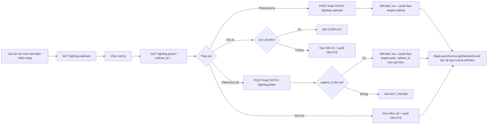

# TÀI LIỆU THIẾT KẾ KỸ THUẬT — LỚP DỮ LIỆU ĐÈN CHIẾU SÁNG (GIS)

---

## 📋 LỊCH SỬ THAY ĐỔI (CHANGELOG)

> Mỗi thay đổi nghiệp vụ hoặc hợp đồng tích hợp so với bản thiết kế gốc được ghi tại đây và đánh dấu **tại chỗ** bằng khối trích dẫn `> 🔄 CẬP NHẬT [ngày]` hoặc `> 🆕 MỚI [ngày]`, để FE/BE dễ dàng đối chiếu.

| Ngày       | Nội dung thay đổi                                                                                                                                                                                                                                                                        | Mục liên quan |
| :--------- | :--------------------------------------------------------------------------------------------------------------------------------------------------------------------------------------------------------------------------------------------------------------------------------------- | :------------ |
| 2026-09-04 | **Khởi tạo**: tách lớp Đèn chiếu sáng khỏi bảng vị trí generic `map_layer_items` (đã bị xóa, xem `map_layers_technical_design.md`), triển khai bảng nghiệp vụ riêng (tủ điều khiển + cột đèn) theo `docs/driver/Thuyet_minh_giai_phap_CSDL.docx` Mục I, có nhật ký thay đổi field-level. | Toàn bộ       |

---

## MỤC LỤC

1. [Phạm vi](#1-phạm-vi)
2. [Quyết định thiết kế](#2-quyết-định-thiết-kế)
   - [2.1. Hai bảng nghiệp vụ: tủ điều khiển và cột đèn](#21-hai-bảng-nghiệp-vụ-tủ-điều-khiển-và-cột-đèn)
   - [2.2. Liên kết với danh mục lớp bản đồ (`map_layers`)](#22-liên-kết-với-danh-mục-lớp-bản-đồ-map_layers)
   - [2.3. Nhật ký thay đổi field-level dùng chung cho tủ và cột](#23-nhật-ký-thay-đổi-field-level-dùng-chung-cho-tủ-và-cột)
   - [2.4. Quy tắc dữ liệu](#24-quy-tắc-dữ-liệu)
3. [Luồng nghiệp vụ](#3-luồng-nghiệp-vụ)
4. [Thiết kế cơ sở dữ liệu](#4-thiết-kế-cơ-sở-dữ-liệu)
   - [4.1. `lighting_cabinets`](#41-lighting_cabinets)
   - [4.2. `lighting_poles`](#42-lighting_poles)
   - [4.3. `lighting_audit_logs`](#43-lighting_audit_logs)
5. [Danh mục thiết kế RESTful API contracts và bảng tham số chi tiết](#5-danh-mục-thiết-kế-restful-api-contracts-và-bảng-tham-số-chi-tiết)
   - [5.1. Quy chuẩn dùng chung](#51-quy-chuẩn-dùng-chung)
   - [5.2. API quản lý tủ điều khiển — `/api/v1/lighting-cabinets`](#52-api-quản-lý-tủ-điều-khiển--apiv1lighting-cabinets)
   - [5.3. API quản lý cột đèn — `/api/v1/lighting-poles`](#53-api-quản-lý-cột-đèn--apiv1lighting-poles)
6. [Phân quyền](#6-phân-quyền)
7. [Ranh giới với `map_layers` và các lớp khác](#7-ranh-giới-với-map_layers-và-các-lớp-khác)
8. [Triển khai và kiểm thử](#8-triển-khai-và-kiểm-thử)

## 1. Phạm vi

Phân hệ này quản lý dữ liệu của lớp bản đồ **Đèn chiếu sáng** (`map_layers.code = LYR_LIGHT`):

1. **Quản lý tủ điều khiển chiếu sáng**: CRUD tủ, vị trí lắp đặt, khối lượng đèn theo chủng loại, chiều dài đường dây, trạng thái bàn giao/vận hành.
2. **Quản lý cột đèn**: CRUD cột đèn gắn với một tủ điều khiển, tọa độ, chủng loại đèn, công suất, mốc thời gian lắp đặt/thay bóng, tình trạng hoạt động.
3. **Nhật ký thay đổi**: ghi vết từng trường dữ liệu bị thay đổi trên cả tủ và cột, phân biệt bằng cột `target`.

Module này **không** quản lý danh mục lớp bản đồ (`map_layers` — xem `map_layers_technical_design.md`) và không có khóa ngoại tới bảng đó; quan hệ giữa hai module là một ánh xạ cố định theo `code`, resolve ở tầng `MapLayersService` (xem [§2.2](#22-liên-kết-với-danh-mục-lớp-bản-đồ-map_layers)).

Import hàng loạt từ Excel **chưa được triển khai** ở đợt này — xem [§8](#8-triển-khai-và-kiểm-thử).

## 2. Quyết định thiết kế

### 2.1. Hai bảng nghiệp vụ: tủ điều khiển và cột đèn

Khác với Cây xanh (một bảng trung tâm), Đèn chiếu sáng có quan hệ cha-con thật sự trong dữ liệu: mỗi **tủ điều khiển** (`lighting_cabinets`) cấp nguồn cho nhiều **cột đèn** (`lighting_poles`), theo đúng mô tả tại `docs/driver/Thuyet_minh_giai_phap_CSDL.docx`, Mục 1.7.7. Khối lượng đèn theo chủng loại (5 cột đếm: `sodium_count`, `led_count`, `metal_halide_count`, `mercury_count`, `other_count`) và `total_lamps` được lưu trên **tủ** — đây là số liệu hồ sơ do đơn vị vận hành cung cấp, không nhất thiết khớp tuyệt đối với số cột đèn đã khảo sát chi tiết (bảng `lighting_poles` "được điền dần theo tiến độ khảo sát hiện trường" — tài liệu gốc). Vì vậy `total_lamps` **không** bị ràng buộc bằng `CHECK` phải bằng tổng 5 cột chủng loại; việc đối chiếu hai con số này là việc của tầng báo cáo/service, không phải ràng buộc toàn vẹn dữ liệu.

Không dùng cột JSONB cho thuộc tính riêng. Danh mục đóng (`handover_status`, `status` của tủ; `lamp_type`, `status` của cột) được ràng buộc bằng `CHECK` ngay trên bảng.

### 2.2. Liên kết với danh mục lớp bản đồ (`map_layers`)

Tương tự Cây xanh: không có cột `map_layer_id` hay khóa ngoại nào từ `lighting_cabinets`/`lighting_poles` về `map_layers`. `MapLayersModule` import `LightingModule` và inject `LightingService` trực tiếp:

```ts
LYR_LIGHT: () => this.lightingService.countLivePoles();
```

**Quan trọng**: `element_count` của lớp Đèn chiếu sáng đếm theo **số cột đèn** (`lighting_poles`), không phải số tủ điều khiển — quyết định nghiệp vụ đã chốt, vì cột đèn là đơn vị hiển thị trên bản đồ (mỗi điểm sáng = 1 cột), còn tủ là hạ tầng cấp nguồn phía sau. Xóa lớp `LYR_LIGHT` qua `DELETE /api/v1/map-layers` luôn bị từ chối (`409 CONFLICT`) vì lớp này được sở hữu bởi module chuyên biệt — xem `map_layers_technical_design.md` §5.2.5.

### 2.3. Nhật ký thay đổi field-level dùng chung cho tủ và cột

Cùng quyết định và cơ chế như module Cây xanh (xem `trees_technical_design.md` §2.3): ghi ở **tầng service**, không dùng Postgres trigger, dùng chung hàm thuần `buildFieldDiffs()` (`src/shared/entity-diff.util.ts`).

Khác biệt riêng của module này: `lighting_audit_logs` là **một bảng dùng chung** cho cả 2 loại đối tượng, phân biệt bằng cột `target` (`'cabinet'` hoặc `'pole'`):

- `cabinet_id` **luôn có giá trị**, kể cả với một dòng nhật ký của cột đèn — vì cột đèn thuộc về một tủ, nên nhật ký của cột cũng ghi lại tủ chứa nó, cho phép truy vấn toàn bộ lịch sử thay đổi dưới một tủ mà không cần join qua bảng cột (đúng đặc tả tài liệu CSDL gốc, Mục 1.7.7.c: _"Liên kết đến tủ điều khiển; luôn có giá trị, kể cả với thay đổi của cột đèn"_).
- `pole_id` chỉ có giá trị khi `target = 'pole'`.
- `CHECK` ràng buộc: `target = 'cabinet' → pole_id IS NULL`; `target = 'pole' → pole_id IS NOT NULL`.

`LightingService.updateCabinet()`/`updatePole()` đều theo đúng flow: đọc trong transaction → kiểm tra `version` → diff field → lưu + tăng `version` → ghi N dòng audit (một dòng mỗi field đổi thật sự) — không ghi log nếu không đổi gì.

### 2.4. Quy tắc dữ liệu

- `cabinet_code` duy nhất toàn hệ thống, cho phép hậu tố chữ (`28A`, `55B`), là khóa tự nhiên chống nhập trùng.
- `cabinet_lat`/`cabinet_lng` là **tùy chọn** — theo số liệu khảo sát ban đầu, 142/142 tủ hiện chưa có tọa độ, chỉ có mô tả vị trí bằng chữ (`location_desc`); chờ khảo sát bổ sung.
- `pole_lat`/`pole_lng` là **bắt buộc** khi tạo cột đèn (khác với tủ) — một cột đèn luôn được khảo sát kèm tọa độ.
- `pole_code` là tùy chọn (cột chưa đánh số vẫn tạo được), nhưng khi có giá trị thì duy nhất toàn hệ thống — ràng buộc bằng **partial unique index** (`WHERE pole_code IS NOT NULL`), không phải `UNIQUE` thường, vì cho phép nhiều cột cùng chưa có mã.
- `lamp_type` thuộc danh mục đóng 5 giá trị: `led`, `sodium`, `metal_halide`, `mercury`, `other`; để trống khi khảo sát chưa xác định.
- `last_replaced_at` không được sớm hơn `installed_at` khi cả hai có giá trị — ràng buộc bằng `CHECK` ở DB, kiểm tra lại ở tầng service (`assertReplacementNotBeforeInstall`) để trả lỗi thân thiện thay vì để lộ vi phạm constraint thô.
- Xóa tủ điều khiển bị từ chối (`409 CONFLICT`) nếu tủ còn cột đèn chưa xóa mềm gắn vào (`fk_lighting_poles_cabinet_id ... ON DELETE RESTRICT` + kiểm tra ở service trước khi xóa).
- Xóa tủ/cột là xóa mềm; `LightingService.countLivePoles()` chỉ đếm cột chưa xóa mềm.

## 3. Luồng nghiệp vụ



## 4. Thiết kế cơ sở dữ liệu

Cả 3 bảng đều kế thừa `BaseEntity` (`src/base/base.entity.ts`): khóa chính `id UUID DEFAULT gen_random_uuid()`, `created_at`/`updated_at` timestamptz, `deleted_at` timestamptz nullable (xóa mềm).

### 4.1. `lighting_cabinets`

Mỗi dòng một tủ điều khiển. Migration: `src/migrations/1787447000000-CreateLightingCabinetsTable.ts`.

| Cột                                    | Kiểu                     | Ràng buộc / Ý nghĩa                                                                 |
| -------------------------------------- | ------------------------ | ----------------------------------------------------------------------------------- |
| `id`                                   | `uuid`                   | Khóa chính.                                                                         |
| `cabinet_code`                         | `text`                   | `UNIQUE`. Số tủ ghi ngoài thực địa, cho phép hậu tố chữ.                            |
| `location_desc`                        | `text` nullable          | Mô tả vị trí lắp đặt (tuyến đường, trạm biến áp...).                                |
| `cabinet_lat`                          | `numeric(10,7)` nullable | Vĩ độ WGS-84; để trống khi chưa khảo sát bổ sung.                                   |
| `cabinet_lng`                          | `numeric(11,7)` nullable | Kinh độ WGS-84; để trống khi chưa khảo sát bổ sung.                                 |
| `sodium_count`                         | `integer` NOT NULL       | Mặc định `0`. Số đèn cao áp natri theo hồ sơ.                                       |
| `led_count`                            | `integer` NOT NULL       | Mặc định `0`. Số đèn LED theo hồ sơ.                                                |
| `metal_halide_count`                   | `integer` NOT NULL       | Mặc định `0`.                                                                       |
| `mercury_count`                        | `integer` NOT NULL       | Mặc định `0`.                                                                       |
| `other_count`                          | `integer` NOT NULL       | Mặc định `0`.                                                                       |
| `total_lamps`                          | `integer` NOT NULL       | Mặc định `0`. Tổng theo hồ sơ; **không** ràng buộc bằng tổng 5 cột trên (xem §2.1). |
| `cable_length_m`                       | `numeric(8,1)` nullable  | Tổng chiều dài đường dây do tủ cấp nguồn, 1 chữ số thập phân.                       |
| `managing_unit`                        | `text` nullable          | Đơn vị quản lý, vận hành.                                                           |
| `handover_status`                      | `text` nullable          | `CHECK IN ('handed_over', 'operating_temporarily', 'not_handed_over')`.             |
| `status`                               | `text` nullable          | `CHECK IN ('operating', 'not_operating')`.                                          |
| `version`                              | `integer` NOT NULL       | Mặc định `1`. Optimistic-concurrency.                                               |
| `created_at`/`updated_at`/`deleted_at` | `timestamptz`            | Lifecycle và xóa mềm.                                                               |

Index: `idx_lighting_cabinets_status` (`status`).

### 4.2. `lighting_poles`

Mỗi dòng một cột đèn, gắn với một tủ. Migration: `src/migrations/1787448000000-CreateLightingPolesTable.ts` (sau `lighting_cabinets` do có FK phụ thuộc).

| Cột                                    | Kiểu                     | Ràng buộc / Ý nghĩa                                                                  |
| -------------------------------------- | ------------------------ | ------------------------------------------------------------------------------------ |
| `id`                                   | `uuid`                   | Khóa chính.                                                                          |
| `cabinet_id`                           | `uuid` NOT NULL          | FK → `lighting_cabinets(id)`, `ON DELETE RESTRICT`.                                  |
| `pole_code`                            | `text` nullable          | Số hiệu ghi trên thân cột; **unique khi có giá trị** (partial unique index).         |
| `pole_lat`                             | `numeric(10,7)` NOT NULL | Vĩ độ WGS-84, bắt buộc.                                                              |
| `pole_lng`                             | `numeric(11,7)` NOT NULL | Kinh độ WGS-84, bắt buộc.                                                            |
| `lamp_type`                            | `text` nullable          | `CHECK IN ('led', 'sodium', 'metal_halide', 'mercury', 'other')`.                    |
| `lamp_count`                           | `integer` NOT NULL       | Mặc định `1`. Cột cần đôi mang ≥ 2.                                                  |
| `power_w`                              | `integer` nullable       | Công suất một bộ đèn, đơn vị W.                                                      |
| `pole_height_m`                        | `numeric(5,2)` nullable  | Chiều cao cột, đơn vị mét.                                                           |
| `installed_at`                         | `date` nullable          | Ngày lắp đặt.                                                                        |
| `last_replaced_at`                     | `date` nullable          | Ngày thay bóng gần nhất; `CHECK` không sớm hơn `installed_at` khi cả hai có giá trị. |
| `status`                               | `text` nullable          | `CHECK IN ('operating', 'broken_pending_repair', 'dismantled')`.                     |
| `note`                                 | `text` nullable          | Ghi chú của cán bộ khảo sát.                                                         |
| `version`                              | `integer` NOT NULL       | Mặc định `1`. Optimistic-concurrency.                                                |
| `created_at`/`updated_at`/`deleted_at` | `timestamptz`            | Lifecycle và xóa mềm.                                                                |

Index: `idx_lighting_poles_cabinet_id` (`cabinet_id`), `idx_lighting_poles_status` (`status`), unique index bộ phận `uq_lighting_poles_pole_code` (`pole_code`, `WHERE pole_code IS NOT NULL`).

### 4.3. `lighting_audit_logs`

Nhật ký thay đổi field-level dùng chung cho cả tủ và cột, append-only. Migration: `src/migrations/1787449000000-CreateLightingAuditLogsTable.ts` (sau `lighting_poles`).

| Cột                                    | Kiểu                   | Ràng buộc / Ý nghĩa                                                                        |
| -------------------------------------- | ---------------------- | ------------------------------------------------------------------------------------------ |
| `id`                                   | `uuid`                 | Khóa chính.                                                                                |
| `target`                               | `text` NOT NULL        | `CHECK IN ('cabinet', 'pole')`.                                                            |
| `cabinet_id`                           | `uuid` NOT NULL        | FK → `lighting_cabinets(id)`. **Luôn có giá trị**, kể cả khi `target = 'pole'` (xem §2.3). |
| `pole_id`                              | `uuid` nullable        | FK → `lighting_poles(id)`. Chỉ có giá trị khi `target = 'pole'`.                           |
| `action`                               | `text` NOT NULL        | `CHECK IN ('INSERT', 'UPDATE', 'DELETE')`.                                                 |
| `field_name`                           | `text` nullable        | Tên trường bị đổi; rỗng với `INSERT`/`DELETE`.                                             |
| `old_value` / `new_value`              | `text` nullable        | Giá trị trước/sau, đã stringify.                                                           |
| `reason`                               | `text` nullable        | Lý do thay đổi.                                                                            |
| `actor_user_id`                        | `uuid` nullable        | Không FK cứng tới bảng user.                                                               |
| `actor_display_snapshot`               | `text` nullable        | Snapshot tên hiển thị người thực hiện.                                                     |
| `actor_ip`                             | `inet` nullable        | Địa chỉ IP thực hiện thao tác.                                                             |
| `actual_time`                          | `timestamptz` NOT NULL | Thời điểm thực hiện thay đổi.                                                              |
| `created_at`/`updated_at`/`deleted_at` | `timestamptz`          | Lifecycle của chính dòng nhật ký.                                                          |

CHECK bổ sung `chk_lighting_audit_logs_target_ref`: `(target='cabinet' AND pole_id IS NULL) OR (target='pole' AND pole_id IS NOT NULL)`. Index: `idx_lighting_audit_logs_cabinet_id`, `idx_lighting_audit_logs_pole_id`, `idx_lighting_audit_logs_actual_time`.

## 5. DANH MỤC THIẾT KẾ RESTFUL API CONTRACTS VÀ BẢNG THAM SỐ CHI TIẾT

> **Quy chuẩn kiến trúc:** Base URL là `/api/v1`. Tất cả API yêu cầu JWT Bearer (chưa gắn `@RequireRole` — xem §6). Không dùng path parameter; GET dùng Query Params, POST/PATCH/DELETE dùng Request Body.

### 5.1. Quy chuẩn dùng chung

Envelope thành công/lỗi, phân trang và mã lỗi giống hệt `map_layers_technical_design.md` §5.1 — không lặp lại ở đây. Riêng module này:

| HTTP | `code`         | Trường hợp dùng trong module                                                                               |
| ---- | -------------- | ---------------------------------------------------------------------------------------------------------- |
| 400  | `BAD_REQUEST`  | Body/query sai định dạng.                                                                                  |
| 401  | `UNAUTHORIZED` | Thiếu hoặc sai JWT.                                                                                        |
| 404  | `NOT_FOUND`    | Không tìm thấy tủ/cột; hoặc tạo cột với `cabinet_id` không tồn tại.                                        |
| 409  | `CONFLICT`     | `version` không khớp; trùng `cabinet_code`; xóa tủ còn cột đèn; `last_replaced_at` sớm hơn `installed_at`. |

### 5.2. API quản lý tủ điều khiển — `/api/v1/lighting-cabinets`

#### Response object `LightingCabinetResponseDto`

| Field                            | Kiểu             | Ý nghĩa                                                    |
| -------------------------------- | ---------------- | ---------------------------------------------------------- |
| `id`                             | `string` (UUID)  | Khóa chính.                                                |
| `cabinet_code`                   | `string`         | Số tủ, duy nhất.                                           |
| `location_desc`                  | `string \| null` | Mô tả vị trí lắp đặt.                                      |
| `cabinet_lat` / `cabinet_lng`    | `number \| null` | Tọa độ WGS-84 (thường `null` khi chưa khảo sát bổ sung).   |
| `sodium_count` ... `other_count` | `integer`        | Số đèn theo từng chủng loại.                               |
| `total_lamps`                    | `integer`        | Tổng số đèn theo hồ sơ.                                    |
| `cable_length_m`                 | `number \| null` | Chiều dài đường dây (m).                                   |
| `managing_unit`                  | `string \| null` | Đơn vị quản lý.                                            |
| `handover_status`                | `enum \| null`   | `handed_over`, `operating_temporarily`, `not_handed_over`. |
| `status`                         | `enum \| null`   | `operating`, `not_operating`.                              |
| `version`                        | `integer`        | Dùng cho optimistic lock khi `PATCH`.                      |
| `created_at`/`updated_at`        | `ISO 8601`       | Lifecycle.                                                 |

| Method   | Endpoint                        | Mục đích                                           |
| -------- | ------------------------------- | -------------------------------------------------- |
| `GET`    | `/lighting-cabinets`            | Danh sách tủ, phân trang, tìm kiếm/lọc.            |
| `GET`    | `/lighting-cabinets/detail?id=` | Chi tiết một tủ.                                   |
| `POST`   | `/lighting-cabinets`            | Tạo tủ mới.                                        |
| `PATCH`  | `/lighting-cabinets`            | Cập nhật; `id` + `version` trong body.             |
| `DELETE` | `/lighting-cabinets`            | Xóa mềm; từ chối nếu còn cột đèn (`409 CONFLICT`). |

#### 5.2.1. Lấy danh sách tủ điều khiển

- **Endpoint**: `GET /api/v1/lighting-cabinets`
- **Sắp xếp**: `cabinet_code ASC`.

| Tham số         | Vị trí | Kiểu      | Bắt buộc | Ý nghĩa                                   |
| --------------- | ------ | --------- | -------- | ----------------------------------------- |
| `page`, `limit` | Query  | `integer` | Không    | Phân trang, mặc định `1`/`20`.            |
| `status`        | Query  | `enum`    | Không    | `operating`, `not_operating`.             |
| `keyword`       | Query  | `string`  | Không    | Tìm trên `cabinet_code`, `location_desc`. |

#### 5.2.2. Lấy chi tiết một tủ

- **Endpoint**: `GET /api/v1/lighting-cabinets/detail`

| Tham số | Vị trí | Kiểu   | Bắt buộc | Ý nghĩa        |
| ------- | ------ | ------ | -------- | -------------- |
| `id`    | Query  | `uuid` | Có       | ID tủ cần xem. |

Trả `404 NOT_FOUND` nếu tủ không tồn tại hoặc đã xóa mềm.

#### 5.2.3. Tạo tủ điều khiển

- **Endpoint**: `POST /api/v1/lighting-cabinets`

| Trường                           | Kiểu      | Bắt buộc | Ràng buộc                                                  |
| -------------------------------- | --------- | -------- | ---------------------------------------------------------- |
| `cabinet_code`                   | `string`  | Có       | Tối đa 255 ký tự, duy nhất toàn hệ thống.                  |
| `location_desc`                  | `string`  | Không    | —                                                          |
| `cabinet_lat`, `cabinet_lng`     | `number`  | Không    | WGS-84, tối đa 7 chữ số thập phân.                         |
| `sodium_count` ... `other_count` | `integer` | Không    | ≥ 0, mặc định `0`.                                         |
| `total_lamps`                    | `integer` | Không    | ≥ 0, mặc định `0`.                                         |
| `cable_length_m`                 | `number`  | Không    | ≥ 0, 1 chữ số thập phân.                                   |
| `managing_unit`                  | `string`  | Không    | —                                                          |
| `handover_status`                | `enum`    | Không    | `handed_over`, `operating_temporarily`, `not_handed_over`. |
| `status`                         | `enum`    | Không    | `operating`, `not_operating`.                              |

**Request mẫu:**

```json
{
  "cabinet_code": "28A",
  "location_desc": "Đường Điện Biên, gần TBA Điện Biên 1",
  "sodium_count": 40,
  "led_count": 10,
  "total_lamps": 50,
  "cable_length_m": 1250.5,
  "managing_unit": "Công ty Điện lực Hưng Yên",
  "status": "operating"
}
```

Trả `409 CONFLICT` nếu `cabinet_code` đã tồn tại. Response `200 OK` trả tủ vừa tạo (`version: 1`), ghi 1 dòng nhật ký `target = cabinet`, `action = INSERT`.

#### 5.2.4. Cập nhật tủ điều khiển

- **Endpoint**: `PATCH /api/v1/lighting-cabinets`

| Trường            | Kiểu      | Bắt buộc | Ý nghĩa                                                              |
| ----------------- | --------- | -------- | -------------------------------------------------------------------- |
| `id`              | `uuid`    | Có       | ID tủ cần cập nhật.                                                  |
| `version`         | `integer` | Có       | Không khớp bản ghi hiện tại → `409 CONFLICT`.                        |
| `reason`          | `string`  | Không    | Lý do thay đổi, ghi vào nhật ký cho các field đổi trong request này. |
| Các field còn lại | —         | Không    | Dùng field của API tạo; chỉ field được truyền lên mới cập nhật.      |

Trả `404 NOT_FOUND` nếu không có tủ, `409 CONFLICT` nếu đổi `cabinet_code` sang mã đã tồn tại hoặc `version` không khớp.

#### 5.2.5. Xóa tủ điều khiển

- **Endpoint**: `DELETE /api/v1/lighting-cabinets`

| Trường   | Kiểu     | Bắt buộc | Ý nghĩa                     |
| -------- | -------- | -------- | --------------------------- |
| `id`     | `uuid`   | Có       | ID tủ cần xóa mềm.          |
| `reason` | `string` | Không    | Lý do xóa, ghi vào nhật ký. |

Từ chối (`409 CONFLICT`, message `LIGHTING_CABINET_MESSAGES.IN_USE`) nếu tủ còn cột đèn chưa xóa mềm. Xóa thành công ghi 1 dòng nhật ký `target = cabinet`, `action = DELETE`.

### 5.3. API quản lý cột đèn — `/api/v1/lighting-poles`

#### Response object `LightingPoleResponseDto`

| Field                     | Kiểu              | Ý nghĩa                                              |
| ------------------------- | ----------------- | ---------------------------------------------------- |
| `id`                      | `string` (UUID)   | Khóa chính.                                          |
| `cabinet_id`              | `string` (UUID)   | Tủ điều khiển cấp nguồn.                             |
| `pole_code`               | `string \| null`  | Số hiệu ghi trên thân cột.                           |
| `pole_lat` / `pole_lng`   | `number`          | Tọa độ WGS-84, luôn có giá trị.                      |
| `lamp_type`               | `enum \| null`    | `led`, `sodium`, `metal_halide`, `mercury`, `other`. |
| `lamp_count`              | `integer`         | Mặc định `1`.                                        |
| `power_w`                 | `integer \| null` | Công suất (W).                                       |
| `pole_height_m`           | `number \| null`  | Chiều cao cột (m).                                   |
| `installed_at`            | `string \| null`  | Ngày lắp đặt (`YYYY-MM-DD`).                         |
| `last_replaced_at`        | `string \| null`  | Ngày thay bóng gần nhất.                             |
| `status`                  | `enum \| null`    | `operating`, `broken_pending_repair`, `dismantled`.  |
| `note`                    | `string \| null`  | Ghi chú.                                             |
| `version`                 | `integer`         | Dùng cho optimistic lock khi `PATCH`.                |
| `created_at`/`updated_at` | `ISO 8601`        | Lifecycle.                                           |

| Method   | Endpoint                     | Mục đích                                              |
| -------- | ---------------------------- | ----------------------------------------------------- |
| `GET`    | `/lighting-poles`            | Danh sách cột, lọc theo tủ/trạng thái/chủng loại đèn. |
| `GET`    | `/lighting-poles/detail?id=` | Chi tiết một cột.                                     |
| `POST`   | `/lighting-poles`            | Tạo cột mới; `cabinet_id` bắt buộc trong body.        |
| `PATCH`  | `/lighting-poles`            | Cập nhật; `id` + `version` trong body.                |
| `DELETE` | `/lighting-poles`            | Xóa mềm; `id` trong body.                             |

#### 5.3.1. Lấy danh sách cột đèn

- **Endpoint**: `GET /api/v1/lighting-poles`
- **Sắp xếp**: `created_at DESC`.

| Tham số         | Vị trí | Kiểu      | Bắt buộc | Ý nghĩa                        |
| --------------- | ------ | --------- | -------- | ------------------------------ |
| `page`, `limit` | Query  | `integer` | Không    | Phân trang, mặc định `1`/`20`. |
| `cabinet_id`    | Query  | `uuid`    | Không    | Lọc cột thuộc một tủ.          |
| `status`        | Query  | `enum`    | Không    | Lọc theo tình trạng.           |
| `lamp_type`     | Query  | `enum`    | Không    | Lọc theo chủng loại đèn.       |

#### 5.3.2. Lấy chi tiết một cột đèn

- **Endpoint**: `GET /api/v1/lighting-poles/detail`

| Tham số | Vị trí | Kiểu   | Bắt buộc | Ý nghĩa         |
| ------- | ------ | ------ | -------- | --------------- |
| `id`    | Query  | `uuid` | Có       | ID cột cần xem. |

Trả `404 NOT_FOUND` nếu cột không tồn tại hoặc đã xóa mềm.

#### 5.3.3. Tạo cột đèn

- **Endpoint**: `POST /api/v1/lighting-poles`

| Trường                 | Kiểu      | Bắt buộc | Ràng buộc                                           |
| ---------------------- | --------- | -------- | --------------------------------------------------- |
| `cabinet_id`           | `uuid`    | Có       | Phải tồn tại; sai → `404 NOT_FOUND`.                |
| `pole_code`            | `string`  | Không    | Tối đa 255 ký tự, duy nhất khi có giá trị.          |
| `pole_lat`, `pole_lng` | `number`  | Có       | WGS-84, tối đa 7 chữ số thập phân.                  |
| `lamp_type`            | `enum`    | Không    | 1 trong 5 mã chủng loại.                            |
| `lamp_count`           | `integer` | Không    | Mặc định `1`, ≥ 1.                                  |
| `power_w`              | `integer` | Không    | ≥ 0.                                                |
| `pole_height_m`        | `number`  | Không    | ≥ 0.                                                |
| `installed_at`         | `date`    | Không    | —                                                   |
| `last_replaced_at`     | `date`    | Không    | Không sớm hơn `installed_at` nếu cả hai có giá trị. |
| `status`               | `enum`    | Không    | `operating`, `broken_pending_repair`, `dismantled`. |
| `note`                 | `string`  | Không    | —                                                   |

**Request mẫu:**

```json
{
  "cabinet_id": "c1a2b3c4-0000-4000-8000-000000000020",
  "pole_lat": 20.6462,
  "pole_lng": 106.0512,
  "lamp_type": "led",
  "power_w": 150,
  "installed_at": "2025-01-01"
}
```

Trả `404 NOT_FOUND` nếu `cabinet_id` không tồn tại, `409 CONFLICT` nếu `last_replaced_at` sớm hơn `installed_at`. Response `200 OK` trả cột vừa tạo (`version: 1`), ghi 1 dòng nhật ký `target = pole`, `action = INSERT`, `cabinet_id` = tủ cấp nguồn.

#### 5.3.4. Cập nhật cột đèn

- **Endpoint**: `PATCH /api/v1/lighting-poles`

| Trường            | Kiểu      | Bắt buộc | Ý nghĩa                                                         |
| ----------------- | --------- | -------- | --------------------------------------------------------------- |
| `id`              | `uuid`    | Có       | ID cột cần cập nhật.                                            |
| `version`         | `integer` | Có       | Không khớp bản ghi hiện tại → `409 CONFLICT`.                   |
| `cabinet_id`      | `uuid`    | Không    | Chuyển cột sang tủ khác; tủ mới phải tồn tại.                   |
| `reason`          | `string`  | Không    | Lý do thay đổi.                                                 |
| Các field còn lại | —         | Không    | Dùng field của API tạo; chỉ field được truyền lên mới cập nhật. |

Mỗi field thực sự đổi giá trị sinh một dòng `lighting_audit_logs` (`target = pole`, `cabinet_id` luôn ghi theo tủ **hiện tại** của cột sau khi lưu). Trả `404 NOT_FOUND` nếu không có cột hoặc `cabinet_id` mới không tồn tại; `409 CONFLICT` nếu `version` không khớp hoặc vi phạm ràng buộc ngày thay bóng.

#### 5.3.5. Xóa cột đèn

- **Endpoint**: `DELETE /api/v1/lighting-poles`

| Trường   | Kiểu     | Bắt buộc | Ý nghĩa                     |
| -------- | -------- | -------- | --------------------------- |
| `id`     | `uuid`   | Có       | ID cột cần xóa mềm.         |
| `reason` | `string` | Không    | Lý do xóa, ghi vào nhật ký. |

**Response `200 OK`:**

```json
{ "success": true, "message": "Xóa cột đèn thành công", "data": null }
```

Ghi 1 dòng nhật ký `target = pole`, `action = DELETE`. Cột bị xóa mềm không còn xuất hiện trong danh sách và không được tính vào `element_count` của lớp `LYR_LIGHT`.

## 6. Phân quyền

Theo quyết định đã thống nhất, module này **chưa gắn quyền riêng** ở đợt triển khai này — chỉ dùng quyền sẵn có `gis-map.layer.manage` cho việc quản lý danh mục lớp bản đồ nói chung. `LightingCabinetsController` và `LightingPolesController` không gắn `@RequireRole`, nhất quán với phần lớn controller khác trong repo. Khi cần bật quyền riêng, thêm role dạng `<module>.<object>.<action>` (ví dụ `lighting.cabinet.manage`, `lighting.pole.manage`) vào `auth.constants.ts` và `keycloak/realm-phohien.json`, rồi gắn `@RequireRole` trên các route mutating.

## 7. Ranh giới với `map_layers` và các lớp khác

- `LightingModule` không import `MapLayersModule`; chiều phụ thuộc duy nhất là `MapLayersModule → LightingModule` (xem §2.2).
- Không có bảng nào trong module này tham chiếu `map_layers.id`.
- `LightingService` chỉ export những gì `MapLayersService` cần (`countLivePoles()`); không export logic CRUD tủ/cột cho module khác dùng lại.

## 8. Triển khai và kiểm thử

Thay đổi mã nguồn chính:

- `src/modules/lighting/`: `lighting-cabinet.entity.ts`, `lighting-pole.entity.ts`, `lighting-audit-log.entity.ts`, `lighting.dto.ts`, `lighting.mapper.ts`, `lighting.constants.ts`, `lighting.service.ts`, `lighting.controller.ts` (2 controller: `LightingCabinetsController`, `LightingPolesController`), `lighting.module.ts`, `lighting.service.spec.ts`.
- `src/shared/entity-diff.util.ts` (+ `entity-diff.util.spec.ts`): dùng chung với module Cây xanh.
- `src/migrations/1787447000000-CreateLightingCabinetsTable.ts`, `1787448000000-CreateLightingPolesTable.ts`, `1787449000000-CreateLightingAuditLogsTable.ts` (chạy theo đúng thứ tự do phụ thuộc FK).
- `src/app.module.ts`: đăng ký `LightingModule`.
- `src/modules/map-layers/map-layers.service.ts`: inject `LightingService`, dùng `countLivePoles()` cho `element_count` của `LYR_LIGHT`.

**Chưa triển khai ở đợt này**: import hàng loạt từ Excel/bảng khối lượng của đơn vị vận hành; quyền riêng cho module; Postgres trigger cho audit (xem §2.3); đối chiếu tự động `total_lamps` với tổng 5 cột chủng loại (hiện chỉ là số liệu hồ sơ song song, không tự tính).

Kiểm tra bắt buộc trước khi merge:

```bash
pnpm run lint:check
pnpm run format:check
pnpm run typecheck
pnpm test
pnpm run openapi:check
pnpm run build
```

Migration: `pnpm run db:migrate` → `pnpm run db:revert` (theo thứ tự ngược) → `pnpm run db:migrate` lại để xác nhận có thể áp dụng lại được đúng convention AGENT.md. **Chưa chạy được trong môi trường phát triển này do không có Postgres** — cần verify trên máy có DB trước khi merge.
