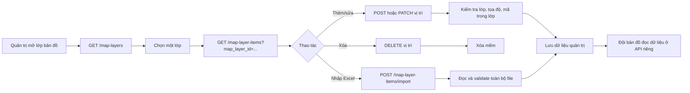

# TÀI LIỆU THIẾT KẾ KỸ THUẬT — QUẢN LÝ LỚP VÀ DANH MỤC BẢN ĐỒ

---

## 📋 LỊCH SỬ THAY ĐỔI (CHANGELOG)

> Mỗi thay đổi nghiệp vụ hoặc hợp đồng tích hợp so với bản thiết kế gốc được ghi tại đây và đánh dấu **tại chỗ** bằng khối trích dẫn `> 🔄 CẬP NHẬT [ngày]` hoặc `> 🆕 MỚI [ngày]`, để FE/BE và đội bản đồ dễ dàng đối chiếu.

| Ngày       | Nội dung thay đổi                                                                                                                                                                                                                | Mục liên quan |
| :--------- | :------------------------------------------------------------------------------------------------------------------------------------------------------------------------------------------------------------------------------- | :------------ |
| 2026-08-12 | **Khởi tạo phân hệ quản lý bản đồ**: chuẩn hóa `map_layers` cho CRUD lớp và bổ sung `map_layer_items` cho CRUD các vị trí thuộc lớp; loại bỏ phạm vi quản lý camera khỏi module.                                                 | §1–§5, §7–§8  |
| 2026-08-12 | **Bổ sung hợp đồng với VNMap SDK 3.0.0**: SDK chỉ hiển thị bản đồ nền/lớp dữ liệu phía trình duyệt; backend cung cấp dữ liệu quản trị, không gọi SDK và không giao CRUD cho SDK.                                                 | §3, §6, §7    |
| 2026-08-13 | **Chuẩn hóa chi tiết API contracts**: bổ sung bảng tham số, request/response mẫu, response fields, phân trang, envelope và mã lỗi cho `map_layers`, `map_layer_items` và API import Excel theo format tài liệu `urban_services`. | §5            |
| 2026-08-13 | **Chuẩn hóa tên trường trên wire**: request/query và response của module dùng `snake_case`; entity/TypeScript nội bộ vẫn giữ `camelCase`.                                                                                        | §5, §6        |

---

## MỤC LỤC

1. [Phạm vi](#1-phạm-vi)
2. [Quyết định thiết kế](#2-quyết-định-thiết-kế)
   - [2.1. Một bảng vị trí generic](#21-một-bảng-vị-trí-generic)
   - [2.2. Quy tắc dữ liệu](#22-quy-tắc-dữ-liệu)
3. [Luồng nghiệp vụ](#3-luồng-nghiệp-vụ)
4. [Thiết kế cơ sở dữ liệu](#4-thiết-kế-cơ-sở-dữ-liệu)
   - [4.1. `map_layers`](#41-map_layers)
   - [4.2. `map_layer_items`](#42-map_layer_items)
5. [Danh mục thiết kế RESTful API contracts và bảng tham số chi tiết](#5-danh-mục-thiết-kế-restful-api-contracts-và-bảng-tham-số-chi-tiết)
   - [5.1. Quy chuẩn dùng chung](#51-quy-chuẩn-dùng-chung)
   - [5.2. API quản lý lớp bản đồ](#52-api-quản-lý-lớp-bản-đồ-map-layers)
   - [5.3. API quản lý danh mục vị trí](#53-api-quản-lý-danh-mục-vị-trí-map-layer-items)
   - [5.4. API nhập danh mục từ Excel](#54-api-nhập-danh-mục-từ-excel)
6. [Hợp đồng tích hợp với VNMap SDK](#6-hợp-đồng-tích-hợp-với-vnmap-sdk)
   - [6.1. Vai trò của SDK](#61-vai-trò-của-sdk)
   - [6.2. Mapping dữ liệu](#62-mapping-dữ-liệu)
   - [6.3. Luồng hiển thị đề xuất](#63-luồng-hiển-thị-đề-xuất)
   - [6.4. Giới hạn của phiên bản đầu](#64-giới-hạn-của-phiên-bản-đầu)
7. [Ranh giới với camera và bản đồ nền](#7-ranh-giới-với-camera-và-bản-đồ-nền)
8. [Triển khai và kiểm thử](#8-triển-khai-và-kiểm-thử)

## 1. Phạm vi

Phân hệ này quản lý hai màn hình trong mockup:

1. **Quản lý lớp bản đồ**: CRUD lớp dữ liệu, trạng thái vận hành, thứ tự hiển thị, cấu hình icon/màu và số lượng vị trí.
2. **Danh mục bản đồ**: CRUD các vị trí thuộc từng lớp, tìm kiếm/phân trang, nhập danh sách từ Excel.

Phân hệ chỉ là **lớp quản trị dữ liệu**. Bản đồ nền, cách render lớp trên bản đồ nền, tile/vector service, clustering, heatmap và đồng bộ với hệ thống hiển thị thuộc đội khác, không nằm trong module này. SDK VNMap là một dependency phía trình duyệt của đội hiển thị; module này không nhúng SDK và không gọi SDK từ backend.

Camera cũng không thuộc module này. Không có bảng `cameras`, `installation_tasks`, API `/cameras` hoặc quan hệ map-layer-camera sau migration chuyển đổi. Nếu một nghiệp vụ khác nhận dữ liệu camera từ hệ thống bên ngoài, nghiệp vụ đó tự lưu mã/snapshot theo thiết kế riêng.

## 2. Quyết định thiết kế

### 2.1. Một bảng vị trí generic

Không tạo một bảng riêng cho từng loại điểm như `trees`, `street_lights` hoặc `waste_points`. Các trường dùng chung được chuẩn hóa trong `map_layer_items`:

- `name`, `code`, `category`, `address` phục vụ danh sách và tìm kiếm;
- `latitude`, `longitude` phục vụ dữ liệu điểm;
- `status` phục vụ bật/tắt vị trí;
- `properties` là JSONB cho thuộc tính riêng của lớp, ví dụ `height_meters`, `power_watts`, `collection_frequency`.

Thiết kế này cho phép thêm lớp mới mà không cần migration mới. Đội bản đồ có thể đọc `properties` cùng cấu hình lớp để quyết định cách hiển thị; module quản trị không biết và không phụ thuộc vào cách render đó.

### 2.2. Quy tắc dữ liệu

- Mỗi lớp có `code` duy nhất.
- `code` của vị trí là tùy chọn vì mockup có lớp dùng mã và lớp chỉ dùng tên.
- Nếu có `code`, mã đó duy nhất trong phạm vi một lớp và được phép dùng lại sau khi vị trí cũ bị xóa mềm.
- Một vị trí luôn có tọa độ WGS-84 hợp lệ: latitude `[-90, 90]`, longitude `[-180, 180]`.
- Xóa lớp là xóa mềm và bị từ chối khi lớp còn vị trí, tránh dữ liệu mồ côi.
- Xóa vị trí là xóa mềm; bộ đếm lớp chỉ tính các vị trí chưa bị xóa.
- `properties` không được dùng để lưu mật khẩu, token, URL kết nối hoặc thông tin bí mật.

## 3. Luồng nghiệp vụ



Module này không gọi bản đồ nền sau bước lưu dữ liệu. Consumer bản đồ đọc các lớp/vị trí đang được phép hiển thị từ API rồi chuyển đổi sang định dạng mà SDK yêu cầu. Việc một lớp đang `active` có được hiển thị hay không do hệ thống bản đồ quyết định.

## 4. Thiết kế cơ sở dữ liệu

### 4.1. `map_layers`

Bảng đã có trong repo và tiếp tục là bảng nguồn của màn hình quản lý lớp. Khóa chính integer được giữ nguyên để không phá dữ liệu/API hiện hữu của bảng này.

| Cột                                      | Kiểu                    | Ý nghĩa                                    |
| ---------------------------------------- | ----------------------- | ------------------------------------------ |
| `id`                                     | `serial`                | Khóa chính lớp                             |
| `code`                                   | `varchar(100)` unique   | Mã nghiệp vụ duy nhất                      |
| `name`                                   | `varchar(255)`          | Tên hiển thị                               |
| `description`                            | `text` nullable         | Mô tả                                      |
| `group_name`                             | `varchar(100)` nullable | Nhóm dữ liệu                               |
| `layer_type`                             | `varchar(50)`           | `point`, `line`, `polygon`, `heatmap`      |
| `source_type`                            | `varchar(50)`           | Nguồn dữ liệu; v1 quản lý `internal_table` |
| `style_config`                           | `jsonb` nullable        | Icon, màu, kích thước, opacity             |
| `sort_order`                             | `smallint`              | Thứ tự sidebar                             |
| `is_visible_by_default`                  | `boolean`               | Cấu hình mặc định của lớp                  |
| `status`                                 | `varchar(20)`           | `active`, `inactive`, `maintenance`        |
| `created_at`, `updated_at`, `deleted_at` | `timestamptz`           | Lifecycle và xóa mềm                       |

`is_visible_by_default` chỉ là dữ liệu cấu hình cho consumer bản đồ; API không tự bật/tắt bản đồ nền.

### 4.2. `map_layer_items`

```sql
CREATE TABLE map_layer_items (
  id             serial PRIMARY KEY,
  map_layer_id   integer NOT NULL REFERENCES map_layers(id) ON DELETE RESTRICT,
  code           varchar(100),
  name           varchar(255) NOT NULL,
  description    text,
  category       varchar(100),
  address        text,
  latitude       numeric(10, 7) NOT NULL CHECK (latitude BETWEEN -90 AND 90),
  longitude      numeric(11, 7) NOT NULL CHECK (longitude BETWEEN -180 AND 180),
  properties     jsonb NOT NULL DEFAULT '{}'::jsonb,
  status         varchar(20) NOT NULL DEFAULT 'active'
                 CHECK (status IN ('active', 'inactive')),
  created_at     timestamptz NOT NULL DEFAULT now(),
  updated_at     timestamptz NOT NULL DEFAULT now(),
  deleted_at     timestamptz
);

CREATE UNIQUE INDEX uq_map_layer_items_layer_code
  ON map_layer_items (map_layer_id, code)
  WHERE code IS NOT NULL AND deleted_at IS NULL;
```

Các index tra cứu:

- `idx_map_layer_items_map_layer_id` cho danh sách theo lớp;
- `idx_map_layer_items_layer_status` cho bộ lọc trạng thái;
- tìm kiếm text dùng `ILIKE` trên tên, mã, địa chỉ, loại và JSONB properties.

Migration `DropCameraModuleTables` dọn các bảng camera/task cũ và seed lớp `camera-ai`; migration `CreateMapLayerItemsTable` tạo bảng vị trí generic.

## 5. DANH MỤC THIẾT KẾ RESTFUL API CONTRACTS VÀ BẢNG THAM SỐ CHI TIẾT

> 🔄 **CẬP NHẬT 2026-08-13**: Mục này được mở rộng thành hợp đồng API chi tiết để FE có thể triển khai trực tiếp theo request, response và mã lỗi thống nhất.

> **Quy chuẩn kiến trúc:**
>
> - Base URL là `/api/v1`; các endpoint bên dưới được viết rút gọn, ví dụ `/map-layers` tương ứng với `/api/v1/map-layers`.
> - Tất cả API quản trị yêu cầu JWT Bearer. Quyền dự kiến là `gis-map.layer.manage`; việc bật guard theo quyền thực hiện đồng bộ với cơ chế phân quyền chung.
> - Không dùng path parameter trong module này. GET dùng Query Params; POST/PATCH/DELETE dùng Request Body, giống quy ước hiện tại của các module trong repo.
> - Tất cả ID là số nguyên dương. `map_layer_id` là khóa tham chiếu từ `map_layer_items` tới `map_layers`.

### 5.1. Quy chuẩn dùng chung

> 🔄 **CẬP NHẬT 2026-08-13**: Tất cả field trên wire của module, gồm query params, request body, response object và các key cấu hình style được tài liệu hóa, dùng `snake_case`. Tên property `camelCase` chỉ được giữ bên trong entity/service TypeScript.

#### 5.1.1. Response thành công

API trả về envelope thống nhất:

```json
{
  "success": true,
  "message": "Thông báo nghiệp vụ bằng tiếng Việt",
  "data": {}
}
```

API danh sách trả thêm `meta` phân trang:

```json
{
  "success": true,
  "message": "Lấy danh sách thành công",
  "data": [],
  "meta": { "page": 1, "limit": 20, "total": 137, "total_pages": 7 }
}
```

API xóa mềm trả `data: null`. Thời gian trong response dùng ISO 8601 UTC. `latitude` và `longitude` được trả về dạng number dù PostgreSQL lưu kiểu numeric.

#### 5.1.2. Response lỗi

```json
{
  "success": false,
  "status_code": 409,
  "code": "CONFLICT",
  "message": "Mã lớp bản đồ đã tồn tại trong hệ thống",
  "errors": [],
  "path": "/api/v1/map-layers",
  "timestamp": "2026-08-13T08:00:00.000Z"
}
```

| HTTP | `code`         | Trường hợp dùng trong module                                                         |
| ---- | -------------- | ------------------------------------------------------------------------------------ |
| 400  | `BAD_REQUEST`  | Body/query sai; tọa độ ngoài phạm vi; file Excel không hợp lệ hoặc dòng sai dữ liệu. |
| 401  | `UNAUTHORIZED` | Thiếu hoặc sai JWT.                                                                  |
| 404  | `NOT_FOUND`    | Không tìm thấy lớp hoặc vị trí.                                                      |
| 409  | `CONFLICT`     | Trùng mã hoặc xóa lớp đang còn vị trí.                                               |

#### 5.1.3. Phân trang và tìm kiếm

| Tham số   | Vị trí | Kiểu      | Bắt buộc | Mặc định | Ràng buộc                            |
| --------- | ------ | --------- | -------- | -------- | ------------------------------------ |
| `page`    | Query  | `integer` | Không    | `1`      | Tối thiểu `1`.                       |
| `limit`   | Query  | `integer` | Không    | `20`     | Từ `1` đến `100`.                    |
| `keyword` | Query  | `string`  | Không    | —        | Tìm kiếm không phân biệt hoa thường. |

### 5.2. API quản lý lớp bản đồ — `/api/v1/map-layers`

`map_layers` là đối tượng cấp cha. FE dùng danh sách này để dựng Sidebar, bộ lọc lớp, trạng thái bật mặc định và lấy `element_count` hiển thị số lượng vị trí.

#### Response object của `map_layers`

| Field                   | Kiểu       | Ý nghĩa                                                          |
| ----------------------- | ---------- | ---------------------------------------------------------------- |
| `id`                    | `integer`  | ID lớp trong database.                                           |
| `code`                  | `string`   | Mã lớp duy nhất, dùng làm định danh ổn định khi FE tích hợp SDK. |
| `name`                  | `string`   | Tên hiển thị của lớp.                                            |
| `description`           | `string    | null`                                                            | Mô tả lớp.                                    |
| `group_name`            | `string    | null`                                                            | Nhóm dữ liệu.                                 |
| `layer_type`            | `enum`     | `point`, `line`, `polygon`, `heatmap`.                           |
| `source_type`           | `enum`     | `internal_table`, `geojson`, `wms`.                              |
| `style_config`          | `object    | null`                                                            | Cấu hình icon/màu/kích thước do FE diễn giải. |
| `sort_order`            | `integer`  | Thứ tự lớp trên Sidebar hoặc khi tạo layer trên bản đồ.          |
| `is_visible_by_default` | `boolean`  | Trạng thái bật mặc định khi FE tải bản đồ.                       |
| `status`                | `enum`     | `active`, `inactive`, `maintenance`.                             |
| `element_count`         | `integer`  | Số vị trí chưa xóa mềm thuộc lớp.                                |
| `created_at`            | `ISO 8601` | Thời điểm tạo.                                                   |
| `updated_at`            | `ISO 8601` | Thời điểm cập nhật gần nhất.                                     |

| Method   | Endpoint                                                 | Mục đích                          |
| -------- | -------------------------------------------------------- | --------------------------------- |
| `GET`    | `/map-layers?page=1&limit=20&status=active&keyword=ngap` | Danh sách lớp, có `element_count` |
| `GET`    | `/map-layers/detail?id=2`                                | Chi tiết một lớp                  |
| `POST`   | `/map-layers`                                            | Tạo lớp                           |
| `PATCH`  | `/map-layers`                                            | Cập nhật; `id` nằm trong body     |
| `DELETE` | `/map-layers`                                            | Xóa mềm; `id` nằm trong body      |

#### 5.2.1. Lấy danh sách lớp bản đồ

- **Endpoint**: `GET /api/v1/map-layers`
- **Mục đích**: Lấy danh sách lớp chưa bị xóa mềm, có phân trang và số lượng vị trí đang tồn tại.
- **Sắp xếp**: `sort_order ASC`, sau đó `id ASC`.

| Tên tham số   | Vị trí | Kiểu      | Bắt buộc | Ý nghĩa và ràng buộc                    |
| ------------- | ------ | --------- | -------- | --------------------------------------- |
| `page`        | Query  | `integer` | Không    | Trang hiện tại; mặc định `1`.           |
| `limit`       | Query  | `integer` | Không    | Mặc định `20`, tối đa `100`.            |
| `status`      | Query  | `enum`    | Không    | `active`, `inactive`, `maintenance`.    |
| `group_name`  | Query  | `string`  | Không    | Lọc gần đúng theo nhóm dữ liệu.         |
| `layer_type`  | Query  | `enum`    | Không    | `point`, `line`, `polygon`, `heatmap`.  |
| `source_type` | Query  | `enum`    | Không    | `internal_table`, `geojson`, `wms`.     |
| `keyword`     | Query  | `string`  | Không    | Tìm trên `name`, `code`, `description`. |

**Ví dụ gọi:** `GET /api/v1/map-layers?page=1&limit=20&status=active&keyword=ngap`

**Response `200 OK`:**

```json
{
  "success": true,
  "message": "Lấy danh sách lớp bản đồ thành công",
  "data": [
    {
      "id": 2,
      "code": "LYR_FLOOD",
      "name": "Điểm ngập úng",
      "description": "Các điểm thường xuyên ngập khi mưa lớn.",
      "group_name": "Điểm sự vụ",
      "layer_type": "point",
      "source_type": "internal_table",
      "style_config": { "icon_name": "waves", "color": "#06B6D4", "icon_size": 24 },
      "sort_order": 2,
      "is_visible_by_default": true,
      "status": "active",
      "element_count": 12,
      "created_at": "2026-08-12T08:00:00.000Z",
      "updated_at": "2026-08-12T08:00:00.000Z"
    }
  ],
  "meta": { "page": 1, "limit": 20, "total": 1, "total_pages": 1 }
}
```

#### 5.2.2. Lấy chi tiết một lớp

- **Endpoint**: `GET /api/v1/map-layers/detail`
- **Mục đích**: Lấy metadata của một lớp và `element_count`.

| Tên tham số | Vị trí | Kiểu      | Bắt buộc | Ý nghĩa                    |
| ----------- | ------ | --------- | -------- | -------------------------- |
| `id`        | Query  | `integer` | Có       | ID lớp bản đồ cần tra cứu. |

Response `200 OK` có dạng `{ success, message, data }`, trong đó `data` là một object cùng field với phần tử của API danh sách. Trả `404 NOT_FOUND` nếu lớp không tồn tại hoặc đã bị xóa mềm.

#### 5.2.3. Tạo lớp bản đồ

- **Endpoint**: `POST /api/v1/map-layers`
- **Mục đích**: Tạo metadata cho một lớp mới. Việc tạo lớp chưa tạo vị trí nào, nên `element_count` bằng `0`.

| Tên trường              | Vị trí    | Kiểu      | Bắt buộc | Ý nghĩa và ràng buộc                                                           |
| ----------------------- | --------- | --------- | -------- | ------------------------------------------------------------------------------ |
| `code`                  | Body JSON | `string`  | Có       | Mã duy nhất toàn hệ thống, tối đa 100 ký tự.                                   |
| `name`                  | Body JSON | `string`  | Có       | Tên hiển thị, tối đa 255 ký tự.                                                |
| `description`           | Body JSON | `string`  | Không    | Mô tả lớp.                                                                     |
| `group_name`            | Body JSON | `string`  | Không    | Nhóm dữ liệu, tối đa 100 ký tự.                                                |
| `layer_type`            | Body JSON | `enum`    | Không    | `point` mặc định; ngoài ra `line`, `polygon`, `heatmap`.                       |
| `source_type`           | Body JSON | `enum`    | Không    | `internal_table` mặc định; ngoài ra `geojson`, `wms`.                          |
| `style_config`          | Body JSON | `object`  | Không    | Đề xuất các key `icon_name`, `icon_url`, `color`, `icon_size`, `fill_opacity`. |
| `sort_order`            | Body JSON | `integer` | Không    | Thứ tự trên Sidebar, mặc định `1`, tối thiểu `1`.                              |
| `is_visible_by_default` | Body JSON | `boolean` | Không    | Có bật lớp khi FE tải lần đầu không; mặc định `true`.                          |
| `status`                | Body JSON | `enum`    | Không    | `active` mặc định; ngoài ra `inactive`, `maintenance`.                         |

**Request mẫu:**

```json
{
  "code": "LYR_FLOOD",
  "name": "Điểm ngập úng",
  "description": "Các điểm thường xuyên ngập khi mưa lớn.",
  "group_name": "Điểm sự vụ",
  "layer_type": "point",
  "source_type": "internal_table",
  "style_config": { "icon_name": "waves", "color": "#06B6D4", "icon_size": 24 },
  "sort_order": 2,
  "is_visible_by_default": true,
  "status": "active"
}
```

Response `201 Created` có dạng `{ success, message, data }`, trong đó `data` là lớp vừa tạo và có `element_count: 0`. Trả `409 CONFLICT` nếu `code` đã tồn tại.

#### 5.2.4. Cập nhật lớp bản đồ

- **Endpoint**: `PATCH /api/v1/map-layers`
- **Mục đích**: Cập nhật một phần metadata của lớp.

| Tên trường        | Vị trí    | Kiểu      | Bắt buộc | Ý nghĩa                                                                      |
| ----------------- | --------- | --------- | -------- | ---------------------------------------------------------------------------- |
| `id`              | Body JSON | `integer` | Có       | ID lớp cần cập nhật.                                                         |
| Các field còn lại | Body JSON | —         | Không    | Dùng các field `snake_case` của API tạo; chỉ cập nhật field được truyền lên. |

`map_layer_id` của các vị trí con không thay đổi khi cập nhật lớp. Response trả về lớp sau cập nhật, bao gồm `element_count` hiện tại. Trả `404 NOT_FOUND` nếu không có lớp hoặc `409 CONFLICT` nếu đổi sang `code` đã tồn tại.

#### 5.2.5. Xóa lớp bản đồ

- **Endpoint**: `DELETE /api/v1/map-layers`
- **Mục đích**: Xóa mềm lớp bản đồ.

| Tên trường | Vị trí    | Kiểu      | Bắt buộc | Ý nghĩa             |
| ---------- | --------- | --------- | -------- | ------------------- |
| `id`       | Body JSON | `integer` | Có       | ID lớp cần xóa mềm. |

**Response `200 OK`:**

```json
{ "success": true, "message": "Xóa lớp bản đồ thành công", "data": null }
```

Không cho xóa lớp khi còn vị trí chưa xóa mềm thuộc lớp đó; trả `409 CONFLICT`.

### 5.3. API quản lý danh mục vị trí — `/api/v1/map-layer-items`

`map_layer_items` là đối tượng cấp con. Mỗi bản ghi bắt buộc thuộc một `map_layers`; phiên bản đầu lưu dữ liệu điểm bằng cặp `latitude`/`longitude` WGS-84.

#### Response object của `map_layer_items`

| Field          | Kiểu       | Ý nghĩa                                |
| -------------- | ---------- | -------------------------------------- |
| `id`           | `integer`  | ID vị trí trong database.              |
| `map_layer_id` | `integer`  | ID lớp cha.                            |
| `code`         | `string    | null`                                  | Mã vị trí, duy nhất trong phạm vi lớp nếu có. |
| `name`         | `string`   | Tên điểm hiển thị.                     |
| `description`  | `string    | null`                                  | Mô tả điểm.                                   |
| `category`     | `string    | null`                                  | Phân loại nghiệp vụ.                          |
| `address`      | `string    | null`                                  | Địa chỉ hiển thị trong popup/danh sách.       |
| `latitude`     | `number`   | Vĩ độ WGS-84, từ `-90` đến `90`.       |
| `longitude`    | `number`   | Kinh độ WGS-84, từ `-180` đến `180`.   |
| `properties`   | `object`   | Thuộc tính mở rộng theo từng loại lớp. |
| `status`       | `enum`     | `active` hoặc `inactive`.              |
| `created_at`   | `ISO 8601` | Thời điểm tạo.                         |
| `updated_at`   | `ISO 8601` | Thời điểm cập nhật gần nhất.           |

| Method   | Endpoint                                                             | Mục đích                                  |
| -------- | -------------------------------------------------------------------- | ----------------------------------------- |
| `GET`    | `/map-layer-items?map_layer_id=2&page=1&limit=20&keyword=Ba%20Trieu` | Danh sách vị trí của một lớp              |
| `GET`    | `/map-layer-items/detail?id=15`                                      | Chi tiết vị trí                           |
| `POST`   | `/map-layer-items`                                                   | Tạo vị trí; `map_layer_id` nằm trong body |
| `PATCH`  | `/map-layer-items`                                                   | Cập nhật vị trí; `id` nằm trong body      |
| `DELETE` | `/map-layer-items`                                                   | Xóa mềm; `id` nằm trong body              |
| `POST`   | `/map-layer-items/import`                                            | Nhập Excel theo lớp                       |

#### 5.3.1. Lấy danh sách vị trí theo lớp

- **Endpoint**: `GET /api/v1/map-layer-items`
- **Mục đích**: Tải danh sách vị trí của một lớp cho màn hình “Danh mục bản đồ” hoặc cho FE chuyển thành marker/GeoJSON.
- **Sắp xếp**: `id ASC`.

| Tên tham số    | Vị trí | Kiểu      | Bắt buộc | Ý nghĩa và ràng buộc                                          |
| -------------- | ------ | --------- | -------- | ------------------------------------------------------------- |
| `map_layer_id` | Query  | `integer` | Có       | Chỉ lấy vị trí của lớp này; lớp phải tồn tại.                 |
| `page`         | Query  | `integer` | Không    | Mặc định `1`.                                                 |
| `limit`        | Query  | `integer` | Không    | Mặc định `20`, tối đa `100`.                                  |
| `status`       | Query  | `enum`    | Không    | `active`, `inactive`.                                         |
| `keyword`      | Query  | `string`  | Không    | Tìm trên `name`, `code`, `address`, `category`, `properties`. |

**Ví dụ gọi:** `GET /api/v1/map-layer-items?map_layer_id=2&page=1&limit=20&keyword=Ba%20Trieu`

**Response `200 OK`:**

```json
{
  "success": true,
  "message": "Lấy danh sách vị trí bản đồ thành công",
  "data": [
    {
      "id": 15,
      "map_layer_id": 2,
      "code": "DIEM_NGAP_BA_TRIEU",
      "name": "Điểm ngập ngã tư Bà Triệu",
      "description": "Điểm thường xuyên ngập khi mưa lớn.",
      "category": "Nặng",
      "address": "Ngã tư Bà Triệu",
      "latitude": 20.6462,
      "longitude": 106.0512,
      "properties": { "recurrenceLevel": "high" },
      "status": "active",
      "created_at": "2026-08-12T08:00:00.000Z",
      "updated_at": "2026-08-12T08:00:00.000Z"
    }
  ],
  "meta": { "page": 1, "limit": 20, "total": 1, "total_pages": 1 }
}
```

FE chuyển tọa độ sang GeoJSON theo thứ tự `[longitude, latitude]`, không phải `[latitude, longitude]`.

#### 5.3.2. Lấy chi tiết một vị trí

- **Endpoint**: `GET /api/v1/map-layer-items/detail`
- **Mục đích**: Lấy đầy đủ thông tin một vị trí để xem/sửa hoặc mở popup chi tiết.

| Tên tham số | Vị trí | Kiểu      | Bắt buộc | Ý nghĩa                |
| ----------- | ------ | --------- | -------- | ---------------------- |
| `id`        | Query  | `integer` | Có       | ID vị trí cần tra cứu. |

Response `200 OK` có dạng `{ success, message, data }`, trong đó `data` có toàn bộ field của một phần tử trong danh sách. Trả `404 NOT_FOUND` nếu vị trí không tồn tại hoặc đã bị xóa mềm.

#### 5.3.3. Tạo vị trí trong một lớp

- **Endpoint**: `POST /api/v1/map-layer-items`
- **Mục đích**: Tạo một điểm mới thuộc lớp bản đồ đã có.

| Tên trường     | Vị trí    | Kiểu      | Bắt buộc | Ý nghĩa và ràng buộc                                                       |
| -------------- | --------- | --------- | -------- | -------------------------------------------------------------------------- |
| `map_layer_id` | Body JSON | `integer` | Có       | ID lớp cha phải tồn tại.                                                   |
| `code`         | Body JSON | `string`  | Không    | Mã vị trí, tối đa 100 ký tự; nếu có thì duy nhất trong phạm vi lớp.        |
| `name`         | Body JSON | `string`  | Có       | Tên điểm, tối đa 255 ký tự.                                                |
| `description`  | Body JSON | `string`  | Không    | Mô tả điểm.                                                                |
| `category`     | Body JSON | `string`  | Không    | Phân loại nghiệp vụ, tối đa 100 ký tự.                                     |
| `address`      | Body JSON | `string`  | Không    | Địa chỉ hiển thị.                                                          |
| `latitude`     | Body JSON | `number`  | Có       | Vĩ độ WGS-84, từ `-90` đến `90`, tối đa 7 chữ số thập phân.                |
| `longitude`    | Body JSON | `number`  | Có       | Kinh độ WGS-84, từ `-180` đến `180`, tối đa 7 chữ số thập phân.            |
| `properties`   | Body JSON | `object`  | Không    | Thuộc tính riêng của lớp; mặc định `{}`; không lưu secret/credential/RTSP. |
| `status`       | Body JSON | `enum`    | Không    | `active` mặc định hoặc `inactive`.                                         |

**Request mẫu:**

```json
{
  "map_layer_id": 2,
  "name": "Điểm ngập ngã tư Bà Triệu",
  "category": "Nặng",
  "address": "Ngã tư Bà Triệu",
  "latitude": 20.6462,
  "longitude": 106.0512,
  "properties": { "recurrence_level": "high" }
}
```

`code` và `category` có thể bỏ trống. `properties` là object JSON, không phải nơi để bỏ qua validation cho các trường tọa độ hoặc trạng thái.

Response `201 Created` có dạng `{ success, message, data }`, trong đó `data` là vị trí vừa tạo với `id`, lifecycle timestamps và các giá trị đã chuẩn hóa. Trả `404 NOT_FOUND` nếu `map_layer_id` không tồn tại hoặc `409 CONFLICT` nếu `code` bị trùng trong lớp.

#### 5.3.4. Cập nhật vị trí

- **Endpoint**: `PATCH /api/v1/map-layer-items`
- **Mục đích**: Cập nhật một phần dữ liệu của vị trí.

| Tên trường     | Vị trí    | Kiểu      | Bắt buộc | Ý nghĩa                                                         |
| -------------- | --------- | --------- | -------- | --------------------------------------------------------------- |
| `id`           | Body JSON | `integer` | Có       | ID vị trí cần cập nhật.                                         |
| Các field khác | Body JSON | —         | Không    | Dùng các field của API tạo; chỉ cập nhật field được truyền lên. |

`map_layer_id` không được cập nhật ở API này; muốn chuyển điểm sang lớp khác phải thực hiện nghiệp vụ riêng. Response `200 OK` trả vị trí sau cập nhật. Trả `404 NOT_FOUND` nếu không có vị trí, `409 CONFLICT` nếu mã mới trùng trong cùng lớp hoặc `400 BAD_REQUEST` nếu dữ liệu không hợp lệ.

#### 5.3.5. Xóa vị trí

- **Endpoint**: `DELETE /api/v1/map-layer-items`
- **Mục đích**: Xóa mềm một vị trí.

| Tên trường | Vị trí    | Kiểu      | Bắt buộc | Ý nghĩa                |
| ---------- | --------- | --------- | -------- | ---------------------- |
| `id`       | Body JSON | `integer` | Có       | ID vị trí cần xóa mềm. |

**Response `200 OK`:**

```json
{ "success": true, "message": "Xóa vị trí bản đồ thành công", "data": null }
```

Sau khi xóa mềm, vị trí không còn xuất hiện trong danh sách quản trị và không được tính vào `element_count`.

### 5.4. API nhập danh mục từ Excel

#### 5.4.1. Hợp đồng request

- **Endpoint**: `POST /api/v1/map-layer-items/import`
- **Mục đích**: Nhập nhiều vị trí vào một lớp bản đồ trong một transaction.
- **Content-Type**: `multipart/form-data`.

| Tên field      | Kiểu      | Bắt buộc | Ý nghĩa và ràng buộc                                |
| -------------- | --------- | -------- | --------------------------------------------------- |
| `map_layer_id` | `integer` | Có       | Lớp nhận dữ liệu import; phải tồn tại.              |
| `file`         | `binary`  | Có       | File `.xlsx`, tối đa 10 MB, đọc worksheet đầu tiên. |

Hàng đầu tiên là header; các header hỗ trợ gồm:

| Header chuẩn  | Alias tiếng Việt                |
| ------------- | ------------------------------- |
| `code`        | `ma`, `ma_diem`, `ma_cay`       |
| `name`        | `ten`, `ten_diem`, `ten_vi_tri` |
| `description` | `mo_ta`                         |
| `category`    | `loai`, `chung_loai`            |
| `address`     | `dia_chi`                       |
| `latitude`    | `lat`, `vi_do`                  |
| `longitude`   | `lng`, `lon`, `kinh_do`         |
| `status`      | `trang_thai`                    |
| `properties`  | JSON object dạng chuỗi          |

Các cột khác được đưa vào `properties` theo tên header đã chuẩn hóa. Backend parse và validate toàn bộ dòng trước, kiểm tra mã trùng trong file và trong lớp, sau đó mới ghi một transaction. Vì vậy file lỗi không tạo ra trạng thái import một phần.

#### 5.4.2. Response và lỗi

**Response `200 OK`:**

```json
{
  "success": true,
  "message": "Nhập danh mục vị trí bản đồ thành công",
  "data": { "map_layer_id": 2, "imported_count": 48 }
}
```

| HTTP | Trường hợp                                                                                              |
| ---- | ------------------------------------------------------------------------------------------------------- |
| 400  | Thiếu file, file rỗng, không phải `.xlsx`, vượt quá 10 MB, thiếu header bắt buộc hoặc dòng sai dữ liệu. |
| 404  | `map_layer_id` không tồn tại.                                                                           |
| 409  | Mã vị trí trùng trong file hoặc đã tồn tại trong lớp.                                                   |

## 6. Hợp đồng tích hợp với VNMap SDK

> 🆕 MỚI [2026-08-12] — Nội dung dưới đây được bổ sung sau khi đối chiếu tài liệu [VNMap SDK](http://103.74.121.52:8001/sdk/) phiên bản 3.0.0.

### 6.1. Vai trò của SDK

SDK cung cấp bản đồ nền offline Việt Nam và các hàm hiển thị lớp dữ liệu phía trình duyệt, gồm:

- `map.addMarker(...)` cho số lượng rất nhỏ;
- `map.addMarkerLayer(id, geojson, options)` cho lớp marker quản lý theo lớp;
- `map.addGeoJSONLayer(id, geojson, options)` cho lớp dữ liệu GeoJSON;
- `map.addClusterLayer(...)` cho số lượng lớn và `map.addPolygonLayer(...)` cho vùng;
- `map.setLayerVisible(id, visible)` và `map.removeLayer(id)` để điều khiển vòng đời lớp.

SDK không biết `map_layers`, `map_layer_items`, quyền quản trị, xóa mềm, import Excel hoặc transaction. SDK cũng không tự đọc database. Vì vậy câu trả lời là **có, đội hiển thị về sau sẽ dùng dữ liệu của cả hai đối tượng này với SDK**, nhưng thông qua một adapter/consumer phía frontend hoặc một API gateway riêng:

```text
map_layers       ─┐
                  ├─> API quản trị ─> adapter chuyển đổi ─> VNMap SDK
map_layer_items  ─┘                         (GeoJSON/marker layer)
```

### 6.2. Mapping dữ liệu

| Dữ liệu quản trị                       | Dữ liệu/khái niệm khi đưa vào SDK                                                                                 |
| -------------------------------------- | ----------------------------------------------------------------------------------------------------------------- |
| `map_layers.id` hoặc `map_layers.code` | `id` ổn định của layer trong SDK; nên dùng `code` để không phụ thuộc số thứ tự database.                          |
| `map_layers.name`                      | Nhãn layer, tiêu đề danh sách bật/tắt lớp.                                                                        |
| `map_layers.style_config`              | Adapter chọn lọc và chuyển thành `color`, `label`, icon hoặc style mà SDK hỗ trợ; không truyền JSON nguyên trạng. |
| `map_layers.sort_order`                | Thứ tự tạo layer trên bản đồ.                                                                                     |
| `status`, `is_visible_by_default`      | Điều kiện khởi tạo và trạng thái visible của layer.                                                               |
| `map_layer_items.id`                   | `Feature.id` hoặc định danh item để popup/click mở chi tiết.                                                      |
| `latitude`, `longitude`                | GeoJSON Point với thứ tự tọa độ **`[longitude, latitude]`**.                                                      |
| `name`, `code`, `category`, `address`  | `Feature.properties` dùng cho popup, tìm kiếm và callback `onClick`.                                              |
| `map_layer_items.properties`           | Thuộc tính mở rộng của feature; adapter phải whitelist dữ liệu được phép hiển thị.                                |

Với lớp điểm nội bộ, adapter có thể tạo payload tương đương:

```json
{
  "type": "FeatureCollection",
  "features": [
    {
      "type": "Feature",
      "id": 15,
      "geometry": { "type": "Point", "coordinates": [106.0512, 20.6462] },
      "properties": {
        "name": "Điểm ngập ngã tư Bà Triệu",
        "category": "Nặng",
        "address": "Ngã tư Bà Triệu"
      }
    }
  ]
}
```

### 6.3. Luồng hiển thị đề xuất

1. Frontend gọi `GET /api/v1/map-layers` để lấy các lớp chưa xóa mềm.
2. Frontend lọc theo `status`, quyền và quy tắc hiển thị của sản phẩm.
3. Khi người dùng bật một lớp, frontend gọi `GET /api/v1/map-layer-items?map_layer_id=...` hoặc API đọc dữ liệu tối ưu cho bản đồ.
4. Frontend chuyển từng item thành GeoJSON Point hoặc marker layer, sau đó gọi SDK bằng `layer.code` làm định danh ổn định.
5. Khi tắt lớp, frontend gọi `map.setLayerVisible(layer.code, false)`; khi thay dữ liệu hoặc rời màn hình, frontend gọi `map.removeLayer(layer.code)` nếu cần.

Backend không nên gọi `map.addGeoJSONLayer`, không lưu object của SDK và không để CRUD phụ thuộc vào SDK. Điều này giữ cho module quản trị có thể được dùng bởi web khác, mobile hoặc một nhà cung cấp bản đồ khác trong tương lai.

### 6.4. Giới hạn của phiên bản đầu

- `map_layer_items` phiên bản đầu là **dữ liệu điểm**, bắt buộc có latitude/longitude. Chưa dùng bảng này để lưu line/polygon/heatmap geometry.
- `map_layers.layer_type` vẫn giữ các giá trị mở rộng để tương thích thiết kế hiện hữu, nhưng lớp `internal_table` muốn hiển thị bằng `map_layer_items` phải dùng `point`. Các nguồn `geojson`/`wms` hoặc geometry khác cần hợp đồng riêng trước khi triển khai.
- Không nên trả toàn bộ `properties` không kiểm soát ra UI. Adapter cần loại bỏ credential, RTSP URL, token hoặc thông tin nội bộ.
- SDK khuyến nghị chọn kiểu hiển thị theo số lượng điểm. Với số lượng hiện tại của mockup, nên tách theo từng `map_layer`; dùng `addMarkerLayer` khi lớp nhỏ và `addGeoJSONLayer` khi lớp lớn hơn. Đây là quyết định của đội hiển thị, không phải logic CRUD.

## 7. Ranh giới với camera và bản đồ nền

- Không có `Camera` entity trong `src/modules` sau thay đổi.
- Không có `CamerasModule`, `InstallationTasksModule`, API `/cameras` hoặc bảng liên kết camera-task trong schema cuối.
- Không FK tới hệ thống camera bên ngoài.
- `properties` có thể chứa thuộc tính mô tả của một loại điểm, nhưng không chứa credential/RTSP/secret và không biến module này thành module camera.
- Module bản đồ chỉ cung cấp dữ liệu quản trị; đội bản đồ nền tự quyết định cách lấy, cache, render và đồng bộ dữ liệu.

## 8. Triển khai và kiểm thử

Thay đổi mã nguồn chính:

- `src/modules/map-layers`: lớp, vị trí, CRUD, import Excel và bộ đếm vị trí;
- `src/migrations/1785742700005-DropCameraModuleTables.ts`;
- `src/migrations/1785742700006-CreateMapLayerItemsTable.ts`;
- `src/app.module.ts`: bỏ module camera và installation task.

Kiểm tra bắt buộc:

```bash
pnpm run lint:check
pnpm run format:check
pnpm run typecheck
pnpm test
pnpm run openapi:check
pnpm run build
```

Khi rollout database, chạy migration theo thứ tự. Migration drop chỉ xóa các bảng camera catalogue cũ; các bảng nghiệp vụ khác có trường snapshot camera nhưng không bị migration này chạm vào.
