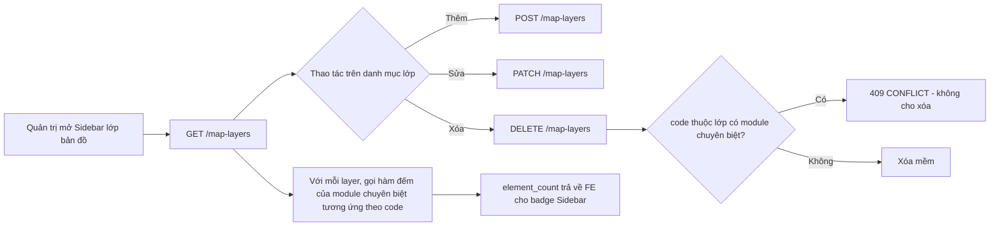

# TÀI LIỆU THIẾT KẾ KỸ THUẬT — QUẢN LÝ LỚP VÀ DANH MỤC BẢN ĐỒ

---

## 📋 LỊCH SỬ THAY ĐỔI (CHANGELOG)

> Mỗi thay đổi nghiệp vụ hoặc hợp đồng tích hợp so với bản thiết kế gốc được ghi tại đây và đánh dấu **tại chỗ** bằng khối trích dẫn `> 🔄 CẬP NHẬT [ngày]` hoặc `> 🆕 MỚI [ngày]`, để FE/BE và đội bản đồ dễ dàng đối chiếu.

| Ngày       | Nội dung thay đổi                                                                                                                                                                                                                                                                                                                                                                                                                                                                                                                                                                                                                                                                                                              | Mục liên quan              |
| :--------- | :----------------------------------------------------------------------------------------------------------------------------------------------------------------------------------------------------------------------------------------------------------------------------------------------------------------------------------------------------------------------------------------------------------------------------------------------------------------------------------------------------------------------------------------------------------------------------------------------------------------------------------------------------------------------------------------------------------------------------- | :------------------------- |
| 2026-08-12 | **Khởi tạo phân hệ quản lý bản đồ**: chuẩn hóa `map_layers` cho CRUD lớp và bổ sung `map_layer_items` cho CRUD các vị trí thuộc lớp; loại bỏ phạm vi quản lý camera khỏi module.                                                                                                                                                                                                                                                                                                                                                                                                                                                                                                                                               | §1–§5, §7–§8               |
| 2026-08-12 | **Bổ sung hợp đồng với VNMap SDK 3.0.0**: SDK chỉ hiển thị bản đồ nền/lớp dữ liệu phía trình duyệt; backend cung cấp dữ liệu quản trị, không gọi SDK và không giao CRUD cho SDK.                                                                                                                                                                                                                                                                                                                                                                                                                                                                                                                                               | §3, §6, §7                 |
| 2026-08-13 | **Chuẩn hóa chi tiết API contracts**: bổ sung bảng tham số, request/response mẫu, response fields, phân trang, envelope và mã lỗi cho `map_layers`, `map_layer_items` và API import Excel theo format tài liệu `urban_services`.                                                                                                                                                                                                                                                                                                                                                                                                                                                                                               | §5                         |
| 2026-08-13 | **Chuẩn hóa tên trường trên wire**: request/query và response của module dùng `snake_case`; entity/TypeScript nội bộ vẫn giữ `camelCase`.                                                                                                                                                                                                                                                                                                                                                                                                                                                                                                                                                                                      | §5, §6                     |
| 2026-09-04 | **Bỏ bảng vị trí generic `map_layer_items`**: xóa bảng, entity và toàn bộ API `/map-layer-items` (CRUD + import Excel). Lý do: thuộc tính giữa các lớp khác nhau quá nhiều để dùng chung một bảng `properties` JSONB (xem `docs/driver/Thuyet_minh_giai_phap_CSDL.docx`, Mục I). Lớp **Cây xanh** và **Đèn chiếu sáng** chuyển sang bảng nghiệp vụ riêng, kiểu dữ liệu tường minh, có nhật ký thay đổi field-level — xem `trees_technical_design.md` và `lighting_technical_design.md`. `map_layers` chỉ còn là **danh mục hiển thị** (tên, icon, màu, ngưỡng zoom), không còn bảng con chung; các lớp khác (rác, ngập, an ninh, chợ, camera) tạm thời không còn API item generic cho tới khi có module chuyên biệt tương ứng. | §1, §2, §4, §5, §6, §7, §8 |

---

## MỤC LỤC

1. [Phạm vi](#1-phạm-vi)
2. [Quyết định thiết kế](#2-quyết-định-thiết-kế)
   - [2.1. Từ một bảng vị trí generic sang bảng riêng theo lớp](#21-từ-một-bảng-vị-trí-generic-sang-bảng-riêng-theo-lớp)
   - [2.2. Quy tắc dữ liệu](#22-quy-tắc-dữ-liệu)
3. [Luồng nghiệp vụ](#3-luồng-nghiệp-vụ)
4. [Thiết kế cơ sở dữ liệu](#4-thiết-kế-cơ-sở-dữ-liệu)
   - [4.1. `map_layers`](#41-map_layers)
   - [4.2. `map_layer_items` (đã gỡ bỏ)](#42-map_layer_items-đã-gỡ-bỏ)
5. [Danh mục thiết kế RESTful API contracts và bảng tham số chi tiết](#5-danh-mục-thiết-kế-restful-api-contracts-và-bảng-tham-số-chi-tiết)
   - [5.1. Quy chuẩn dùng chung](#51-quy-chuẩn-dùng-chung)
   - [5.2. API quản lý lớp bản đồ](#52-api-quản-lý-lớp-bản-đồ-map-layers)
   - [5.3. API quản lý danh mục vị trí (đã gỡ bỏ)](#53-api-quản-lý-danh-mục-vị-trí-đã-gỡ-bỏ)
   - [5.4. API nhập danh mục từ Excel (đã gỡ bỏ)](#54-api-nhập-danh-mục-từ-excel-đã-gỡ-bỏ)
6. [Hợp đồng tích hợp với VNMap SDK](#6-hợp-đồng-tích-hợp-với-vnmap-sdk)
   - [6.1. Vai trò của SDK](#61-vai-trò-của-sdk)
   - [6.2. Mapping dữ liệu](#62-mapping-dữ-liệu)
   - [6.3. Luồng hiển thị đề xuất](#63-luồng-hiển-thị-đề-xuất)
   - [6.4. Giới hạn của phiên bản đầu](#64-giới-hạn-của-phiên-bản-đầu)
7. [Ranh giới với camera và bản đồ nền](#7-ranh-giới-với-camera-và-bản-đồ-nền)
8. [Triển khai và kiểm thử](#8-triển-khai-và-kiểm-thử)

## 1. Phạm vi

> 🔄 **CẬP NHẬT 2026-09-04**: Phân hệ này giờ chỉ còn quản lý **danh mục lớp bản đồ** (`map_layers`). Bảng vị trí generic `map_layer_items` và toàn bộ API `/map-layer-items` (bao gồm import Excel) đã bị xóa. CRUD dữ liệu của từng lớp cụ thể chuyển sang module chuyên biệt riêng, tự có bảng nghiệp vụ, DTO và API của mình — xem `trees_technical_design.md` (Cây xanh) và `lighting_technical_design.md` (Đèn chiếu sáng). Tài liệu này chỉ còn mô tả `map_layers`.

Phân hệ này quản lý một màn hình trong mockup:

1. **Quản lý lớp bản đồ**: CRUD lớp dữ liệu, trạng thái vận hành, thứ tự hiển thị, cấu hình icon/màu và số lượng phần tử (`element_count`) của lớp.

CRUD dữ liệu bên trong từng lớp (cây, đèn, và về sau là rác/ngập/an ninh/chợ...) **không còn nằm trong module này**. Mỗi lớp có module chuyên biệt riêng, tự chịu trách nhiệm về bảng dữ liệu, API và nhật ký thay đổi của lớp đó; `map_layers` chỉ đóng vai trò danh mục hiển thị (tên, icon, màu, thứ tự, ngưỡng zoom) cho Sidebar bản đồ.

Phân hệ chỉ là **lớp quản trị dữ liệu**. Bản đồ nền, cách render lớp trên bản đồ nền, tile/vector service, clustering, heatmap và đồng bộ với hệ thống hiển thị thuộc đội khác, không nằm trong module này. SDK VNMap là một dependency phía trình duyệt của đội hiển thị; module này không nhúng SDK và không gọi SDK từ backend.

Camera cũng không thuộc module này. Không có bảng `cameras`, `installation_tasks`, API `/cameras` hoặc quan hệ map-layer-camera sau migration chuyển đổi. Nếu một nghiệp vụ khác nhận dữ liệu camera từ hệ thống bên ngoài, nghiệp vụ đó tự lưu mã/snapshot theo thiết kế riêng.

## 2. Quyết định thiết kế

### 2.1. Từ một bảng vị trí generic sang bảng riêng theo lớp

> 🔄 **CẬP NHẬT 2026-09-04**: Quyết định "một bảng generic" của bản thiết kế gốc bị đảo ngược. Phần mô tả dưới đây được giữ lại để lịch sử, đoạn cuối mục nêu quyết định hiện hành.

Bản thiết kế gốc không tạo bảng riêng cho từng loại điểm như `trees`, `street_lights`, mà chuẩn hóa các trường dùng chung (`name`, `code`, `category`, `address`, `latitude`, `longitude`, `status`) trong một bảng `map_layer_items`, cùng cột `properties` JSONB cho thuộc tính riêng của từng lớp (ví dụ `height_meters`, `power_watts`). Cách này cho phép thêm lớp mới mà không cần migration mới, nhưng đánh đổi lấy việc mất kiểm soát kiểu dữ liệu, ràng buộc toàn vẹn và khả năng lọc/thống kê theo từng thuộc tính — điều tài liệu thiết kế CSDL chính thức của dự án (`docs/driver/Thuyet_minh_giai_phap_CSDL.docx`, Mục I) yêu cầu tường minh cho từng lớp nghiệp vụ.

**Quyết định hiện hành**: mỗi lớp dữ liệu có bảng nghiệp vụ riêng, cột kiểu dữ liệu tường minh, không dùng `properties` JSONB dùng chung. `map_layers` chỉ còn là danh mục đăng ký lớp (tên, icon, màu, ngưỡng zoom) cho Sidebar bản đồ; **không có khóa ngoại** từ bảng nghiệp vụ của một lớp về `map_layers` — quan hệ layer ↔ bảng là một ánh xạ cố định theo `map_layers.code` (ví dụ `LYR_TREE`, `LYR_LIGHT`), được resolve trong `MapLayersService` bằng cách inject trực tiếp service của module chuyên biệt (`TreesService`, `LightingService`), không phải bằng quan hệ dữ liệu. Đây là lựa chọn có chủ đích: layer ⟷ bảng là quan hệ 1-1 cố định (một cây không bao giờ đổi sang lớp khác), nên một cột `map_layer_id` trên bảng nghiệp vụ chỉ là dữ liệu dư thừa, không giúp gì thêm ngoài việc phải bảo trì đồng bộ.

Bảng nghiệp vụ, danh mục kèm theo và cơ chế nhật ký thay đổi field-level của từng lớp được mô tả trong tài liệu riêng của lớp đó (`trees_technical_design.md`, `lighting_technical_design.md`), không lặp lại ở đây.

### 2.2. Quy tắc dữ liệu

- Mỗi lớp có `code` duy nhất.
- Xóa lớp là xóa mềm và bị từ chối nếu `code` của lớp thuộc danh sách lớp có module chuyên biệt quản lý (hiện tại: `LYR_TREE`, `LYR_LIGHT`) — vòng đời của các lớp này do module chuyên biệt sở hữu, không phải theo số lượng phần tử còn lại trong `map_layers`.
- `element_count` trả về cho FE được tính bằng cách gọi hàm đếm của module chuyên biệt tương ứng (`TreesService.countLiveTrees()`, `LightingService.countLivePoles()` — đèn chiếu sáng đếm theo **cột đèn**, không phải tủ điều khiển); lớp chưa có module chuyên biệt trả `element_count: 0`.
- `style_config` không được dùng để lưu mật khẩu, token, URL kết nối hoặc thông tin bí mật.

## 3. Luồng nghiệp vụ

> 🔄 **CẬP NHẬT 2026-09-04**: Sơ đồ dưới đây chỉ còn vòng đời của `map_layers`. CRUD dữ liệu bên trong lớp (thêm cây, thêm cột đèn...) chạy trên API riêng của module chuyên biệt, xem sơ đồ luồng nghiệp vụ trong tài liệu của lớp đó.



Module này không gọi bản đồ nền, không CRUD dữ liệu bên trong lớp và không gọi module chuyên biệt nào ngoài việc đọc bộ đếm (`element_count`). Consumer bản đồ đọc danh mục lớp từ API này, sau đó gọi API riêng của từng module chuyên biệt để lấy dữ liệu điểm rồi chuyển đổi sang định dạng mà SDK yêu cầu. Việc một lớp đang `active` có được hiển thị hay không do hệ thống bản đồ quyết định.

## 4. Thiết kế cơ sở dữ liệu

### 4.1. `map_layers`

Bảng đã có trong repo và tiếp tục là bảng nguồn của màn hình quản lý lớp. Khóa chính integer được giữ nguyên để không phá dữ liệu/API hiện hữu của bảng này.

| Cột                                      | Kiểu                    | Ý nghĩa                                    |
| ---------------------------------------- | ----------------------- | ------------------------------------------ |
| `id`                                     | `serial`                | Khóa chính lớp                             |
| `code`                                   | `varchar(100)` unique   | Mã nghiệp vụ duy nhất                      |
| `name`                                   | `varchar(255)`          | Tên hiển thị                               |
| `description`                            | `text` nullable         | Mô tả                                      |
| `group_name`                             | `varchar(100)` nullable | Nhóm dữ liệu                               |
| `layer_type`                             | `varchar(50)`           | `point`, `line`, `polygon`, `heatmap`      |
| `source_type`                            | `varchar(50)`           | Nguồn dữ liệu; v1 quản lý `internal_table` |
| `style_config`                           | `jsonb` nullable        | Icon, màu, kích thước, opacity             |
| `sort_order`                             | `smallint`              | Thứ tự sidebar                             |
| `is_visible_by_default`                  | `boolean`               | Cấu hình mặc định của lớp                  |
| `status`                                 | `varchar(20)`           | `active`, `inactive`, `maintenance`        |
| `created_at`, `updated_at`, `deleted_at` | `timestamptz`           | Lifecycle và xóa mềm                       |

`is_visible_by_default` chỉ là dữ liệu cấu hình cho consumer bản đồ; API không tự bật/tắt bản đồ nền.

### 4.2. `map_layer_items` (đã gỡ bỏ)

> 🔄 **CẬP NHẬT 2026-09-04**: Bảng này đã bị xóa khỏi schema. Migration `DropMapLayerItemsTable` (`src/migrations/1787443000000-DropMapLayerItemsTable.ts`) chạy `DROP TABLE map_layer_items CASCADE`; `down()` của migration này khôi phục đúng nguyên trạng cấu trúc bảng (cột, constraint, index) như migration gốc `CreateMapLayerItemsTable` bên dưới, phòng khi cần rollback.

Cấu trúc bảng cũ, giữ lại để tham chiếu lịch sử:

```sql
CREATE TABLE map_layer_items (
  id             serial PRIMARY KEY,
  map_layer_id   integer NOT NULL REFERENCES map_layers(id) ON DELETE RESTRICT,
  code           varchar(100),
  name           varchar(255) NOT NULL,
  description    text,
  category       varchar(100),
  address        text,
  latitude       numeric(10, 7) NOT NULL CHECK (latitude BETWEEN -90 AND 90),
  longitude      numeric(11, 7) NOT NULL CHECK (longitude BETWEEN -180 AND 180),
  properties     jsonb NOT NULL DEFAULT '{}'::jsonb,
  status         varchar(20) NOT NULL DEFAULT 'active'
                 CHECK (status IN ('active', 'inactive')),
  created_at     timestamptz NOT NULL DEFAULT now(),
  updated_at     timestamptz NOT NULL DEFAULT now(),
  deleted_at     timestamptz
);

CREATE UNIQUE INDEX uq_map_layer_items_layer_code
  ON map_layer_items (map_layer_id, code)
  WHERE code IS NOT NULL AND deleted_at IS NULL;
```

Bảng nghiệp vụ thay thế cho hai lớp đã triển khai (`green_trees`, `tree_species`, `green_tree_audit_logs` cho Cây xanh; `lighting_cabinets`, `lighting_poles`, `lighting_audit_logs` cho Đèn chiếu sáng) được mô tả trong tài liệu riêng của từng lớp. Các lớp còn lại (rác, ngập, an ninh, chợ, camera) hiện chưa có bảng dữ liệu điểm nào trong module này; đội phụ trách lớp nào cần thiết kế bảng riêng theo đúng mẫu đã áp dụng cho cây/đèn khi tới lượt triển khai.

## 5. DANH MỤC THIẾT KẾ RESTFUL API CONTRACTS VÀ BẢNG THAM SỐ CHI TIẾT

> 🔄 **CẬP NHẬT 2026-08-13**: Mục này được mở rộng thành hợp đồng API chi tiết để FE có thể triển khai trực tiếp theo request, response và mã lỗi thống nhất.

> **Quy chuẩn kiến trúc:**
>
> - Base URL là `/api/v1`; các endpoint bên dưới được viết rút gọn, ví dụ `/map-layers` tương ứng với `/api/v1/map-layers`.
> - Tất cả API quản trị yêu cầu JWT Bearer. Quyền dự kiến là `gis-map.layer.manage`; việc bật guard theo quyền thực hiện đồng bộ với cơ chế phân quyền chung.
> - Không dùng path parameter trong module này. GET dùng Query Params; POST/PATCH/DELETE dùng Request Body, giống quy ước hiện tại của các module trong repo.
> - `map_layers.id` là số nguyên dương. Không có bảng con nào trong module này tham chiếu tới nó bằng khóa ngoại (xem §2.1) — bảng nghiệp vụ của các lớp chuyên biệt dùng UUID làm khóa chính riêng.

### 5.1. Quy chuẩn dùng chung

> 🔄 **CẬP NHẬT 2026-08-13**: Tất cả field trên wire của module, gồm query params, request body, response object và các key cấu hình style được tài liệu hóa, dùng `snake_case`. Tên property `camelCase` chỉ được giữ bên trong entity/service TypeScript.

#### 5.1.1. Response thành công

API trả về envelope thống nhất:

```json
{
  "success": true,
  "message": "Thông báo nghiệp vụ bằng tiếng Việt",
  "data": {}
}
```

API danh sách trả thêm `meta` phân trang:

```json
{
  "success": true,
  "message": "Lấy danh sách thành công",
  "data": [],
  "meta": { "page": 1, "limit": 20, "total": 137, "total_pages": 7 }
}
```

API xóa mềm trả `data: null`. Thời gian trong response dùng ISO 8601 UTC. `latitude` và `longitude` được trả về dạng number dù PostgreSQL lưu kiểu numeric.

#### 5.1.2. Response lỗi

```json
{
  "success": false,
  "status_code": 409,
  "code": "CONFLICT",
  "message": "Mã lớp bản đồ đã tồn tại trong hệ thống",
  "errors": [],
  "path": "/api/v1/map-layers",
  "timestamp": "2026-08-13T08:00:00.000Z"
}
```

| HTTP | `code`         | Trường hợp dùng trong module                                                                                                            |
| ---- | -------------- | --------------------------------------------------------------------------------------------------------------------------------------- |
| 400  | `BAD_REQUEST`  | Body/query sai định dạng hoặc thiếu trường bắt buộc.                                                                                    |
| 401  | `UNAUTHORIZED` | Thiếu hoặc sai JWT.                                                                                                                     |
| 404  | `NOT_FOUND`    | Không tìm thấy lớp bản đồ.                                                                                                              |
| 409  | `CONFLICT`     | Trùng `code` khi tạo/sửa, hoặc xóa một lớp có `code` thuộc danh sách lớp được quản lý bởi module chuyên biệt (`LYR_TREE`, `LYR_LIGHT`). |

#### 5.1.3. Phân trang và tìm kiếm

| Tham số   | Vị trí | Kiểu      | Bắt buộc | Mặc định | Ràng buộc                            |
| --------- | ------ | --------- | -------- | -------- | ------------------------------------ |
| `page`    | Query  | `integer` | Không    | `1`      | Tối thiểu `1`.                       |
| `limit`   | Query  | `integer` | Không    | `20`     | Từ `1` đến `100`.                    |
| `keyword` | Query  | `string`  | Không    | —        | Tìm kiếm không phân biệt hoa thường. |

### 5.2. API quản lý lớp bản đồ — `/api/v1/map-layers`

`map_layers` là đối tượng cấp cha. FE dùng danh sách này để dựng Sidebar, bộ lọc lớp, trạng thái bật mặc định và lấy `element_count` hiển thị số lượng vị trí.

#### Response object của `map_layers`

| Field                   | Kiểu       | Ý nghĩa                                                                                                                                                                                                                |
| ----------------------- | ---------- | ---------------------------------------------------------------------------------------------------------------------------------------------------------------------------------------------------------------------- |
| `id`                    | `integer`  | ID lớp trong database.                                                                                                                                                                                                 |
| `code`                  | `string`   | Mã lớp duy nhất, dùng làm định danh ổn định khi FE tích hợp SDK.                                                                                                                                                       |
| `name`                  | `string`   | Tên hiển thị của lớp.                                                                                                                                                                                                  |
| `description`           | `string    | null`                                                                                                                                                                                                                  | Mô tả lớp.                                    |
| `group_name`            | `string    | null`                                                                                                                                                                                                                  | Nhóm dữ liệu.                                 |
| `layer_type`            | `enum`     | `point`, `line`, `polygon`, `heatmap`.                                                                                                                                                                                 |
| `source_type`           | `enum`     | `internal_table`, `geojson`, `wms`.                                                                                                                                                                                    |
| `style_config`          | `object    | null`                                                                                                                                                                                                                  | Cấu hình icon/màu/kích thước do FE diễn giải. |
| `sort_order`            | `integer`  | Thứ tự lớp trên Sidebar hoặc khi tạo layer trên bản đồ.                                                                                                                                                                |
| `is_visible_by_default` | `boolean`  | Trạng thái bật mặc định khi FE tải bản đồ.                                                                                                                                                                             |
| `status`                | `enum`     | `active`, `inactive`, `maintenance`.                                                                                                                                                                                   |
| `element_count`         | `integer`  | Số phần tử chưa xóa mềm thuộc lớp. Với lớp có module chuyên biệt, số này lấy từ module đó (`LYR_TREE` → số cây; `LYR_LIGHT` → số **cột đèn**, không phải số tủ điều khiển). Lớp chưa có module chuyên biệt trả về `0`. |
| `created_at`            | `ISO 8601` | Thời điểm tạo.                                                                                                                                                                                                         |
| `updated_at`            | `ISO 8601` | Thời điểm cập nhật gần nhất.                                                                                                                                                                                           |

| Method   | Endpoint                                                 | Mục đích                          |
| -------- | -------------------------------------------------------- | --------------------------------- |
| `GET`    | `/map-layers?page=1&limit=20&status=active&keyword=ngap` | Danh sách lớp, có `element_count` |
| `GET`    | `/map-layers/detail?id=2`                                | Chi tiết một lớp                  |
| `POST`   | `/map-layers`                                            | Tạo lớp                           |
| `PATCH`  | `/map-layers`                                            | Cập nhật; `id` nằm trong body     |
| `DELETE` | `/map-layers`                                            | Xóa mềm; `id` nằm trong body      |

#### 5.2.1. Lấy danh sách lớp bản đồ

- **Endpoint**: `GET /api/v1/map-layers`
- **Mục đích**: Lấy danh sách lớp chưa bị xóa mềm, có phân trang và số lượng vị trí đang tồn tại.
- **Sắp xếp**: `sort_order ASC`, sau đó `id ASC`.

| Tên tham số   | Vị trí | Kiểu      | Bắt buộc | Ý nghĩa và ràng buộc                    |
| ------------- | ------ | --------- | -------- | --------------------------------------- |
| `page`        | Query  | `integer` | Không    | Trang hiện tại; mặc định `1`.           |
| `limit`       | Query  | `integer` | Không    | Mặc định `20`, tối đa `100`.            |
| `status`      | Query  | `enum`    | Không    | `active`, `inactive`, `maintenance`.    |
| `group_name`  | Query  | `string`  | Không    | Lọc gần đúng theo nhóm dữ liệu.         |
| `layer_type`  | Query  | `enum`    | Không    | `point`, `line`, `polygon`, `heatmap`.  |
| `source_type` | Query  | `enum`    | Không    | `internal_table`, `geojson`, `wms`.     |
| `keyword`     | Query  | `string`  | Không    | Tìm trên `name`, `code`, `description`. |

**Ví dụ gọi:** `GET /api/v1/map-layers?page=1&limit=20&status=active&keyword=ngap`

**Response `200 OK`:**

```json
{
  "success": true,
  "message": "Lấy danh sách lớp bản đồ thành công",
  "data": [
    {
      "id": 2,
      "code": "LYR_FLOOD",
      "name": "Điểm ngập úng",
      "description": "Các điểm thường xuyên ngập khi mưa lớn.",
      "group_name": "Điểm sự vụ",
      "layer_type": "point",
      "source_type": "internal_table",
      "style_config": { "icon_name": "waves", "color": "#06B6D4", "icon_size": 24 },
      "sort_order": 2,
      "is_visible_by_default": true,
      "status": "active",
      "element_count": 12,
      "created_at": "2026-08-12T08:00:00.000Z",
      "updated_at": "2026-08-12T08:00:00.000Z"
    }
  ],
  "meta": { "page": 1, "limit": 20, "total": 1, "total_pages": 1 }
}
```

#### 5.2.2. Lấy chi tiết một lớp

- **Endpoint**: `GET /api/v1/map-layers/detail`
- **Mục đích**: Lấy metadata của một lớp và `element_count`.

| Tên tham số | Vị trí | Kiểu      | Bắt buộc | Ý nghĩa                    |
| ----------- | ------ | --------- | -------- | -------------------------- |
| `id`        | Query  | `integer` | Có       | ID lớp bản đồ cần tra cứu. |

Response `200 OK` có dạng `{ success, message, data }`, trong đó `data` là một object cùng field với phần tử của API danh sách. Trả `404 NOT_FOUND` nếu lớp không tồn tại hoặc đã bị xóa mềm.

#### 5.2.3. Tạo lớp bản đồ

- **Endpoint**: `POST /api/v1/map-layers`
- **Mục đích**: Tạo metadata cho một lớp mới. Việc tạo lớp chưa tạo vị trí nào, nên `element_count` bằng `0`.

| Tên trường              | Vị trí    | Kiểu      | Bắt buộc | Ý nghĩa và ràng buộc                                                           |
| ----------------------- | --------- | --------- | -------- | ------------------------------------------------------------------------------ |
| `code`                  | Body JSON | `string`  | Có       | Mã duy nhất toàn hệ thống, tối đa 100 ký tự.                                   |
| `name`                  | Body JSON | `string`  | Có       | Tên hiển thị, tối đa 255 ký tự.                                                |
| `description`           | Body JSON | `string`  | Không    | Mô tả lớp.                                                                     |
| `group_name`            | Body JSON | `string`  | Không    | Nhóm dữ liệu, tối đa 100 ký tự.                                                |
| `layer_type`            | Body JSON | `enum`    | Không    | `point` mặc định; ngoài ra `line`, `polygon`, `heatmap`.                       |
| `source_type`           | Body JSON | `enum`    | Không    | `internal_table` mặc định; ngoài ra `geojson`, `wms`.                          |
| `style_config`          | Body JSON | `object`  | Không    | Đề xuất các key `icon_name`, `icon_url`, `color`, `icon_size`, `fill_opacity`. |
| `sort_order`            | Body JSON | `integer` | Không    | Thứ tự trên Sidebar, mặc định `1`, tối thiểu `1`.                              |
| `is_visible_by_default` | Body JSON | `boolean` | Không    | Có bật lớp khi FE tải lần đầu không; mặc định `true`.                          |
| `status`                | Body JSON | `enum`    | Không    | `active` mặc định; ngoài ra `inactive`, `maintenance`.                         |

**Request mẫu:**

```json
{
  "code": "LYR_FLOOD",
  "name": "Điểm ngập úng",
  "description": "Các điểm thường xuyên ngập khi mưa lớn.",
  "group_name": "Điểm sự vụ",
  "layer_type": "point",
  "source_type": "internal_table",
  "style_config": { "icon_name": "waves", "color": "#06B6D4", "icon_size": 24 },
  "sort_order": 2,
  "is_visible_by_default": true,
  "status": "active"
}
```

Response `201 Created` có dạng `{ success, message, data }`, trong đó `data` là lớp vừa tạo và có `element_count: 0`. Trả `409 CONFLICT` nếu `code` đã tồn tại.

#### 5.2.4. Cập nhật lớp bản đồ

- **Endpoint**: `PATCH /api/v1/map-layers`
- **Mục đích**: Cập nhật một phần metadata của lớp.

| Tên trường        | Vị trí    | Kiểu      | Bắt buộc | Ý nghĩa                                                                      |
| ----------------- | --------- | --------- | -------- | ---------------------------------------------------------------------------- |
| `id`              | Body JSON | `integer` | Có       | ID lớp cần cập nhật.                                                         |
| Các field còn lại | Body JSON | —         | Không    | Dùng các field `snake_case` của API tạo; chỉ cập nhật field được truyền lên. |

`map_layer_id` của các vị trí con không thay đổi khi cập nhật lớp. Response trả về lớp sau cập nhật, bao gồm `element_count` hiện tại. Trả `404 NOT_FOUND` nếu không có lớp hoặc `409 CONFLICT` nếu đổi sang `code` đã tồn tại.

#### 5.2.5. Xóa lớp bản đồ

- **Endpoint**: `DELETE /api/v1/map-layers`
- **Mục đích**: Xóa mềm lớp bản đồ.

| Tên trường | Vị trí    | Kiểu      | Bắt buộc | Ý nghĩa             |
| ---------- | --------- | --------- | -------- | ------------------- |
| `id`       | Body JSON | `integer` | Có       | ID lớp cần xóa mềm. |

**Response `200 OK`:**

```json
{ "success": true, "message": "Xóa lớp bản đồ thành công", "data": null }
```

Không cho xóa lớp nếu `code` của lớp thuộc danh sách lớp được quản lý bởi module chuyên biệt (hiện tại: `LYR_TREE`, `LYR_LIGHT`), bất kể lớp đó còn dữ liệu hay không — vòng đời của các lớp này do module chuyên biệt sở hữu; trả `409 CONFLICT` với message `MAP_LAYER_MESSAGES.MANAGED_BY_DEDICATED_MODULE(code)`.

### 5.3. API quản lý danh mục vị trí (đã gỡ bỏ)

> 🔄 **CẬP NHẬT 2026-09-04**: API `/api/v1/map-layer-items` (5 endpoint CRUD: danh sách, chi tiết, tạo, cập nhật, xóa mềm) đã bị xóa cùng bảng `map_layer_items`. CRUD dữ liệu điểm của Cây xanh chuyển sang `/api/v1/trees` (xem `trees_technical_design.md`, mục 5); của Đèn chiếu sáng chuyển sang `/api/v1/lighting-cabinets` và `/api/v1/lighting-poles` (xem `lighting_technical_design.md`, mục 5). Các lớp khác (rác, ngập, an ninh, chợ, camera) hiện không có API item nào trong module này cho tới khi có module chuyên biệt tương ứng.

### 5.4. API nhập danh mục từ Excel (đã gỡ bỏ)

> 🔄 **CẬP NHẬT 2026-09-04**: `POST /api/v1/map-layer-items/import` đã bị xóa cùng module `map_layer_items`. Import Excel cho Cây xanh và Đèn chiếu sáng **chưa được triển khai** ở đợt tách bảng này — quyết định có chủ đích: ưu tiên CRUD và nhật ký thay đổi ổn định trước, import hàng loạt là hạng mục riêng khi nghiệp vụ cần.

## 6. Hợp đồng tích hợp với VNMap SDK

> 🆕 MỚI [2026-08-12] — Nội dung dưới đây được bổ sung sau khi đối chiếu tài liệu [VNMap SDK](http://103.74.121.52:8001/sdk/) phiên bản 3.0.0.

### 6.1. Vai trò của SDK

SDK cung cấp bản đồ nền offline Việt Nam và các hàm hiển thị lớp dữ liệu phía trình duyệt, gồm:

- `map.addMarker(...)` cho số lượng rất nhỏ;
- `map.addMarkerLayer(id, geojson, options)` cho lớp marker quản lý theo lớp;
- `map.addGeoJSONLayer(id, geojson, options)` cho lớp dữ liệu GeoJSON;
- `map.addClusterLayer(...)` cho số lượng lớn và `map.addPolygonLayer(...)` cho vùng;
- `map.setLayerVisible(id, visible)` và `map.removeLayer(id)` để điều khiển vòng đời lớp.

SDK không biết `map_layers`, các bảng nghiệp vụ của từng lớp (`green_trees`, `lighting_poles`...), quyền quản trị, xóa mềm hoặc transaction. SDK cũng không tự đọc database. Vì vậy câu trả lời là **có, đội hiển thị về sau sẽ dùng dữ liệu này với SDK**, nhưng thông qua một adapter/consumer phía frontend hoặc một API gateway riêng, tổng hợp từ `map_layers` (danh mục lớp) và API của từng module chuyên biệt (dữ liệu điểm):

```text
map_layers                     ─┐
                                ├─> adapter tổng hợp ─> VNMap SDK
API module chuyên biệt         ─┘        (GeoJSON/marker layer)
(trees, lighting, ...)
```

### 6.2. Mapping dữ liệu

> 🔄 **CẬP NHẬT 2026-09-04**: Cột `map_layer_items.*` không còn tồn tại. Dữ liệu điểm giờ lấy từ API của module chuyên biệt tương ứng (`GET /api/v1/trees`, `GET /api/v1/lighting-poles`...); mapping chi tiết theo field của từng lớp được mô tả trong tài liệu riêng của lớp đó. Bảng dưới đây chỉ còn phần mapping ổn định của `map_layers`.

| Dữ liệu quản trị                       | Dữ liệu/khái niệm khi đưa vào SDK                                                                                                                        |
| -------------------------------------- | -------------------------------------------------------------------------------------------------------------------------------------------------------- |
| `map_layers.id` hoặc `map_layers.code` | `id` ổn định của layer trong SDK; nên dùng `code` để không phụ thuộc số thứ tự database.                                                                 |
| `map_layers.name`                      | Nhãn layer, tiêu đề danh sách bật/tắt lớp.                                                                                                               |
| `map_layers.style_config`              | Adapter chọn lọc và chuyển thành `color`, `label`, icon hoặc style mà SDK hỗ trợ; không truyền JSON nguyên trạng.                                        |
| `map_layers.sort_order`                | Thứ tự tạo layer trên bản đồ.                                                                                                                            |
| `status`, `is_visible_by_default`      | Điều kiện khởi tạo và trạng thái visible của layer.                                                                                                      |
| ID của item lấy từ module chuyên biệt  | `Feature.id` hoặc định danh item để popup/click mở chi tiết — ví dụ `GreenTree.id`, `LightingPole.id`.                                                   |
| Tọa độ lấy từ module chuyên biệt       | GeoJSON Point với thứ tự tọa độ **`[longitude, latitude]`** — ví dụ `tree_lng, tree_lat`, `pole_lng, pole_lat`.                                          |
| Thuộc tính tường minh của từng bảng    | `Feature.properties` dùng cho popup, tìm kiếm và callback `onClick`; adapter chọn field cần thiết cho từng lớp thay vì đọc một `properties` JSONB chung. |

Với lớp điểm Cây xanh, adapter có thể tạo payload tương đương (dữ liệu lấy từ `GET /api/v1/trees`):

```json
{
  "type": "FeatureCollection",
  "features": [
    {
      "type": "Feature",
      "id": "b6f6c6b0-...-...-...-000000000010",
      "geometry": { "type": "Point", "coordinates": [106.0512, 20.6462] },
      "properties": {
        "survey_code": "CX-0044",
        "species_name": "Xà cừ",
        "condition_codes": ["BINH_THUONG"]
      }
    }
  ]
}
```

### 6.3. Luồng hiển thị đề xuất

1. Frontend gọi `GET /api/v1/map-layers` để lấy các lớp chưa xóa mềm.
2. Frontend lọc theo `status`, quyền và quy tắc hiển thị của sản phẩm.
3. Khi người dùng bật một lớp, frontend gọi API danh sách của module chuyên biệt tương ứng với lớp đó (ví dụ `GET /api/v1/trees` cho `LYR_TREE`, `GET /api/v1/lighting-poles` cho `LYR_LIGHT`) — `map_layers` không còn API con để đọc dữ liệu điểm.
4. Frontend chuyển từng item thành GeoJSON Point hoặc marker layer, sau đó gọi SDK bằng `layer.code` làm định danh ổn định.
5. Khi tắt lớp, frontend gọi `map.setLayerVisible(layer.code, false)`; khi thay dữ liệu hoặc rời màn hình, frontend gọi `map.removeLayer(layer.code)` nếu cần.

Backend không nên gọi `map.addGeoJSONLayer`, không lưu object của SDK và không để CRUD phụ thuộc vào SDK. Điều này giữ cho module quản trị có thể được dùng bởi web khác, mobile hoặc một nhà cung cấp bản đồ khác trong tương lai.

### 6.4. Giới hạn của phiên bản đầu

> 🔄 **CẬP NHẬT 2026-09-04**: Gạch đầu dòng đầu tiên của mục này (về `map_layer_items`) không còn áp dụng — bảng đó đã bị xóa. Các mục còn lại vẫn đúng.

- Mỗi lớp point-based muốn hiển thị bằng dữ liệu điểm cần một bảng nghiệp vụ riêng theo đúng mẫu đã áp dụng cho Cây xanh/Đèn chiếu sáng (xem `docs/driver/Thuyet_minh_giai_phap_CSDL.docx`, Mục I) — không còn một bảng generic dùng chung cho mọi lớp `point`.
- `map_layers.layer_type` vẫn giữ các giá trị mở rộng để tương thích thiết kế hiện hữu; nguồn `geojson`/`wms` hoặc geometry khác cần hợp đồng riêng trước khi triển khai.
- Không nên trả toàn bộ dữ liệu nội bộ không kiểm soát ra UI. Adapter cần loại bỏ các trường không dành cho hiển thị công khai (ví dụ `actor_ip`, `source_uuid` nội bộ của các bảng audit).
- SDK khuyến nghị chọn kiểu hiển thị theo số lượng điểm. Với số lượng hiện tại (2.850 cây, 7.431 đèn theo khảo sát), nên tách theo từng `map_layer`; dùng `addMarkerLayer` khi lớp nhỏ và `addClusterLayer`/`addGeoJSONLayer` khi lớp lớn hơn. Đây là quyết định của đội hiển thị, không phải logic CRUD.

## 7. Ranh giới với camera và bản đồ nền

- Không có `Camera` entity trong `src/modules` sau thay đổi.
- Không có `CamerasModule`, `InstallationTasksModule`, API `/cameras` hoặc bảng liên kết camera-task trong schema cuối.
- Không FK tới hệ thống camera bên ngoài.
- Module bản đồ (`map_layers`) chỉ cung cấp danh mục lớp; dữ liệu điểm và toàn bộ ràng buộc/validation riêng của từng loại điểm (không chứa credential/RTSP/secret) thuộc trách nhiệm của module chuyên biệt quản lý lớp đó.
- Đội bản đồ nền tự quyết định cách lấy, cache, render và đồng bộ dữ liệu.

## 8. Triển khai và kiểm thử

Thay đổi mã nguồn chính:

- `src/modules/map-layers`: chỉ còn CRUD danh mục lớp (`map_layers`) và bộ đếm phần tử theo `code`, không còn CRUD vị trí hay import Excel;
- `src/migrations/1787443000000-DropMapLayerItemsTable.ts`: xóa bảng `map_layer_items`;
- Bảng nghiệp vụ và migration của từng lớp chuyên biệt (Cây xanh, Đèn chiếu sáng) được liệt kê trong tài liệu riêng của lớp đó;
- `src/app.module.ts`: đăng ký `TreesModule`, `LightingModule` bên cạnh `MapLayersModule`.

Kiểm tra bắt buộc:

```bash
pnpm run lint:check
pnpm run format:check
pnpm run typecheck
pnpm test
pnpm run openapi:check
pnpm run build
```

Khi rollout database, chạy migration theo thứ tự: `DropMapLayerItemsTable` trước (độc lập, không phụ thuộc migration nào khác), sau đó tới các migration tạo bảng của từng lớp chuyên biệt theo thứ tự liệt kê trong tài liệu riêng của lớp đó. `DropMapLayerItemsTable.down()` khôi phục đúng nguyên trạng bảng cũ nên có thể rollback an toàn nếu cần.
