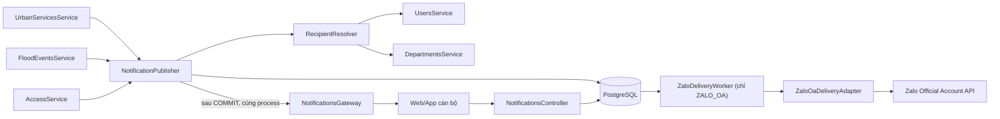
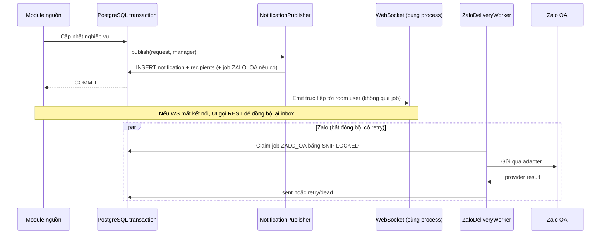
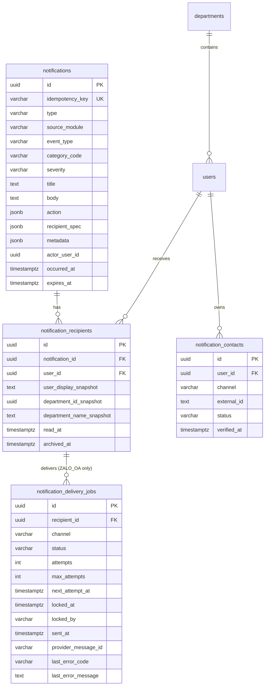
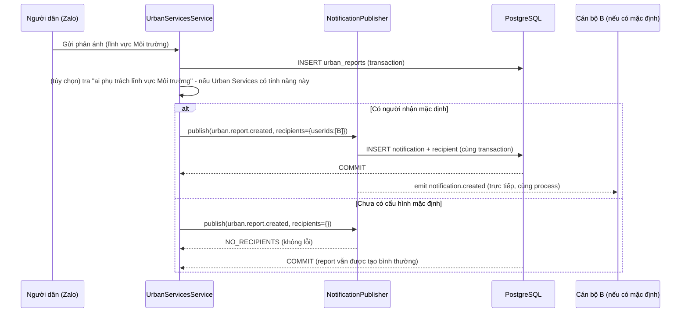
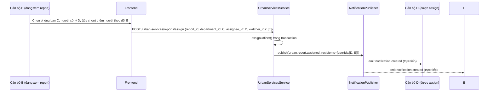
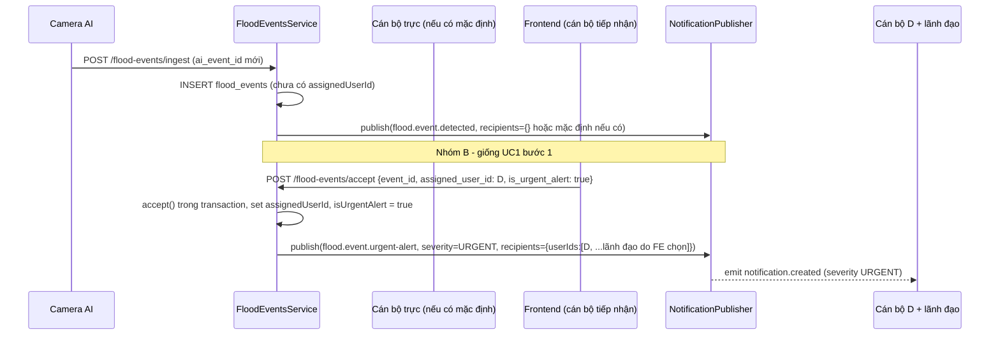
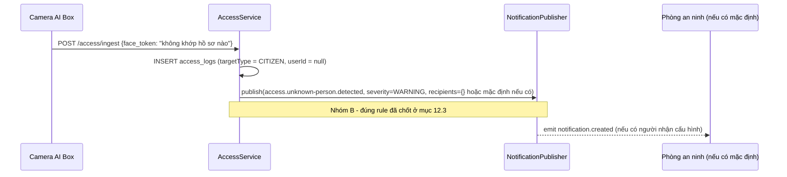
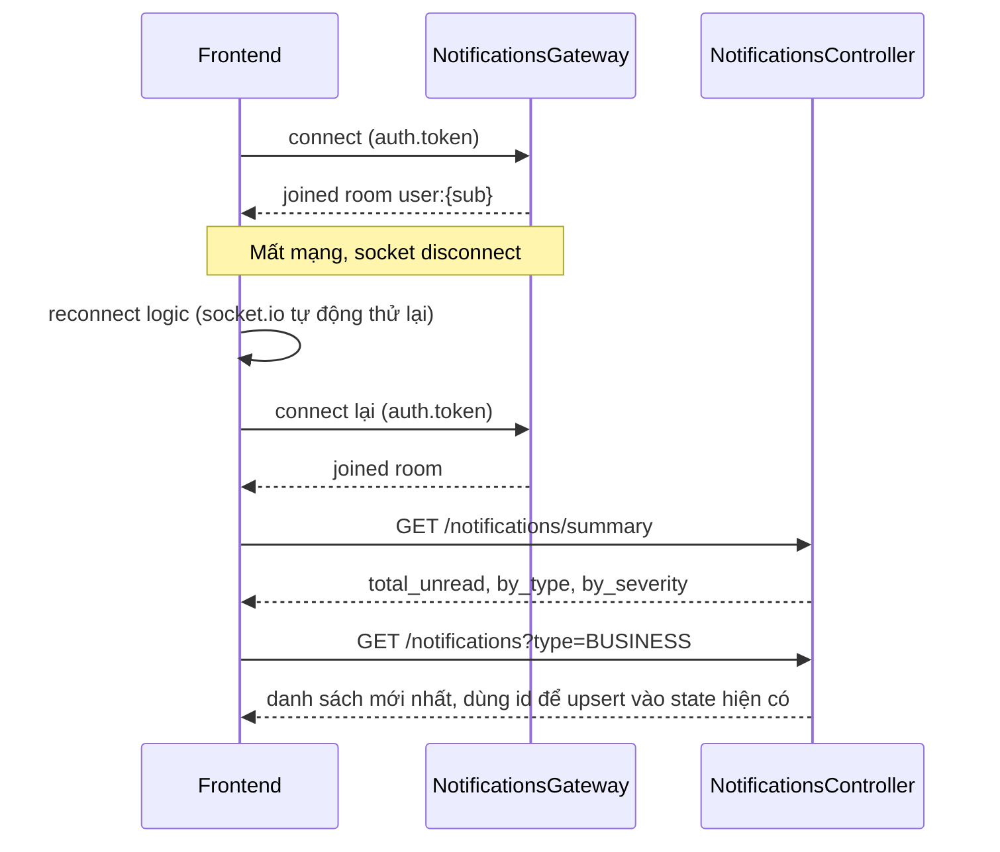
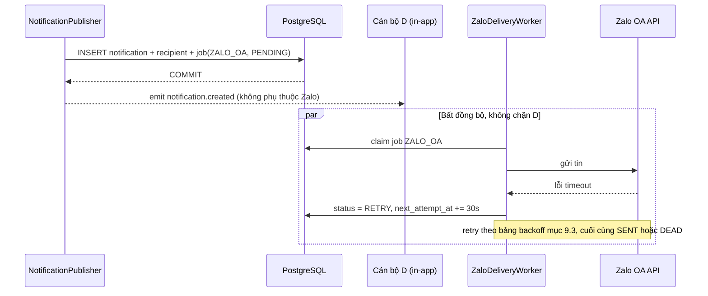

# TÀI LIỆU THIẾT KẾ KỸ THUẬT CHI TIẾT

# MODULE: THÔNG BÁO & CẢNH BÁO (NOTIFICATIONS)

> Phạm vi giai đoạn 1: Ngập úng, Ra vào thông minh, Phản ánh hiện trường. Kênh gửi: in-app realtime và Zalo Official Account.
>
> **Các quyết định thiết kế nền tảng:**
>
> 1. **Một backend instance duy nhất** — không xây PostgreSQL LISTEN/NOTIFY hay bất kỳ cơ chế signal liên-tiến-trình nào (mục 4.3).
> 2. **`notification_delivery_jobs` + worker/retry chỉ tồn tại cho kênh ZALO_OA.** IN_APP emit trực tiếp trong process ngay sau transaction commit, không qua bảng job (mục 6.3, 9).
> 3. **Notifications không sở hữu khái niệm "người nhận mặc định theo lĩnh vực/khu vực".** Sự kiện có actor (assign, accept...) lấy người nhận từ chính hành động đó + danh sách FE tự thêm. Sự kiện không có actor (báo cáo mới, camera tự phát hiện) phụ thuộc cấu hình mặc định **tùy chọn do chính phân hệ nguồn sở hữu**; nếu chưa có, publisher trả `NO_RECIPIENTS` an toàn, không chặn nghiệp vụ chính (mục 3.2, 5.1, 12).
> 4. **`mark-all-read` áp dụng đúng theo toàn bộ filter đang hiển thị, kể cả `search`** (mục 10.4).
> 5. Rule "người lạ" của Ra vào thông minh giữ nguyên logic hiện có: không khớp `face_token` đã enroll → cảnh báo. Chưa xây rule anomaly phức tạp hơn; ghi nhận là câu hỏi mở (mục 12.3, 19).

---

## 📋 LỊCH SỬ THAY ĐỔI (CHANGELOG)

> Mỗi thay đổi nghiệp vụ so với bản thiết kế đã chốt được đánh dấu **tại chỗ** trong tài liệu bằng khối trích dẫn
> `> 🔄 CẬP NHẬT [ngày]` (sửa/thay quy tắc cũ) hoặc `> 🆕 MỚI [ngày]` (bổ sung thuần túy, không phá vỡ luồng cũ),
> đặt ngay sau bảng/đoạn liên quan — nội dung đã chốt **không bị xóa hay ghi đè**, chỉ được chú thích để FE dễ dàng
> dò ra chỗ nào đã đổi so với lần đọc trước.

| Ngày       | Nội dung thay đổi                                                                                                                                                                                                                                                                                          | Mục liên quan                                           |
| :--------- | :--------------------------------------------------------------------------------------------------------------------------------------------------------------------------------------------------------------------------------------------------------------------------------------------------------- | :------------------------------------------------------ |
| 2026-08-12 | Chốt kiến trúc sau thảo luận với chủ dự án: 1 instance (bỏ LISTEN/NOTIFY), job/worker chỉ cho ZALO_OA (IN_APP emit trực tiếp), `mark-all-read` gồm cả `search`, rule người lạ giữ nguyên logic hiện tại, người nhận mặc định theo lĩnh vực là tùy chọn của phân hệ nguồn chứ không phải của Notifications. | Toàn tài liệu                                           |
| 2026-08-12 | Triển khai Giai đoạn A/B/C: inbox + publisher + WebSocket gateway + tích hợp Urban Services/Flood/Access (Nhóm A), adapter Zalo placeholder (Giai đoạn D chưa có nghiệp vụ). `GET /notifications/categories` đã triển khai đúng như thiết kế §10.2. Thêm hướng dẫn kết nối WebSocket cho FE ReactJS.       | §10.2, §20.6, toàn bộ §3-§16 (mô tả nay khớp code thật) |

---

## MỤC LỤC

1. Bối cảnh, mục tiêu và quyết định kiến trúc
2. Đối chiếu mockup và quy tắc nghiệp vụ
3. Phạm vi, trách nhiệm và ranh giới module
4. Kiến trúc tổng thể
5. Mô hình người nhận mở rộng
6. Luồng xử lý và bảo đảm không mất thông báo
7. Thiết kế cơ sở dữ liệu
8. WebSocket realtime
9. Hàng đợi, retry và Zalo OA
10. API contract
11. Hợp đồng tích hợp cho các module nguồn
12. Ma trận sự kiện của ba phân hệ giai đoạn 1
13. Idempotency, chống trùng và kiểm soát tải
14. Phân quyền, bảo mật và dữ liệu cá nhân
15. Cấu hình, quan sát hệ thống và vận hành
16. Chuẩn triển khai trong repository
17. Kiểm thử và tiêu chí nghiệm thu
18. Kế hoạch rollout
19. Các điểm cần chốt trước khi bật production
20. Use case thực tế và sơ đồ minh họa (dành cho FE)
    - 20.6. Hướng dẫn kết nối WebSocket cho FE (ReactJS)

---

## 1. BỐI CẢNH, MỤC TIÊU VÀ QUYẾT ĐỊNH KIẾN TRÚC

### 1.1. Bối cảnh

Notifications là bộ gửi thông báo dùng chung. Các phân hệ nghiệp vụ không tự gửi
WebSocket hoặc gọi Zalo OA. Chúng chỉ xác định:

- Chuyện gì vừa xảy ra.
- Nội dung và mức độ của thông báo.
- Tài nguyên đích để người dùng mở khi bấm thông báo.
- Những người hoặc phòng ban cần nhận.
- Kênh nào cần gửi.

Sau đó chúng chuyển một yêu cầu chuẩn hóa sang Notifications. Module này chịu
trách nhiệm tạo hộp thư cá nhân, đẩy realtime, xếp hàng gửi Zalo, retry khi lỗi
và lưu dấu vết giao tin.

### 1.2. Mục tiêu bắt buộc

1. Thông báo mới xuất hiện trên màn hình mà không cần tải lại trang.
2. Người dùng xem được danh sách, lọc, tìm kiếm, đánh dấu đã đọc và đánh dấu tất
   cả đã đọc theo mockup.
3. Mọi thông báo in-app được lưu bền vững trước khi đẩy realtime.
4. Zalo OA được gửi bất đồng bộ, có hàng đợi, retry và trạng thái cuối rõ ràng.
5. Một lỗi Zalo không được rollback nghiệp vụ chính hoặc làm mất thông báo
   in-app.
6. Một sự kiện retry từ camera hoặc API không được tạo thông báo trùng.
7. Người nhận có thể là nhiều user, nhiều phòng ban hoặc tổ hợp hai loại; danh
   sách cuối được đóng băng tại thời điểm phát hành.
8. Kiến trúc không gắn cứng với assign phản ánh hay một phân hệ cụ thể.
9. Có thể bổ sung email, SMS, mobile push hoặc resolver theo quyền sau này mà
   không đổi dữ liệu hộp thư hiện có.

### 1.3. Các quyết định chính

| Mã          | Quyết định                                                                                                                                                                         | Lý do                                                                                                                                                           |
| :---------- | :--------------------------------------------------------------------------------------------------------------------------------------------------------------------------------- | :-------------------------------------------------------------------------------------------------------------------------------------------------------------- |
| ADR-NOTI-01 | PostgreSQL là nguồn sự thật và hàng đợi bền vững ở giai đoạn 1                                                                                                                     | Repo đã có PostgreSQL 14; chưa có Redis/RabbitMQ. Tránh thêm hạ tầng trước khi có nhu cầu đo được.                                                              |
| ADR-NOTI-02 | Ghi notification và recipients trong cùng transaction với thay đổi nghiệp vụ; delivery job (chỉ kênh ZALO_OA) cũng ghi trong transaction đó                                        | Không có trạng thái "đã assign nhưng mất thông báo" khi tiến trình chết giữa chừng.                                                                             |
| ADR-NOTI-03 | WebSocket là cơ chế báo nhanh, REST là cơ chế đồng bộ và phục hồi                                                                                                                  | Mất kết nối WebSocket không làm mất dữ liệu; reconnect chỉ cần gọi lại REST.                                                                                    |
| ADR-NOTI-04 | Trạng thái đọc thuộc từng người nhận, không thuộc notification dùng chung                                                                                                          | Cùng một nội dung có thể được nhiều người nhận và đọc ở thời điểm khác nhau.                                                                                    |
| ADR-NOTI-05 | Phân hệ nguồn quyết định selector người nhận; Notifications resolve và đóng băng danh sách user                                                                                    | Giữ nghiệp vụ phân công ở đúng module, đồng thời cho phép gửi theo phòng ban và loại trùng.                                                                     |
| ADR-NOTI-06 | Giai đoạn 1 triển khai selector USER và DEPARTMENT                                                                                                                                 | Bảng users có department_id nhưng không lưu role. Không truy vấn role ngoại tuyến bằng dữ liệu hiện tại.                                                        |
| ADR-NOTI-07 | Kênh ngoài hệ thống dùng adapter Zalo OA                                                                                                                                           | Không để DTO nghiệp vụ hoặc schema DB phụ thuộc trực tiếp vào request/response của Zalo.                                                                        |
| ADR-NOTI-08 | Không dùng EventEmitter2 làm cơ chế giao tin bền vững                                                                                                                              | Event nội bộ mất khi process dừng và không cung cấp retry/dedup. Có thể dùng sau commit cho tác vụ không quan trọng, không dùng làm nguồn sự thật.              |
| ADR-NOTI-09 | Một notification có nội dung bất biến; thao tác đọc chỉ cập nhật recipient                                                                                                         | Bảo toàn lịch sử và làm cho audit dễ kiểm tra.                                                                                                                  |
| ADR-NOTI-10 | Tách trạng thái READ khỏi trạng thái DELIVERY                                                                                                                                      | Người dùng có thể đọc in-app dù Zalo đang lỗi; hai khái niệm không được trộn.                                                                                   |
| ADR-NOTI-11 | Backend giai đoạn 1 chạy đúng một instance; không xây RealtimeSignalBus/PostgreSQL LISTEN-NOTIFY                                                                                   | Xác nhận trực tiếp với chủ dự án (12/08/2026).                                                                                                                  |
| ADR-NOTI-12 | notification_delivery_jobs + worker/poll/SKIP LOCKED/retry-backoff chỉ tồn tại cho kênh ZALO_OA                                                                                    | IN_APP không cần retry vì REST luôn phục hồi được inbox (ADR-NOTI-03); Zalo là hệ thống ngoài, thật sự cần retry/backoff/dead-letter.                           |
| ADR-NOTI-13 | IN_APP emit trực tiếp trong process ngay sau khi transaction commit, không qua bảng job                                                                                            | Hệ quả của ADR-NOTI-11 + 12: không có tiến trình khác cần "báo tin".                                                                                            |
| ADR-NOTI-14 | Notifications không sở hữu bảng "người nhận mặc định theo lĩnh vực/khu vực"; nếu cần, phân hệ nguồn tự sở hữu dữ liệu và tự truyền userIds/departmentIds đã resolve vào recipients | Đúng ADR-NOTI-05. Không phụ thuộc việc tính năng này có được duyệt hay không — thiếu người nhận thì publisher trả NO_RECIPIENTS (mục 5.1), không có gì bị chặn. |

### 1.4. Bằng chứng từ repository hiện tại

- Backend dùng NestJS 10, TypeORM và PostgreSQL 14.
- Không có dependency WebSocket, EventEmitter, Redis, BullMQ hoặc message broker.
- Bảng users liên kết phòng ban qua users.department_id.
- User chỉ được tạo/cập nhật cục bộ khi đã đăng nhập ít nhất một lần.
- Role được đọc từ JWT Keycloak ở mỗi request và không được lưu vào users.
- Urban Services và Flood Events đã bọc các thay đổi nhiều bảng trong
  TransactionHelper.
- Access ingest đã chống lặp trong cửa sổ 5 giây (`SMART_ACCESS_TUNING.dedupWindowSeconds`),
  Flood ingest idempotent theo ai_event_id.
- Access hiện chưa có khái niệm watchlist, camera health hoặc anomaly rule:
  mọi lượt ra/vào không khớp hồ sơ khuôn mặt đã enroll đều mặc định là
  `TargetType.CITIZEN`.
- `urban_report_fields` (lĩnh vực/category của phản ánh) không có cột nào chỉ
  định phòng ban/người phụ trách mặc định; `flood_events` không có cột
  department nào — chỉ có `assignedUserId` (nullable, set lúc accept). Điều
  này xác nhận: các sự kiện xảy ra _trước khi có người thao tác_ không có
  người nhận nào tự suy ra được từ dữ liệu hiện có (xem phần "Các quyết định thiết kế nền tảng" đầu tài liệu và 12).
- Jenkinsfile build và đẩy image lên registry, sau đó cập nhật tag trong một
  repo CI/CD riêng (`template-cicd`, Helm values) — không có file cấu hình
  `replicas` nào trong chính repo này. Số instance production đã được chủ dự
  án xác nhận trực tiếp là 1 (xem ADR-NOTI-11).
- Ba tài liệu cũ đã nêu các domain event cần thông báo nhưng chưa có code triển
  khai event bus, inbox, queue hoặc WebSocket.

---

## 2. ĐỐI CHIẾU MOCKUP VÀ QUY TẮC NGHIỆP VỤ

### 2.1. Thành phần giao diện

| Thành phần mockup               | Contract backend                                                                                           |
| :------------------------------ | :--------------------------------------------------------------------------------------------------------- |
| Chuông và badge đỏ ở header     | Tổng unread của user hiện tại, cập nhật qua WebSocket và REST summary                                      |
| Tab "Cảnh báo nghiệp vụ"        | type = BUSINESS                                                                                            |
| Tab "Thông báo hệ thống"        | type = SYSTEM                                                                                              |
| Badge trên mỗi tab              | Số chưa đọc của tab, không phải tổng số bản ghi                                                            |
| Bộ lọc Mức độ                   | INFO, WARNING, URGENT                                                                                      |
| Bộ lọc Chuyên mục               | source_module/category lấy từ dữ liệu, không hard-code ở controller                                        |
| Bộ lọc Trạng thái               | UNREAD hoặc READ                                                                                           |
| Tìm theo tiêu đề                | Tìm title đã chuẩn hóa, có thể mở rộng body                                                                |
| Dòng nền xanh nhạt và chấm xanh | Recipient chưa đọc                                                                                         |
| Nút thao tác mở chi tiết        | action_url đã được whitelist hoặc route descriptor an toàn                                                 |
| Nút dấu kiểm kép                | Đánh dấu tất cả kết quả trong phạm vi tab/bộ lọc **đang hiển thị, gồm cả search** là đã đọc (xem mục 10.4) |
| Phân trang                      | page, limit kế thừa PaginationDto; limit tối đa 100                                                        |

### 2.2. Điểm không nhất quán trong mockup

Mockup tab "Thông báo hệ thống" hiển thị 5 dòng, trong đó 3 dòng có trạng thái
"Chưa đọc", nhưng footer ghi "5 chưa đọc". Badge tab là 3 và badge chuông tổng là
5, khớp với 2 cảnh báo nghiệp vụ cộng 3 thông báo hệ thống chưa đọc.

Quyết định thiết kế:

- Badge tab và footer unread lấy bằng COUNT notification_recipients.read_at IS NULL.
- Với dữ liệu minh họa trong ảnh, footer đúng phải là "Tổng 5 · 3 chưa đọc".
- Frontend không tự suy ra count từ số dòng trang hiện tại.

### 2.3. Phân loại

#### Loại thông báo

| Giá trị  | Ý nghĩa                                  | Ví dụ                                        |
| :------- | :--------------------------------------- | :------------------------------------------- |
| BUSINESS | Phát sinh từ vận hành một phân hệ        | Ngập mới, phản ánh sắp hết hạn, giao xử lý   |
| SYSTEM   | Phát sinh từ vận hành nền tảng/tài khoản | Gán vai trò, đăng nhập thiết bị mới, bảo trì |

Ba phân hệ giai đoạn 1 chủ yếu phát BUSINESS. Thiết kế vẫn hỗ trợ SYSTEM để đáp
ứng mockup, nhưng các nguồn system như quản trị tài khoản/bảo trì nằm ngoài phạm
vi tích hợp đầu tiên.

#### Mức độ

| Giá trị | Nhãn UI   | Nguyên tắc sử dụng                                      |
| :------ | :-------- | :------------------------------------------------------ |
| INFO    | Thông tin | Hoàn thành, khôi phục camera, cập nhật bình thường      |
| WARNING | Cảnh báo  | Sắp quá SLA, người lạ cần xác minh, kết quả bị trả lại  |
| URGENT  | Khẩn      | Ngập mức nguy hiểm, khói/lửa, sự kiện cần phản ứng ngay |

Notifications không tự nâng/hạ severity theo nội dung. Phân hệ nguồn sở hữu quy
tắc nghiệp vụ và phải truyền severity rõ ràng.

### 2.4. Trạng thái đọc

- Một recipient mới có read_at = NULL.
- Mở action_url không tự động đồng nghĩa đã đọc ở backend.
- Frontend gọi mark-read trước hoặc đồng thời khi điều hướng.
- mark-read idempotent: gọi lại không đổi read_at lần đầu và vẫn trả thành công.
- mark-all-read chỉ tác động notification mà user hiện tại được nhận, đúng theo
  filter (kể cả search) đang hiển thị trên UI tại thời điểm bấm.
- Read/unread không ảnh hưởng trạng thái gửi Zalo.

---

## 3. PHẠM VI, TRÁCH NHIỆM VÀ RANH GIỚI MODULE

### 3.1. Notifications chịu trách nhiệm

- Chuẩn hóa yêu cầu phát hành.
- Resolve USER và DEPARTMENT thành user IDs.
- Loại trùng, loại người bị exclude và tùy chọn bỏ actor.
- Lưu notification và snapshot người nhận.
- Tạo delivery job cho kênh ZALO_OA (IN_APP không tạo job — xem ADR-NOTI-12/13).
- Cung cấp REST inbox/summary/read state.
- Xác thực kết nối WebSocket, join room cá nhân và push sự kiện.
- Gửi Zalo qua adapter, retry, dead-letter và theo dõi lỗi.
- Cung cấp metric, log an toàn và công cụ retry thủ công cho quản trị.
- Áp dụng retention và cleanup theo chính sách được duyệt.

### 3.2. Phân hệ nguồn chịu trách nhiệm

- Xác định khi nào sự kiện nghiệp vụ đủ điều kiện phát thông báo.
- Chọn type, category, severity, title, body và action target.
- Chọn người/phòng ban cần nhận:
  - Với sự kiện có actor đang thao tác (assign, accept...): lấy từ chính
    payload request đó (assignee, cộng danh sách người được thêm thủ công mà
    FE tự làm UI để chọn — BE chỉ nhận `userIds[]`, không tự suy luận).
  - Với sự kiện không có actor (báo cáo mới, camera tự phát hiện): nếu phân hệ
    nguồn muốn có người nhận mặc định (ví dụ "ai phụ trách lĩnh vực X"), phân
    hệ đó **tự sở hữu dữ liệu và bảng cấu hình cho việc này** trong phạm vi
    module của mình — đây là tính năng tùy chọn, làm ở giai đoạn nào tùy phân
    hệ nguồn quyết định, không thuộc trách nhiệm hay lịch trình của
    Notifications (ADR-NOTI-14).
- Không gửi dữ liệu camera nhạy cảm hoặc dữ liệu cá nhân dư thừa.
- Cung cấp idempotency_key ổn định theo sự kiện nghiệp vụ.
- Gọi NotificationPublisher trong cùng transaction nếu nghiệp vụ có transaction.

### 3.3. Không thuộc phạm vi giai đoạn 1

- Email và SMS.
- Mobile push FCM/APNs.
- Màn hình soạn broadcast marketing.
- Chat hai chiều với người dân.
- Thay thế audit log nghiệp vụ.
- Tự suy luận người nhận bằng AI.
- Lưu role của user hoặc đồng bộ toàn bộ Keycloak.
- Notification preference theo từng loại sự kiện.
- Đảm bảo Zalo nhận được nếu user chưa liên kết/cấp quyền tương tác với OA.
- Cơ chế "người nhận mặc định theo lĩnh vực/khu vực" — nếu cần, thuộc phạm vi
  của phân hệ nguồn tương ứng (Urban Services/Flood/Access), không phải của
  Notifications (xem phần "Các quyết định thiết kế nền tảng" đầu tài liệu).

### 3.4. Nguyên tắc module boundary

Các module nghiệp vụ import NotificationsModule và chỉ gọi
NotificationPublisher. Chúng không import repository của Notifications.
Notifications có thể dùng UsersService và DepartmentsService công khai; không
truy cập repository của module nguồn.

---

## 4. KIẾN TRÚC TỔNG THỂ

### 4.1. Sơ đồ component



IN_APP không đi qua bảng job: `NotificationPublisher` gọi thẳng
`NotificationsGateway` trong cùng process sau khi transaction commit
(ADR-NOTI-13). Worker + hàng đợi chỉ phục vụ `ZALO_OA`.

### 4.2. Sơ đồ dữ liệu và phục hồi



### 4.3. Một instance duy nhất — không xây cơ chế liên-tiến-trình

Production chỉ chạy **một instance** backend (ADR-NOTI-11, xác nhận trực tiếp
với chủ dự án 12/08/2026). Socket của mọi user và tiến trình ghi notification
luôn nằm trong cùng một process, nên `NotificationPublisher` gọi thẳng
`NotificationsGateway.emit(...)` ngay sau khi transaction commit — không cần
hàng đợi trung gian, không cần PostgreSQL LISTEN/NOTIFY hay Redis Pub/Sub.

**Nếu sau này production chuyển sang nhiều instance**, đây là phần duy nhất
cần thiết kế lại: thay lệnh gọi trực tiếp `gateway.emit(...)` bằng một lớp
signal liên-tiến-trình (LISTEN/NOTIFY hoặc Redis Pub/Sub). Schema,
`NotificationPublisher`, REST API và `notification_delivery_jobs` không đổi —
đây là lý do ADR-NOTI-03 (REST luôn phục hồi được inbox) vẫn giữ nguyên dù
chưa dùng đến ở giai đoạn 1.

---

## 5. MÔ HÌNH NGƯỜI NHẬN MỞ RỘNG

### 5.1. Recipient selectors giai đoạn 1

```typescript
export interface NotificationRecipientsInput {
  userIds?: string[];
  departmentIds?: string[];
  excludeUserIds?: string[];
  excludeActor?: boolean;
}
```

Quy tắc:

1. Phải có ít nhất một userIds hoặc departmentIds.
2. Mỗi ID phải là UUID hợp lệ.
3. Department được mở rộng thành các user có users.department_id tương ứng.
4. Hợp nhất tất cả user IDs bằng tập hợp để loại trùng.
5. Áp dụng excludeUserIds và excludeActor sau khi hợp nhất.
6. Nếu danh sách cuối rỗng, publisher trả kết quả NO_RECIPIENTS có log cảnh báo;
   transaction nghiệp vụ không lỗi trừ khi caller đặt requireRecipients = true.
   Đây chính là cơ chế khiến việc "chưa có người nhận mặc định" của một phân
   hệ nguồn không bao giờ chặn nghiệp vụ chính (xem phần "Các quyết định thiết kế nền tảng" đầu tài liệu, ADR-NOTI-14).
7. Lưu recipient_spec đã chuẩn hóa để audit, nhưng delivery luôn dựa trên
   notification_recipients đã đóng băng.

`NotificationRecipientsInput` là **input chung duy nhất** mà
`NotificationPublisher.publish()` nhận, bất kể `userIds`/`departmentIds` đến
từ đâu. Publisher không phân biệt và không cần biết nguồn gốc của các ID này
— chỉ có hai cách phân hệ nguồn điền vào field này (xem mục 20 để có ví dụ cụ
thể theo từng use case):

- **Có actor đang thao tác** (assign report, accept flood event...): factory
  của phân hệ nguồn lấy `userIds` thẳng từ payload request FE gửi lên
  (assignee + danh sách người được thêm thủ công).
- **Không có actor** (báo cáo mới, camera tự phát hiện): nếu phân hệ nguồn có
  cấu hình người nhận mặc định của riêng mình (tùy chọn, xem mục 3.2), factory
  tự query dữ liệu đó rồi điền vào cùng field. Nếu chưa có, field này rỗng và
  publisher trả `NO_RECIPIENTS` — không lỗi, chỉ đơn giản là chưa ai được báo.

### 5.2. Ví dụ assign phản ánh

Khi giao phản ánh cho cán bộ A thuộc Phòng Đô thị:

- userIds có thể chứa cán bộ A.
- departmentIds có thể chứa Phòng Hành chính công để những cán bộ trực khác cùng
  theo dõi.
- excludeActor = true nếu người thực hiện assign không cần tự nhận lại.
- Một cán bộ vừa được chỉ định trực tiếp vừa thuộc phòng nhận chung chỉ có một
  notification_recipient.

Đây là quyết định của Urban Services; Notifications không tự mặc định rằng mọi
lần assign đều gửi cả phòng.

### 5.3. Snapshot người nhận

notification_recipients lưu:

- user_id để phân quyền và truy vấn inbox.
- user_display_snapshot.
- department_id_snapshot.
- department_name_snapshot.

Nếu user đổi phòng ban sau đó, thông báo lịch sử không đổi người nhận và vẫn cho
biết vì sao họ đã nhận tại thời điểm phát hành.

### 5.4. Hạn chế dữ liệu user hiện tại

UsersService hiện chỉ có user đã đăng nhập ít nhất một lần. Vì vậy resolve theo
department có thể thiếu tài khoản chưa từng đăng nhập.

Trước production phải chọn một trong hai:

1. Đồng bộ danh bạ cán bộ từ Keycloak/nguồn nhân sự vào users; đây là phương án
   khuyến nghị.
2. Cam kết nghiệp vụ rằng mọi cán bộ nhận thông báo đã đăng nhập và có row users.

Không được âm thầm coi danh sách users hiện tại là danh bạ đầy đủ.

### 5.5. Mở rộng theo role/quyền

Thiết kế dành interface RecipientStrategy:

```typescript
export interface RecipientStrategy<TSelector> {
  type: string;
  resolve(selector: TSelector, manager: EntityManager): Promise<string[]>;
}
```

Các strategy tương lai có thể là ACTION_ROLE, DUTY_ROSTER hoặc CAMERA_GROUP.
ACTION_ROLE chỉ được bật sau khi có nguồn tra cứu đáng tin cậy như local role
projection được đồng bộ hoặc DirectoryService; không gọi Keycloak Admin API
trong transaction nghiệp vụ. Bảng `users` cố tình không lưu role (roles chỉ
đọc từ JWT ở mỗi request), nên "gửi theo quyền" không thể triển khai bằng dữ
liệu hiện có mà không xây thêm một cơ chế đồng bộ role riêng — đây là lý do
ACTION_ROLE bị hoãn sang Giai đoạn E thay vì làm ngay ở giai đoạn 1.

---

## 6. LUỒNG XỬ LÝ VÀ BẢO ĐẢM KHÔNG MẤT THÔNG BÁO

### 6.1. Hợp đồng publish

```typescript
export interface PublishNotificationInput {
  idempotencyKey: string;
  type: 'BUSINESS' | 'SYSTEM';
  sourceModule: 'FLOOD' | 'SMART_ACCESS' | 'URBAN_SERVICES' | string;
  eventType: string;
  categoryCode: string;
  severity: 'INFO' | 'WARNING' | 'URGENT';
  title: string;
  body: string;
  action: {
    kind: string;
    resourceId?: string;
    resourceCode?: string;
    routeName: string;
    routeParams?: Record<string, string>;
  };
  recipients: NotificationRecipientsInput;
  channels: Array<'IN_APP' | 'ZALO_OA'>;
  actorUserId?: string;
  occurredAt: Date;
  metadata?: Record<string, unknown>;
  requireRecipients?: boolean;
  expiresAt?: Date;
}
```

Publisher nhận EntityManager transaction từ caller:

```typescript
await this.notificationPublisher.publish(input, manager);
```

Không cung cấp phương thức publish "fire-and-forget" cho các mutation quan
trọng. Với nguồn không có transaction sẵn, publisher tự mở transaction riêng.

### 6.2. Trình tự trong transaction

1. Validate input và giới hạn độ dài.
2. Kiểm tra idempotency_key.
3. Resolve selectors.
4. INSERT notifications.
5. Bulk INSERT notification_recipients với unique(notification_id, user_id).
6. Bulk INSERT notification_delivery_jobs — **chỉ cho các recipient có kênh
   ZALO_OA trong `channels`**. Kênh IN_APP không tạo job (ADR-NOTI-12).
7. Commit cùng thay đổi nghiệp vụ.

Nếu idempotency_key đã tồn tại:

- Không tạo notification thứ hai.
- Trả notification_id hiện có và idempotent = true.
- Không tạo thêm job.

### 6.3. Emit IN_APP ngay sau commit, trong cùng process

Vì backend chỉ chạy một instance (ADR-NOTI-11), `NotificationPublisher`
không cần chờ worker claim job để emit IN_APP:

1. Transaction commit thành công (bước 6.2).
2. Ngay sau commit, `NotificationPublisher` gọi trực tiếp
   `NotificationsGateway.emitToUser(recipientId, payload)` cho từng recipient
   — cùng lời gọi hàm, không qua hàng đợi.
3. Emit thất bại (socket không tồn tại vì user offline) không phải lỗi:
   notification đã có trong DB, client thấy nó khi gọi REST lúc mở lại
   app/kết nối lại (ADR-NOTI-03). Không retry việc emit.

Không emit **trước** commit: nếu emit trước COMMIT, frontend có thể gọi
detail nhưng DB chưa có dữ liệu hoặc transaction về sau rollback.

### 6.4. Quan hệ giữa inbox và delivery

- Notification + recipient tồn tại nghĩa là inbox đã nhận — đây là nguồn sự
  thật, không phụ thuộc việc emit realtime có thành công hay không.
- Với IN_APP: không có khái niệm "delivery job" hay trạng thái riêng — có
  record trong notification_recipients tức là đã "giao" theo đúng nghĩa REST
  luôn đọc lại được.
- ZALO_OA job có lifecycle và retry riêng, độc lập hoàn toàn với IN_APP.
- Không xóa notification khi Zalo thất bại.

---

## 7. THIẾT KẾ CƠ SỞ DỮ LIỆU

### 7.1. ERD



### 7.2. Bảng notifications

| Cột                              | Kiểu         | Null            | Ràng buộc/ý nghĩa                               |
| :------------------------------- | :----------- | :-------------- | :---------------------------------------------- |
| id                               | uuid         | Không           | PK, gen_random_uuid()                           |
| idempotency_key                  | varchar(200) | Không           | Unique toàn hệ thống; prefix bằng source module |
| type                             | varchar(20)  | Không           | BUSINESS hoặc SYSTEM                            |
| source_module                    | varchar(50)  | Không           | FLOOD, SMART_ACCESS, URBAN_SERVICES...          |
| event_type                       | varchar(100) | Không           | Tên event ổn định, không dùng câu tiếng Việt    |
| category_code                    | varchar(100) | Không           | Mã chuyên mục phục vụ filter                    |
| severity                         | varchar(20)  | Không           | INFO, WARNING, URGENT                           |
| title                            | varchar(250) | Không           | Plain text; không cho HTML                      |
| body                             | text         | Không           | Plain text; giới hạn 2.000 ký tự                |
| action                           | jsonb        | Không           | Route descriptor đã kiểm soát                   |
| recipient_spec                   | jsonb        | Không           | Selector đầu vào đã chuẩn hóa, phục vụ audit    |
| metadata                         | jsonb        | Có              | Dữ liệu hiển thị tối thiểu, schema versioned    |
| actor_user_id                    | uuid         | Có              | FK users ON DELETE SET NULL                     |
| occurred_at                      | timestamptz  | Không           | Thời điểm nghiệp vụ xảy ra                      |
| expires_at                       | timestamptz  | Có              | Hết giá trị hiển thị, không tự hard-delete      |
| created_at/updated_at/deleted_at | timestamptz  | Theo BaseEntity | Soft-delete chỉ dùng theo retention             |

Check constraints:

- chk_notifications_type
- chk_notifications_severity
- chk_notifications_title_non_blank
- chk_notifications_body_non_blank

Indexes:

- uq_notifications_idempotency_key
- idx_notifications_source_event
- idx_notifications_occurred_at_desc
- idx_notifications_type_severity

### 7.3. Bảng notification_recipients

| Cột                      | Kiểu        | Null  | Ràng buộc/ý nghĩa                     |
| :----------------------- | :---------- | :---- | :------------------------------------ |
| id                       | uuid        | Không | PK                                    |
| notification_id          | uuid        | Không | FK notifications ON DELETE CASCADE    |
| user_id                  | uuid        | Không | FK users ON DELETE RESTRICT           |
| user_display_snapshot    | text        | Không | Tên tại thời điểm phát hành           |
| department_id_snapshot   | uuid        | Có    | Không FK để giữ snapshot lịch sử      |
| department_name_snapshot | text        | Có    | Tên phòng ban tại thời điểm phát hành |
| read_at                  | timestamptz | Có    | NULL là chưa đọc                      |
| archived_at              | timestamptz | Có    | Dành cho tính năng ẩn tương lai       |
| created_at/updated_at    | timestamptz | Không | Audit                                 |

Constraints và indexes:

- uq_notification_recipients_notification_user
- idx_notification_recipients_user_created
- idx_notification_recipients_user_unread là partial index WHERE read_at IS NULL
- idx_notification_recipients_notification_id

### 7.4. Bảng notification_delivery_jobs

Bảng này **chỉ dùng cho kênh ZALO_OA** (ADR-NOTI-12). IN_APP không bao giờ tạo
row ở đây. Cột `channel` vẫn giữ kiểu `varchar(30)` (không đổi thành enum một
giá trị) để không phải migrate lại schema nếu sau này có thêm kênh ngoài khác
(email, SMS...) cũng cần retry.

| Cột                   | Kiểu         | Null  | Ý nghĩa                                         |
| :-------------------- | :----------- | :---- | :---------------------------------------------- |
| id                    | uuid         | Không | PK                                              |
| recipient_id          | uuid         | Không | FK notification_recipients ON DELETE CASCADE    |
| channel               | varchar(30)  | Không | ZALO_OA (giai đoạn 1 chỉ có giá trị này)        |
| status                | varchar(20)  | Không | PENDING, PROCESSING, RETRY, SENT, DEAD, SKIPPED |
| attempts              | integer      | Không | Mặc định 0                                      |
| max_attempts          | integer      | Không | Snapshot policy tại lúc tạo                     |
| next_attempt_at       | timestamptz  | Không | Thời điểm sớm nhất được claim                   |
| locked_at             | timestamptz  | Có    | Worker lease                                    |
| locked_by             | varchar(100) | Có    | Instance/worker ID                              |
| sent_at               | timestamptz  | Có    | Hoàn tất                                        |
| provider_message_id   | varchar(255) | Có    | ID do provider trả về                           |
| last_error_code       | varchar(100) | Có    | Mã đã chuẩn hóa                                 |
| last_error_message    | varchar(500) | Có    | Đã loại secret/PII                              |
| created_at/updated_at | timestamptz  | Không | Audit                                           |

Constraints và indexes:

- unique(recipient_id, channel)
- attempts >= 0 và max_attempts >= 1
- idx_delivery_jobs_claim trên status, next_attempt_at
- idx_delivery_jobs_processing_lease partial WHERE status = PROCESSING
- idx_delivery_jobs_dead partial WHERE status = DEAD

### 7.5. Bảng notification_contacts

| Cột                              | Kiểu        | Null            | Ý nghĩa                         |
| :------------------------------- | :---------- | :-------------- | :------------------------------ |
| id                               | uuid        | Không           | PK                              |
| user_id                          | uuid        | Không           | FK users ON DELETE CASCADE      |
| channel                          | varchar(30) | Không           | Giai đoạn 1: ZALO_OA            |
| external_id                      | text        | Không           | Zalo user_id/UID; select: false |
| status                           | varchar(20) | Không           | ACTIVE, REVOKED, INVALID        |
| verified_at                      | timestamptz | Có              | Lần xác minh/cấp tương tác      |
| metadata                         | jsonb       | Có              | Không lưu token OA              |
| created_at/updated_at/deleted_at | timestamptz | Theo BaseEntity | Lịch sử liên kết                |

Constraints:

- unique(user_id, channel) với contact đang active.
- unique(channel, external_id) để một Zalo identity không gắn hai cán bộ.
- external_id không được xuất qua API inbox.

### 7.6. Không tạo bảng notification_templates ở giai đoạn 1

Các nội dung nghiệp vụ còn thay đổi và chỉ có ba phân hệ. Template code được đặt
trong từng integration subscriber/factory của module nguồn, có unit test snapshot.
Khi cần quản trị template không deploy code, bổ sung versioned templates sau;
không đưa sớm một CMS template vào module vận hành.

### 7.7. Không tạo bảng "người nhận mặc định" trong Notifications

Xem phần "Các quyết định thiết kế nền tảng" đầu tài liệu và ADR-NOTI-14: nếu một phân hệ nguồn cần khái niệm "ai phụ trách
lĩnh vực/khu vực X theo mặc định", bảng đó (nếu được duyệt) sẽ nằm trong
chính module nguồn (ví dụ `urban_report_field_owners` trong `urban-services`),
không nằm trong migration của Notifications. Việc này giữ đúng ranh giới
module (`AGENT.md`: "Never import another module's repository") và không ràng
buộc lịch trình của Notifications vào một tính năng chưa được duyệt.

### 7.8. Thứ tự migration

1. CreateNotificationsTable.
2. CreateNotificationRecipientsTable.
3. CreateNotificationContactsTable.
4. CreateNotificationDeliveryJobsTable.

Mỗi migration có down thực, được migrate → revert → migrate trước khi merge.

---

## 8. WEBSOCKET REALTIME

### 8.1. Công nghệ

Bổ sung:

- @nestjs/websockets cùng major 10.
- @nestjs/platform-socket.io cùng major 10.
- socket.io phiên bản tương thích do Nest adapter sử dụng.

Không dùng raw ws nếu frontend đã cần namespace, rooms, ack và reconnect; Socket.IO
giảm code giao thức tự viết.

### 8.2. Namespace và room

- Namespace: /notifications
- Room server-side: user:{keycloak-sub}
- Client không được tự truyền userId để join room.
- Gateway lấy user id từ JWT đã verify.

### 8.3. Xác thực handshake

Client gửi access token trong handshake auth, không đặt trong query string:

```typescript
io('/notifications', {
  auth: { token: accessToken },
});
```

Gateway:

1. Lấy auth.token.
2. Gọi AuthService.verifyAccessToken.
3. Reject kết nối nếu token thiếu, hết hạn, sai issuer/audience/signature.
4. Gắn authenticated user vào socket.data.
5. Join duy nhất room của chính user.
6. Không log token hoặc toàn bộ handshake.

AuthModule cần export AuthService hoặc tách TokenVerifier thành service công khai
được cả HTTP guard và gateway dùng chung; không copy logic verify JWT.

### 8.4. Server events

| Event                         | Payload                   | Khi phát                                                                                     |
| :---------------------------- | :------------------------ | :------------------------------------------------------------------------------------------- |
| notification.created          | NotificationRealtimeItem  | Notification mới của user, emit trực tiếp từ NotificationPublisher ngay sau commit (mục 6.3) |
| notification.read             | id, read_at               | Một session của cùng user đánh dấu đã đọc                                                    |
| notification.read_all         | filter, read_at, affected | Mark all                                                                                     |
| notification.counts_changed   | total_unread, by_type     | Sau created/read/read-all                                                                    |
| notification.delivery_changed | id, channel, status       | Chỉ phát nếu UI cần hiển thị trạng thái kênh ZALO_OA; mặc định tắt                           |

Payload notification.created:

```json
{
  "id": "uuid",
  "type": "BUSINESS",
  "source_module": "FLOOD",
  "category_code": "FLOOD_MANAGEMENT",
  "severity": "URGENT",
  "title": "Vượt ngưỡng ngập 60 cm — Ngã tư Bà Triệu",
  "body": "Camera CAM012 phát hiện ngập sâu, cần xác minh hiện trường.",
  "action": {
    "route_name": "flood-event-detail",
    "route_params": { "event_code": "NGAP.20260811.0001" }
  },
  "occurred_at": "2026-08-11T03:15:20.000Z",
  "is_read": false
}
```

### 8.5. Client reconnect

WebSocket không replay lịch sử. Sau connect/reconnect:

1. Client gọi GET /notifications/summary.
2. Client gọi GET /notifications với bộ lọc/tab hiện tại.
3. Có thể truyền created_before/id cursor ở giai đoạn tối ưu sau; v1 dùng
   pagination theo REST hiện có.
4. Dùng notification.id để upsert và tránh duplicate giữa REST với socket.

### 8.6. Heartbeat và token hết hạn

- Dùng heartbeat mặc định của Socket.IO với timeout cấu hình.
- Token chỉ verify lúc connect ở v1; khi access token refresh, client reconnect
  bằng token mới.
- Có thể buộc disconnect theo exp để không giữ socket vượt quá token lifetime.
- Mỗi user giới hạn số connection đồng thời hợp lý để tránh abuse.

---

## 9. HÀNG ĐỢI, RETRY VÀ ZALO OA

Toàn bộ mục này (job, worker, claim, retry, dead-letter) **chỉ áp dụng cho
kênh ZALO_OA** (ADR-NOTI-12). IN_APP không có gì tương ứng ở đây — xem mục
6.3.

### 9.1. Claim job an toàn

Worker chạy theo interval ngắn và claim batch bằng transaction:

```sql
SELECT id
FROM notification_delivery_jobs
WHERE status IN ('PENDING', 'RETRY')
  AND next_attempt_at <= now()
ORDER BY next_attempt_at, created_at
FOR UPDATE SKIP LOCKED
LIMIT 100;
```

Sau khi claim:

- status = PROCESSING.
- locked_at = now().
- locked_by = instance ID.
- attempts tăng ngay trước lần gọi adapter.

SKIP LOCKED cho phép nhiều worker chạy song song mà không gửi cùng job (dù
giai đoạn 1 chỉ có một instance, giữ SKIP LOCKED vẫn đúng và an toàn nếu sau
này tăng số worker trong cùng instance để tăng throughput Zalo).

### 9.2. Lease recovery

Job PROCESSING có locked_at quá timeout được đưa về RETRY bởi recovery job.
Timeout phải dài hơn provider request timeout. Việc recovery có metric riêng để
phát hiện worker thường xuyên chết giữa chừng.

### 9.3. Retry policy đề xuất

| Lần thất bại     | Thời gian chờ    |
| :--------------- | :--------------- |
| 1                | 30 giây + jitter |
| 2                | 2 phút + jitter  |
| 3                | 10 phút + jitter |
| 4                | 30 phút + jitter |
| 5                | 2 giờ + jitter   |
| Hết max attempts | DEAD             |

Phân loại:

- Timeout, mất mạng, HTTP 429, provider 5xx: retry.
- Token hết hạn: refresh token có single-flight rồi retry cùng lần hoặc lần kế.
- Contact không tồn tại/đã revoke: SKIPPED, không retry.
- Payload/template sai hoặc provider trả lỗi vĩnh viễn: DEAD.
- Không retry vô hạn.

### 9.4. Zalo OA adapter

```typescript
export interface ExternalNotificationAdapter {
  readonly channel: 'ZALO_OA';
  send(input: ExternalDeliveryInput): Promise<ExternalDeliveryResult>;
  classifyError(error: unknown): DeliveryFailure;
}
```

Adapter chịu trách nhiệm:

- Lấy token từ Secret Manager/env thông qua ConfigService.
- Refresh/rotate token theo cơ chế chính thức của Zalo.
- Map payload nội bộ sang request Zalo.
- Đặt timeout và giới hạn concurrency/rate.
- Chuẩn hóa response thành provider_message_id và error code.
- Không trả raw response có secret vào log hoặc last_error_message.

Module lõi không hard-code endpoint hoặc mã lỗi Zalo trong publisher.

### 9.5. Liên kết cán bộ với Zalo

Zalo OA gửi theo định danh người dùng Zalo, không thể coi phone_number trong users
là UID. Theo tài liệu chính thức, user_id có thể nhận qua callback/webhook sau
khi người dùng cấp tương tác với OA. Hệ thống cần một luồng onboarding:

1. Cán bộ đăng nhập hệ thống.
2. UI hiển thị widget/link cấp tương tác với OA cùng external user key an toàn.
3. Callback/webhook đã xác minh liên kết Zalo user_id với Keycloak user id.
4. Lưu notification_contacts ACTIVE.
5. Khi user bỏ theo dõi/thu hồi, cập nhật REVOKED.

Không suy đoán Zalo UID từ số điện thoại.

Tham khảo chính thức:

- https://developers.zalo.me/docs/
- https://developers.zalo.me/docs/social/zalo-interactive-widget

Endpoint cụ thể, loại message/template, quota và chính sách phí phải được xác nhận
lại trong portal của OA tại thời điểm triển khai production.

### 9.6. Token và webhook

- Token OA không lưu DB notification, không commit vào repository.
- Webhook public phải xác thực chữ ký/secret đúng tài liệu Zalo tại thời điểm
  triển khai.
- Webhook idempotent theo provider event id.
- Rate limit webhook.
- Không log query string, header secret hoặc payload nhạy cảm.
- Nếu chưa hoàn tất onboarding Zalo, in-app vẫn hoạt động; Zalo job chuyển SKIPPED
  với CONTACT_NOT_LINKED.

---

## 10. API CONTRACT

Tất cả route dưới /api/v1 và yêu cầu JWT. GET dùng Query DTO; POST mutation dùng
Body DTO, đúng quy ước repository.

### 10.1. Lấy danh sách notification

**GET /api/v1/notifications**

| Param         | Kiểu                | Bắt buộc | Ý nghĩa                         |
| :------------ | :------------------ | :------- | :------------------------------ |
| type          | BUSINESS/SYSTEM     | Không    | Tab hiện tại                    |
| severity      | INFO/WARNING/URGENT | Không    | Mức độ                          |
| source_module | string              | Không    | Phân hệ nguồn                   |
| category_code | string              | Không    | Chuyên mục                      |
| read_status   | ALL/UNREAD/READ     | Không    | Mặc định ALL                    |
| search        | string              | Không    | Tiêu đề, trim, tối đa 200 ký tự |
| page          | integer             | Không    | Mặc định 1                      |
| limit         | integer             | Không    | Mặc định 10, tối đa 100         |

Mọi query bắt đầu từ notification_recipients.user_id = currentUser.id. Không
nhận user_id từ client.

Item response:

```json
{
  "id": "uuid",
  "type": "BUSINESS",
  "source_module": "URBAN_SERVICES",
  "category_code": "DIGITAL_URBAN_SERVICE",
  "severity": "WARNING",
  "title": "Phản ánh sắp hết hạn xử lý",
  "body": "PAHT.20260725.0002 — còn 1 ngày 08 giờ.",
  "action": {
    "route_name": "urban-report-detail",
    "route_params": { "report_id": "uuid" }
  },
  "is_read": false,
  "read_at": null,
  "occurred_at": "2026-08-11T02:30:00.000Z"
}
```

Sort ổn định: occurred_at DESC, notifications.id DESC.

### 10.2. Lấy count và danh mục filter

**GET /api/v1/notifications/summary**

```json
{
  "total_unread": 5,
  "by_type": {
    "BUSINESS": 2,
    "SYSTEM": 3
  },
  "by_severity": {
    "INFO": 1,
    "WARNING": 3,
    "URGENT": 1
  }
}
```

**GET /api/v1/notifications/categories**

Trả các source/category user hiện có quyền nhìn thấy và số unread. Không trả
danh mục hard-code toàn hệ thống khiến frontend hiển thị lựa chọn rỗng.

### 10.3. Đánh dấu một hoặc nhiều notification đã đọc

**POST /api/v1/notifications/mark-read**

```json
{
  "notification_ids": ["uuid-1", "uuid-2"]
}
```

- Tối đa 100 IDs.
- Chỉ update recipient của current user.
- ID không thuộc user được bỏ qua hoặc trả 404 theo policy thống nhất; khuyến
  nghị bỏ qua để không làm lộ existence và trả affected.
- Idempotent.

Response:

```json
{
  "affected": 2,
  "read_at": "2026-08-11T04:00:00.000Z"
}
```

### 10.4. Đánh dấu tất cả đã đọc

**POST /api/v1/notifications/mark-all-read**

```json
{
  "type": "BUSINESS",
  "severity": null,
  "source_module": null,
  "category_code": null,
  "search": null
}
```

Nút dấu kiểm kép áp dụng cho **toàn bộ kết quả đang hiển thị theo filter hiện
tại, bao gồm cả `search`**. Frontend phải gửi đúng filter (kể cả từ khóa tìm
kiếm) đang hiển thị trên màn hình tại thời điểm bấm nút — loại `search` ra
mới là thứ gây bất ngờ: user gõ tìm một notification cụ thể, chỉ còn 1 dòng
hiển thị, bấm "đánh dấu tất cả" thì chắc chắn kỳ vọng chỉ dòng đang thấy được
đánh dấu, không phải toàn bộ danh sách gốc trước khi lọc.

### 10.5. Retry thủ công job DEAD

**POST /api/v1/notifications/retry-delivery**

Body gồm delivery_job_id và reason. Chỉ dành cho quyền vận hành được bổ sung khi
triển khai admin; không hiển thị trên mockup người dùng. Chỉ áp dụng cho job
ZALO_OA (IN_APP không có job để retry).

Không cho retry notification đã soft-delete hoặc contact đang revoked.

### 10.6. Internal publish contract

Không mở REST public để các module trong cùng monolith tự HTTP gọi nhau. Dùng
NotificationPublisher qua Nest dependency injection để giữ transaction chung.

Nếu sau này tách service, contract publish được chuyển thành message schema có
version, còn inbox API giữ nguyên.

---

## 11. HỢP ĐỒNG TÍCH HỢP CHO CÁC MODULE NGUỒN

### 11.1. Notification factory theo module

Mỗi module nguồn có factory riêng:

- UrbanNotificationFactory
- FloodNotificationFactory
- AccessNotificationFactory

Factory chỉ tạo PublishNotificationInput, không ghi DB và không gọi Zalo.
Nội dung được unit test độc lập.

Với các event không có actor (xem phần "Các quyết định thiết kế nền tảng" đầu tài liệu), factory là nơi duy nhất được phép
tự query dữ liệu "người nhận mặc định" của chính module đó (nếu tính năng này
tồn tại) — Notifications không tham gia vào quyết định này.

### 11.2. Quy ước idempotency key

```text
{source_module}:{event_type}:{aggregate_id}:{aggregate_version_or_milestone}
```

Ví dụ:

- urban-services:report.assigned:{reportId}:{timelineId}
- flood:event.detected:{floodEventId}:created
- flood:event.urgent-alert:{floodEventId}:accepted
- smart-access:unknown.detected:{accessLogId}:created

Không dùng timestamp hiện tại ngẫu nhiên trong key vì retry sẽ sinh key khác.

### 11.3. Action descriptor

Không lưu URL tùy ý do module nguồn gửi. Dùng route_name nằm trong allowlist và
route_params:

| route_name              | Params                   |
| :---------------------- | :----------------------- |
| urban-report-detail     | report_id                |
| flood-event-detail      | event_code hoặc event_id |
| smart-access-log-detail | access_log_id            |
| notification-center     | type                     |

Frontend map route_name sang URL của phiên bản UI hiện tại. Điều này tránh open
redirect và không làm dữ liệu lịch sử hỏng khi URL frontend đổi.

### 11.4. Metadata

Metadata có schema_version và chỉ chứa dữ liệu cần render/điều tra:

- aggregate_id/code.
- camera_id/code/name/address nếu cần.
- confidence đã làm tròn nếu cần.
- assigned_user_id/department_id nếu phục vụ hành vi.

Không lưu:

- camera.username.
- camera.stream_url.
- OA access/refresh token.
- JWT.
- số điện thoại người dân.
- toàn bộ detected_objects nếu notification chỉ cần mô tả tổng hợp.

---

## 12. MA TRẬN SỰ KIỆN CỦA BA PHÂN HỆ GIAI ĐOẠN 1

Các dòng dưới là integration points. Selector cuối cùng vẫn do module nguồn cấu
hình theo nghiệp vụ; bảng không biến Notifications thành nơi quyết định phân
công. Cột "Người nhận" ghi rõ event thuộc **Nhóm A** (có actor, người nhận =
assignee/người thao tác + người được thêm thủ công qua FE) hay **Nhóm B**
(không có actor, người nhận phụ thuộc vào cấu hình mặc định tùy chọn của
chính phân hệ nguồn — xem phần "Các quyết định thiết kế nền tảng" đầu tài liệu và mục 20).

### 12.1. Phản ánh hiện trường

| Event type                    | Thời điểm                     | Severity                        | Người nhận (nhóm)                                                                                                                 | Kênh          |
| :---------------------------- | :---------------------------- | :------------------------------ | :-------------------------------------------------------------------------------------------------------------------------------- | :------------ |
| urban.report.created          | Phản ánh mới không auto-merge | INFO                            | Nhóm B — mặc định của Urban Services nếu có cấu hình, không thì NO_RECIPIENTS                                                     | In-app        |
| urban.report.auto-merged      | Hệ thống tự gộp               | WARNING                         | Nhóm A nếu report đã có người giữ hồ sơ chính; ngược lại Nhóm B như trên                                                          | In-app        |
| urban.report.assigned         | assignOfficer commit          | INFO                            | Nhóm A — assignee (report_assignees.user_id) + phòng ban (report_department_assignments.department_id) + người được thêm thủ công | In-app + Zalo |
| urban.report.result-submitted | Cán bộ trình duyệt            | INFO                            | Nhóm A — người/cụm người có trách nhiệm duyệt, actor chọn qua FE                                                                  | In-app        |
| urban.report.result-rejected  | Kết quả bị trả lại            | WARNING                         | Nhóm A — assigned_user_id                                                                                                         | In-app + Zalo |
| urban.report.approved         | Hoàn thành                    | INFO                            | Nhóm A — assigned_user_id; kênh công dân nằm ngoài inbox cán bộ                                                                   | In-app        |
| urban.report.merged           | Gộp thủ công                  | INFO/WARNING                    | Nhóm A — người giữ hồ sơ chính (actor thao tác merge)                                                                             | In-app        |
| urban.report.unmerged         | Tách về NEW                   | WARNING                         | Nhóm A — actor thao tác unmerge chọn người nhận qua FE                                                                            | In-app        |
| urban.report.sla-warning      | Còn tối đa ngưỡng SLA         | WARNING                         | Nhóm A — assigned_user_id (report đã có assignee tại thời điểm này)                                                               | In-app + Zalo |
| urban.report.intake-overdue   | Quá hạn tiếp nhận             | WARNING/URGENT theo rule source | Nhóm B — chưa có assignee ở bước tiếp nhận; cần cấu hình mặc định của Urban Services nếu muốn bật event này                       | In-app + Zalo |

Lưu ý triển khai:

- assignOfficer hiện đã có manager transaction, thích hợp gọi publisher trước
  khi callback transaction kết thúc.
- auto-merge diễn ra ngay trong intake transaction; key phải gắn report child
  để retry submit không bắn trùng.
- autoCompleteChildren có thể tạo nhiều kết quả; quyết định gửi một thông báo
  tổng hợp hay từng hồ sơ con thuộc Urban Services, không thuộc Notifications.
- `urban.report.created` và `urban.report.intake-overdue` (Nhóm B) **có thể bị
  bỏ qua ở Giai đoạn A/C nếu Urban Services chưa xây cấu hình người nhận mặc
  định** — điều này không chặn các event Nhóm A, vốn là phần lõi mang lại giá
  trị chính (báo cho người được giao việc).

### 12.2. Ngập úng

| Event type               | Thời điểm                                                   | Severity             | Người nhận (nhóm)                                                                    | Kênh          |
| :----------------------- | :---------------------------------------------------------- | :------------------- | :----------------------------------------------------------------------------------- | :------------ |
| flood.event.detected     | AI ingest tạo event mới, không phải replay/child auto-merge | Theo flood rule      | Nhóm B — chưa có assignedUserId; cần cấu hình mặc định của Flood nếu muốn bật        | In-app        |
| flood.event.auto-merged  | AI event gộp vào event đang mở                              | WARNING khi cần soát | Nhóm A nếu event đã có assignedUserId; ngược lại Nhóm B                              | In-app        |
| flood.event.accepted     | Nhận việc và gán cán bộ                                     | INFO                 | Nhóm A — assignedUserId (flood_events.assignedUserId) + người phối hợp thêm thủ công | In-app + Zalo |
| flood.event.urgent-alert | accept có is_urgent_alert = true                            | URGENT               | Nhóm A — cùng danh sách accepted, actor có thể mở rộng thêm lãnh đạo qua FE          | In-app + Zalo |
| flood.event.submitted    | Cán bộ báo hoàn tất                                         | INFO                 | Nhóm A — người/phòng duyệt, actor chọn qua FE                                        | In-app        |
| flood.event.approved     | Duyệt đạt                                                   | INFO                 | Nhóm A — assignedUserId                                                              | In-app        |
| flood.event.returned     | Trả lại xử lý                                               | WARNING              | Nhóm A — assignedUserId                                                              | In-app + Zalo |
| flood.event.merged       | Gộp thủ công                                                | INFO                 | Nhóm A — người giữ event chính (actor)                                               | In-app        |
| flood.event.unmerged     | Tách event                                                  | WARNING              | Nhóm A — actor thao tác unmerge chọn người nhận                                      | In-app        |

Quy tắc bắt buộc:

- ingest replay theo ai_event_id không tạo notification mới.
- Payload tài liệu Camera AI có username và stream_url; hai trường này không đi
  qua notification.
- urgent alert chỉ phát khi flag chuyển false → true tại accept, không phát lại
  do request retry.
- `flood.event.detected` (Nhóm B) là event duy nhất trước assignment trong
  phân hệ này — nếu Flood chưa có cấu hình mặc định, event này đơn giản là
  chưa gửi được cho ai, và đó là hành vi chấp nhận được ở Giai đoạn 1 (xem
  phần "Các quyết định thiết kế nền tảng" đầu tài liệu).

### 12.3. Ra vào thông minh

**Rule hiện tại (đã chốt cho giai đoạn 1, xem phần "Các quyết định thiết kế nền tảng" đầu tài liệu quyết định #4):** một lượt
ra/vào được coi là "người lạ cần xác minh" khi và chỉ khi nó không khớp với
bất kỳ `face_token` nào đã enroll trong `staff_face_photos` — tức đúng bằng
điều kiện code hiện tại gán `targetType = CITIZEN`. Không có rule bổ sung nào
khác (không phân biệt giờ hành chính, không watchlist, không đếm tần suất).

> **Câu hỏi mở — cần theo dõi sau khi bật production (xem mục 19):** vì mọi
> khách vãng lai hợp lệ (giao hàng, khách liên hệ công việc...) đều rơi vào
> đúng điều kiện này, rule hiện tại có thể tạo nhiều cảnh báo với người hoàn
> toàn bình thường. Cần đánh giá lại sau khi có dữ liệu thực tế và quyết định
> có cần tinh chỉnh (ví dụ giới hạn theo khung giờ, hoặc chỉ cảnh báo từ lần
> thứ N trong ngày) hay không. Việc tinh chỉnh này, nếu có, thuộc phạm vi của
> Access, không phải của Notifications.

| Event type                     | Điều kiện                                                      | Severity     | Người nhận (nhóm)                                                                   | Kênh                          |
| :----------------------------- | :------------------------------------------------------------- | :----------- | :---------------------------------------------------------------------------------- | :---------------------------- |
| access.unknown-person.detected | `face_token` không khớp hồ sơ đã enroll (targetType = CITIZEN) | WARNING      | Nhóm B — cần cấu hình mặc định của Access nếu muốn bật; chưa có assignee ở bước này | In-app; Zalo nếu rule yêu cầu |
| access.watchlist.detected      | Tương lai, khi có watchlist hợp pháp                           | URGENT       | Nhóm B — tương tự, ngoài phạm vi giai đoạn 1                                        | In-app + Zalo                 |
| access.camera.offline          | Nguồn camera/monitoring báo mất kết nối                        | WARNING      | Nhóm B — ngoài phạm vi giai đoạn 1 (chưa có khái niệm camera health)                | In-app                        |
| access.camera.recovered        | Camera hoạt động lại                                           | INFO         | Nhóm B — ngoài phạm vi giai đoạn 1                                                  | In-app                        |
| access.profile.insufficient    | Hồ sơ ảnh không đủ theo job kiểm tra                           | INFO/WARNING | Nhóm A — người quản lý hồ sơ đang thao tác (upsertStaffProfile)                     | In-app                        |

Giai đoạn 1 chỉ bật `access.unknown-person.detected`. Current AccessService
chưa có khái niệm watchlist hay camera health; tài liệu này không tự thêm
nghiệp vụ đó.

### 12.4. Thông báo hệ thống

Các mẫu trong mockup như bảo trì, gán vai trò, đăng nhập thiết bị mới, cập nhật
phiên bản và nhắc đổi mật khẩu được schema hỗ trợ với type SYSTEM. Việc phát các
event này thuộc module quản trị/auth/deployment tương ứng và nằm sau tích hợp ba
phân hệ đầu tiên.

---

## 13. IDEMPOTENCY, CHỐNG TRÙNG VÀ KIỂM SOÁT TẢI

### 13.1. Hai lớp chống trùng

1. Source dedup: Flood theo ai_event_id, Access theo cửa sổ 5 giây, Urban theo
   report/merge rules.
2. Notification dedup: unique idempotency_key.

Không thay thế lớp source dedup bằng notification dedup vì bản ghi nghiệp vụ vẫn
có thể trùng.

### 13.2. Notification storm

- Camera event lặp không tạo notification cho mọi frame.
- Auto-merge có thể cập nhật alert_count nhưng chỉ gửi lại khi severity tăng hoặc
  qua cooldown do source quyết định.
- Department lớn có giới hạn recipient tối đa mặc định; vượt ngưỡng cần chia
  batch có kiểm soát hoặc require broadcast permission.
- Worker áp concurrency riêng cho ZALO_OA.
- summary count cache chỉ bổ sung sau khi đo; truy vấn partial index đủ cho v1.
- Rule "người lạ" ở mục 12.3 là nguồn storm tiềm ẩn lớn nhất trong ba phân hệ
  giai đoạn 1 — xem câu hỏi mở đã ghi ở đó.

### 13.3. Ordering

Inbox sort theo occurred_at và id. Zalo không cam kết tuyệt đối thứ tự khi retry.
Nếu hai event phụ thuộc thứ tự, source phải thiết kế nội dung tự đủ nghĩa và
action luôn mở trạng thái hiện tại của aggregate.

---

## 14. PHÂN QUYỀN, BẢO MẬT VÀ DỮ LIỆU CÁ NHÂN

### 14.1. Quyền inbox

Mỗi user đăng nhập được:

- List/summary notification của chính mình.
- Mark read notification của chính mình.
- Không xem delivery job, contact hoặc recipient của người khác.

Không cần action role riêng cho thao tác hộp thư cá nhân; auth guard và
recipient.user_id là điều kiện bắt buộc ở service.

Các API vận hành retry/dead-letter cần role system phù hợp. Repo hiện chưa có
notification role; khi triển khai phải bổ sung đồng thời auth.constants.ts,
realm JSON, permission matrix và test đồng bộ.

### 14.2. WebSocket

- Verify cùng issuer/audience/signature với HTTP.
- Không tin userId do client gửi.
- Room name tạo server-side.
- CORS origin dùng allowlist hiện có.
- Rate limit connect và client events.
- Không chấp nhận client event để tự publish notification.

### 14.3. Nội dung an toàn

- title/body là plain text.
- Frontend escape output, không render HTML từ notification.
- action route allowlist.
- metadata schema allowlist theo event factory.
- Không đưa token, secret, camera credential, RTSP URL, dữ liệu sinh trắc học,
  số điện thoại người dân vào notification.
- last_error_message được sanitize và giới hạn độ dài.
- notification_contacts.external_id dùng select: false và cân nhắc mã hóa ở
  tầng ứng dụng/DB theo chuẩn hạ tầng.

### 14.4. Zalo OA

- Credential chỉ qua secret store/env và ConfigService.
- Không log request authorization hoặc full provider payload.
- Webhook signature validation bắt buộc.
- Thực hiện đúng consent/quyền tương tác và chính sách template của Zalo tại
  thời điểm vận hành.
- Có cơ chế revoke/unlink contact.

### 14.5. Retention đề xuất

Chưa hard-code trước khi chủ sở hữu dữ liệu duyệt. Giá trị đề xuất:

- Inbox/read history: 12 tháng.
- Delivery job SENT/SKIPPED: 90 ngày sau đó xóa chi tiết provider, giữ metric.
- Delivery job DEAD: 180 ngày hoặc đến khi xử lý xong.
- Contact: giữ khi còn active; revoke không hard-delete ngay để audit.

Cleanup theo batch nhỏ, tránh lock bảng lớn.

---

## 15. CẤU HÌNH, QUAN SÁT HỆ THỐNG VÀ VẬN HÀNH

### 15.1. Biến môi trường đề xuất

```text
NOTIFICATION_ZALO_WORKER_ENABLED=true
NOTIFICATION_ZALO_WORKER_POLL_MS=500
NOTIFICATION_ZALO_WORKER_BATCH_SIZE=100
NOTIFICATION_ZALO_WORKER_CONCURRENCY=10
NOTIFICATION_JOB_LEASE_SECONDS=60
NOTIFICATION_MAX_RECIPIENTS=500
NOTIFICATION_ZALO_MAX_ATTEMPTS=5

NOTIFICATION_WS_NAMESPACE=/notifications

ZALO_OA_ENABLED=false
ZALO_OA_BASE_URL=<official-current-endpoint>
ZALO_OA_ID=<secret-or-config>
ZALO_OA_ACCESS_TOKEN=<secret>
ZALO_OA_REFRESH_TOKEN=<secret-if-required>
ZALO_OA_APP_ID=<secret-or-config>
ZALO_OA_APP_SECRET=<secret>
ZALO_OA_REQUEST_TIMEOUT_MS=5000
ZALO_OA_CONCURRENCY=5
```

Biến worker/poll đặt tên `NOTIFICATION_ZALO_WORKER_*` để rõ phạm vi — chỉ cho
Zalo, không có biến signal liên-tiến-trình nào.

Tên credential cuối cùng phải khớp flow xác thực Zalo được chọn. Khi
ZALO_OA_ENABLED=false, publish vẫn tạo inbox; Zalo job SKIPPED hoặc không tạo
theo policy cấu hình đã thống nhất.

Tất cả biến được validate fail-fast trong env.validation.ts và đọc qua
ConfigService.

### 15.2. Metrics

- notifications_published_total theo source_module/event_type/severity.
- notification_recipients_total.
- notification_publish_no_recipients_total.
- notification_jobs_pending.
- notification_jobs_dead.
- notification_delivery_attempts_total theo channel/result.
- notification_delivery_latency_seconds.
- notification_worker_lease_recovered_total.
- notification_websocket_connections.
- notification_websocket_emit_total.
- notification_zalo_contact_missing_total.

Không dùng userId, notificationId hoặc error message làm metric label.

### 15.3. Structured logs

Log tối thiểu:

- request_id/correlation_id.
- notification_id.
- source_module/event_type.
- job_id/channel/status/attempt (chỉ áp dụng job ZALO_OA).
- provider error code đã chuẩn hóa.
- duration.

Không log title/body mặc định vì có thể chứa thông tin hiện trường hoặc cá nhân.

### 15.4. Health

Health check:

- DB connectivity đã có.
- Worker heartbeat/last successful poll (Zalo worker).
- Số job PENDING quá tuổi threshold (Zalo).
- Số job DEAD tăng bất thường (Zalo).
- Zalo dependency health dùng circuit state/last result, không gọi provider
  trực tiếp ở mỗi GET /health.

### 15.5. Cảnh báo vận hành

- Pending oldest age vượt 5 phút (Zalo).
- DEAD tăng liên tục (Zalo).
- Contact missing cao sau rollout.
- Provider 401/403 hàng loạt: khả năng token/config sai.
- Provider 429: giảm concurrency và tôn trọng retry-after.
- Lease recovery tăng: worker crash hoặc timeout quá ngắn.

---

## 16. CHUẨN TRIỂN KHAI TRONG REPOSITORY

### 16.1. Cấu trúc module đề xuất

```text
src/modules/notifications/
├── notifications.module.ts
├── notifications.controller.ts
├── notifications.service.ts
├── notifications.publisher.ts
├── notifications.gateway.ts
├── notifications.dto.ts
├── notifications.entity.ts
├── notifications.constants.ts
├── notifications.types.ts
├── notification-recipient.resolver.ts
├── notification-zalo-delivery.worker.ts
├── notification-contact.service.ts
├── adapters/
│   └── zalo-oa-delivery.adapter.ts
├── notifications.service.spec.ts
├── notifications.publisher.spec.ts
├── notifications.gateway.spec.ts
└── notification-zalo-delivery.worker.spec.ts
```

Không có adapter/worker riêng cho IN_APP (emit trực tiếp từ
`notifications.publisher.ts`) và không có service signal liên-tiến-trình
(ADR-NOTI-11). Worker đặt tên `notification-zalo-delivery.worker.ts` vì chỉ
còn phục vụ Zalo.

Integration factory đặt ở module nguồn để nghiệp vụ không chảy ngược vào
Notifications:

```text
src/modules/urban-services/urban-notification.factory.ts
src/modules/flood-events/flood-notification.factory.ts
src/modules/access/access-notification.factory.ts
```

Nếu Urban Services/Flood/Access sau này xây tính năng "người nhận mặc định"
(phần "Các quyết định thiết kế nền tảng" đầu tài liệu, tùy chọn), dữ liệu và service tương ứng cũng nằm trong chính module
đó (ví dụ `src/modules/urban-services/urban-report-field-owner.entity.ts`),
không nằm trong `src/modules/notifications/`.

### 16.2. Export

NotificationsModule chỉ export NotificationPublisher. Không export repositories,
worker, adapter hay gateway.

### 16.3. Users/Departments

Cần bổ sung public service methods:

- `UsersService.findByIds` đã có sẵn (dùng để validate/snapshot user).
- `DepartmentsService.findByIds` đã có sẵn (dùng để validate/snapshot department).
- **Cần bổ sung mới**: một method công khai trả về danh sách user theo tập
  department_id (ví dụ `DepartmentsService.findUsersByDepartmentIds`) — hiện
  chỉ có bản private (`loadUsersByDepartment`) phục vụ riêng
  `DepartmentsService.findAll`. RecipientResolver của Notifications cần một
  bản public tương đương để resolve selector DEPARTMENT.

Hiện users chưa có is_active; không được tự thêm filter active giả. Nếu trạng
thái account thuộc Keycloak, cần đồng bộ/projection trước khi dùng.

### 16.4. Tích hợp transaction

Urban/Flood/Access gọi publisher bằng cùng EntityManager đang dùng. Publisher
không được dùng repository inject ngoài transaction cho các insert này.

### 16.5. Dependency mới

Chỉ thêm dependency WebSocket cần thiết. Queue cho Zalo dùng PostgreSQL và
driver pg đã có, không thêm BullMQ/Redis trong v1.

Nếu dùng EventEmitter cho cập nhật không bền vững phụ trợ, phải nêu rõ nó không
thay thế delivery jobs (Zalo).

### 16.6. OpenAPI

Sau khi thêm DTO/endpoint:

- pnpm run openapi:export.
- Commit openapi.json.
- WebSocket event contract ghi trong tài liệu riêng hoặc Swagger description vì
  OpenAPI không mô tả Socket.IO đầy đủ.

### 16.7. Sai lệch có chủ ý so với shape module đơn giản

Notifications có gateway, worker (chỉ Zalo) và adapter (chỉ Zalo) ngoài
controller/service/entity chuẩn vì đây là cross-cutting delivery module. Việc
chia file ngăn service khổng lồ và tách rõ inbox, recipient resolution,
realtime, external provider.

---

## 17. KIỂM THỬ VÀ TIÊU CHÍ NGHIỆM THU

### 17.1. Unit tests

Recipient resolver:

- Hợp nhất user + department.
- Loại trùng.
- exclude user/actor.
- Department/user không tồn tại.
- Danh sách rỗng và requireRecipients.
- Snapshot đúng tại thời điểm publish.

Publisher:

- Ghi notification/recipients (+ job ZALO_OA nếu có) cùng transaction.
- Rollback nghiệp vụ làm rollback notification.
- Duplicate idempotency key không tạo thêm row/job.
- Channel không hợp lệ bị chặn.
- Giới hạn recipients.
- Không nhận title/body rỗng hoặc quá dài.
- Emit IN_APP được gọi đúng một lần sau commit, không tạo row trong
  `notification_delivery_jobs`.
- Emit thất bại (socket không tồn tại) không làm publish thất bại.

Zalo worker:

- Hai worker không claim cùng job.
- Retry đúng loại lỗi và backoff.
- Permanent error thành DEAD.
- Missing contact thành SKIPPED.
- Lease recovery.
- Provider timeout.
- Token refresh single-flight.

Gateway:

- Token hợp lệ join đúng room.
- Thiếu/sai/hết hạn token bị từ chối.
- Client không join room user khác.
- Không log token.
- Emit chỉ đến socket của recipient.

Service/API:

- User chỉ thấy recipient row của chính mình.
- Filter/type/severity/category/read/search.
- Pagination và sort ổn định.
- Mark read idempotent.
- Mark all đúng phạm vi filter, **bao gồm search**.
- Count khớp unread thực, không khớp số dòng trang.

### 17.2. Integration/E2E

1. Assign phản ánh:
   - nghiệp vụ commit.
   - assignee và phòng bổ sung nhận đúng một inbox item/người.
   - badge tăng qua socket (emit trực tiếp, không qua job).
   - Zalo job được tạo.

2. Rollback assign:
   - report không đổi.
   - không có notification/job.

3. Flood ingest replay:
   - một flood event.
   - một notification.

4. Flood urgent:
   - severity URGENT.
   - đúng danh sách selector.
   - retry request không nhân đôi.

5. Access duplicate trong 5 giây:
   - record bị ignore không phát notification.

6. WebSocket disconnect:
   - notification vẫn có trong REST.
   - reconnect summary đúng.

7. Zalo outage:
   - API nghiệp vụ vẫn thành công.
   - inbox realtime/REST vẫn có.
   - job retry rồi DEAD khi hết lần.

8. Sự kiện không có người nhận (Nhóm B, chưa cấu hình mặc định):
   - `urban.report.created`/`flood.event.detected`/`access.unknown-person.detected`
     publish với recipients rỗng.
   - publisher trả `NO_RECIPIENTS`, không lỗi.
   - nghiệp vụ chính (tạo report/tạo flood event/ghi access log) vẫn thành công.

### 17.3. Quality gate

```text
pnpm run lint:check
pnpm run format:check
pnpm run typecheck
pnpm test
pnpm run openapi:check
pnpm run build
```

Migration test thêm:

```text
pnpm run db:migrate
pnpm run db:revert
pnpm run db:migrate
```

### 17.4. Tiêu chí nghiệm thu chức năng

- Notification mới hiển thị trong 2 giây ở điều kiện bình thường.
- Không refresh vẫn cập nhật badge và danh sách.
- Socket offline không mất notification.
- Một event retry không tạo notification trùng.
- Mark read phản ánh trên mọi session của cùng user.
- Filter/count đúng theo mockup.
- Zalo lỗi không ảnh hưởng transaction nghiệp vụ.
- Retry tự động và quan sát được DEAD (Zalo).
- Không có secret/camera RTSP/credential trong DB notification hoặc log.
- Event thuộc Nhóm B chưa có người nhận mặc định không làm nghiệp vụ chính
  lỗi hay chậm.

---

## 18. KẾ HOẠCH ROLLOUT

### Giai đoạn A — Inbox bền vững

- Migration bốn bảng (không có bảng "người nhận mặc định" — mục 7.7).
- Publisher + recipient resolver USER/DEPARTMENT.
- REST list/summary/read.
- Tích hợp một event assign Urban Services làm vertical slice (Nhóm A —
  không phụ thuộc bất kỳ cấu hình mặc định nào).

### Giai đoạn B — Realtime

- Gateway auth.
- Emit IN_APP trực tiếp từ Publisher sau commit (không có worker/job cho
  IN_APP).
- Frontend badge/tab/list reconnect flow.

### Giai đoạn C — Ba phân hệ (ưu tiên Nhóm A trước)

- Hoàn tất ma trận Urban Services, Flood, Access cho các event Nhóm A (có
  actor) — đây là phần mang lại giá trị ngay mà không cần quyết định thêm.
- Access chỉ bật `access.unknown-person.detected` theo rule hiện tại (mục
  12.3), theo dõi tần suất cảnh báo thực tế sau khi bật.
- Các event Nhóm B (`report.created`, `flood.event.detected`,
  `access.unknown-person.detected` với người nhận mặc định) chỉ triển khai
  nếu/khi phân hệ nguồn tương ứng xây xong cấu hình người nhận mặc định của
  riêng mình — không nằm trên đường găng (critical path) của Giai đoạn C.
- Load test camera burst và department fan-out.

### Giai đoạn D — Zalo OA

- Chốt loại message và OA production.
- Làm onboarding/link contact.
- Adapter/token/webhook.
- Retry/dead-letter/admin monitoring.
- Canary với nhóm cán bộ nhỏ trước khi bật toàn phường.

### Giai đoạn E — Mở rộng

- System notifications.
- Preference và quiet hours nếu cần.
- Email/SMS/mobile push adapter.
- Role/duty-roster recipient strategy sau khi có directory projection (đọc
  role từ Keycloak về local, hiện chưa có).
- Nếu production chuyển sang nhiều instance: thêm lớp signal liên-tiến-trình
  (LISTEN/NOTIFY hoặc Redis Pub/Sub) thay cho lệnh emit trực tiếp — xem mục
  4.3.

---

## 19. CÁC ĐIỂM CẦN CHỐT TRƯỚC KHI BẬT PRODUCTION

Các điểm này không chặn việc triển khai inbox + WebSocket, nhưng chặn bật Zalo
hoặc một số event:

1. OA nào được sử dụng và loại tin Zalo được phép gửi cho từng ngữ cảnh nghiệp
   vụ; template/quota/chi phí hiện hành.
2. Luồng cán bộ liên kết tài khoản hệ thống với Zalo user_id và cơ chế thu hồi.
3. Nguồn danh bạ đầy đủ cho cán bộ chưa từng đăng nhập.
4. **[Câu hỏi mở đã chốt tạm cho giai đoạn 1 — xem mục 12.3]** Rule hiện tại
   coi mọi lượt ra/vào không khớp hồ sơ khuôn mặt là "người lạ cần xác minh".
   Cần đánh giá lại sau khi có dữ liệu vận hành thực tế, vì khách vãng lai
   bình thường (giao hàng, khách liên hệ công việc lặp lại) cũng rơi vào điều
   kiện này và có thể gây nhiều cảnh báo không cần thiết.
5. Danh sách người/phòng ban mặc định cho các event Nhóm B
   (`report.created`, `flood.event.detected`,
   `access.unknown-person.detected`) — **tùy chọn, thuộc quyết định của từng
   phân hệ nguồn** (xem phần "Các quyết định thiết kế nền tảng" đầu tài liệu); không có deadline gắn với rollout Notifications.
6. Retention chính thức cho inbox, delivery log và Zalo contact.

Đã chốt, không còn là điểm mở:

- ~~Nút "đánh dấu tất cả" áp dụng toàn tab hay toàn bộ filter hiện tại~~ — đã
  chốt: toàn bộ filter hiện tại, gồm cả search (mục 10.4).
- ~~Mô hình triển khai một hay nhiều backend instance~~ — đã xác nhận: một
  instance (ADR-NOTI-11).

---

## 20. USE CASE THỰC TẾ VÀ SƠ ĐỒ MINH HỌA (DÀNH CHO FE)

Mục này minh họa cụ thể cách các quyết định ở phần "Các quyết định thiết kế nền tảng" đầu tài liệu vận hành trong thực tế,
để FE hình dung đúng luồng gọi API/nhận socket khi tích hợp.

### 20.1. UC1 — Phản ánh hiện trường: từ lúc dân gửi đến lúc xử lý xong

**Bước 1 — Dân gửi phản ánh mới (Nhóm B, không có actor).**



**Bước 2 — Cán bộ B (hoặc ai thấy report) mở ra và assign (Nhóm A, có actor).**



Ghi chú cho FE: `watcher_ids` (danh sách "người theo dõi/được thêm thông
báo") là trường **mới**, do FE tự làm UI chọn người (ví dụ multi-select trong
form assign) và gửi kèm trong body — BE không tự suy luận danh sách này.

### 20.2. UC2 — Ngập úng khẩn cấp



### 20.3. UC3 — Ra vào thông minh: người lạ qua cổng



### 20.4. UC4 — WebSocket mất kết nối, phục hồi qua REST



### 20.5. UC5 — Zalo lỗi, in-app không bị ảnh hưởng



### 20.6. Hướng dẫn kết nối WebSocket cho FE (ReactJS)

> 🆕 MỚI [2026-08-12] Mục này mô tả đúng những gì BE đã triển khai thật (không
> phải đề xuất) — namespace, tên event, payload đều lấy trực tiếp từ
> `NotificationsGateway`/`NotificationsService`.

#### 20.6.1. Cài đặt

```bash
pnpm add socket.io-client
```

Backend dùng Socket.IO server v4 (`@nestjs/platform-socket.io`), nên client
phải dùng `socket.io-client` phiên bản 4.x — không dùng WebSocket API thuần
hay thư viện khác, giao thức bắt tay (handshake) khác nhau sẽ không kết nối
được.

#### 20.6.2. Thông tin kết nối

| Thứ       | Giá trị                                                                              |
| :-------- | :----------------------------------------------------------------------------------- |
| URL       | `${API_BASE_URL}` (cùng origin/port với REST, ví dụ `http://localhost:3000`)         |
| Namespace | `/notifications`                                                                     |
| Auth      | `auth: { token: accessToken }` trong lúc connect — **không** truyền qua query string |
| CORS      | Phải nằm trong `CORS_ORIGINS` phía BE, xin thêm origin dev của FE nếu chưa có        |

Access token là JWT giống hệt token dùng cho REST (Bearer). Gateway chỉ verify
token **một lần lúc connect** — nếu token hết hạn giữa chừng, socket vẫn giữ
kết nối tới khi bị ngắt; khi FE refresh token mới (qua luồng refresh REST hiện
có), phải **disconnect socket cũ và connect lại bằng token mới**, không có
cơ chế "update token" trên socket đang mở.

#### 20.6.3. Sự kiện server phát ra

| Event                   | Payload                                                 | Khi nào                                                     |
| :---------------------- | :------------------------------------------------------ | :---------------------------------------------------------- |
| `notification.created`  | `NotificationRealtimeItem` (xem bên dưới)               | Có thông báo mới cho user này                               |
| `notification.read`     | `{ id: string; read_at: string }`                       | User (ở một session bất kỳ) vừa đánh dấu 1 thông báo đã đọc |
| `notification.read_all` | `{ filter: object; read_at: string; affected: number }` | User vừa bấm "đánh dấu tất cả đã đọc"                       |

```typescript
interface NotificationRealtimeItem {
  id: string;
  type: 'BUSINESS' | 'SYSTEM';
  source_module: string;
  category_code: string;
  severity: 'INFO' | 'WARNING' | 'URGENT';
  title: string;
  body: string;
  action: { route_name: string; route_params?: Record<string, string> };
  occurred_at: string; // ISO 8601
  is_read: boolean; // luôn false cho notification.created
}
```

Server **không nhận** bất kỳ event nào từ client (không có "ack", không có
"subscribe to room X" — room được gán tự động theo user đã xác thực). Gửi
event tùy ý từ client sẽ bị bỏ qua.

#### 20.6.4. Vòng đời kết nối bắt buộc phải xử lý

1. **Connect**: dùng access token hiện có.
2. **Reconnect** (mất mạng, tab quay lại từ background...): `socket.io-client`
   tự động reconnect, nhưng **không replay** những gì xảy ra lúc mất kết nối.
   Sau mỗi lần connect/reconnect thành công, FE **phải** gọi lại:
   - `GET /api/v1/notifications/summary` — để badge/tab đúng số.
   - `GET /api/v1/notifications` (theo filter/tab đang mở) — để danh sách đúng.
3. **Token hết hạn/refresh**: disconnect socket cũ, connect lại với token mới
   (xem 20.6.2).
4. **Đăng xuất**: disconnect socket, không cần gọi API nào thêm.

#### 20.6.5. Ví dụ hook React

```typescript
// useNotificationsSocket.ts
import { useEffect, useRef } from 'react';
import { io, type Socket } from 'socket.io-client';

interface NotificationRealtimeItem {
  id: string;
  type: 'BUSINESS' | 'SYSTEM';
  source_module: string;
  category_code: string;
  severity: 'INFO' | 'WARNING' | 'URGENT';
  title: string;
  body: string;
  action: { route_name: string; route_params?: Record<string, string> };
  occurred_at: string;
  is_read: boolean;
}

interface UseNotificationsSocketOptions {
  apiBaseUrl: string;
  accessToken: string | null; // null khi chưa đăng nhập / đang refresh
  onCreated: (item: NotificationRealtimeItem) => void;
  onRead: (payload: { id: string; read_at: string }) => void;
  onReadAll: (payload: { affected: number; read_at: string }) => void;
  /** Gọi lại GET /notifications/summary + GET /notifications sau mỗi lần (re)connect. */
  onResync: () => void;
}

export function useNotificationsSocket(options: UseNotificationsSocketOptions): void {
  const socketRef = useRef<Socket | null>(null);

  useEffect(() => {
    if (options.accessToken === null) {
      return;
    }

    const socket = io(`${options.apiBaseUrl}/notifications`, {
      auth: { token: options.accessToken },
      // Không set transports thủ công trừ khi hạ tầng (proxy/CDN) yêu cầu -
      // để socket.io tự thương lượng polling -> websocket.
    });
    socketRef.current = socket;

    socket.on('connect', options.onResync);
    socket.on('notification.created', options.onCreated);
    socket.on('notification.read', options.onRead);
    socket.on('notification.read_all', options.onReadAll);

    return () => {
      socket.disconnect();
      socketRef.current = null;
    };
    // Đưa accessToken vào dependency: token đổi (refresh) -> effect chạy lại
    // -> socket cũ bị disconnect trong cleanup, socket mới connect bằng token
    // mới (đúng yêu cầu ở 20.6.2, gateway chỉ verify lúc connect).
    // eslint-disable-next-line react-hooks/exhaustive-deps
  }, [options.apiBaseUrl, options.accessToken]);
}
```

Dùng trong component:

```tsx
function NotificationBell() {
  const { accessToken } = useAuth(); // hook auth sẵn có của FE
  const queryClient = useQueryClient(); // ví dụ dùng react-query

  useNotificationsSocket({
    apiBaseUrl: import.meta.env.VITE_API_BASE_URL,
    accessToken,
    onCreated: () => {
      queryClient.invalidateQueries({ queryKey: ['notifications'] });
      queryClient.invalidateQueries({ queryKey: ['notifications', 'summary'] });
    },
    onRead: () => {
      queryClient.invalidateQueries({ queryKey: ['notifications'] });
      queryClient.invalidateQueries({ queryKey: ['notifications', 'summary'] });
    },
    onReadAll: () => {
      queryClient.invalidateQueries({ queryKey: ['notifications'] });
      queryClient.invalidateQueries({ queryKey: ['notifications', 'summary'] });
    },
    onResync: () => {
      queryClient.invalidateQueries({ queryKey: ['notifications'] });
      queryClient.invalidateQueries({ queryKey: ['notifications', 'summary'] });
    },
  });

  // ... render chuông + badge từ query GET /notifications/summary
}
```

Cách trên (invalidate rồi để react-query tự fetch lại) là đơn giản và an toàn
nhất cho v1 — tránh phải tự viết logic "chèn item mới vào đúng vị trí trong
danh sách đã phân trang". Nếu sau này cần mượt hơn (không nháy loading), có
thể tối ưu bằng cách tự cập nhật cache cục bộ trong `onCreated`/`onRead`, dùng
`notification.id` để upsert — nhưng đó là việc riêng của FE, BE không phụ
thuộc vào cách này hay cách kia.

#### 20.6.6. Lỗi thường gặp

| Hiện tượng                                                     | Nguyên nhân thường gặp                                                                                                                                                                                                              |
| :------------------------------------------------------------- | :---------------------------------------------------------------------------------------------------------------------------------------------------------------------------------------------------------------------------------- |
| Socket connect rồi bị disconnect ngay                          | Token sai/hết hạn (gateway `socket.disconnect(true)` ngay khi verify thất bại, không có lý do chi tiết trong log vì BE cố tình không log token/lỗi verify - mục 14.2) — kiểm tra token còn hạn bằng cách gọi thử một API REST trước |
| Không nhận được `notification.created` dù đã tạo report/assign | Kiểm tra xem event đó có phải Nhóm A (có actor) không — Nhóm B (`report.created`, `flood.event.detected`, `access.unknown-person.detected`) hiện luôn `NO_RECIPIENTS` cho tới khi có cấu hình mặc định (mục 0)                      |
| CORS error khi connect                                         | Origin FE chưa có trong `CORS_ORIGINS` phía BE                                                                                                                                                                                      |
| Nhận trùng thông báo khi có nhiều tab mở                       | Đúng hành vi — mỗi tab là một socket riêng, đều join room `user:{id}` và đều nhận. Dùng `notification.id` để dedupe ở tầng cache của FE nếu cần                                                                                     |

---

## KẾT LUẬN

Thiết kế này biến Notifications thành một năng lực dùng chung thay vì một tập
subscriber gắn cứng vào từng nghiệp vụ:

- Module nguồn sở hữu quyết định nghiệp vụ và người nhận — kể cả quyết định
  có xây "người nhận mặc định" cho các sự kiện không có actor hay không.
- Notifications sở hữu inbox, fan-out, realtime (emit trực tiếp, một
  instance) và delivery Zalo (job/worker/retry).
- Transactional publish ngăn mất thông báo.
- PostgreSQL đáp ứng hàng đợi/retry cho Zalo mà không thêm hạ tầng sớm; IN_APP
  không cần hàng đợi vì chỉ chạy một instance.
- WebSocket tăng tốc trải nghiệm nhưng không trở thành nguồn sự thật — REST
  luôn phục hồi được.
- Adapter Zalo OA được cô lập và có thể thay đổi theo API/chính sách provider.
- USER/DEPARTMENT hoạt động với dữ liệu hiện tại; role-based targeting chỉ bật
  khi có nguồn directory đáng tin cậy.

Đây là nền tảng đủ mở để tích hợp ba phân hệ đầu tiên và mở rộng sang các phân
hệ còn lại, đồng thời đủ tối giản cho đúng hạ tầng thật (một instance) mà
không phải thiết kế lại dữ liệu hộp thư nếu sau này quy mô thay đổi.
