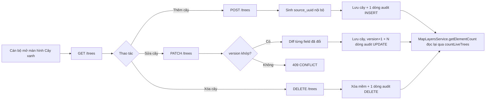

# TÀI LIỆU THIẾT KẾ KỸ THUẬT — LỚP DỮ LIỆU CÂY XANH (GIS)

---

## 📋 LỊCH SỬ THAY ĐỔI (CHANGELOG)

> Mỗi thay đổi nghiệp vụ hoặc hợp đồng tích hợp so với bản thiết kế gốc được ghi tại đây và đánh dấu **tại chỗ** bằng khối trích dẫn `> 🔄 CẬP NHẬT [ngày]` hoặc `> 🆕 MỚI [ngày]`, để FE/BE dễ dàng đối chiếu.

| Ngày       | Nội dung thay đổi                                                                                                                                                                                                                                        | Mục liên quan |
| :--------- | :------------------------------------------------------------------------------------------------------------------------------------------------------------------------------------------------------------------------------------------------------- | :------------ |
| 2026-09-04 | **Khởi tạo**: tách lớp Cây xanh khỏi bảng vị trí generic `map_layer_items` (đã bị xóa, xem `map_layers_technical_design.md`), triển khai bảng nghiệp vụ riêng theo `docs/driver/Thuyet_minh_giai_phap_CSDL.docx` Mục I, có nhật ký thay đổi field-level. | Toàn bộ       |

---

## MỤC LỤC

1. [Phạm vi](#1-phạm-vi)
2. [Quyết định thiết kế](#2-quyết-định-thiết-kế)
   - [2.1. Bảng nghiệp vụ riêng, không còn `properties` JSONB](#21-bảng-nghiệp-vụ-riêng-không-còn-properties-jsonb)
   - [2.2. Liên kết với danh mục lớp bản đồ (`map_layers`)](#22-liên-kết-với-danh-mục-lớp-bản-đồ-map_layers)
   - [2.3. Nhật ký thay đổi field-level](#23-nhật-ký-thay-đổi-field-level)
   - [2.4. Quy tắc dữ liệu](#24-quy-tắc-dữ-liệu)
3. [Luồng nghiệp vụ](#3-luồng-nghiệp-vụ)
4. [Thiết kế cơ sở dữ liệu](#4-thiết-kế-cơ-sở-dữ-liệu)
   - [4.1. `green_trees`](#41-green_trees)
   - [4.2. `tree_species`](#42-tree_species)
   - [4.3. `green_tree_audit_logs`](#43-green_tree_audit_logs)
5. [Danh mục thiết kế RESTful API contracts và bảng tham số chi tiết](#5-danh-mục-thiết-kế-restful-api-contracts-và-bảng-tham-số-chi-tiết)
   - [5.1. Quy chuẩn dùng chung](#51-quy-chuẩn-dùng-chung)
   - [5.2. API quản lý cây xanh — `/api/v1/trees`](#52-api-quản-lý-cây-xanh--apiv1trees)
   - [5.3. API danh mục loài cây — `/api/v1/trees/species`](#53-api-danh-mục-loài-cây--apiv1treesspecies)
6. [Phân quyền](#6-phân-quyền)
7. [Ranh giới với `map_layers` và các lớp khác](#7-ranh-giới-với-map_layers-và-các-lớp-khác)
8. [Triển khai và kiểm thử](#8-triển-khai-và-kiểm-thử)

## 1. Phạm vi

Phân hệ này quản lý dữ liệu của lớp bản đồ **Cây xanh** (`map_layers.code = LYR_TREE`):

1. **Quản lý cây xanh**: CRUD từng cây, tọa độ định vị, thông số kỹ thuật (chiều cao, độ rộng tán, đường kính gốc), tình trạng, ảnh hiện trạng.
2. **Danh mục loài cây**: danh mục mở, cho phép bổ sung loài mới khi có kết quả khảo sát, lưu các cách viết tương đương để ánh xạ khi nhập dữ liệu.
3. **Nhật ký thay đổi**: ghi vết từng trường dữ liệu bị thay đổi trên một cây, phục vụ truy vết.

Module này **không** quản lý danh mục lớp bản đồ (`map_layers` — xem `map_layers_technical_design.md`) và không có khóa ngoại tới bảng đó; quan hệ giữa hai module là một ánh xạ cố định theo `code` được resolve ở tầng `MapLayersService` (xem [§2.2](#22-liên-kết-với-danh-mục-lớp-bản-đồ-map_layers)).

Import hàng loạt từ Excel **chưa được triển khai** ở đợt này — xem [§8](#8-triển-khai-và-kiểm-thử).

## 2. Quyết định thiết kế

### 2.1. Bảng nghiệp vụ riêng, không còn `properties` JSONB

Bảng `map_layer_items` (dùng chung cho mọi lớp, thuộc tính riêng lưu trong cột `properties` JSONB) đã bị xóa — xem `map_layers_technical_design.md` §2.1. Lớp Cây xanh chuyển sang 3 bảng nghiệp vụ riêng với cột kiểu dữ liệu tường minh, theo đúng đặc tả tại `docs/driver/Thuyet_minh_giai_phap_CSDL.docx`, Mục 1.7.1:

- `green_trees` — bảng trung tâm, mỗi dòng một cây.
- `tree_species` — danh mục loài cây (mở, có thể bổ sung).
- `green_tree_audit_logs` — nhật ký thay đổi field-level.

Không dùng cột JSONB cho thuộc tính riêng; danh mục đóng (tình trạng cây) được ràng buộc ngay trên bảng bằng `CHECK` thay vì tách bảng danh mục riêng, đúng nguyên tắc tổ chức dữ liệu của tài liệu CSDL gốc (Mục 1.1.3).

### 2.2. Liên kết với danh mục lớp bản đồ (`map_layers`)

`green_trees` **không có cột `map_layer_id`** và không có khóa ngoại nào trỏ về `map_layers`. Lý do: quan hệ layer ⟷ bảng là 1-1 cố định (một cây không bao giờ đổi sang lớp khác), nên một cột FK chỉ là dữ liệu dư thừa cần bảo trì đồng bộ mà không tăng thêm ràng buộc thực sự nào.

`MapLayersModule` import `TreesModule` và inject `TreesService` trực tiếp; `MapLayersService` giữ một bảng tra cứu cố định theo `map_layers.code`:

```ts
LYR_TREE: () => this.treesService.countLiveTrees();
```

`GET /api/v1/map-layers` gọi hàm này để trả `element_count` cho badge Sidebar của lớp Cây xanh, thay vì `COUNT(*)` trên một bảng item chung. Xóa lớp `LYR_TREE` qua `DELETE /api/v1/map-layers` luôn bị từ chối (`409 CONFLICT`) vì lớp này được sở hữu bởi module chuyên biệt — xem `map_layers_technical_design.md` §5.2.5.

### 2.3. Nhật ký thay đổi field-level

Tài liệu CSDL gốc yêu cầu ghi vết mọi thay đổi, kể cả thao tác không đi qua ứng dụng, bằng **Postgres trigger**. Quyết định triển khai (đã thống nhất) là **ghi ở tầng service**, không dùng trigger:

- Codebase hiện chưa có tiền lệ dùng Postgres trigger/function nào; audit hiện có trong repo (`sanitation_waste_point_histories`) cũng là log sự kiện ghi tường minh ở tầng service.
- Đổi lại lấy sự đơn giản, dễ test, không rủi ro migration; đánh đổi là không bắt được thao tác chạy thẳng trên DB ngoài ứng dụng — nhưng kiến trúc hiện tại vốn đã cấm "query database from controller" và không có đường tắt ghi thẳng DB ngoài API.

Cơ chế cụ thể — `TreesService.update()`:

1. Đọc bản ghi hiện tại trong transaction (`TransactionHelper.runInTransaction`).
2. Kiểm tra optimistic lock: `dto.version` phải khớp `tree.version` hiện tại, sai thì `409 CONFLICT`.
3. So sánh từng trường được client gửi lên (chỉ trường có mặt trong request, theo pattern `if (dto.x !== undefined)`) với giá trị hiện tại, dùng hàm thuần `buildFieldDiffs()` (`src/shared/entity-diff.util.ts`, dùng chung với module Đèn chiếu sáng).
4. Ghi bản ghi cây đã cập nhật, tăng `version` lên 1.
5. Với mỗi trường thực sự đổi giá trị, ghi **một dòng** vào `green_tree_audit_logs` (`action = UPDATE`, `field_name`, `old_value`, `new_value`, `reason` lấy từ body nếu có, `actor_user_id`/`actor_display_snapshot` lấy từ `@CurrentUser()`, `actor_ip` lấy từ `@Ip()`).
6. Nếu không trường nào thực sự đổi (client gửi lại đúng giá trị cũ), **không ghi** dòng nhật ký nào — tránh log rác.

`create()` ghi một dòng tổng hợp (`action = INSERT`, không có `field_name`); `remove()` ghi một dòng tổng hợp (`action = DELETE`) kèm xóa mềm cây. Toàn bộ thao tác ghi entity + nhật ký nằm trong cùng một transaction.

### 2.4. Quy tắc dữ liệu

- `source_uuid` là khóa tự nhiên chống nhập trùng khi import từ nền tảng khảo sát (chưa triển khai import — xem §8). Khi cán bộ tạo cây **thủ công qua API** (không qua import), backend **tự sinh UUID nội bộ** bằng `crypto.randomUUID()` — không bắt buộc, không cho nhập tay.
- `survey_code` cho phép trùng (nhiều cây có thể chưa được đánh số hoặc đánh trùng ngoài thực địa).
- `species_id` không bắt buộc; để trống khi chưa tra được loài, `species_raw` giữ nguyên tên ghi ngoài thực địa để đối soát sau.
- `condition_codes` là mảng tối đa 3 phần tử, chỉ nhận giá trị thuộc danh mục đóng `BINH_THUONG`, `CONG_NGHIENG`, `CAN_CAT_TIA` — ràng buộc bằng `CHECK` ở tầng DB, validate lại ở tầng DTO (`@IsEnum` + `@ArrayMaxSize(3)`).
- Tọa độ (`tree_lat`, `tree_lng`) là tùy chọn — một cây có thể chưa có tọa độ, chờ khảo sát bổ sung (461/2.850 cây theo số liệu khảo sát ban đầu).
- Xóa cây là xóa mềm (`deleted_at`); `TreesService.countLiveTrees()` chỉ đếm bản ghi chưa xóa mềm (mặc định của TypeORM `count()`).
- `tree_species.species_code` và `tree_species.name_vi` duy nhất trong danh mục; `aliases` là mảng các cách viết tương đương, không bắt buộc.

## 3. Luồng nghiệp vụ



Toàn bộ thao tác ghi (tạo/sửa/xóa) chạy trong một transaction cùng với dòng nhật ký tương ứng — không có trạng thái "đã lưu cây nhưng thiếu nhật ký".

## 4. Thiết kế cơ sở dữ liệu

Cả 3 bảng đều kế thừa `BaseEntity` (`src/base/base.entity.ts`): khóa chính `id UUID DEFAULT gen_random_uuid()`, `created_at`/`updated_at` timestamptz, `deleted_at` timestamptz nullable (xóa mềm).

### 4.1. `green_trees`

Bảng trung tâm, mỗi dòng tương ứng một cây ngoài thực địa. Migration: `src/migrations/1787445000000-CreateGreenTreesTable.ts`.

| Cột                                    | Kiểu                     | Ràng buộc / Ý nghĩa                                                                          |
| -------------------------------------- | ------------------------ | -------------------------------------------------------------------------------------------- |
| `id`                                   | `uuid`                   | Khóa chính.                                                                                  |
| `source_uuid`                          | `text`                   | `UNIQUE`. Định danh nguồn; tự sinh nếu tạo qua API.                                          |
| `survey_code`                          | `text` nullable          | Số hiệu ghi ngoài thực địa; cho phép trùng.                                                  |
| `species_id`                           | `uuid` nullable          | FK → `tree_species(id)`, `ON DELETE SET NULL`.                                               |
| `species_raw`                          | `text` nullable          | Tên loài nguyên trạng, giữ để đối soát.                                                      |
| `tree_lat`                             | `numeric(10,7)` nullable | Vĩ độ WGS-84.                                                                                |
| `tree_lng`                             | `numeric(11,7)` nullable | Kinh độ WGS-84.                                                                              |
| `gps_accuracy_m`                       | `integer` nullable       | Sai số định vị, đơn vị mét.                                                                  |
| `height_m`                             | `numeric(6,2)` nullable  | Chiều cao cây, đơn vị mét.                                                                   |
| `crown_width_m`                        | `numeric(6,2)` nullable  | Độ rộng tán, đơn vị mét.                                                                     |
| `base_diameter_cm`                     | `numeric(6,2)` nullable  | Đường kính gốc, đơn vị centimet.                                                             |
| `condition_codes`                      | `text[]` NOT NULL        | Mặc định `{}`. `CHECK` thuộc `{BINH_THUONG, CONG_NGHIENG, CAN_CAT_TIA}` và tối đa 3 phần tử. |
| `photo_url`                            | `text` nullable          | Đường dẫn ảnh hiện trạng.                                                                    |
| `surveyed_at`                          | `timestamptz` nullable   | Thời điểm ghi nhận ngoài thực địa.                                                           |
| `source_uploaded_at`                   | `timestamptz` nullable   | Thời điểm đồng bộ lên máy chủ khảo sát (chỉ có ý nghĩa khi import; chưa dùng ở đợt này).     |
| `version`                              | `integer` NOT NULL       | Mặc định `1`. Optimistic-concurrency, tăng mỗi lần `PATCH`.                                  |
| `created_at`/`updated_at`/`deleted_at` | `timestamptz`            | Lifecycle và xóa mềm.                                                                        |

Index: `idx_green_trees_species_id` (`species_id`), `idx_green_trees_survey_code` (`survey_code`, không unique).

### 4.2. `tree_species`

Danh mục loài cây mở. Migration: `src/migrations/1787444000000-CreateTreeSpeciesTable.ts` (chạy trước `green_trees` do có FK phụ thuộc).

| Cột                                    | Kiểu              | Ràng buộc / Ý nghĩa                                               |
| -------------------------------------- | ----------------- | ----------------------------------------------------------------- |
| `id`                                   | `uuid`            | Khóa chính.                                                       |
| `species_code`                         | `varchar(50)`     | `UNIQUE`. Mã loài chuẩn hóa.                                      |
| `name_vi`                              | `varchar(255)`    | `UNIQUE`. Tên loài tiếng Việt.                                    |
| `aliases`                              | `text[]` NOT NULL | Mặc định `{}`. Các cách viết tương đương ghi nhận ngoài thực địa. |
| `note`                                 | `text` nullable   | Ghi chú bổ sung.                                                  |
| `created_at`/`updated_at`/`deleted_at` | `timestamptz`     | Lifecycle và xóa mềm.                                             |

Index: `idx_tree_species_aliases` (GIN trên `aliases`) — hỗ trợ tra alias khi import về sau.

### 4.3. `green_tree_audit_logs`

Nhật ký thay đổi field-level, chỉ ghi thêm (append-only). Migration: `src/migrations/1787446000000-CreateGreenTreeAuditLogsTable.ts` (sau `green_trees`).

| Cột                                    | Kiểu                   | Ràng buộc / Ý nghĩa                                                               |
| -------------------------------------- | ---------------------- | --------------------------------------------------------------------------------- |
| `id`                                   | `uuid`                 | Khóa chính.                                                                       |
| `tree_id`                              | `uuid` NOT NULL        | FK → `green_trees(id)`, không `ON DELETE CASCADE` (nhật ký sống qua xóa mềm cây). |
| `source_uuid`                          | `text` nullable        | Snapshot `source_uuid` của cây tại thời điểm ghi, đọc log không cần join.         |
| `action`                               | `text` NOT NULL        | `CHECK IN ('INSERT', 'UPDATE', 'DELETE')`.                                        |
| `field_name`                           | `text` nullable        | Tên trường bị đổi; rỗng với `INSERT`/`DELETE`.                                    |
| `old_value` / `new_value`              | `text` nullable        | Giá trị trước/sau, đã stringify (mảng/Date qua JSON).                             |
| `reason`                               | `text` nullable        | Lý do thay đổi, người thực hiện nhập.                                             |
| `actor_user_id`                        | `uuid` nullable        | Không FK cứng tới bảng user (giữ nguyên khi tài khoản đổi/bị xóa).                |
| `actor_display_snapshot`               | `text` nullable        | Snapshot tên hiển thị của người thực hiện.                                        |
| `actor_ip`                             | `inet` nullable        | Địa chỉ IP thực hiện thao tác.                                                    |
| `actual_time`                          | `timestamptz` NOT NULL | Thời điểm thực hiện thay đổi.                                                     |
| `created_at`/`updated_at`/`deleted_at` | `timestamptz`          | Lifecycle của chính dòng nhật ký (không xóa trong vận hành bình thường).          |

Index: `idx_green_tree_audit_logs_tree_id` (`tree_id`), `idx_green_tree_audit_logs_actual_time` (`actual_time`).

## 5. DANH MỤC THIẾT KẾ RESTFUL API CONTRACTS VÀ BẢNG THAM SỐ CHI TIẾT

> **Quy chuẩn kiến trúc:** Base URL là `/api/v1`. Tất cả API yêu cầu JWT Bearer (chưa gắn `@RequireRole` — xem §6). Không dùng path parameter; GET dùng Query Params, POST/PATCH/DELETE dùng Request Body, theo đúng quy ước hiện có của repo.

### 5.1. Quy chuẩn dùng chung

Envelope thành công/lỗi, phân trang và mã lỗi giống hệt `map_layers_technical_design.md` §5.1 — không lặp lại ở đây. Riêng module này:

| HTTP | `code`         | Trường hợp dùng trong module                                                        |
| ---- | -------------- | ----------------------------------------------------------------------------------- |
| 400  | `BAD_REQUEST`  | Body/query sai định dạng, `condition_codes` sai giá trị hoặc quá 3 phần tử.         |
| 401  | `UNAUTHORIZED` | Thiếu hoặc sai JWT.                                                                 |
| 404  | `NOT_FOUND`    | Không tìm thấy cây.                                                                 |
| 409  | `CONFLICT`     | `version` không khớp (cập nhật đồng thời); mã/tên loài trùng khi tạo danh mục loài. |

### 5.2. API quản lý cây xanh — `/api/v1/trees`

#### Response object `TreeResponseDto`

| Field                                             | Kiểu               | Ý nghĩa                                                    |
| ------------------------------------------------- | ------------------ | ---------------------------------------------------------- |
| `id`                                              | `string` (UUID)    | Khóa chính.                                                |
| `source_uuid`                                     | `string`           | Định danh nguồn (tự sinh nếu tạo qua API).                 |
| `survey_code`                                     | `string \| null`   | Số hiệu ghi ngoài thực địa.                                |
| `species_id`                                      | `string \| null`   | ID loài trong `tree_species`.                              |
| `species_name`                                    | `string \| null`   | Tên loài đã chuẩn hóa (join từ `tree_species`).            |
| `species_raw`                                     | `string \| null`   | Tên loài nguyên trạng.                                     |
| `tree_lat` / `tree_lng`                           | `number \| null`   | Tọa độ WGS-84.                                             |
| `gps_accuracy_m`                                  | `number \| null`   | Sai số định vị (m).                                        |
| `height_m` / `crown_width_m` / `base_diameter_cm` | `number \| null`   | Thông số kỹ thuật cây.                                     |
| `condition_codes`                                 | `string[]`         | Tối đa 3 mã: `BINH_THUONG`, `CONG_NGHIENG`, `CAN_CAT_TIA`. |
| `photo_url`                                       | `string \| null`   | Ảnh hiện trạng.                                            |
| `surveyed_at`                                     | `ISO 8601 \| null` | Thời điểm khảo sát.                                        |
| `source_uploaded_at`                              | `ISO 8601 \| null` | Thời điểm đồng bộ (chưa dùng, dành cho import).            |
| `version`                                         | `integer`          | Dùng cho optimistic lock khi `PATCH`.                      |
| `created_at`/`updated_at`                         | `ISO 8601`         | Lifecycle.                                                 |

| Method   | Endpoint            | Mục đích                                        |
| -------- | ------------------- | ----------------------------------------------- |
| `GET`    | `/trees`            | Danh sách cây, phân trang, tìm kiếm/lọc.        |
| `GET`    | `/trees/detail?id=` | Chi tiết một cây.                               |
| `POST`   | `/trees`            | Tạo cây mới; `source_uuid` do backend tự sinh.  |
| `PATCH`  | `/trees`            | Cập nhật một phần; `id` + `version` trong body. |
| `DELETE` | `/trees`            | Xóa mềm; `id` trong body.                       |

#### 5.2.1. Lấy danh sách cây xanh

- **Endpoint**: `GET /api/v1/trees`
- **Sắp xếp**: `created_at DESC`.

| Tham số          | Vị trí | Kiểu      | Bắt buộc | Ý nghĩa                                            |
| ---------------- | ------ | --------- | -------- | -------------------------------------------------- |
| `page`, `limit`  | Query  | `integer` | Không    | Phân trang, mặc định `1`/`20`, tối đa `100`.       |
| `species_id`     | Query  | `uuid`    | Không    | Lọc theo loài.                                     |
| `condition_code` | Query  | `enum`    | Không    | Lọc cây có tình trạng này trong `condition_codes`. |
| `keyword`        | Query  | `string`  | Không    | Tìm trên `survey_code`, `species_raw`.             |

**Response `200 OK` (rút gọn):**

```json
{
  "success": true,
  "message": "Lấy danh sách cây xanh thành công",
  "data": [
    {
      "id": "b6f6c6b0-0000-4000-8000-000000000010",
      "source_uuid": "8f14e45f-...-...-...-...",
      "survey_code": "CX-0044",
      "species_id": null,
      "species_name": null,
      "species_raw": "Xà cừ",
      "tree_lat": 20.6462,
      "tree_lng": 106.0512,
      "gps_accuracy_m": 3,
      "height_m": 12.5,
      "crown_width_m": 6.2,
      "base_diameter_cm": 45,
      "condition_codes": ["BINH_THUONG"],
      "photo_url": null,
      "surveyed_at": null,
      "source_uploaded_at": null,
      "version": 1,
      "created_at": "2026-09-04T08:00:00.000Z",
      "updated_at": "2026-09-04T08:00:00.000Z"
    }
  ],
  "meta": { "page": 1, "limit": 20, "total": 1, "total_pages": 1 }
}
```

#### 5.2.2. Lấy chi tiết một cây

- **Endpoint**: `GET /api/v1/trees/detail`

| Tham số | Vị trí | Kiểu   | Bắt buộc | Ý nghĩa         |
| ------- | ------ | ------ | -------- | --------------- |
| `id`    | Query  | `uuid` | Có       | ID cây cần xem. |

Trả `404 NOT_FOUND` nếu cây không tồn tại hoặc đã xóa mềm.

#### 5.2.3. Tạo cây mới

- **Endpoint**: `POST /api/v1/trees`
- **Mục đích**: Tạo một cây thủ công qua UI (không phải luồng import hàng loạt).

| Trường                                          | Kiểu       | Bắt buộc | Ràng buộc                                     |
| ----------------------------------------------- | ---------- | -------- | --------------------------------------------- |
| `survey_code`                                   | `string`   | Không    | Tối đa 100 ký tự.                             |
| `species_id`                                    | `uuid`     | Không    | Phải tồn tại trong `tree_species` nếu truyền. |
| `species_raw`                                   | `string`   | Không    | —                                             |
| `tree_lat`, `tree_lng`                          | `number`   | Không    | WGS-84, tối đa 7 chữ số thập phân.            |
| `gps_accuracy_m`                                | `integer`  | Không    | ≥ 0.                                          |
| `height_m`, `crown_width_m`, `base_diameter_cm` | `number`   | Không    | ≥ 0.                                          |
| `condition_codes`                               | `string[]` | Không    | Mỗi phần tử thuộc enum, tối đa 3 phần tử.     |
| `photo_url`                                     | `string`   | Không    | —                                             |
| `surveyed_at`                                   | `ISO 8601` | Không    | —                                             |

`source_uuid` **không** nhận từ client — backend tự sinh bằng `crypto.randomUUID()`.

**Request mẫu:**

```json
{
  "survey_code": "CX-0099",
  "species_raw": "Bằng lăng",
  "tree_lat": 20.6501,
  "tree_lng": 106.0498,
  "condition_codes": ["BINH_THUONG"]
}
```

Response `200 OK` trả cây vừa tạo (`version: 1`) và ghi 1 dòng nhật ký `INSERT`.

#### 5.2.4. Cập nhật cây

- **Endpoint**: `PATCH /api/v1/trees`

| Trường            | Kiểu      | Bắt buộc | Ý nghĩa                                                                      |
| ----------------- | --------- | -------- | ---------------------------------------------------------------------------- |
| `id`              | `uuid`    | Có       | ID cây cần cập nhật.                                                         |
| `version`         | `integer` | Có       | Phiên bản client đang có; không khớp bản ghi hiện tại → `409 CONFLICT`.      |
| `reason`          | `string`  | Không    | Lý do thay đổi, ghi vào nhật ký cho tất cả field đổi trong request này.      |
| Các field còn lại | —         | Không    | Dùng field của API tạo; chỉ field được truyền lên mới được diff và cập nhật. |

Mỗi field thực sự đổi giá trị sinh một dòng `green_tree_audit_logs` (`action = UPDATE`). Response trả cây sau cập nhật với `version` đã +1. Trả `404 NOT_FOUND` nếu không có cây, `409 CONFLICT` nếu `version` không khớp.

#### 5.2.5. Xóa cây

- **Endpoint**: `DELETE /api/v1/trees`

| Trường   | Kiểu     | Bắt buộc | Ý nghĩa                     |
| -------- | -------- | -------- | --------------------------- |
| `id`     | `uuid`   | Có       | ID cây cần xóa mềm.         |
| `reason` | `string` | Không    | Lý do xóa, ghi vào nhật ký. |

**Response `200 OK`:**

```json
{ "success": true, "message": "Xóa cây xanh thành công", "data": null }
```

Ghi 1 dòng nhật ký `action = DELETE`. Cây bị xóa mềm không còn xuất hiện trong danh sách và không được tính vào `element_count` của lớp `LYR_TREE`.

### 5.3. API danh mục loài cây — `/api/v1/trees/species`

| Method | Endpoint         | Mục đích                              |
| ------ | ---------------- | ------------------------------------- |
| `GET`  | `/trees/species` | Danh sách loài, phân trang, tìm kiếm. |
| `POST` | `/trees/species` | Thêm loài mới vào danh mục.           |

#### 5.3.1. Lấy danh mục loài cây

- **Endpoint**: `GET /api/v1/trees/species`
- **Sắp xếp**: `name_vi ASC`.

| Tham số         | Vị trí | Kiểu      | Bắt buộc | Ý nghĩa                             |
| --------------- | ------ | --------- | -------- | ----------------------------------- |
| `page`, `limit` | Query  | `integer` | Không    | Phân trang, mặc định `1`/`20`.      |
| `keyword`       | Query  | `string`  | Không    | Tìm trên `name_vi`, `species_code`. |

#### 5.3.2. Thêm loài cây

- **Endpoint**: `POST /api/v1/trees/species`

| Trường         | Kiểu       | Bắt buộc | Ràng buộc                                  |
| -------------- | ---------- | -------- | ------------------------------------------ |
| `species_code` | `string`   | Có       | Tối đa 50 ký tự, duy nhất trong danh mục.  |
| `name_vi`      | `string`   | Có       | Tối đa 255 ký tự, duy nhất trong danh mục. |
| `aliases`      | `string[]` | Không    | Các cách viết tương đương.                 |
| `note`         | `string`   | Không    | —                                          |

**Request mẫu:**

```json
{ "species_code": "SAU", "name_vi": "Sấu", "aliases": ["Sấu", "Sau", "S"] }
```

Trả `409 CONFLICT` nếu `species_code` hoặc `name_vi` đã tồn tại.

## 6. Phân quyền

Theo quyết định đã thống nhất, module này **chưa gắn quyền riêng** ở đợt triển khai này — chỉ dùng quyền sẵn có `gis-map.layer.manage` cho việc quản lý danh mục lớp bản đồ nói chung. Controller `TreesController` không gắn `@RequireRole`, nhất quán với phần lớn controller khác trong repo (theo `src/modules/auth/auth.constants.ts`, hiện chỉ `ping.controller.ts` thực sự enforce quyền qua guard — các route khác là "từ vựng dự trữ", đã có tên quyền khai báo trong `keycloak/realm-phohien.json` nhưng chưa gắn guard). Khi cần bật quyền riêng cho cây xanh, thêm role dạng `<module>.<object>.<action>` (ví dụ `tree.record.manage`) vào `auth.constants.ts` và `keycloak/realm-phohien.json`, rồi gắn `@RequireRole` trên các route mutating.

## 7. Ranh giới với `map_layers` và các lớp khác

- `TreesModule` không import `MapLayersModule`; chiều phụ thuộc duy nhất là `MapLayersModule → TreesModule` (xem §2.2).
- Không có bảng nào trong module này tham chiếu `map_layers.id`.
- `TreesService` chỉ export những gì `MapLayersService` cần (`countLiveTrees()`); không export logic CRUD cây cho module khác dùng lại.
- Danh mục loài cây (`tree_species`) là dữ liệu nội bộ của lớp Cây xanh, không dùng chung với module nào khác.

## 8. Triển khai và kiểm thử

Thay đổi mã nguồn chính:

- `src/modules/trees/`: `green-tree.entity.ts`, `tree-species.entity.ts`, `green-tree-audit-log.entity.ts`, `trees.dto.ts`, `trees.mapper.ts`, `trees.constants.ts`, `trees.service.ts`, `trees.controller.ts`, `trees.module.ts`, `trees.service.spec.ts`.
- `src/shared/entity-diff.util.ts` (+ `entity-diff.util.spec.ts`): hàm `buildFieldDiffs()` dùng chung với module Đèn chiếu sáng.
- `src/migrations/1787444000000-CreateTreeSpeciesTable.ts`, `1787445000000-CreateGreenTreesTable.ts`, `1787446000000-CreateGreenTreeAuditLogsTable.ts` (chạy theo đúng thứ tự do phụ thuộc FK).
- `src/app.module.ts`: đăng ký `TreesModule`.
- `src/modules/map-layers/map-layers.service.ts`: inject `TreesService`, dùng `countLiveTrees()` cho `element_count` của `LYR_TREE`.

**Chưa triển khai ở đợt này** (ghi nhận rõ để tránh hiểu nhầm là thiếu sót): import hàng loạt từ Excel/nền tảng khảo sát; quyền riêng cho module; Postgres trigger cho audit (xem §2.3).

Kiểm tra bắt buộc trước khi merge:

```bash
pnpm run lint:check
pnpm run format:check
pnpm run typecheck
pnpm test
pnpm run openapi:check
pnpm run build
```

Migration: `pnpm run db:migrate` → `pnpm run db:revert` (theo thứ tự ngược) → `pnpm run db:migrate` lại để xác nhận có thể áp dụng lại được đúng convention AGENT.md. **Chưa chạy được trong môi trường phát triển này do không có Postgres** — cần verify trên máy có DB trước khi merge.
