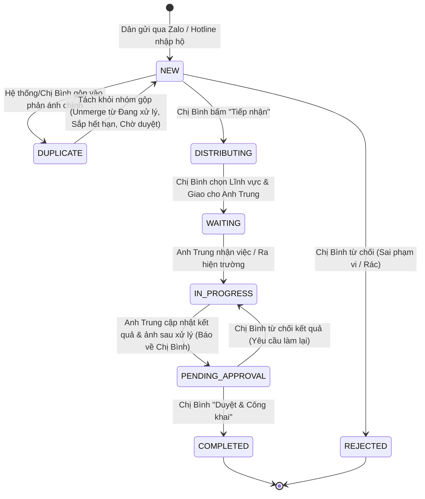
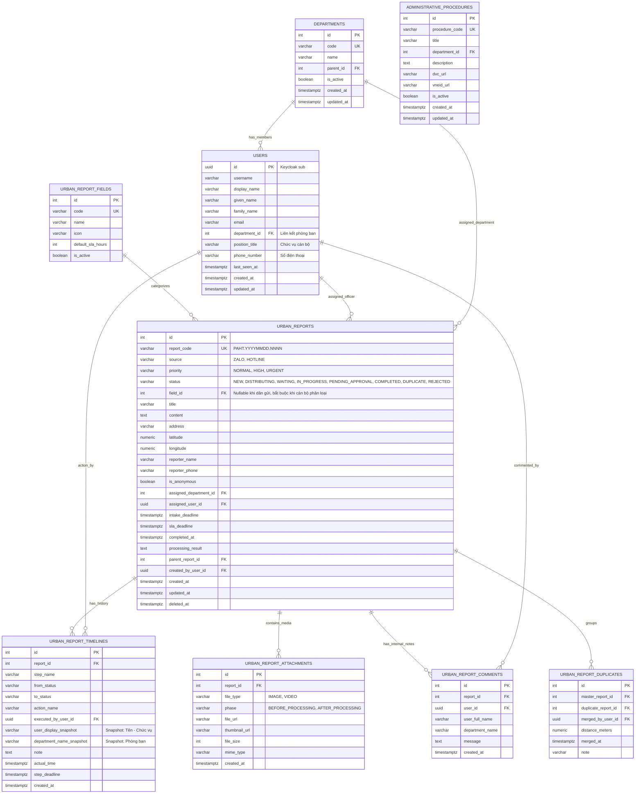

# TÀI LIỆU THIẾT KẾ KỸ THUẬT CHI TIẾT (ĐẦY ĐỦ THAM SỐ API & QUY CHUẨN BACKEND)
# PHÂN HỆ: DỊCH VỤ ĐÔ THỊ SỐ (QUẢN LÝ PHẢN ÁNH HIỆN TRƯỜNG & DỊCH VỤ CÔNG DÂN)

---

## MỤC LỤC
1. [Ví dụ minh họa thực tế ngoài đời thực (Happy Case 3 Nhân vật & Các Tình huống Thực tế)](#1-ví-dụ-minh-họa-thực-tế-ngoài-đời-thực-happy-case-3-nhân-vật--các-tình-huống-thực-tế)
   - 1.1. Luồng chuẩn mực (Happy Case) — Quy trình 3 người tinh gọn
   - 1.2. Mô phỏng chi tiết: Tình huống Gộp phản ánh (Merge) & Tách khỏi nhóm (Unmerge)
   - 1.3. Các tình huống thực tế đặc thù khác (Hotline, Sắp hết hạn, Từ chối kết quả)
2. [Nghiệp vụ hệ thống & Mô hình trạng thái (Business Flow & State Machine)](#2-nghiệp-vụ-hệ-thống--mô-hình-trạng-thái-business-flow--state-machine)
   - 2.1. Sơ đồ luồng tổng quan (Core Flow Diagram)
   - 2.2. Vòng đời và bảng chuyển đổi trạng thái (State Transitions & Guards)
   - 2.3. Ma trận phân quyền RBAC
3. [Thiết kế Cơ sở dữ liệu (Database Schema)](#3-thiết-kế-cơ-sở-dữ-liệu-database-schema)
   - 3.1. Sơ đồ quan hệ thực thể (ERD)
   - 3.2. Bổ sung bảng `departments` và cập nhật bảng `users`
   - 3.3. Chi tiết DDL các bảng nghiệp vụ cốt lõi
4. [Thuật toán & Cơ chế kỹ thuật đặc thù](#4-thuật-toán--cơ-chế-kỹ-thuật-đặc-thù)
   - 4.1. Cơ chế sinh mã hồ sơ tự động dạng công văn `#PAHT.YYYYMMDD.NNNN`
   - 4.2. Thuật toán phát hiện và gộp phản ánh trùng lặp (Spatial-Temporal Deduplication)
   - 4.3. Cơ chế & Logic kỹ thuật khi "Tách khỏi nhóm" (Unmerge Lifecycle)
   - 4.4. Quản lý hạn xử lý SLA 07 ngày và Background Job cảnh báo trễ hạn
   - 4.5. Cơ chế thông báo tách rời (Decoupled Notification Architecture)
5. [**Danh mục Thiết kế RESTful API Contracts & Bảng Tham số Chi tiết**](#5-danh-mục-thiết-kế-restful-api-contracts--bảng-tham-số-chi-tiết)
   - 5.1. Nhóm API dành cho Người dân (Public Endpoints)
   - 5.2. Nhóm API dành cho Cán bộ & Quản trị (Officer Endpoints)
6. [Bảo mật & Vận hành Production](#6-bảo-mật--vận-hành-production)

---

## 1. VÍ DỤ MINH HỌA THỰC TẾ NGOÀI ĐỜI THỰC (HAPPY CASE 3 NHÂN VẬT & CÁC TÌNH HUỐNG THỰC TẾ)

### 1.1. Luồng chuẩn mực (Happy Case) — Quy trình 3 người tinh gọn

#### 👥 3 Nhân vật cốt lõi trong quy trình:
1. **Bác Nguyễn Đăng Khoa (Người dân)**: Sử dụng Zalo Mini App "Phường Phố Hiến" để gửi phản ánh hoặc gọi Hotline.
2. **Chị Trần Thị Bình (Chuyên viên Phòng Hành chính công)**: Đầu mối tiếp nhận, phân loại lĩnh vực, giao việc cho cán bộ chuyên môn và là người trực tiếp kiểm tra, phê duyệt kết quả cuối cùng để công khai cho người dân.
3. **Anh Nguyễn Thành Trung (Cán bộ Phòng Kinh tế, Hạ tầng và Đô thị)**: Cán bộ chuyên môn trực tiếp thụ lý, tự đi xử lý hiện trường, cập nhật kết quả kèm ảnh sau xử lý và gửi ngược lại cho Chị Bình.

---


---

#### ⏱️ Diễn biến chi tiết từng bước:

* **08:30:00 — Dân phát hiện sự cố**:
  Bác Nguyễn Đăng Khoa đi bộ qua tuyến đường Lê Đình Kiên thấy cỏ dại mọc tràn ra lòng đường hơn 1m gây che khuất tầm nhìn xe cộ.
* **08:32:00 — Dân gửi qua Zalo Mini App (Form siêu tinh gọn)**:
  * Bác Khoa mở Mini App Zalo "Phường Phố Hiến" $\rightarrow$ Chọn **"Gửi phản ánh"**.
  * Bác **không cần chọn danh mục phức tạp**. Form chỉ yêu cầu **3 thông tin cốt lõi**:
    1. **Tiêu đề**: *"Đường Lê Đình Kiên cỏ dại mọc vào hành lang đường mỗi bên hơn 1m"*
    2. **Nội dung**: *"Cây dại mọc che hết lối đi gây nguy hiểm cho người tham gia giao thông"*
    3. **Ảnh/Video**: Bác bấm chụp ngay **3 tấm ảnh hiện trường**.
  * Hệ thống tự động lấy tọa độ GPS `(20.654312, 106.052145)` và SĐT Zalo `0787022889`. Bác bấm **[Gửi phản ánh]**.
* **08:32:05 — Hệ thống tiếp nhận & Thông báo tức thì cho Chị Bình**:
  1. Backend cấp mã tự động: `#PAHT.20260729.0009`.
  2. Trả ngay mã cho Bác Khoa trên Zalo để theo dõi.
  3. **ĐỒNG THỜI**: Hệ thống phát thông báo real-time tới **Chị Trần Thị Bình (Phòng Hành chính công)** $\rightarrow$ Chuông góc phải nhảy số đỏ `(+1)`, kèm popup: *"Có phản ánh mới #PAHT.20260729.0009 tại Đường Lê Đình Kiên cần tiếp nhận"*. Hồ sơ nằm ở đầu Tab **"Chờ tiếp nhận (1)"**.
* **09:00:00 — Chị Bình Tiếp nhận, Phân loại lĩnh vực & Giao việc**:
  * Chị Bình mở chi tiết phản ánh: Xem ảnh, vị trí và mô tả của Bác Khoa.
  * Chị Bình bấm **[Tiếp nhận xử lý]**, chọn phân loại lĩnh vực: `Vệ sinh môi trường`.
  * Chị chọn đơn vị: `Phòng Kinh tế, Hạ tầng và Đô thị` $\rightarrow$ Chọn cán bộ xử lý: `Nguyễn Thành Trung`.
  * Hệ thống kích hoạt hạn SLA xử lý 07 ngày: Đến `05/08/2026 14:54`.
* **09:05:00 — Anh Trung trực tiếp thụ lý & xử lý hiện trường**:
  * Anh Trung nhận thông báo trên hệ thống: *"Bạn được giao xử lý phản ánh #PAHT.20260729.0009"*.
  * Anh Trung mở hồ sơ, xác nhận tiếp nhận việc $\rightarrow$ Trạng thái chuyển sang **"Đang xử lý"** (`Còn 6 ngày 23 giờ`).
  * Anh Trung trực tiếp ra hiện trường kiểm tra, tiến hành cắt tỉa cỏ dại, thu gom phế thải và chụp lại **2 bức ảnh mặt đường đã được dọn sạch đẹp**.
* **14:00:00 hôm sau — Anh Trung cập nhật kết quả & Bắn thông báo về Chị Bình**:
  * Anh Trung mở lại hồ sơ trên hệ thống, vào Tab **Kết quả xử lý**:
    * Nhập nội dung: *"Đã phát quang cây cỏ dại lấn đường, thu gom phế thải, đảm bảo an toàn giao thông"*.
    * Tải lên 2 ảnh sau khi xử lý.
    * Bấm nút **[Trình duyệt kết quả]**.
  * Trạng thái chuyển sang **"Chờ duyệt kết quả"**.
  * **Hệ thống tự động gửi thông báo real-time quay lại cho Chị Bình**: *"Cán bộ Nguyễn Thành Trung đã cập nhật kết quả xử lý phản ánh #PAHT.20260729.0009, chờ bạn phê duyệt"*.
* **15:00:00 — Chị Bình Duyệt kết quả & Công khai**:
  * Chị Bình mở Tab **"Chờ duyệt kết quả (1)"**, đối chiếu ảnh Trước xử lý vs ảnh Sau xử lý của Anh Trung.
  * Thấy tuyến đường đã thông thoáng, Chị Bình bấm nút **[Duyệt & Công khai]**.
  * Trạng thái chuyển sang **"Hoàn thành"** (hoàn thành trước hạn 5 ngày).
* **15:01:00 — Người dân nhận kết quả**:
  * Bác Khoa mở Zalo tra cứu mã `#PAHT.20260729.0009` thấy trạng thái đã **Hoàn thành**, xem ảnh kết quả đường sạch đẹp và đánh giá "Rất hài lòng".

---

### 1.2. MÔ PHỎNG CHI TIẾT: TÌNH HUỐNG GỘP PHẢN ÁNH (MERGE) & TÁCH KHỎI NHÓM (UNMERGE)

#### 🎬 Bối cảnh:
* **08:30**: **Bác Khoa** gửi phản ánh `#PAHT.20260725.0002`: *"Cành cây gãy chắn đường Lê Đình Kiên"*. Hồ sơ được giao cho Anh Trung đang xử lý.
* **08:45**: **Chị Mai** đi qua đoạn đường đó, cũng thấy cành cây và gửi phản ánh `#PAHT.20260725.0003`: *"Cây đổ lấn đường Lê Đình Kiên"*.

---

#### 📌 KỊCH BẢN A: GỘP PHẢN ÁNH (Hệ thống tự động hoặc Cán bộ gộp)
1. **Hệ thống xử lý**:
   * Backend nhận tọa độ GPS thấy cách vị trí Bác Khoa chỉ 12 mét, gửi trong vòng 15 phút $\rightarrow$ Tự động gộp `#0003` vào nhóm của `#0002`, chuyển trạng thái `#0003` sang `DUPLICATE` (Phản ánh trùng).
2. **Trải nghiệm người dân (Chị Mai)**:
   * Chị Mai tra cứu mã `#0003` trên Zalo thấy: *"Phản ánh của bạn đã được tiếp nhận và gộp cùng vụ việc với hồ sơ #PAHT.20260725.0002. Cán bộ đang xử lý."*
3. **Phía Cán bộ (Anh Trung)**:
   * Anh Trung mở hồ sơ `#0002`, tại tab **"Phản ánh trùng (1)"** thấy phản ánh `#0003` của Chị Mai $\rightarrow$ Chỉ cần xử lý 1 lần cho hồ sơ `#0002`.
4. **Kết quả hoàn thành**:
   * Khi Chị Bình duyệt hoàn thành hồ sơ `#0002`, hệ thống tự động cập nhật hoàn thành cho cả `#0003`. Cả Bác Khoa và Chị Mai cùng nhận được ảnh nghiệm thu đường đã sạch đẹp!

---

#### 📌 KỊCH BẢN B: TÁCH KHỎI NHÓM (UNMERGE) KHI PHÁT HIỆN BỊ GỘP NHẦM
* Khi Anh Trung đang xử lý (ở Tab **"Sắp hết hạn"**) hoặc Chị Bình chuẩn bị duyệt (ở Tab **"Chờ duyệt kết quả"**), mở Tab con **"Phản ánh trùng"** xem kỹ ảnh của Chị Mai thì phát hiện:
  * `#0002` (Bác Khoa): Cây gãy ở **đầu đường** Lê Đình Kiên.
  * `#0003` (Chị Mai): Cây gãy ở **trong ngõ 12** Lê Đình Kiên (2 cây khác nhau, cần 2 tổ xử lý).
* Cán bộ bấm nút **[Tách khỏi nhóm]** tại thẻ `#0003`.
* **Kết quả sau khi tách**:
  1. **Hồ sơ `#0002` (Bác Khoa)**: Tiếp tục xử lý cho xong cây ở đầu đường.
  2. **Hồ sơ `#0003` (Chị Mai)**: Trở thành **phản ánh độc lập hoàn toàn**, chuyển về `NEW` (**Chờ tiếp nhận**), đồng hồ SLA được cấp 7 ngày mới. Chị Bình nhận thông báo để phân phối xử lý cây trong ngõ 12.
  3. **Hai hồ sơ có 2 kết quả xử lý và ảnh nghiệm thu riêng biệt cho 2 người dân.**

---

### 1.3. Các tình huống thực tế đặc thù khác

* **Tình huống 1: Người già/không có Zalo gọi qua HOTLINE (Cán bộ nhập hộ)**:
  * Cụ Hưng gọi đường dây nóng của Phường $\rightarrow$ Chị Bình mở **"Tiếp nhận thay dân"**, nhập hộ thông tin. Hệ thống cấp mã `#PAHT...` và chạy quy trình chuẩn 7 ngày.
* **Tình huống 2: Cảnh báo sắp trễ hạn SLA 7 ngày**:
  * Quá 5 ngày chưa có kết quả $\rightarrow$ Hệ thống tự đổi nhãn đỏ `Sắp hết hạn (Còn 1 ngày 08 giờ)`, đẩy vào Tab **"Sắp hết hạn"** và phát thông báo đôn đốc.
* **Tình huống 3: Kết quả xử lý chưa đạt (Chị Bình yêu cầu làm lại)**:
  * Chị Bình xem ảnh thấy chưa sạch $\rightarrow$ Bấm **[Từ chối kết quả]**, nhập lý do: *"Cần thu gom nốt rác thải ven đường"*. Hồ sơ quay lại trạng thái **"Đang xử lý"** cho Anh Trung.

---

## 2. NGHIỆP VỤ HỆ THỐNG & MÔ HÌNH TRẠNG THÁI (BUSINESS FLOW & STATE MACHINE)

### 2.1. Sơ đồ trạng thái (State Machine)



---

### 2.2. Bảng chuyển đổi trạng thái & Quyền hạn RBAC

| Trạng thái nguồn | Hành động | Trạng thái đích | Người thực hiện | Điều kiện nghiệp vụ (Guards) |
| :--- | :--- | :--- | :--- | :--- |
| `[START]` | `SUBMIT_REPORT` | `NEW` | Người dân / Hotline | Nhập Tiêu đề, Nội dung, có ít nhất 1 ảnh/video. Nguồn: `ZALO` hoặc `HOTLINE`. |
| `NEW` | `ACCEPT_INTAKE` | `DISTRIBUTING` | Chị Bình (Phòng HCC) | Xác nhận nội dung thuộc thẩm quyền đô thị. |
| `NEW` / `DISTRIBUTING` | `REJECT_REPORT` | `REJECTED` | Chị Bình (Phòng HCC) | Bắt buộc nhập lý do từ chối để công khai cho dân. |
| `DISTRIBUTING` | `ASSIGN_OFFICER` | `WAITING` | Chị Bình (Phòng HCC) | Phải phân loại `fieldId` và gán `assignedUserId` (Anh Trung). |
| `WAITING` | `START_PROCESSING` | `IN_PROGRESS` | Anh Trung (Cán bộ Đô thị)| Xác nhận tiếp nhận hồ sơ. |
| `IN_PROGRESS` | `SUBMIT_RESULT` | `PENDING_APPROVAL`| Anh Trung (Cán bộ Đô thị)| Nhập kết quả + Tải ảnh sau xử lý $\rightarrow$ Tự động gửi thông báo về Chị Bình. |
| `PENDING_APPROVAL` | `REJECT_RESULT` | `IN_PROGRESS` | Chị Bình (Phòng HCC) | Nhập lý do chưa đạt để Anh Trung khắc phục. |
| `PENDING_APPROVAL` | `APPROVE_RESULT` | `COMPLETED` | Chị Bình (Phòng HCC) | Đóng hồ sơ, công khai kết quả cho dân, dừng tính SLA. |
| `DUPLICATE` | `UNMERGE` | `NEW` | Cán bộ (Chị Bình / Anh Trung) | Tách hồ sơ con độc lập, khôi phục SLA và đẩy về Chờ tiếp nhận. |

---

## 3. THIẾT KẾ CƠ SỞ DỮ LIỆU (DATABASE SCHEMA)

### 3.1. Sơ đồ quan hệ thực thể (ERD)



---

### 3.2. Bổ sung bảng `departments` & Cập nhật trực tiếp bảng `users`

```sql
-- 1. Bảng phòng ban / đơn vị
CREATE TABLE departments (
    id SERIAL PRIMARY KEY,
    code VARCHAR(50) UNIQUE NOT NULL, -- 'PHONG_HCC', 'PHONG_KT_HT_DT', 'UBND'
    name VARCHAR(255) NOT NULL,        -- 'Phòng Kinh tế, Hạ tầng và Đô thị'
    parent_id INT REFERENCES departments(id) ON DELETE SET NULL,
    is_active BOOLEAN NOT NULL DEFAULT TRUE,
    created_at TIMESTAMPTZ NOT NULL DEFAULT NOW(),
    updated_at TIMESTAMPTZ NOT NULL DEFAULT NOW(),
    deleted_at TIMESTAMPTZ
);

CREATE INDEX idx_departments_code ON departments(code);

-- 2. Cập nhật trực tiếp bảng users hiện có (Không tạo bảng user_profiles)
ALTER TABLE users 
ADD COLUMN department_id INT REFERENCES departments(id) ON DELETE SET NULL,
ADD COLUMN position_title VARCHAR(150),  -- 'Phó Trưởng phòng', 'Chuyên viên', 'Phó Chủ tịch UBND'
ADD COLUMN phone_number VARCHAR(25);

CREATE INDEX idx_users_department_id ON users(department_id);
```

---

### 3.3. Chi tiết DDL các bảng nghiệp vụ cốt lõi

```sql
-- Danh mục lĩnh vực phản ánh (Do Cán bộ phân loại ở bước tiếp nhận)
CREATE TABLE urban_report_fields (
    id SERIAL PRIMARY KEY,
    code VARCHAR(50) UNIQUE NOT NULL, -- 'VE_SINH_MOI_TRUONG', 'CAY_XANH', 'AN_NINH_TRAT_TU', 'HA_TANG_DO_THI', 'NGAP_UNG'
    name VARCHAR(255) NOT NULL,
    icon VARCHAR(100),
    default_sla_hours INT NOT NULL DEFAULT 168, -- 7 ngày = 168 giờ
    is_active BOOLEAN NOT NULL DEFAULT TRUE,
    created_at TIMESTAMPTZ NOT NULL DEFAULT NOW(),
    updated_at TIMESTAMPTZ NOT NULL DEFAULT NOW()
);

-- Bảng chính phản ánh hiện trường
CREATE TABLE urban_reports (
    id SERIAL PRIMARY KEY,
    report_code VARCHAR(50) UNIQUE NOT NULL, -- '#PAHT.YYYYMMDD.NNNN'
    source VARCHAR(30) NOT NULL DEFAULT 'ZALO', -- 'ZALO', 'HOTLINE'
    priority VARCHAR(20) NOT NULL DEFAULT 'NORMAL', -- 'NORMAL', 'HIGH', 'URGENT'
    status VARCHAR(30) NOT NULL DEFAULT 'NEW', -- 'NEW', 'DISTRIBUTING', 'WAITING', 'IN_PROGRESS', 'PENDING_APPROVAL', 'COMPLETED', 'DUPLICATE', 'REJECTED'
    field_id INT REFERENCES urban_report_fields(id) ON DELETE RESTRICT, -- Nullable khi dân gửi, cán bộ sẽ phân loại sau
    title VARCHAR(500) NOT NULL,
    content TEXT NOT NULL,
    address VARCHAR(500) NOT NULL,
    latitude NUMERIC(10, 7) NOT NULL,
    longitude NUMERIC(10, 7) NOT NULL,
    reporter_name VARCHAR(150),
    reporter_phone VARCHAR(30),
    is_anonymous BOOLEAN NOT NULL DEFAULT FALSE,
    assigned_department_id INT REFERENCES departments(id) ON DELETE SET NULL,
    assigned_user_id UUID REFERENCES users(id) ON DELETE SET NULL,
    intake_deadline TIMESTAMPTZ, -- Hạn tiếp nhận (24h)
    sla_deadline TIMESTAMPTZ,    -- Hạn xử lý toàn trình (7 ngày)
    completed_at TIMESTAMPTZ,
    processing_result TEXT,
    parent_report_id INT REFERENCES urban_reports(id) ON DELETE SET NULL,
    created_by_user_id UUID REFERENCES users(id) ON DELETE SET NULL,
    created_at TIMESTAMPTZ NOT NULL DEFAULT NOW(),
    updated_at TIMESTAMPTZ NOT NULL DEFAULT NOW(),
    deleted_at TIMESTAMPTZ
);

CREATE INDEX idx_urban_reports_code ON urban_reports(report_code);
CREATE INDEX idx_urban_reports_status ON urban_reports(status);
CREATE INDEX idx_urban_reports_field_id ON urban_reports(field_id);
CREATE INDEX idx_urban_reports_assigned_user ON urban_reports(assigned_user_id);
CREATE INDEX idx_urban_reports_created_at ON urban_reports(created_at DESC);
CREATE INDEX idx_urban_reports_coords ON urban_reports(latitude, longitude);

-- Bảng tệp tin đính kèm (Ảnh / Video trước & sau xử lý)
CREATE TABLE urban_report_attachments (
    id SERIAL PRIMARY KEY,
    report_id INT NOT NULL REFERENCES urban_reports(id) ON DELETE CASCADE,
    file_type VARCHAR(20) NOT NULL DEFAULT 'IMAGE', -- 'IMAGE', 'VIDEO'
    phase VARCHAR(30) NOT NULL DEFAULT 'BEFORE_PROCESSING', -- 'BEFORE_PROCESSING', 'AFTER_PROCESSING'
    file_url TEXT NOT NULL,
    thumbnail_url TEXT,
    file_size INT,
    mime_type VARCHAR(100),
    created_at TIMESTAMPTZ NOT NULL DEFAULT NOW()
);

-- Bảng lịch sử tiến trình xử lý (Audit Trail - Snapshot Invariant)
CREATE TABLE urban_report_timelines (
    id SERIAL PRIMARY KEY,
    report_id INT NOT NULL REFERENCES urban_reports(id) ON DELETE CASCADE,
    step_name VARCHAR(150) NOT NULL, -- 'Tiếp nhận phản ánh', 'Chuyển đơn vị xử lý', 'Tiếp nhận xử lý', 'Cập nhật kết quả', 'Chờ duyệt kết quả', 'Hoàn thành'
    from_status VARCHAR(30),
    to_status VARCHAR(30) NOT NULL,
    action_name VARCHAR(100) NOT NULL,
    executed_by_user_id UUID REFERENCES users(id) ON DELETE SET NULL,
    user_display_snapshot VARCHAR(255), -- 'Nguyễn Thành Trung - Phó Trưởng phòng'
    department_name_snapshot VARCHAR(255), -- 'Phòng Kinh tế, Hạ tầng và Đô thị'
    note TEXT,
    actual_time TIMESTAMPTZ NOT NULL DEFAULT NOW(),
    step_deadline TIMESTAMPTZ,
    created_at TIMESTAMPTZ NOT NULL DEFAULT NOW()
);

-- Bảng trao đổi bình luận nội bộ
CREATE TABLE urban_report_comments (
    id SERIAL PRIMARY KEY,
    report_id INT NOT NULL REFERENCES urban_reports(id) ON DELETE CASCADE,
    user_id UUID NOT NULL REFERENCES users(id) ON DELETE CASCADE,
    user_full_name VARCHAR(150) NOT NULL,
    department_name VARCHAR(255),
    message TEXT NOT NULL,
    created_at TIMESTAMPTZ NOT NULL DEFAULT NOW()
);

-- Bảng liên kết phản ánh trùng lặp
CREATE TABLE urban_report_duplicates (
    id SERIAL PRIMARY KEY,
    master_report_id INT NOT NULL REFERENCES urban_reports(id) ON DELETE CASCADE,
    duplicate_report_id INT NOT NULL REFERENCES urban_reports(id) ON DELETE CASCADE,
    merged_by_user_id UUID REFERENCES users(id) ON DELETE SET NULL,
    distance_meters NUMERIC(10, 2),
    merged_at TIMESTAMPTZ NOT NULL DEFAULT NOW(),
    note VARCHAR(255),
    CONSTRAINT uq_duplicate_pair UNIQUE(master_report_id, duplicate_report_id)
);

-- Bảng tra cứu thủ tục hành chính
CREATE TABLE administrative_procedures (
    id SERIAL PRIMARY KEY,
    procedure_code VARCHAR(100) UNIQUE NOT NULL,
    title VARCHAR(500) NOT NULL,
    department_id INT REFERENCES departments(id) ON DELETE SET NULL,
    description TEXT,
    dvc_url TEXT,
    vneid_url TEXT,
    is_active BOOLEAN NOT NULL DEFAULT TRUE,
    created_at TIMESTAMPTZ NOT NULL DEFAULT NOW(),
    updated_at TIMESTAMPTZ NOT NULL DEFAULT NOW()
);
```

---

## 4. THUẬT TOÁN & CƠ CHẾ KỸ THUẬT ĐẶC THÙ

### 4.1. Cơ chế sinh Mã Hồ sơ tự động `#PAHT.YYYYMMDD.NNNN`
* Sử dụng `INCR` nguyên tử của Redis để đảm bảo tính duy nhất và không bị trùng mã (race-condition proof):
  ```typescript
  const today = dayjs().format('YYYYMMDD');
  const currentSeq = await this.redisService.incr(`seq:urban_report:${today}`);
  const reportCode = `PAHT.${today}.${String(currentSeq).padStart(4, '0')}`;
  ```

### 4.2. Thuật toán phát hiện & Gộp phản ánh trùng lặp (Haversine & Time Window)
* Do người dân chưa chọn lĩnh vực, thuật toán phát hiện trùng dựa trên:
  1. **Khoảng cách GPS (Haversine)**: Bán kính $d \le 50\text{m}$.
  2. **Thời gian**: Gửi cách nhau trong vòng 24 giờ.
  3. **Độ tương đồng văn bản (Text Similarity / Trigram)**: Khớp địa chỉ hoặc tiêu đề.
* Hệ thống tự động gán cờ `is_duplicate_candidate` để Chị Bình gộp hoặc tách nhóm chỉ với 1 click.

---

### 4.3. Cơ chế & Logic kỹ thuật khi "Tách khỏi nhóm" (Unmerge Lifecycle)

#### ⚙️ Luồng thực thi kỹ thuật của chức năng Tách nhóm:
```typescript
async unmergeDuplicateReport(dto: UnmergeReportDto, currentUser: User): Promise<void> {
  const { masterReportId, duplicateReportId } = dto;
  await this.dataSource.transaction(async (manager) => {
    // 1. Kiểm tra quan hệ gộp
    const dupRelation = await manager.findOne(UrbanReportDuplicate, {
      where: { masterReportId, duplicateReportId },
    });
    if (!dupRelation) {
      throw new NotFoundException('Không tìm thấy liên kết gộp của phản ánh này.');
    }

    const masterReport = await manager.findOneOrFail(UrbanReport, { where: { id: masterReportId } });
    const duplicateReport = await manager.findOneOrFail(UrbanReport, { where: { id: duplicateReportId } });

    // 2. Xóa bản ghi trong bảng duplicates
    await manager.remove(dupRelation);

    // 3. Khôi phục trạng thái cho hồ sơ con về NEW (Chờ tiếp nhận) và làm mới hạn SLA
    const now = new Date();
    duplicateReport.parentReportId = null;
    duplicateReport.status = UrbanReportStatus.NEW;
    duplicateReport.intakeDeadline = dayjs(now).add(24, 'hours').toDate();
    duplicateReport.slaDeadline = dayjs(now).add(7, 'days').toDate();
    await manager.save(duplicateReport);

    // 4. Ghi nhận Timeline trên Master Report
    await manager.save(UrbanReportTimeline, {
      reportId: masterReportId,
      stepName: 'Tách phản ánh trùng',
      fromStatus: masterReport.status,
      toStatus: masterReport.status,
      actionName: 'UNMERGE_DUPLICATE',
      executedByUserId: currentUser.id,
      userDisplaySnapshot: `${currentUser.displayName} - ${currentUser.positionTitle || 'Cán bộ'}`,
      departmentNameSnapshot: currentUser.department?.name || 'Phòng Hành chính công',
      note: `Đã tách phản ánh #${duplicateReport.reportCode} ra khỏi nhóm để xử lý độc lập.`,
      actualTime: now,
    });

    // 5. Ghi nhận Timeline trên Duplicate Report vừa được giải phóng
    await manager.save(UrbanReportTimeline, {
      reportId: duplicateReportId,
      stepName: 'Tách khỏi nhóm',
      fromStatus: UrbanReportStatus.DUPLICATE,
      toStatus: UrbanReportStatus.NEW,
      actionName: 'RESTORE_TO_NEW',
      executedByUserId: currentUser.id,
      userDisplaySnapshot: `${currentUser.displayName} - ${currentUser.positionTitle || 'Cán bộ'}`,
      departmentNameSnapshot: currentUser.department?.name || 'Phòng Hành chính công',
      note: `Được tách khỏi hồ sơ #${masterReport.reportCode} và đưa về trạng thái Chờ tiếp nhận.`,
      actualTime: now,
    });

    // 6. Phát sự kiện để gửi thông báo tới Phòng Hành chính công
    this.eventEmitter.emit('report.unmerged', {
      masterReportId,
      duplicateReportId,
      duplicateReportCode: duplicateReport.reportCode,
      unmergedBy: currentUser.displayName,
    });
  });
}
```

---

### 4.4. Quản lý hạn SLA 07 ngày & Cron Job cảnh báo trễ hạn
* **Hạn tiếp nhận**: 24 giờ kể từ khi nộp.
* **Hạn xử lý toàn trình**: 7 ngày (168 giờ).
* **Cron Job (chạy mỗi 15 phút)**: Tự động quét các hồ sơ sắp đến hạn ($\le 24\text{h}$) hoặc quá hạn để đổi nhãn màu đỏ và bắn thông báo đôn đốc cho Chị Bình & Anh Trung.

### 4.5. Cơ chế thông báo tách rời (Decoupled Notification Architecture)
* Khi hồ sơ được tạo hoặc chuyển bước, Service phát ra Domain Event:
  * `ReportCreatedEvent` $\rightarrow$ Phát chuông & thông báo cho Chị Bình (Phòng HCC).
  * `ReportAssignedEvent` $\rightarrow$ Phát thông báo giao việc cho Anh Trung.
  * `ReportResultSubmittedEvent` $\rightarrow$ Phát thông báo ngược lại cho Chị Bình để duyệt kết quả.
  * `ReportApprovedEvent` $\rightarrow$ Báo kết quả hoàn thành cho người dân.
  * `ReportUnmergedEvent` $\rightarrow$ Báo cho Chị Bình có hồ sơ vừa tách ra cần tiếp nhận & phân phối lại.

---

## 5. DANH MỤC THIẾT KẾ RESTFUL API CONTRACTS & BẢNG THAM SỐ CHI TIẾT

> **Quy chuẩn kiến trúc:**
> * Tất cả API **POST**: Định danh tài nguyên (`reportId`, `masterReportId`, `duplicateReportId`) và dữ liệu truyền qua **Request Body DTO** (`@Body()`). Không dùng Path Params trên URL.
> * Tất cả API **GET**: Bộ lọc, phân trang, và định danh tra cứu (`id`, `reportCode`, `tab`, `page`, `limit`) truyền qua **Query Params** (`@Query()`). Không dùng Path Params trên URL.

---

### 5.1. Nhóm API dành cho Người dân (Public Endpoints — `@Public()`)

#### 1. Gửi phản ánh hiện trường (Form tinh gọn)
* **Endpoint**: `POST /api/v1/public/urban-reports`
* **Mục đích**: Người dân gửi phản ánh từ Zalo Mini App.

| Tên trường (Field) | Vị trí | Kiểu dữ liệu (Type) | Bắt buộc (Req/Opt) | Ý nghĩa & Ràng buộc chi tiết |
| :--- | :--- | :--- | :--- | :--- |
| `title` | Body JSON | `string` | **Bắt buộc** | Tiêu đề phản ánh. Min 5 ký tự, max 500 ký tự. |
| `content` | Body JSON | `string` | **Bắt buộc** | Mô tả chi tiết sự việc. Min 10 ký tự. |
| `address` | Body JSON | `string` | **Bắt buộc** | Địa chỉ xảy ra sự việc do người dân nhập hoặc bản đồ định vị. |
| `latitude` | Body JSON | `number` | **Bắt buộc** | Tọa độ vĩ độ (GPS). Ví dụ: `20.654312`. |
| `longitude` | Body JSON | `number` | **Bắt buộc** | Tọa độ kinh độ (GPS). Ví dụ: `106.052145`. |
| `reporterName` | Body JSON | `string` | Tùy chọn | Họ tên người gửi (Lấy từ profile Zalo hoặc nhập). Max 150 ký tự. |
| `reporterPhone`| Body JSON | `string` | Tùy chọn | Số điện thoại liên hệ của người dân. Max 30 ký tự. |
| `isAnonymous` | Body JSON | `boolean` | Tùy chọn | Ẩn danh danh tính (mặc định `false`). |
| `attachmentUrls`| Body JSON| `string[]`| **Bắt buộc** | Mảng chứa danh sách URL ảnh/video hiện trường (Ít nhất 1 tệp tin, tối đa 5 tệp tin). |

---

#### 2. Tra cứu tiến độ phản ánh hiện trường
* **Endpoint**: `GET /api/v1/public/urban-reports/tracking`
* **Mục đích**: Người dân nhập mã hồ sơ hoặc số điện thoại để xem tiến trình xử lý và ảnh kết quả.

| Tên tham số (Param)| Vị trí | Kiểu dữ liệu (Type) | Bắt buộc (Req/Opt) | Ý nghĩa & Ràng buộc chi tiết |
| :--- | :--- | :--- | :--- | :--- |
| `reportCode` | Query Param | `string` | Tùy chọn* | Mã hồ sơ cấp tự động dạng `PAHT.YYYYMMDD.NNNN`. (*Bắt buộc nếu không truyền phone). |
| `phone` | Query Param | `string` | Tùy chọn* | Số điện thoại người gửi để lấy danh sách các phản ánh của mình. |

---

#### 3. Danh mục thủ tục hành chính
* **Endpoint**: `GET /api/v1/public/administrative-procedures`
* **Mục đích**: Tra cứu danh mục hướng dẫn thủ tục dịch vụ công trực tuyến.

| Tên tham số (Param)| Vị trí | Kiểu dữ liệu (Type) | Bắt buộc (Req/Opt) | Ý nghĩa & Ràng buộc chi tiết |
| :--- | :--- | :--- | :--- | :--- |
| `search` | Query Param | `string` | Tùy chọn | Từ khóa tìm kiếm theo tên hoặc mã thủ tục. |
| `departmentId` | Query Param | `number` | Tùy chọn | Lọc theo ID phòng ban quản lý thủ tục. |
| `page` | Query Param | `number` | Tùy chọn | Trang hiện tại (Mặc định `1`). |
| `limit` | Query Param | `number` | Tùy chọn | Số lượng bản ghi trên 1 trang (Mặc định `10`, max `100`). |

---

#### 4. Bản đồ tiện ích đô thị
* **Endpoint**: `GET /api/v1/public/map-utilities`
* **Mục đích**: Hiển thị các điểm tiện ích trên bản đồ (Điểm thu gom rác, camera, trạm y tế...).

| Tên tham số (Param)| Vị trí | Kiểu dữ liệu (Type) | Bắt buộc (Req/Opt) | Ý nghĩa & Ràng buộc chi tiết |
| :--- | :--- | :--- | :--- | :--- |
| `category` | Query Param | `string` | Tùy chọn | Loại tiện ích (`WASTE_POINT`, `CAMERA`, `HEALTH_STATION`...). |
| `latitude` | Query Param | `number` | Tùy chọn | Tọa độ trung tâm người dùng để tính bán kính. |
| `longitude` | Query Param | `number` | Tùy chọn | Tọa độ trung tâm người dùng. |
| `radiusMeters` | Query Param | `number` | Tùy chọn | Bán kính tìm kiếm xung quanh (Mặc định 2000m). |

---

### 5.2. Nhóm API dành cho Cán bộ & Quản trị (`@RequireRole('urban-services.request.manage')`)

#### 1. Lấy danh sách phản ánh (Phân trang & Lọc theo Tabs)
* **Endpoint**: `GET /api/v1/urban-reports`
* **Mục đích**: Tải danh sách hồ sơ cho cán bộ ở các tab giao diện.

| Tên tham số (Param)| Vị trí | Kiểu dữ liệu (Type) | Bắt buộc (Req/Opt) | Ý nghĩa & Ràng buộc chi tiết |
| :--- | :--- | :--- | :--- | :--- |
| `tab` | Query Param | `enum` | Tùy chọn | Tab danh sách: `all` (Tất cả), `new` (Chờ tiếp nhận), `distrib` (Chờ phân phối), `waiting` (Chờ xử lý), `doing` (Đang xử lý), `approve` (Chờ duyệt kết quả), `soon` (Sắp hết hạn), `done` (Hoàn thành), `dup` (Phản ánh trùng), `rejected` (Từ chối). Mặc định `all`. |
| `search` | Query Param | `string` | Tùy chọn | Tìm kiếm theo Mã hồ sơ, Tiêu đề, Nội dung hoặc SĐT người dân. |
| `fieldId` | Query Param | `number` | Tùy chọn | Lọc theo ID lĩnh vực phản ánh. |
| `departmentId` | Query Param | `number` | Tùy chọn | Lọc theo ID phòng ban thụ lý. |
| `assignedUserId`| Query Param | `UUID` | Tùy chọn | Lọc theo cán bộ được phân công xử lý. |
| `priority` | Query Param | `enum` | Tùy chọn | Mức độ ưu tiên: `NORMAL`, `HIGH`, `URGENT`. |
| `fromDate` | Query Param | `string` (ISO 8601)| Tùy chọn | Lọc từ ngày nộp (VD: `2026-07-01`). |
| `toDate` | Query Param | `string` (ISO 8601)| Tùy chọn | Lọc đến ngày nộp (VD: `2026-07-31`). |
| `page` | Query Param | `number` | Tùy chọn | Số thứ tự trang (Mặc định `1`). |
| `limit` | Query Param | `number` | Tùy chọn | Số bản ghi trên 1 trang (Mặc định `10`, max `100`). |

---

#### 2. Chi tiết 1 phản ánh hiện trường
* **Endpoint**: `GET /api/v1/urban-reports/detail`
* **Mục đích**: Tải toàn bộ dữ liệu chi tiết của 1 phản ánh (gồm 4 tabs: Thông tin chung, Kết quả xử lý, Bình luận nội bộ, Phản ánh trùng + Cây lịch sử Timeline).

| Tên tham số (Param)| Vị trí | Kiểu dữ liệu (Type) | Bắt buộc (Req/Opt) | Ý nghĩa & Ràng buộc chi tiết |
| :--- | :--- | :--- | :--- | :--- |
| `id` | Query Param | `number` | Tùy chọn* | Khóa chính ID của hồ sơ trong CSDL. (*Bắt buộc nếu không có reportCode). |
| `reportCode` | Query Param | `string` | Tùy chọn* | Mã hồ sơ dạng `#PAHT.YYYYMMDD.NNNN`. |

---

#### 3. Tiếp nhận hộ phản ánh qua Hotline
* **Endpoint**: `POST /api/v1/urban-reports/manual-intake`
* **Mục đích**: Cán bộ một cửa (Chị Bình) nhập thông tin do người dân gọi điện phản ánh qua đường dây nóng.

| Tên trường (Field) | Vị trí | Kiểu dữ liệu (Type) | Bắt buộc (Req/Opt) | Ý nghĩa & Ràng buộc chi tiết |
| :--- | :--- | :--- | :--- | :--- |
| `source` | Body JSON | `enum` | **Bắt buộc** | Nguồn tiếp nhận: cố định `HOTLINE`. |
| `reporterName` | Body JSON | `string` | **Bắt buộc** | Họ tên người dân gọi điện. |
| `reporterPhone`| Body JSON | `string` | **Bắt buộc** | Số điện thoại người dân gọi đến. |
| `title` | Body JSON | `string` | **Bắt buộc** | Tiêu đề tóm tắt vụ việc. |
| `content` | Body JSON | `string` | **Bắt buộc** | Nội dung chi tiết phản ánh. |
| `address` | Body JSON | `string` | **Bắt buộc** | Vị trí xảy ra sự việc. |
| `latitude` | Body JSON | `number` | **Bắt buộc** | Tọa độ vĩ độ. |
| `longitude` | Body JSON | `number` | **Bắt buộc** | Tọa độ kinh độ. |
| `attachmentUrls`| Body JSON| `string[]`| Tùy chọn | Tệp ảnh/video đính kèm (nếu có). |

---

#### 4. Xác nhận tiếp nhận phản ánh
* **Endpoint**: `POST /api/v1/urban-reports/accept-intake`
* **Mục đích**: Chị Bình chuyển trạng thái hồ sơ từ `NEW` sang `DISTRIBUTING` (Chờ phân phối).

| Tên trường (Field) | Vị trí | Kiểu dữ liệu (Type) | Bắt buộc (Req/Opt) | Ý nghĩa & Ràng buộc chi tiết |
| :--- | :--- | :--- | :--- | :--- |
| `reportId` | Body JSON | `number` | **Bắt buộc** | ID của hồ sơ phản ánh cần tiếp nhận. |
| `note` | Body JSON | `string` | Tùy chọn | Ghi chú của cán bộ tiếp nhận. |

---

#### 5. Từ chối phản ánh
* **Endpoint**: `POST /api/v1/urban-reports/reject`
* **Mục đích**: Chị Bình từ chối hồ sơ không thuộc thẩm quyền hoặc phản ánh rác (chuyển sang `REJECTED`).

| Tên trường (Field) | Vị trí | Kiểu dữ liệu (Type) | Bắt buộc (Req/Opt) | Ý nghĩa & Ràng buộc chi tiết |
| :--- | :--- | :--- | :--- | :--- |
| `reportId` | Body JSON | `number` | **Bắt buộc** | ID của hồ sơ phản ánh cần từ chối. |
| `reason` | Body JSON | `string` | **Bắt buộc** | Lý do từ chối phản ánh (sẽ hiển thị cho người dân khi tra cứu). Min 5 ký tự. |

---

#### 6. Phân loại lĩnh vực & Phân công cán bộ xử lý
* **Endpoint**: `POST /api/v1/urban-reports/assign`
* **Mục đích**: Chị Bình phân loại lĩnh vực, chỉ định phòng ban và cán bộ chuyên môn (Anh Trung) đi xử lý (chuyển sang `WAITING`).

| Tên trường (Field) | Vị trí | Kiểu dữ liệu (Type) | Bắt buộc (Req/Opt) | Ý nghĩa & Ràng buộc chi tiết |
| :--- | :--- | :--- | :--- | :--- |
| `reportId` | Body JSON | `number` | **Bắt buộc** | ID của hồ sơ phản ánh cần phân công. |
| `fieldId` | Body JSON | `number` | **Bắt buộc** | ID lĩnh vực phản ánh được cán bộ phân loại (VD: `1` - Vệ sinh môi trường). |
| `departmentId` | Body JSON | `number` | **Bắt buộc** | ID phòng ban chuyên môn thụ lý. |
| `assignedUserId`| Body JSON | `UUID` | **Bắt buộc** | ID tài khoản cán bộ trực tiếp xử lý (Anh Trung). |
| `priority` | Body JSON | `enum` | Tùy chọn | Mức độ ưu tiên: `NORMAL`, `HIGH`, `URGENT` (Mặc định `NORMAL`). |
| `note` | Body JSON | `string` | Tùy chọn | Ý kiến chỉ đạo/ghi chú giao việc. |

---

#### 7. Bắt đầu xử lý hiện trường
* **Endpoint**: `POST /api/v1/urban-reports/start-processing`
* **Mục đích**: Cán bộ chuyên môn (Anh Trung) xác nhận nhận việc và bắt đầu đi xử lý hiện trường (chuyển từ `WAITING` sang `IN_PROGRESS`).

| Tên trường (Field) | Vị trí | Kiểu dữ liệu (Type) | Bắt buộc (Req/Opt) | Ý nghĩa & Ràng buộc chi tiết |
| :--- | :--- | :--- | :--- | :--- |
| `reportId` | Body JSON | `number` | **Bắt buộc** | ID của hồ sơ phản ánh bắt đầu thực hiện. |
| `note` | Body JSON | `string` | Tùy chọn | Ghi chú nhận việc. |

---

#### 8. Cập nhật kết quả & Trình duyệt kết quả
* **Endpoint**: `POST /api/v1/urban-reports/submit-result`
* **Mục đích**: Anh Trung cập nhật kết quả xử lý và tải ảnh nghiệm thu sau xử lý $\rightarrow$ Tự động gửi thông báo về Chị Bình (chuyển sang `PENDING_APPROVAL`).

| Tên trường (Field) | Vị trí | Kiểu dữ liệu (Type) | Bắt buộc (Req/Opt) | Ý nghĩa & Ràng buộc chi tiết |
| :--- | :--- | :--- | :--- | :--- |
| `reportId` | Body JSON | `number` | **Bắt buộc** | ID của hồ sơ phản ánh. |
| `processingResult` | Body JSON | `string` | **Bắt buộc** | Nội dung mô tả kết quả công việc đã xử lý tại hiện trường. Min 10 ký tự. |
| `resultAttachmentUrls`| Body JSON| `string[]`| **Bắt buộc** | Danh sách URL ảnh/video chụp hiện trường SAU KHI xử lý (Ít nhất 1 ảnh). |

---

#### 9. Phê duyệt & Công khai kết quả
* **Endpoint**: `POST /api/v1/urban-reports/approve`
* **Mục đích**: Chị Bình kiểm tra kết quả đạt yêu cầu, bấm duyệt đóng hồ sơ và công khai cho dân (chuyển sang `COMPLETED`).

| Tên trường (Field) | Vị trí | Kiểu dữ liệu (Type) | Bắt buộc (Req/Opt) | Ý nghĩa & Ràng buộc chi tiết |
| :--- | :--- | :--- | :--- | :--- |
| `reportId` | Body JSON | `number` | **Bắt buộc** | ID của hồ sơ phản ánh cần phê duyệt. |
| `approvalNote` | Body JSON | `string` | Tùy chọn | Ý kiến đánh giá phê duyệt của Chị Bình. |

---

#### 10. Từ chối kết quả xử lý (Yêu cầu làm lại)
* **Endpoint**: `POST /api/v1/urban-reports/reject-result`
* **Mục đích**: Chị Bình kiểm tra thấy hiện trường chưa đạt, trả hồ sơ về cho Anh Trung khắc phục tiếp (chuyển từ `PENDING_APPROVAL` về `IN_PROGRESS`).

| Tên trường (Field) | Vị trí | Kiểu dữ liệu (Type) | Bắt buộc (Req/Opt) | Ý nghĩa & Ràng buộc chi tiết |
| :--- | :--- | :--- | :--- | :--- |
| `reportId` | Body JSON | `number` | **Bắt buộc** | ID của hồ sơ phản ánh. |
| `rejectReason` | Body JSON | `string` | **Bắt buộc** | Lý do không đạt và yêu cầu cần khắc phục thêm. Min 5 ký tự. |

---

#### 11. Gộp phản ánh trùng lặp (Merge)
* **Endpoint**: `POST /api/v1/urban-reports/merge`
* **Mục đích**: Gộp một phản ánh trùng vào hồ sơ chính đang xử lý (chuyển hồ sơ con sang `DUPLICATE`).

| Tên trường (Field) | Vị trí | Kiểu dữ liệu (Type) | Bắt buộc (Req/Opt) | Ý nghĩa & Ràng buộc chi tiết |
| :--- | :--- | :--- | :--- | :--- |
| `masterReportId` | Body JSON | `number` | **Bắt buộc** | ID của hồ sơ chính đang thụ lý. |
| `duplicateReportId`| Body JSON | `number` | **Bắt buộc** | ID của hồ sơ con bị gộp vào (sẽ chuyển trạng thái `DUPLICATE`). |
| `note` | Body JSON | `string` | Tùy chọn | Lý do gộp phản ánh. |

---

#### 12. Tách phản ánh khỏi nhóm gộp (Unmerge)
* **Endpoint**: `POST /api/v1/urban-reports/unmerge`
* **Mục đích**: Tách hồ sơ con bị gộp nhầm ra khỏi hồ sơ chính để xử lý độc lập (thực hiện ở mọi trạng thái: Đang xử lý, Sắp hết hạn, Chờ duyệt). Khôi phục hồ sơ con về `NEW`, làm mới hạn SLA và bắn thông báo tới Chị Bình.

| Tên trường (Field) | Vị trí | Kiểu dữ liệu (Type) | Bắt buộc (Req/Opt) | Ý nghĩa & Ràng buộc chi tiết |
| :--- | :--- | :--- | :--- | :--- |
| `masterReportId` | Body JSON | `number` | **Bắt buộc** | ID của hồ sơ chính đang chứa liên kết gộp. |
| `duplicateReportId`| Body JSON | `number` | **Bắt buộc** | ID của hồ sơ con cần được tách ra để trở thành phản ánh độc lập. |

---

#### 13. Gửi bình luận trao đổi nội bộ
* **Endpoint**: `POST /api/v1/urban-reports/comments`
* **Mục đích**: Các cán bộ trao đổi nghiệp vụ nội bộ trên hồ sơ (không công khai cho người dân).

| Tên trường (Field) | Vị trí | Kiểu dữ liệu (Type) | Bắt buộc (Req/Opt) | Ý nghĩa & Ràng buộc chi tiết |
| :--- | :--- | :--- | :--- | :--- |
| `reportId` | Body JSON | `number` | **Bắt buộc** | ID của hồ sơ phản ánh. |
| `message` | Body JSON | `string` | **Bắt buộc** | Nội dung bình luận, trao đổi nghiệp vụ. Min 1 ký tự. |

---

#### 14. Danh mục phòng ban và cán bộ
* **Endpoint**: `GET /api/v1/departments`
* **Mục đích**: Tải danh sách phòng ban và danh sách cán bộ để Chị Bình chọn khi giao việc.

| Tên tham số (Param)| Vị trí | Kiểu dữ liệu (Type) | Bắt buộc (Req/Opt) | Ý nghĩa & Ràng buộc chi tiết |
| :--- | :--- | :--- | :--- | :--- |
| `isActive` | Query Param | `boolean` | Tùy chọn | Lọc phòng ban đang hoạt động (Mặc định `true`). |
| `includeUsers` | Query Param | `boolean` | Tùy chọn | Kèm theo danh sách tài khoản cán bộ trực thuộc (Mặc định `true`). |

---

#### 15. Danh mục lĩnh vực phản ánh
* **Endpoint**: `GET /api/v1/urban-report-fields`
* **Mục đích**: Tải danh mục lĩnh vực (`Vệ sinh môi trường`, `Cây xanh`...) để hiển thị trong popup phân loại.

| Tên tham số (Param)| Vị trí | Kiểu dữ liệu (Type) | Bắt buộc (Req/Opt) | Ý nghĩa & Ràng buộc chi tiết |
| :--- | :--- | :--- | :--- | :--- |
| `isActive` | Query Param | `boolean` | Tùy chọn | Lọc lĩnh vực đang kích hoạt (Mặc định `true`). |

---

## 6. BẢO MẬT & VẬN HÀNH PRODUCTION

1. **Bảo vệ Dữ liệu Cá nhân & Masking (Privacy by Design)**:
   * Số điện thoại công dân nộp phản ánh được ẩn dạng `0787***889` trên giao diện thông thường và API tra cứu công khai.
2. **Chống Spam & DDOS tại Cổng nộp công cộng**:
   * Áp dụng Rate Limiting: Tối đa 5 lượt gửi / 10 phút từ một địa chỉ IP / Device ID.
   * Quét và chặn upload file thực thi độc hại (`.exe`, `.sh`, `.php`), chỉ cho phép MIME type ảnh/video hợp lệ (`image/jpeg`, `image/png`, `video/mp4`) dung lượng tối đa 20MB.
3. **Tính Bất biến của Lịch sử Xử lý (Audit Trail Immutability)**:
   * Bảng `urban_report_timelines` chỉ cho phép quyền `INSERT`, nghiêm cấm `UPDATE` hoặc `DELETE` để đảm bảo tính minh bạch, phục vụ thanh tra công vụ.
