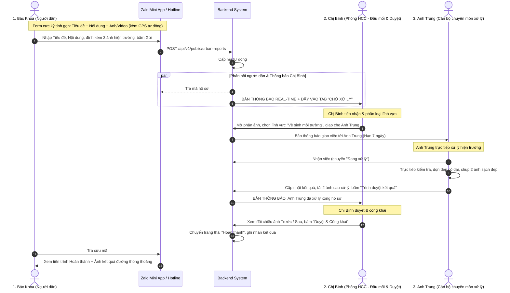
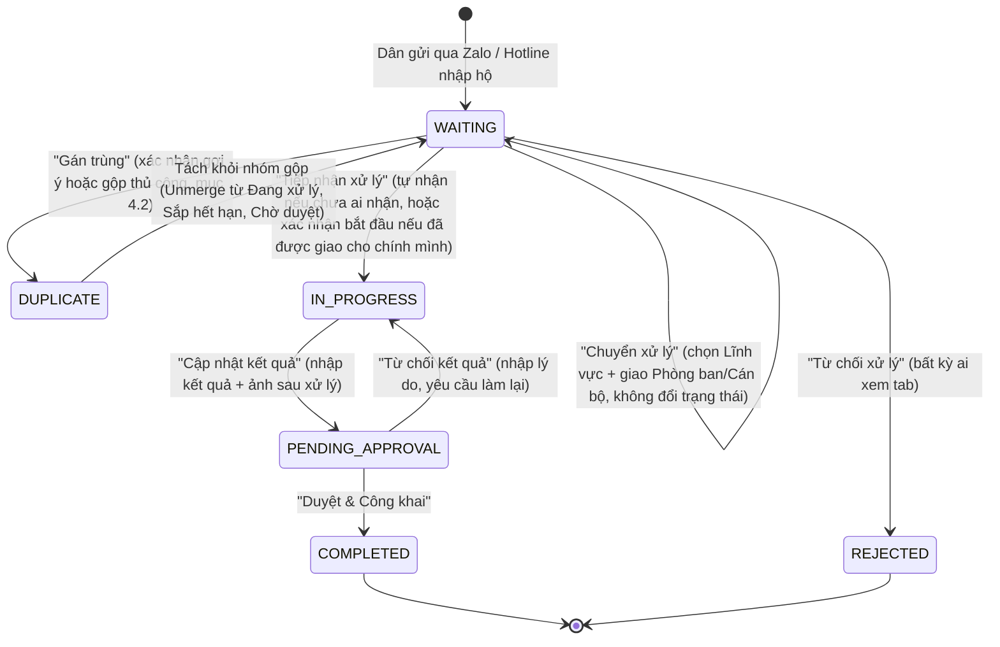

# TÀI LIỆU THIẾT KẾ KỸ THUẬT CHI TIẾT (CHUẨN HÓA UUID & REST API)

# PHÂN HỆ: DỊCH VỤ ĐÔ THỊ SỐ (QUẢN LÝ PHẢN ÁNH HIỆN TRƯỜNG & DỊCH VỤ CÔNG DÂN)

---

## 📋 LỊCH SỬ THAY ĐỔI (CHANGELOG)

> Mỗi thay đổi nghiệp vụ so với bản thiết kế gốc được đánh dấu **tại chỗ** trong tài liệu bằng khối trích dẫn
> `> 🔄 CẬP NHẬT [ngày]` (sửa/thay quy tắc cũ) hoặc `> 🆕 MỚI [ngày]` (bổ sung thuần túy, không phá vỡ luồng cũ),
> đặt ngay sau bảng/đoạn liên quan — nội dung gốc **không bị xóa hay ghi đè**, chỉ được chú thích để FE dễ dàng dò ra
> chỗ nào đã đổi so với lần đọc trước.

| Ngày       | Nội dung thay đổi                                                                                                                                                                                                                                                                                                                                                                                                                                                                                                                                                                                                                                                                                                                                                                                                                                                    | Mục liên quan                                          |
| :--------- | :------------------------------------------------------------------------------------------------------------------------------------------------------------------------------------------------------------------------------------------------------------------------------------------------------------------------------------------------------------------------------------------------------------------------------------------------------------------------------------------------------------------------------------------------------------------------------------------------------------------------------------------------------------------------------------------------------------------------------------------------------------------------------------------------------------------------------------------------------------------- | :----------------------------------------------------- |
| 2026-08-12 | **Phân công nhiều cán bộ & nhiều phòng ban**: API `assign` đổi từ 1 phòng ban + 1 cán bộ (`departmentId`, `assignedUserId`) sang danh sách (`department_ids[]`, `assigned_user_ids[]`). Bất kỳ ai trong danh sách được giao đều có thể `start-processing`/`submit-result`. Bỏ 2 cột `assigned_department_id`/`assigned_user_id` trên `urban_reports`, thay bằng 2 bảng liên kết `urban_report_assigned_departments`/`urban_report_assigned_users`.                                                                                                                                                                                                                                                                                                                                                                                                                   | §2.2, §3.1, §3.2/3.3, §4.3.2, §5.2.6, §6 Lưu ý 5       |
| 2026-08-12 | **Chọn lĩnh vực ngay lúc tạo phản ánh**: thêm trường tùy chọn `field_id` vào API nộp phản ánh Zalo (`POST /public/urban-reports`) và tiếp nhận hộ qua hotline (`POST /urban-reports/manual-intake`). Không bắt buộc — hồ sơ vẫn có thể để trống `field_id` và chờ Chị Bình phân loại như luồng gốc.                                                                                                                                                                                                                                                                                                                                                                                                                                                                                                                                                                  | §5.1.1, §5.2.3                                         |
| 2026-08-12 | **Bổ sung `field_name` vào `GET /urban-reports/detail`**: trước đó endpoint chi tiết chỉ trả `field_id` (UUID), không kèm tên lĩnh vực để FE hiển thị — buộc FE phải tự gọi thêm `GET /urban-report-fields` rồi tự map. Nay trả kèm luôn `field_name` (đã lookup sẵn ở BE), giống cách `GET /urban-reports` (danh sách) đã làm từ trước.                                                                                                                                                                                                                                                                                                                                                                                                                                                                                                                             | §5.2.2                                                 |
| 2026-08-12 | **Bỏ auto-merge, thay bằng "Gợi ý gộp"**: team quyết định hệ thống **không còn tự động gộp** hồ sơ trùng nữa — rủi ro gộp nhầm 2 vụ việc khác nhau mà không ai để ý. Khi phát hiện ứng viên trùng (vẫn cùng 3 điều kiện AND cũ), hệ thống chỉ tạo một **gợi ý** (`urban_report_merge_suggestions`, trạng thái `PENDING`) gắn trên hồ sơ mới, hồ sơ vẫn giữ nguyên `NEW`. Cán bộ xem gợi ý trong `GET /urban-reports/detail` (`merge_suggestions[]`), rồi tự quyết: xác nhận bằng API `merge` sẵn có, hoặc bỏ qua bằng API mới `POST /urban-reports/merge-suggestions/dismiss`. Gộp bởi hệ thống hoàn toàn biến mất — chỉ còn gộp thủ công bởi cán bộ.                                                                                                                                                                                                                | §1.2, §4.2, §4.3, §5.2.13 (mới)                        |
| 2026-08-14 | **Gộp `NEW`/`DISTRIBUTING` thành một trạng thái duy nhất `WAITING` ("Chờ xử lý")** — BA phản hồi quy trình 8 trạng thái quá phức tạp, cán bộ khó theo dõi phải mở đúng tab mới thấy việc. Phản ánh mới (Zalo/hotline) giờ vào thẳng `WAITING`. **[v2, cùng ngày, sau khi rà lại 4 nút thao tác thật]**: `ACCEPT_INTAKE` **bị xóa hoàn toàn** (không chỉ "không đổi status" như v1) — chỉ còn `ASSIGN_OFFICER` ("Chuyển xử lý", vẫn `WAITING`) và `START_PROCESSING` ("Tiếp nhận xử lý", `WAITING`→`IN_PROGRESS`, nay tự động tự-giao-việc nếu hồ sơ chưa có ai nhận). `REJECT_REPORT` chỉ còn thực hiện được từ `WAITING`. `UNMERGE` trả hồ sơ về `WAITING` thay vì `NEW`. 2 mốc SLA (hạn tiếp nhận 24h, hạn xử lý 7 ngày) **giữ nguyên tách biệt như cũ** — quyết định (a), xem mục 4.4. Tab **"Tất cả"** được **khôi phục lại** (quyết định bỏ hôm qua đã bị hủy). | §1.1, §2.1, §2.2, §4.4, §5.2.1, §5.2.4, §5.2.6, §5.2.7 |
| 2026-08-14 | **[v3, cùng ngày]** Rà lại lần nữa theo mockup FE thật: thêm **2 API mới** và **giới hạn lại `reject`**. `POST /urban-reports/classify` ("Phân loại lĩnh vực") — chỉ sửa `field_id`/`priority`, không giao việc, không đổi `status`, chỉ dùng được khi `WAITING`. `POST /urban-reports/decline-processing` ("Từ chối xử lý") — khác `reject`: **không** chuyển `REJECTED`, chỉ xóa phân công hiện tại (nếu có) và giữ nguyên `WAITING`, để hồ sơ "quay lại" hàng chờ chung; bắt buộc lý do. `reject` ("Từ chối phản ánh") giờ **chỉ dùng được khi chưa phân loại** (`field_id IS NULL`) — một khi đã có lĩnh vực, chỉ còn `decline-processing` khả dụng, trả `409` nếu vẫn gọi `reject`.                                                                                                                                                                             | §2.2, §5.2.4 (mới), §5.2.5, §5.2.6 (mới), §5.2.7       |

---

## MỤC LỤC

1. [Ví dụ minh họa thực tế ngoài đời thực (Happy Case 3 Nhân vật & Các Tình huống Thực tế)](#1-ví-dụ-minh-họa-thực-tế-ngoài-đời-thực-happy-case-3-nhân-vật--các-tình-huống-thực-tế)
   - 1.1. Luồng chuẩn mực (Happy Case) — Quy trình 3 người tinh gọn
   - 1.2. Mô phỏng chi tiết: Tình huống Gộp phản ánh (Merge) & Tách khỏi nhóm (Unmerge)
   - 1.3. Các tình huống thực tế đặc thù khác (Hotline, Sắp hết hạn, Từ chối kết quả)
2. [Nghiệp vụ hệ thống & Mô hình trạng thái (Business Flow & State Machine)](#2-nghiệp-vụ-hệ-thống--mô-hình-trạng-thái-business-flow--state-machine)
   - 2.1. Sơ đồ luồng tổng quan (Core Flow Diagram)
   - 2.2. Vòng đời và bảng chuyển đổi trạng thái (State Transitions & Guards)
   - 2.3. Ma trận phân quyền RBAC
3. [Thiết kế Cơ sở dữ liệu (Database Schema — Chuẩn 100% UUID)](#3-thiết-kế-cơ-sở-dữ-liệu-database-schema--chuẩn-100-uuid)
   - 3.1. Sơ đồ quan hệ thực thể (ERD với UUID)
   - 3.2. Bổ sung bảng `departments` và cập nhật bảng `users`
   - 3.3. Chi tiết DDL các bảng nghiệp vụ cốt lõi
4. [Thuật toán & Cơ chế kỹ thuật đặc thù](#4-thuật-toán--cơ-chế-kỹ-thuật-đặc-thù)
   - 4.1. Cơ chế sinh mã hồ sơ tự động dạng công văn `#PAHT.YYYYMMDD.NNNN`
   - 4.2. Thuật toán phát hiện và gộp phản ánh trùng lặp (Spatial-Temporal Deduplication)
   - 4.3. Cơ chế & Logic kỹ thuật khi "Tách khỏi nhóm" (Unmerge Lifecycle)
   - 4.4. Quản lý hạn xử lý SLA 07 ngày và Background Job cảnh báo trễ hạn
   - 4.5. Cơ chế thông báo tách rời (Decoupled Notification Architecture)
5. [Danh mục Thiết kế RESTful API Contracts & Bảng Tham số Chi tiết](#5-danh-mục-thiết-kế-restful-api-contracts--bảng-tham-số-chi-tiết)
   - 5.1. Nhóm API dành cho Người dân (Public Endpoints)
   - 5.2. Nhóm API dành cho Cán bộ & Quản trị (Officer Endpoints)
6. [**Kinh nghiệm Thực chiến & Lưu ý Sống còn cho Dev Team khi Code (Senior 20 Years)**](#6-kinh-nghiệm-thực-chiến--lưu-ý-sống-còn-cho-dev-team-khi-code-senior-20-years)
7. [Bảo mật & Vận hành Production](#7-bảo-mật--vận-hành-production)

---

## 1. VÍ DỤ MINH HỌA THỰC TẾ NGOÀI ĐỜI THỰC (HAPPY CASE 3 NHÂN VẬT & CÁC TÌNH HUỐNG THỰC TẾ)

### 1.1. Luồng chuẩn mực (Happy Case) — Quy trình 3 người tinh gọn

#### 👥 3 Nhân vật cốt lõi trong quy trình:

1. **Bác Nguyễn Đăng Khoa (Người dân)**: Sử dụng Zalo Mini App "Phường Phố Hiến" để gửi phản ánh hoặc gọi Hotline.
2. **Chị Trần Thị Bình (Chuyên viên Phòng Hành chính công)**: Đầu mối tiếp nhận, phân loại lĩnh vực, giao việc cho cán bộ chuyên môn và là người trực tiếp kiểm tra, phê duyệt kết quả cuối cùng để công khai cho người dân.
3. **Anh Nguyễn Thành Trung (Cán bộ Phòng Kinh tế, Hạ tầng và Đô thị)**: Cán bộ chuyên môn trực tiếp thụ lý, tự đi xử lý hiện trường, cập nhật kết quả kèm ảnh sau xử lý và gửi ngược lại cho Chị Bình.

---



---

#### ⏱️ Diễn biến chi tiết từng bước:

- **08:30:00 — Dân phát hiện sự cố**:
  Bác Nguyễn Đăng Khoa đi bộ qua tuyến đường Lê Đình Kiên thấy cỏ dại mọc tràn ra lòng đường hơn 1m gây che khuất tầm nhìn xe cộ.
- **08:32:00 — Dân gửi qua Zalo Mini App (Form siêu tinh gọn)**:
  - Bác Khoa mở Mini App Zalo "Phường Phố Hiến" $\rightarrow$ Chọn **"Gửi phản ánh"**.
  - Bác **không cần chọn danh mục phức tạp**. Form chỉ yêu cầu **3 thông tin cốt lõi**:
    1. **Tiêu đề**: _"Đường Lê Đình Kiên cỏ dại mọc vào hành lang đường mỗi bên hơn 1m"_
    2. **Nội dung**: _"Cây dại mọc che hết lối đi gây nguy hiểm cho người tham gia giao thông"_
    3. **Ảnh/Video**: Bác bấm chụp ngay **3 tấm ảnh hiện trường**.
  - Hệ thống tự động lấy tọa độ GPS `(20.654312, 106.052145)` và SĐT Zalo `0787022889`. Bác bấm **[Gửi phản ánh]**.
- **08:32:05 — Hệ thống tiếp nhận & Thông báo tức thì cho Chị Bình**:
  1. Backend cấp mã tự động: `#PAHT.20260729.0009` (lưu ID dạng `UUID`).
  2. Trả ngay mã cho Bác Khoa trên Zalo để theo dõi.
  3. **ĐỒNG THỜI**: Hệ thống phát thông báo real-time tới **Chị Trần Thị Bình (Phòng Hành chính công)** $\rightarrow$ Chuông góc phải nhảy số đỏ `(+1)`, kèm popup: _"Có phản ánh mới #PAHT.20260729.0009 tại Đường Lê Đình Kiên cần tiếp nhận"_. Hồ sơ nằm ở đầu Tab **"Chờ xử lý (1)"** 🔄 _(2026-08-14: trước đây là tab "Chờ tiếp nhận")_.
- **09:00:00 — Chị Bình Tiếp nhận, Phân loại lĩnh vực & Giao việc**:
  - Chị Bình mở chi tiết phản ánh: Xem ảnh, vị trí và mô tả của Bác Khoa.
  - Chị Bình bấm **[Tiếp nhận xử lý]**, chọn phân loại lĩnh vực: `Vệ sinh môi trường`.
  - Chị chọn đơn vị: `Phòng Kinh tế, Hạ tầng và Đô thị` $\rightarrow$ Chọn cán bộ xử lý: `Nguyễn Thành Trung`.
  - Hệ thống kích hoạt hạn SLA xử lý 07 ngày: Đến `05/08/2026 14:54`.
- **09:05:00 — Anh Trung trực tiếp thụ lý & xử lý hiện trường**:
  - Anh Trung nhận thông báo trên hệ thống: _"Bạn được giao xử lý phản ánh #PAHT.20260729.0009"_.
  - Anh Trung mở hồ sơ, xác nhận tiếp nhận việc $\rightarrow$ Trạng thái chuyển sang **"Đang xử lý"** (`Còn 6 ngày 23 giờ`).
  - Anh Trung trực tiếp ra hiện trường kiểm tra, tiến hành cắt tỉa cỏ dại, thu gom phế thải và chụp lại **2 bức ảnh mặt đường đã được dọn sạch đẹp**.
- **14:00:00 hôm sau — Anh Trung cập nhật kết quả & Bắn thông báo về Chị Bình**:
  - Anh Trung mở lại hồ sơ trên hệ thống, vào Tab **Kết quả xử lý**:
    - Nhập nội dung: _"Đã phát quang cây cỏ dại lấn đường, thu gom phế thải, đảm bảo an toàn giao thông"_.
    - Tải lên 2 ảnh sau khi xử lý.
    - Bấm nút **[Trình duyệt kết quả]**.
  - Trạng thái chuyển sang **"Chờ duyệt kết quả"**.
  - **Hệ thống tự động gửi thông báo real-time quay lại cho Chị Bình**: _"Cán bộ Nguyễn Thành Trung đã cập nhật kết quả xử lý phản ánh #PAHT.20260729.0009, chờ bạn phê duyệt"_.
- **15:00:00 — Chị Bình Duyệt kết quả & Công khai**:
  - Chị Bình mở Tab **"Chờ duyệt kết quả (1)"**, đối chiếu ảnh Trước xử lý vs ảnh Sau xử lý của Anh Trung.
  - Thấy tuyến đường đã thông thoáng, Chị Bình bấm nút **[Duyệt & Công khai]**.
  - Trạng thái chuyển sang **"Hoàn thành"** (hoàn thành trước hạn 5 ngày).
- **15:01:00 — Người dân nhận kết quả**:
  - Bác Khoa mở Zalo tra cứu mã `#PAHT.20260729.0009` thấy trạng thái đã **Hoàn thành**, xem ảnh kết quả đường sạch đẹp và đánh giá "Rất hài lòng".

---

### 1.2. MÔ PHỎNG CHI TIẾT: TÌNH HUỐNG GỘP PHẢN ÁNH (MERGE) & TÁCH KHỎI NHÓM (UNMERGE)

#### 🎬 Bối cảnh:

- **08:30**: **Bác Khoa** gửi phản ánh `#PAHT.20260725.0002`: _"Cành cây gãy chắn đường Lê Đình Kiên"_. Hồ sơ được giao cho Anh Trung đang xử lý.
- **08:45**: **Chị Mai** đi qua đoạn đường đó, cũng thấy cành cây và gửi phản ánh `#PAHT.20260725.0003`: _"Cây đổ lấn đường Lê Đình Kiên"_.

---

#### 📌 KỊCH BẢN A: HỆ THỐNG GỢI Ý GỘP, CÁN BỘ XÁC NHẬN

> 🔄 **CẬP NHẬT 2026-08-12**: Team quyết định bỏ **auto-merge** (hệ thống tự gộp mà không ai duyệt) vì rủi ro gộp nhầm hai vụ việc khác nhau mà không ai để ý cho tới khi dân khiếu nại. Kịch bản dưới đây mô tả hành vi mới: hệ thống chỉ **gợi ý**, cán bộ luôn là người quyết định cuối cùng có gộp hay không (xem đánh giá ảnh hưởng đầy đủ ở mục 4.2).

1. **Hệ thống phát hiện & gợi ý**:
   - Backend nhận tọa độ GPS thấy cách vị trí Bác Khoa chỉ 12 mét, gửi trong vòng 24 giờ, và nội dung tiêu đề tương đồng cao $\rightarrow$ Cả 3 điều kiện đều thỏa (xem thuật toán chi tiết ở mục 4.2) nên hệ thống tạo một **gợi ý gộp** gắn trên hồ sơ `#0003`, trỏ tới `#0002`. Hồ sơ `#0003` **vẫn giữ nguyên trạng thái `WAITING`** 🔄 _(2026-08-14, trước đây `NEW`)_ - chưa có gì bị gộp.
   - **Đồng thời**, hệ thống bắn thông báo real-time cho Chị Bình: _"Hệ thống phát hiện phản ánh #PAHT.20260725.0003 có khả năng trùng với hồ sơ #PAHT.20260725.0002 (độ tin cậy cao). Vui lòng kiểm tra và xác nhận."_
2. **Cán bộ xác nhận (Chị Bình)**:
   - Chị Bình mở hồ sơ `#0003`, thấy mục **"Gợi ý gộp"** trỏ tới `#0002`, đối chiếu ảnh và vị trí thấy đúng là cùng một cây gãy $\rightarrow$ bấm **[Xác nhận gộp]** (gọi lại đúng API `merge` cán bộ vẫn dùng để gộp thủ công) $\rightarrow$ `#0003` mới thật sự chuyển sang `DUPLICATE`.
   - Nếu Chị Bình thấy sai (2 vụ việc khác nhau), bấm **[Bỏ qua gợi ý]** thay vì gộp - xem Kịch bản B.
3. **Trải nghiệm người dân (Chị Mai)**:
   - Trước khi Chị Bình xác nhận: Chị Mai tra cứu `#0003` vẫn thấy trạng thái bình thường **"Chờ xử lý"**, không có gì khác biệt.
   - Sau khi xác nhận: Chị Mai tra cứu mã `#0003` trên Zalo thấy: _"Phản ánh của bạn đã được tiếp nhận và gộp cùng vụ việc với hồ sơ #PAHT.20260725.0002. Cán bộ đang xử lý."_
4. **Phía Cán bộ (Anh Trung)**:
   - Anh Trung mở hồ sơ `#0002`, tại tab **"Phản ánh trùng (1)"** thấy phản ánh `#0003` của Chị Mai $\rightarrow$ Chỉ cần xử lý 1 lần cho hồ sơ `#0002`.
5. **Kết quả hoàn thành**:
   - Khi Chị Bình duyệt hoàn thành hồ sơ `#0002`, hệ thống tự động cập nhật hoàn thành cho cả `#0003`. Cả Bác Khoa và Chị Mai cùng nhận được ảnh nghiệm thu đường đã sạch đẹp!

---

#### 📌 KỊCH BẢN B: BỎ QUA GỢI Ý, HOẶC TÁCH KHỎI NHÓM (UNMERGE) NẾU ĐÃ TỪNG GỘP NHẦM

- **Trường hợp đơn giản nhất** (chưa xác nhận gộp): Chị Bình xem gợi ý ở hồ sơ `#0003`, thấy không cùng vụ việc $\rightarrow$ bấm **[Bỏ qua gợi ý]**. Không có gì bị thay đổi, cả hai hồ sơ vẫn độc lập như cũ - không cần tới thao tác tách nhóm bên dưới.
- **Trường hợp đã lỡ xác nhận gộp** (hoặc gộp thủ công từ trước, không qua gợi ý): Khi Anh Trung đang xử lý (ở Tab **"Sắp hết hạn"**) hoặc Chị Bình chuẩn bị duyệt (ở Tab **"Chờ duyệt kết quả"**), mở Tab con **"Phản ánh trùng"** xem kỹ ảnh của Chị Mai thì phát hiện:
  - `#0002` (Bác Khoa): Cây gãy ở **đầu đường** Lê Đình Kiên.
  - `#0003` (Chị Mai): Cây gãy ở **trong ngõ 12** Lê Đình Kiên (2 cây khác nhau, cần 2 tổ xử lý).
- Cán bộ bấm nút **[Tách khỏi nhóm]** tại thẻ `#0003`.
- **Kết quả sau khi tách**:
  1. **Hồ sơ `#0002` (Bác Khoa)**: Tiếp tục xử lý cho xong cây ở đầu đường.
  2. **Hồ sơ `#0003` (Chị Mai)**: Trở thành **phản ánh độc lập hoàn toàn**, chuyển về `WAITING` (**Chờ xử lý**) 🔄 _(2026-08-14, trước đây là `NEW`)_, hạn tiếp nhận được cấp lại 24h. Chị Bình nhận thông báo để phân phối xử lý cây trong ngõ 12.
  3. **Hai hồ sơ có 2 kết quả xử lý và ảnh nghiệm thu riêng biệt cho 2 người dân.**

---

## 2. NGHIỆP VỤ HỆ THỐNG & MÔ HÌNH TRẠNG THÁI (BUSINESS FLOW & STATE MACHINE)

### 2.1. Sơ đồ trạng thái (State Machine)

> 🔄 **CẬP NHẬT 2026-08-14 (v2 — sau khi rà lại với BA theo 4 nút thao tác thật trên tab "Chờ xử lý")**: `NEW`
> ("Chờ tiếp nhận") và `DISTRIBUTING` ("Chờ phân phối") **không còn tồn tại**. Phản ánh mới vào thẳng `WAITING`
> ("Chờ xử lý"). Hành động `ACCEPT_INTAKE` (tiếp nhận, xác nhận thuộc thẩm quyền) **bị loại bỏ hoàn toàn**, không chỉ
> "không đổi status" như bản v1 hôm qua — rà lại 4 nút thật trên UI (Từ chối xử lý / Gán trùng / Tiếp nhận xử lý /
> Chuyển xử lý) thì không có nút "chỉ xác nhận tiếp nhận" riêng:
>
> - **"Tiếp nhận xử lý"** = cán bộ đang xem tab tự nhận phần việc về mình **và bắt đầu xử lý ngay** — gộp 2 bước cũ
>   (tiếp nhận + tự giao việc + bắt đầu) thành 1 hành động, 1 lần bấm, `WAITING → IN_PROGRESS`.
> - **"Chuyển xử lý"** (= `ASSIGN_OFFICER` cũ, không đổi tên/logic) = giao cho phòng ban/cán bộ khác, **không đổi
>   trạng thái**, vẫn `WAITING` cho tới khi phòng ban/cán bộ được chuyển tự bấm "Tiếp nhận xử lý".
>
> Nói cách khác: chỉ còn **một** hành động đưa hồ sơ ra khỏi `WAITING` để bắt đầu làm — `START_PROCESSING` ("Tiếp
> nhận xử lý") — nhưng hành động này giờ **tự động giao việc cho chính người bấm nếu hồ sơ chưa giao cho ai**, thay
> vì bắt buộc phải qua `ASSIGN_OFFICER` trước như thiết kế gốc.



---

### 2.2. Bảng chuyển đổi trạng thái & Điều kiện nghiệp vụ

> 🔄 **CẬP NHẬT 2026-08-14 (v2)**: `ACCEPT_INTAKE` bị xóa khỏi bảng — không còn là một hành động độc lập.
> `START_PROCESSING` ("Tiếp nhận xử lý") được viết lại để nhận thêm vai trò tự-giao-việc khi hồ sơ chưa được ai nhận.
>
> 🆕 **(v3, cùng ngày)**: thêm `CLASSIFY_REPORT` ("Phân loại lĩnh vực") và `DECLINE_PROCESSING` ("Từ chối xử lý").
> `REJECT_REPORT` ("Từ chối phản ánh") giờ **chỉ dùng được khi chưa phân loại** — bảng dưới cập nhật lại guard.

| Trạng thái nguồn   | Hành động            | Trạng thái đích       | Người thực hiện                                                 | Điều kiện nghiệp vụ (Guards)                                                                                                                                                                                                                                                                                                                                                                                       |
| :----------------- | :------------------- | :-------------------- | :-------------------------------------------------------------- | :----------------------------------------------------------------------------------------------------------------------------------------------------------------------------------------------------------------------------------------------------------------------------------------------------------------------------------------------------------------------------------------------------------------- |
| `[START]`          | `SUBMIT_REPORT`      | `WAITING`             | Người dân / Hotline                                             | Nhập Tiêu đề, Nội dung, có ít nhất 1 ảnh/video. Nguồn: `ZALO` hoặc `HOTLINE`.                                                                                                                                                                                                                                                                                                                                      |
| `WAITING`          | `CLASSIFY_REPORT`    | `WAITING` (không đổi) | Bất kỳ cán bộ nào xem tab "Chờ xử lý" ("Phân loại lĩnh vực")    | 🆕 Chỉ sửa `field_id` (bắt buộc) và `priority` (tùy chọn) - **không** đụng tới phân công/trạng thái. Dùng khi cán bộ chỉ muốn gắn nhãn lĩnh vực trước, chưa quyết định giao cho ai.                                                                                                                                                                                                                                |
| `WAITING`          | `REJECT_REPORT`      | `REJECTED`            | Bất kỳ cán bộ nào xem tab "Chờ xử lý" ("Từ chối phản ánh")      | Bắt buộc nhập lý do từ chối để công khai cho dân. 🔄 _2026-08-14 (v3)_: chỉ gọi được khi `field_id IS NULL` (chưa phân loại) - nếu đã phân loại, trả `409`, dùng `DECLINE_PROCESSING` thay thế.                                                                                                                                                                                                                    |
| `WAITING`          | `DECLINE_PROCESSING` | `WAITING` (không đổi) | Chỉ cán bộ đang nằm trong `assigned_user_ids` hiện tại          | 🆕 Bắt buộc nhập lý do. Khác `REJECT_REPORT`: **không** đóng hồ sơ, chỉ xóa toàn bộ phân công phòng ban/cán bộ hiện tại (nếu có) rồi để hồ sơ quay lại hàng chờ chung - `field_id` đã phân loại **vẫn giữ nguyên**. Người không được giao nhận `403`.                                                                                                                                                              |
| `WAITING`          | `ASSIGN_OFFICER`     | `WAITING` (không đổi) | Bất kỳ cán bộ đã đăng nhập xem tab "Chờ xử lý" ("Chuyển xử lý") | Phải phân loại `field_id` và gán **danh sách** `department_ids[]`/`assigned_user_ids[]` (một hoặc nhiều phòng ban/cán bộ phối hợp). Cấp `sla_deadline` (7 ngày) nếu chưa có. Có thể gọi lại nhiều lần (chuyển tiếp lần 2, ghi đè danh sách được giao). Nếu không truyền `priority` thì giữ nguyên mức ưu tiên hiện tại.                                                                                            |
| `WAITING`          | `START_PROCESSING`   | `IN_PROGRESS`         | Người bấm "Tiếp nhận xử lý"                                     | 🆕 **2 nhánh**: **(1)** Hồ sơ **chưa có ai được giao** → tự động giao cho chính người bấm (dùng `field_id` đã có, hoặc bắt buộc truyền nếu còn trống; phòng ban = phòng ban của người bấm), cấp `sla_deadline` nếu chưa có, rồi chuyển `IN_PROGRESS` ngay. **(2)** Hồ sơ **đã được giao** (qua "Chuyển xử lý") → chỉ người **nằm trong danh sách được giao** mới bấm được, xác nhận bắt đầu, chuyển `IN_PROGRESS`. |
| `IN_PROGRESS`      | `SUBMIT_RESULT`      | `PENDING_APPROVAL`    | Người trong danh sách được giao                                 | Nhập kết quả + Tải ảnh sau xử lý.                                                                                                                                                                                                                                                                                                                                                                                  |
| `PENDING_APPROVAL` | `REJECT_RESULT`      | `IN_PROGRESS`         | Cán bộ có quyền `report.approve`                                | Bắt buộc nhập lý do chưa đạt để cán bộ xử lý khắc phục.                                                                                                                                                                                                                                                                                                                                                            |
| `PENDING_APPROVAL` | `APPROVE_RESULT`     | `COMPLETED`           | Cán bộ có quyền `report.approve`                                | Đóng hồ sơ, công khai kết quả cho dân, dừng tính SLA.                                                                                                                                                                                                                                                                                                                                                              |
| `DUPLICATE`        | `UNMERGE`            | `WAITING`             | Cán bộ đang xử lý hồ sơ chính                                   | Chỉ người nằm trong danh sách cán bộ được giao của hồ sơ chính mới được tách trong giai đoạn hiện tại. Bắt buộc nhập `note` lý do tách. Reset `field_id`, xóa toàn bộ liên kết phân công phòng ban/cán bộ, `priority` về mặc định; khôi phục hạn tiếp nhận và đẩy về `WAITING`.                                                                                                                                    |

> ⚠️ **Câu hỏi cần bạn chốt trước khi code**: `REJECT_RESULT`/`APPROVE_RESULT` hiện **không giới hạn ai được duyệt** —
> bất kỳ ai có quyền `report.approve` cũng duyệt được, không có khái niệm "người chịu trách nhiệm duyệt hồ sơ này"
> riêng cho từng hồ sơ (khác với xử lý, vốn giới hạn đúng người được giao). Bạn có muốn thêm ràng buộc tương tự (chỉ
> người tiếp nhận/chuyển việc ban đầu mới được duyệt), hay giữ nguyên "ai có quyền cũng duyệt được"?

#### 💡 Nội dung "Tiến trình xử lý" chi tiết cho FE — 🆕 2026-08-14 (v2)

API `GET /urban-reports/detail` → `timeline[]` trả về **1 dòng cho mỗi hành động**, đã có sẵn các trường sau (không đổi
payload, bảng dưới liệt kê rõ dòng nào ứng với hành động nào để FE biết lấy field nào hiển thị gì):

| `action_name`              | Tên hiển thị (label) trên tiến trình | `note` chứa gì                                                           | Các trường khác cần dùng                                                                                                                                                                                                                                                               |
| :------------------------- | :----------------------------------- | :----------------------------------------------------------------------- | :------------------------------------------------------------------------------------------------------------------------------------------------------------------------------------------------------------------------------------------------------------------------------------- |
| `SUBMIT_REPORT`            | Tiếp nhận phản ánh                   | _(rỗng)_                                                                 | `actual_time` = lúc dân gửi                                                                                                                                                                                                                                                            |
| `REJECT_REPORT`            | Từ chối xử lý                        | **Lý do từ chối** (bắt buộc, hiển thị công khai cho dân qua API tra cứu) | `user_display_snapshot` = người từ chối, `actual_time`                                                                                                                                                                                                                                 |
| `MERGE_INTO_MASTER`        | Gán trùng                            | Lý do gộp (tùy chọn) + mã hồ sơ chính                                    | `user_display_snapshot`, `actual_time`; xem thêm `duplicates[]`/`merge_suggestions[]` ở API chi tiết                                                                                                                                                                                   |
| `ASSIGN_OFFICER`           | Chuyển đơn vị xử lý                  | Ghi chú chỉ đạo (tùy chọn)                                               | `user_display_snapshot` = **người chuyển**, `actual_time` = **thời gian chuyển**; lĩnh vực/phòng ban/cán bộ nhận đọc từ `field_name`/`assigned_departments[]`/`assigned_users[]` ở API chi tiết (timeline chỉ ghi _ai chuyển lúc nào_, không lặp lại danh sách được giao trong `note`) |
| `START_PROCESSING`         | Tiếp nhận xử lý                      | Ghi chú (tùy chọn)                                                       | `user_display_snapshot` = **người tiếp nhận** (chính là người sẽ xử lý), `actual_time` = **thời gian tiếp nhận**                                                                                                                                                                       |
| `SUBMIT_RESULT`            | Trình duyệt kết quả                  | **Nội dung kết quả xử lý** (copy từ `processing_result`)                 | `user_display_snapshot` = người trình, `actual_time` = thời gian trình duyệt                                                                                                                                                                                                           |
| `REJECT_RESULT`            | Từ chối kết quả                      | **Lý do từ chối kết quả** (bắt buộc)                                     | `user_display_snapshot` = **người từ chối**, `actual_time` = **thời gian từ chối**                                                                                                                                                                                                     |
| `APPROVE_RESULT`           | Duyệt & công khai                    | Ý kiến đánh giá (tùy chọn)                                               | `user_display_snapshot` = **người duyệt**, `actual_time` = **thời gian duyệt**                                                                                                                                                                                                         |
| `UNMERGE_DUPLICATE`        | Tách phản ánh trùng                  | Lý do tách (bắt buộc) + mã hồ sơ vừa tách ra                             | `user_display_snapshot`, `actual_time`                                                                                                                                                                                                                                                 |
| `RESTORE_TO_NEW`           | Tách khỏi nhóm                       | Lý do tách (bắt buộc) + mã hồ sơ chính cũ                                | `user_display_snapshot`, `actual_time`                                                                                                                                                                                                                                                 |
| `AUTO_COMPLETE_CHILD`      | Tự động hoàn thành theo hồ sơ chính  | Mã hồ sơ chính vừa được duyệt                                            | `actual_time`, `user_display_snapshot = null` (hệ thống)                                                                                                                                                                                                                               |
| `SUGGEST_MERGE`            | Gợi ý gộp phản ánh trùng             | Mã hồ sơ nghi trùng + khoảng cách (m)                                    | `actual_time`, `user_display_snapshot = null` (hệ thống)                                                                                                                                                                                                                               |
| `DISMISS_MERGE_SUGGESTION` | Bỏ qua gợi ý gộp                     | Xác nhận không phải cùng vụ việc                                         | `user_display_snapshot`, `actual_time`                                                                                                                                                                                                                                                 |

**Cách nhóm hiển thị theo trạng thái** (đề xuất, không bắt buộc FE phải làm đúng y hệt, nhưng khuyến nghị để nhất quán
với tên tab hiện tại):

```
● Chờ xử lý
    Thời hạn tiếp nhận: ...  (24h kể từ SUBMIT_REPORT, chỉ hiển thị khi sla_deadline = null - mục 4.4)
    Thời hạn xử lý: ...      (7 ngày kể từ ASSIGN_OFFICER hoặc START_PROCESSING, hiển thị khi đã có sla_deadline)

    (0 hoặc nhiều dòng ASSIGN_OFFICER, nếu bị "Chuyển xử lý" nhiều lần)
    └─ Chuyển đơn vị xử lý: <actual_time> — <user_display_snapshot> → Lĩnh vực: <field_name>, Phòng ban: <assigned_departments[]>, Cán bộ: <assigned_users[]>

● Đang xử lý
    └─ Tiếp nhận xử lý: <actual_time START_PROCESSING> — <user_display_snapshot>

● Chờ duyệt kết quả
    └─ Trình duyệt kết quả: <actual_time SUBMIT_RESULT> — <user_display_snapshot> — "<processing_result>"

● Hoàn thành / (quay lại Đang xử lý nếu bị từ chối)
    └─ Duyệt & công khai: <actual_time APPROVE_RESULT> — <user_display_snapshot> — "<approval_note>"
    hoặc
    └─ Từ chối kết quả: <actual_time REJECT_RESULT> — <user_display_snapshot> — "<reject_reason>"
```

Khác với bản v1 hôm qua: **không còn 2 dòng con "Tiếp nhận"/"Giao việc" cố định dưới 1 mục "Chờ xử lý"** — vì
`ACCEPT_INTAKE` không còn tồn tại. Mục "Chờ xử lý" giờ có **0 đến nhiều dòng `ASSIGN_OFFICER`** (mỗi lần "Chuyển xử
lý" là 1 dòng, có thể chuyển đi chuyển lại nhiều lần trước khi ai đó bấm "Tiếp nhận xử lý"), và dòng `START_PROCESSING`
("Tiếp nhận xử lý") đánh dấu điểm chuyển sang mục "Đang xử lý". Nếu hồ sơ bị `REJECT_REPORT` hoặc gộp (`DUPLICATE`)
ngay từ `WAITING` mà chưa từng bị "Chuyển xử lý" lần nào, mục "Chờ xử lý" chỉ có đúng 1 dòng con tương ứng
(Từ chối / Gán trùng), không có dòng `ASSIGN_OFFICER` nào.

---

### 2.3. Ma trận phân quyền RBAC & Danh mục Quyền (Roles & Permissions Matrix)

Quy chuẩn phân quyền tuân thủ 100% theo kiến trúc Keycloak của hệ thống Phố Hiến:

- **Action Roles** (`<module>.<object>.<action>`): Là quyền nguyên tử gắn với từng endpoint/hành động.
- **Composite Roles** (`<subsystem>-<kind>`): Là nhóm quyền chức danh được gán trực tiếp cho cán bộ. Khi đăng nhập, Keycloak sẽ tự động làm phẳng (flatten) composite roles thành danh sách action roles trong JWT Token.

#### 📊 Bảng Ma trận Phân quyền (Permission Matrix):

| Action Role                           | Ý nghĩa hành động                                                                                            | Recv (Tiếp nhận) | Hndl (Xử lý) | Appr (Phê duyệt) | Supv (Giám sát) | Mngr (Quản trị) |
| :------------------------------------ | :----------------------------------------------------------------------------------------------------------- | :--------------: | :----------: | :--------------: | :-------------: | :-------------: |
| `urban-services.report.view`          | Xem danh sách & chi tiết phản ánh                                                                            |      **x**       |    **x**     |      **x**       |      **x**      |      **x**      |
| `urban-services.report.view-history`  | Xem lịch sử tiến trình & audit log                                                                           |      **x**       |    **x**     |      **x**       |      **x**      |      **x**      |
| `urban-services.report.receive`       | Tiếp nhận hộ phản ánh qua hotline (`manual-intake`) 🔄 _2026-08-14: bỏ `accept-intake`, đã xóa_              |      **x**       |              |                  |                 |      **x**      |
| `urban-services.report.assign`        | Chuyển xử lý: phân loại lĩnh vực & giao cán bộ khác (`assign`)                                               |      **x**       |              |                  |                 |      **x**      |
| `urban-services.report.process`       | Tiếp nhận xử lý: tự nhận hoặc xác nhận bắt đầu (`start-processing`) 🔄 _2026-08-14: nay gồm cả tự-giao-việc_ |                  |    **x**     |                  |                 |      **x**      |
| `urban-services.report.submit-result` | Cập nhật kết quả & ảnh sau xử lý (`submit-result`)                                                           |                  |    **x**     |                  |                 |      **x**      |
| `urban-services.report.approve`       | Phê duyệt kết quả & công khai (`approve`)                                                                    |                  |              |      **x**       |                 |      **x**      |
| `urban-services.report.reject`        | Từ chối phản ánh / Từ chối kết quả (`reject`, `reject-result`)                                               |      **x**       |              |      **x**       |                 |      **x**      |
| `urban-services.report.merge`         | Gộp / Tách phản ánh trùng (`merge`, `unmerge`)                                                               |      **x**       |    **x**     |      **x**       |                 |      **x**      |
| `urban-services.report.comment`       | Gửi bình luận trao đổi nội bộ (`comments`)                                                                   |      **x**       |    **x**     |      **x**       |      **x**      |      **x**      |
| `urban-services.field.manage`         | Quản lý danh mục lĩnh vực phản ánh                                                                           |                  |              |                  |                 |      **x**      |
| `urban-services.procedure.manage`     | Quản lý danh mục thủ tục hành chính                                                                          |                  |              |                  |                 |      **x**      |
| `urban-services.report.export`        | Xuất báo cáo thống kê SLA và tiến độ                                                                         |                  |              |                  |      **x**      |      **x**      |

> **Chiến lược áp dụng thực tế:**
>
> - **Giai đoạn hiện tại chưa áp dụng RBAC theo action role**: mọi tài khoản có JWT hợp lệ đều được phép gọi các API nội bộ. Bảng bên trên là ma trận mục tiêu để chốt và bật ở giai đoạn sau; các guard nghiệp vụ theo trạng thái, assignee và dữ liệu hồ sơ vẫn bắt buộc thực thi ngay.
> - Giống như module **Market / Food Safety** và **Flood Events**, toàn bộ Action Roles và Composite Roles này được khai báo trước trong bảng ma trận và từ điển hằng số hệ thống (`auth.constants.ts`).
> - Hiện tại, toàn bộ các route nội bộ được bảo vệ bởi **Global AuthGuard** (bắt buộc JWT token hợp lệ, ngoại trừ các route `@Public()` cho người dân). Việc gắn `@RequireRole(...)` cứng trên từng endpoint sẽ được kích hoạt đồng bộ khi cấu hình Realm trên Keycloak được triển khai hoàn chỉnh.

---

## 3. THIẾT KẾ CƠ SỞ DỮ LIỆU (DATABASE SCHEMA — CHUẨN 100% UUID)

### 3.1. Sơ đồ quan hệ thực thể (ERD với UUID)

> 🔄 **CẬP NHẬT 2026-08-12**: Quan hệ `DEPARTMENTS ||--o{ URBAN_REPORTS : "assigned_department"` và
> `USERS ||--o{ URBAN_REPORTS : "assigned_officer"` (1 phòng ban - 1 cán bộ mỗi hồ sơ) đã đổi thành **nhiều-nhiều**
> qua 2 bảng liên kết mới `URBAN_REPORT_ASSIGNED_DEPARTMENTS`/`URBAN_REPORT_ASSIGNED_USERS` (xem cuối sơ đồ), vì một
> hồ sơ giờ có thể được giao cho nhiều phòng ban phối hợp và nhiều cán bộ cùng lúc. 2 cột
> `assigned_department_id`/`assigned_user_id` cũ trên `URBAN_REPORTS` bên dưới **không còn tồn tại**.

```mermaid
erDiagram
    DEPARTMENTS ||--o{ USERS : "has_members"
    DEPARTMENTS ||--o{ URBAN_REPORT_ASSIGNED_DEPARTMENTS : "assigned_to"
    USERS ||--o{ URBAN_REPORT_ASSIGNED_USERS : "assigned_to"
    URBAN_REPORTS ||--o{ URBAN_REPORT_ASSIGNED_DEPARTMENTS : "routed_to"
    URBAN_REPORTS ||--o{ URBAN_REPORT_ASSIGNED_USERS : "routed_to"
    USERS ||--o{ URBAN_REPORT_TIMELINES : "action_by"
    USERS ||--o{ URBAN_REPORT_COMMENTS : "commented_by"

    URBAN_REPORT_FIELDS ||--o{ URBAN_REPORTS : "categorizes"

    URBAN_REPORTS ||--o{ URBAN_REPORT_ATTACHMENTS : "contains_media"
    URBAN_REPORTS ||--o{ URBAN_REPORT_TIMELINES : "has_history"
    URBAN_REPORTS ||--o{ URBAN_REPORT_COMMENTS : "has_internal_notes"
    URBAN_REPORTS ||--o{ URBAN_REPORT_DUPLICATES : "groups"
    %% 🆕 MỚI 2026-08-12 - thay cho hành vi auto-merge cũ (mục 4.2)
    URBAN_REPORTS ||--o{ URBAN_REPORT_MERGE_SUGGESTIONS : "flagged_as_duplicate"
    URBAN_REPORTS ||--o{ URBAN_REPORT_MERGE_SUGGESTIONS : "suggested_master_of"

    DEPARTMENTS {
        uuid id PK "gen_random_uuid()"
        varchar code UK
        varchar name
        uuid parent_id FK
        boolean is_active
        timestamptz created_at
        timestamptz updated_at
    }

    USERS {
        uuid id PK "Keycloak sub"
        varchar username
        varchar display_name
        varchar given_name
        varchar family_name
        varchar email
        uuid department_id FK "Liên kết phòng ban"
        varchar position_title "Chức vụ cán bộ"
        varchar phone_number "Số điện thoại"
        timestamptz last_seen_at
        timestamptz created_at
        timestamptz updated_at
    }

    URBAN_REPORT_FIELDS {
        uuid id PK "gen_random_uuid()"
        varchar code UK
        varchar name
        varchar icon
        int default_sla_hours
        boolean is_active
    }

    %% 🆕 MỚI 2026-08-12 - thay thế 2 cột assigned_department_id/assigned_user_id cũ trên URBAN_REPORTS
    URBAN_REPORT_ASSIGNED_DEPARTMENTS {
        uuid id PK "gen_random_uuid()"
        uuid report_id FK
        uuid department_id FK
        timestamptz assigned_at
        timestamptz created_at
    }

    URBAN_REPORT_ASSIGNED_USERS {
        uuid id PK "gen_random_uuid()"
        uuid report_id FK
        uuid user_id FK
        timestamptz assigned_at
        timestamptz created_at
    }

    URBAN_REPORTS {
        uuid id PK "gen_random_uuid()"
        varchar report_code UK "PAHT.YYYYMMDD.NNNN"
        varchar source "ZALO, HOTLINE"
        varchar priority "NORMAL, HIGH, URGENT"
        varchar status "WAITING, IN_PROGRESS, PENDING_APPROVAL, COMPLETED, DUPLICATE, REJECTED (🔄 2026-08-14: bỏ NEW, DISTRIBUTING - xem mục 2.1)"
        uuid field_id FK "Nullable khi dân gửi, bắt buộc khi cán bộ phân loại"
        varchar title
        text content
        varchar address
        numeric latitude
        numeric longitude
        varchar reporter_name
        varchar reporter_phone
        boolean is_anonymous
        timestamptz intake_deadline
        timestamptz sla_deadline
        timestamptz completed_at
        text processing_result
        uuid parent_report_id FK
        uuid created_by_user_id FK
        timestamptz created_at
        timestamptz updated_at
        timestamptz deleted_at
    }

    URBAN_REPORT_ATTACHMENTS {
        uuid id PK "gen_random_uuid()"
        uuid report_id FK
        varchar file_type "IMAGE, VIDEO"
        varchar phase "BEFORE_PROCESSING, AFTER_PROCESSING"
        varchar file_url
        varchar thumbnail_url
        int file_size
        varchar mime_type
        timestamptz created_at
    }

    URBAN_REPORT_TIMELINES {
        uuid id PK "gen_random_uuid()"
        uuid report_id FK
        varchar step_name
        varchar from_status
        varchar to_status
        varchar action_name
        uuid executed_by_user_id FK
        varchar user_display_snapshot "Snapshot: Tên - Chức vụ"
        varchar department_name_snapshot "Snapshot: Phòng ban"
        text note
        timestamptz actual_time
        timestamptz step_deadline
        timestamptz created_at
    }

    URBAN_REPORT_COMMENTS {
        uuid id PK "gen_random_uuid()"
        uuid report_id FK
        uuid user_id FK
        varchar user_full_name
        varchar department_name
        text message
        timestamptz created_at
    }

    URBAN_REPORT_DUPLICATES {
        uuid id PK "gen_random_uuid()"
        uuid master_report_id FK
        uuid duplicate_report_id FK
        uuid merged_by_user_id FK
        numeric distance_meters
        timestamptz merged_at
        varchar note
    }

    %% 🆕 MỚI 2026-08-12 - thay cho hành vi auto-merge cũ (mục 4.2)
    URBAN_REPORT_MERGE_SUGGESTIONS {
        uuid id PK "gen_random_uuid()"
        uuid report_id FK "hồ sơ được gắn cờ nghi trùng"
        uuid suggested_master_report_id FK "hồ sơ được đề xuất làm master"
        numeric distance_meters
        varchar status "PENDING, CONFIRMED, DISMISSED"
        uuid resolved_by_user_id FK
        timestamptz resolved_at
        timestamptz created_at
    }

    ADMINISTRATIVE_PROCEDURES {
        uuid id PK "gen_random_uuid()"
        varchar procedure_code UK
        varchar title
        uuid department_id FK
        text description
        varchar dvc_url
        varchar vneid_url
        boolean is_active
        timestamptz created_at
        timestamptz updated_at
    }
```



---

### 3.2. Bổ sung bảng `departments` & Cập nhật trực tiếp bảng `users`

```sql
-- 1. Bảng phòng ban / đơn vị (UUID PK)
CREATE TABLE departments (
    id UUID PRIMARY KEY DEFAULT gen_random_uuid(),
    code VARCHAR(50) UNIQUE NOT NULL, -- 'PHONG_HCC', 'PHONG_KT_HT_DT', 'UBND'
    name VARCHAR(255) NOT NULL,        -- 'Phòng Kinh tế, Hạ tầng và Đô thị'
    parent_id UUID REFERENCES departments(id) ON DELETE SET NULL,
    is_active BOOLEAN NOT NULL DEFAULT TRUE,
    created_at TIMESTAMPTZ NOT NULL DEFAULT NOW(),
    updated_at TIMESTAMPTZ NOT NULL DEFAULT NOW(),
    deleted_at TIMESTAMPTZ
);

CREATE INDEX idx_departments_code ON departments(code);

-- 2. Cập nhật trực tiếp bảng users hiện có (UUID FK)
ALTER TABLE users
ADD COLUMN department_id UUID REFERENCES departments(id) ON DELETE SET NULL,
ADD COLUMN position_title VARCHAR(150),  -- 'Phó Trưởng phòng', 'Chuyên viên', 'Phó Chủ tịch UBND'
ADD COLUMN phone_number VARCHAR(25);

CREATE INDEX idx_users_department_id ON users(department_id);
```

---

### 3.3. Chi tiết DDL các bảng nghiệp vụ cốt lõi (UUID)

> 🔄 **CẬP NHẬT 2026-08-12**: 2 cột `assigned_department_id`/`assigned_user_id` trên `urban_reports` (đánh dấu
> ~~gạch ngang~~ trong khối SQL bên dưới) **đã bị xóa** khỏi bảng thật, thay bằng 2 bảng liên kết mới
> `urban_report_assigned_departments`/`urban_report_assigned_users` ở cuối mục này — cho phép một hồ sơ được giao
> cho nhiều phòng ban và nhiều cán bộ cùng lúc thay vì chỉ 1-1 như thiết kế gốc.

```sql
-- Danh mục lĩnh vực phản ánh (UUID PK)
CREATE TABLE urban_report_fields (
    id UUID PRIMARY KEY DEFAULT gen_random_uuid(),
    code VARCHAR(50) UNIQUE NOT NULL, -- 'VE_SINH_MOI_TRUONG', 'CAY_XANH', 'AN_NINH_TRAT_TU', 'HA_TANG_DO_THI', 'NGAP_UNG'
    name VARCHAR(255) NOT NULL,
    icon VARCHAR(100),
    default_sla_hours INT NOT NULL DEFAULT 168, -- 7 ngày = 168 giờ
    is_active BOOLEAN NOT NULL DEFAULT TRUE,
    created_at TIMESTAMPTZ NOT NULL DEFAULT NOW(),
    updated_at TIMESTAMPTZ NOT NULL DEFAULT NOW()
);

-- Bảng chính phản ánh hiện trường (UUID PK)
CREATE TABLE urban_reports (
    id UUID PRIMARY KEY DEFAULT gen_random_uuid(),
    report_code VARCHAR(50) UNIQUE NOT NULL, -- '#PAHT.YYYYMMDD.NNNN'
    source VARCHAR(30) NOT NULL DEFAULT 'ZALO', -- 'ZALO', 'HOTLINE'
    priority VARCHAR(20) NOT NULL DEFAULT 'NORMAL', -- 'NORMAL', 'HIGH', 'URGENT'
    status VARCHAR(30) NOT NULL DEFAULT 'WAITING', -- 'WAITING', 'IN_PROGRESS', 'PENDING_APPROVAL', 'COMPLETED', 'DUPLICATE', 'REJECTED' (🔄 2026-08-14: bỏ 'NEW', 'DISTRIBUTING', default đổi từ 'NEW')
    field_id UUID REFERENCES urban_report_fields(id) ON DELETE RESTRICT, -- Nullable khi dân gửi, cán bộ phân loại sau
    title VARCHAR(500) NOT NULL,
    content TEXT NOT NULL,
    address VARCHAR(500) NOT NULL,
    latitude NUMERIC(10, 7) NOT NULL,
    longitude NUMERIC(10, 7) NOT NULL,
    reporter_name VARCHAR(150),
    reporter_phone VARCHAR(30),
    is_anonymous BOOLEAN NOT NULL DEFAULT FALSE,
    -- 🔄 XÓA 2026-08-12 (chuyển sang bảng liên kết nhiều-nhiều bên dưới):
    -- assigned_department_id UUID REFERENCES departments(id) ON DELETE SET NULL,
    -- assigned_user_id UUID REFERENCES users(id) ON DELETE SET NULL,
    intake_deadline TIMESTAMPTZ, -- Hạn tiếp nhận (24h)
    sla_deadline TIMESTAMPTZ,    -- Hạn xử lý toàn trình (7 ngày)
    completed_at TIMESTAMPTZ,
    processing_result TEXT,
    parent_report_id UUID REFERENCES urban_reports(id) ON DELETE SET NULL,
    created_by_user_id UUID REFERENCES users(id) ON DELETE SET NULL,
    created_at TIMESTAMPTZ NOT NULL DEFAULT NOW(),
    updated_at TIMESTAMPTZ NOT NULL DEFAULT NOW(),
    deleted_at TIMESTAMPTZ
);

CREATE INDEX idx_urban_reports_code ON urban_reports(report_code);
CREATE INDEX idx_urban_reports_status ON urban_reports(status);
CREATE INDEX idx_urban_reports_field_id ON urban_reports(field_id);
-- idx_urban_reports_assigned_user: XÓA 2026-08-12 cùng với cột assigned_user_id, xem index mới ở bảng liên kết bên dưới.
CREATE INDEX idx_urban_reports_created_at ON urban_reports(created_at DESC);
CREATE INDEX idx_urban_reports_coords ON urban_reports(latitude, longitude);

-- Bảng tệp tin đính kèm (UUID PK)
CREATE TABLE urban_report_attachments (
    id UUID PRIMARY KEY DEFAULT gen_random_uuid(),
    report_id UUID NOT NULL REFERENCES urban_reports(id) ON DELETE CASCADE,
    file_type VARCHAR(20) NOT NULL DEFAULT 'IMAGE', -- 'IMAGE', 'VIDEO'
    phase VARCHAR(30) NOT NULL DEFAULT 'BEFORE_PROCESSING', -- 'BEFORE_PROCESSING', 'AFTER_PROCESSING'
    file_url TEXT NOT NULL,
    thumbnail_url TEXT,
    file_size INT,
    mime_type VARCHAR(100),
    created_at TIMESTAMPTZ NOT NULL DEFAULT NOW()
);

-- Bảng lịch sử tiến trình xử lý (UUID PK - Snapshot Invariant)
CREATE TABLE urban_report_timelines (
    id UUID PRIMARY KEY DEFAULT gen_random_uuid(),
    report_id UUID NOT NULL REFERENCES urban_reports(id) ON DELETE CASCADE,
    step_name VARCHAR(150) NOT NULL,
    from_status VARCHAR(30),
    to_status VARCHAR(30) NOT NULL,
    action_name VARCHAR(100) NOT NULL,
    executed_by_user_id UUID REFERENCES users(id) ON DELETE SET NULL,
    user_display_snapshot VARCHAR(255),
    department_name_snapshot VARCHAR(255),
    note TEXT,
    actual_time TIMESTAMPTZ NOT NULL DEFAULT NOW(),
    step_deadline TIMESTAMPTZ,
    created_at TIMESTAMPTZ NOT NULL DEFAULT NOW()
);

-- Bảng trao đổi bình luận nội bộ (UUID PK)
CREATE TABLE urban_report_comments (
    id UUID PRIMARY KEY DEFAULT gen_random_uuid(),
    report_id UUID NOT NULL REFERENCES urban_reports(id) ON DELETE CASCADE,
    user_id UUID NOT NULL REFERENCES users(id) ON DELETE CASCADE,
    user_full_name VARCHAR(150) NOT NULL,
    department_name VARCHAR(255),
    message TEXT NOT NULL,
    created_at TIMESTAMPTZ NOT NULL DEFAULT NOW()
);

-- Bảng liên kết phản ánh trùng lặp (UUID PK)
CREATE TABLE urban_report_duplicates (
    id UUID PRIMARY KEY DEFAULT gen_random_uuid(),
    master_report_id UUID NOT NULL REFERENCES urban_reports(id) ON DELETE CASCADE,
    duplicate_report_id UUID NOT NULL REFERENCES urban_reports(id) ON DELETE CASCADE,
    merged_by_user_id UUID REFERENCES users(id) ON DELETE SET NULL,
    distance_meters NUMERIC(10, 2),
    merged_at TIMESTAMPTZ NOT NULL DEFAULT NOW(),
    note VARCHAR(255),
    CONSTRAINT uq_duplicate_pair UNIQUE(master_report_id, duplicate_report_id)
);

-- 🆕 MỚI 2026-08-12: thay cho hành vi auto-merge cũ (mục 4.2) - hệ thống chỉ
-- ghi một gợi ý ở đây, không tự đổi trạng thái/parent_report_id của report_id
-- nào cả. Cán bộ xác nhận qua API merge (status -> CONFIRMED) hoặc bỏ qua qua
-- API dismiss (status -> DISMISSED).
CREATE TABLE urban_report_merge_suggestions (
    id UUID PRIMARY KEY DEFAULT gen_random_uuid(),
    report_id UUID NOT NULL REFERENCES urban_reports(id) ON DELETE CASCADE,
    suggested_master_report_id UUID NOT NULL REFERENCES urban_reports(id) ON DELETE CASCADE,
    distance_meters NUMERIC(10, 2),
    status VARCHAR(20) NOT NULL DEFAULT 'PENDING', -- 'PENDING', 'CONFIRMED', 'DISMISSED'
    resolved_by_user_id UUID REFERENCES users(id) ON DELETE SET NULL,
    resolved_at TIMESTAMPTZ,
    created_at TIMESTAMPTZ NOT NULL DEFAULT NOW(),
    CONSTRAINT chk_merge_suggestion_status CHECK (status IN ('PENDING', 'CONFIRMED', 'DISMISSED')),
    CONSTRAINT chk_merge_suggestion_self CHECK (report_id <> suggested_master_report_id)
);

-- 🆕 MỚI 2026-08-12: Phân công nhiều phòng ban cho 1 hồ sơ (thay cho urban_reports.assigned_department_id cũ)
CREATE TABLE urban_report_assigned_departments (
    id UUID PRIMARY KEY DEFAULT gen_random_uuid(),
    report_id UUID NOT NULL REFERENCES urban_reports(id) ON DELETE CASCADE,
    department_id UUID NOT NULL REFERENCES departments(id) ON DELETE CASCADE,
    assigned_at TIMESTAMPTZ NOT NULL DEFAULT NOW(),
    created_at TIMESTAMPTZ NOT NULL DEFAULT NOW(),
    CONSTRAINT uq_urban_report_assigned_departments_report_department UNIQUE (report_id, department_id)
);

-- 🆕 MỚI 2026-08-12: Phân công nhiều cán bộ cho 1 hồ sơ (thay cho urban_reports.assigned_user_id cũ).
-- Bất kỳ ai có mặt trong bảng này cho report_id tương ứng đều được coi là "assignee" hợp lệ khi
-- gọi start-processing/submit-result (thay vì so sánh với đúng 1 assigned_user_id như thiết kế gốc).
CREATE TABLE urban_report_assigned_users (
    id UUID PRIMARY KEY DEFAULT gen_random_uuid(),
    report_id UUID NOT NULL REFERENCES urban_reports(id) ON DELETE CASCADE,
    user_id UUID NOT NULL REFERENCES users(id) ON DELETE CASCADE,
    assigned_at TIMESTAMPTZ NOT NULL DEFAULT NOW(),
    created_at TIMESTAMPTZ NOT NULL DEFAULT NOW(),
    CONSTRAINT uq_urban_report_assigned_users_report_user UNIQUE (report_id, user_id)
);

CREATE INDEX idx_urban_report_assigned_users_user_id ON urban_report_assigned_users(user_id);

-- Bảng tra cứu thủ tục hành chính (UUID PK)
CREATE TABLE administrative_procedures (
    id UUID PRIMARY KEY DEFAULT gen_random_uuid(),
    procedure_code VARCHAR(100) UNIQUE NOT NULL,
    title VARCHAR(500) NOT NULL,
    department_id UUID REFERENCES departments(id) ON DELETE SET NULL,
    description TEXT,
    dvc_url TEXT,
    vneid_url TEXT,
    is_active BOOLEAN NOT NULL DEFAULT TRUE,
    created_at TIMESTAMPTZ NOT NULL DEFAULT NOW(),
    updated_at TIMESTAMPTZ NOT NULL DEFAULT NOW()
);
```

---

## 4. THUẬT TOÁN & CƠ CHẾ KỸ THUẬT ĐẶC THÙ

### 4.1. Cơ chế sinh Mã Hồ sơ tự động `#PAHT.YYYYMMDD.NNNN`

- Sử dụng `INCR` nguyên tử của Redis để đảm bảo tính duy nhất và không bị trùng mã (race-condition proof):
  ```typescript
  const today = dayjs().format('YYYYMMDD');
  const currentSeq = await this.redisService.incr(`seq:urban_report:${today}`);
  const reportCode = `PAHT.${today}.${String(currentSeq).padStart(4, '0')}`;
  ```

### 4.2. Thuật toán phát hiện trùng lặp & Gợi ý gộp (Haversine & Time Window)

> 🔄 **CẬP NHẬT 2026-08-12 — Bỏ auto-merge, thay bằng "Gợi ý gộp"**: Bản gốc mục này chốt "Hệ thống thực hiện auto-merge thật sự". Sau khi thống nhất với team, quyết định đó **bị đảo ngược**: hệ thống không bao giờ tự gộp nữa, mà chỉ tạo một **gợi ý** cho cán bộ xác nhận hoặc bỏ qua.
>
> **Lý do đảo ngược**: dù đã yêu cầu khớp cả 3 điều kiện (AND) để giảm rủi ro, auto-merge vẫn có thể gộp nhầm hai vụ việc khác nhau ở cùng khu vực (ví dụ: 2 cây gãy khác nhau trong cùng con ngõ, xảy ra cùng ngày) mà **không ai chủ động xác nhận** - cơ chế "bắn thông báo để soát lại" chỉ là hậu kiểm, không ngăn được việc dữ liệu (trạng thái, phân công, SLA) đã bị thay đổi trước khi ai đó kịp phát hiện và tách ra. Xem đánh giá ảnh hưởng đầy đủ của thay đổi này ngay dưới đây.
>
> **Đánh giá ảnh hưởng**:
>
> - **Nghiệp vụ**: cán bộ (Chị Bình) có thêm 1 bước thao tác cho mỗi ứng viên trùng (xác nhận hoặc bỏ qua) thay vì hệ thống tự lo; đổi lại, không còn rủi ro 2 vụ việc thật sự khác nhau bị âm thầm gộp làm một, và không còn tình huống người dân B tra cứu thấy hồ sơ của mình đã "biến mất" vào hồ sơ khác mà chưa ai xác nhận là đúng.
> - **Kỹ thuật**: hồ sơ mới **luôn được lưu và giữ nguyên `WAITING`** 🔄 _(2026-08-14, trước đây `NEW`)_ bất kể có ứng viên trùng hay không - loại bỏ hoàn toàn nhánh ghi `DUPLICATE`/`parent_report_id` ngay trong lúc tiếp nhận, đơn giản hóa luồng `submit()`. Đổi lại cần thêm 1 bảng mới (`urban_report_merge_suggestions`) và 1 API mới (`dismiss`, mục 5.2.14).
> - **Dữ liệu cũ**: các hồ sơ đã được auto-merge từ trước khi đổi logic (nếu có) không bị ảnh hưởng hồi tố - chúng vẫn là `DUPLICATE` như cũ, chỉ có báo cáo mới (từ nay) mới đi qua luồng gợi ý.
> - **Không ảnh hưởng**: gộp thủ công qua API `merge`, tách nhóm qua API `unmerge`, và tự động hoàn thành hồ sơ con khi duyệt hồ sơ chính (mục 6 Lưu ý 6) — cả ba giữ nguyên logic cũ 100%.

- Ngay khi một phản ánh mới (`status = WAITING` 🔄 _2026-08-14, trước đây `NEW`_, chưa được cán bộ tiếp nhận/phân loại) được tạo, hệ thống so khớp với các phản ánh **đang ở trạng thái active** (`WAITING, IN_PROGRESS, PENDING_APPROVAL` 🔄 _2026-08-14: bỏ `NEW`, `DISTRIBUTING`_ — chưa `COMPLETED/REJECTED/DUPLICATE`) trong 24 giờ gần nhất, dựa trên **cả 3 điều kiện**:
  1. **Khoảng cách GPS (Haversine)**: $d \le 50\text{m}$.
  2. **Thời gian**: hai phản ánh gửi cách nhau $\le 24$ giờ.
  3. **Độ tương đồng văn bản (Trigram, `pg_trgm`)**: `similarity(title || ' ' || content)` giữa 2 phản ánh $\ge 0.4$ (thang 0–1). Ngưỡng này áp dụng cho câu chữ tiếng Việt đã qua `unaccent`, để tránh bỏ sót do dấu.
- Ứng viên phải khớp **cả 3** điều kiện trên; chỉ khớp 1–2 điều kiện thì hệ thống **không** tạo gợi ý gì cả (im lặng, không có gì để cán bộ soát).
- Khi khớp cả 3, hệ thống ghi một dòng vào `urban_report_merge_suggestions` (`status = PENDING`, gắn `report_id` = hồ sơ mới, `suggested_master_report_id` = hồ sơ cũ) và **giữ nguyên hồ sơ mới ở trạng thái `WAITING`** 🔄 _(2026-08-14, trước đây `NEW`)_ — không có gì bị gộp, bị đổi trạng thái, hay bị đổi `parent_report_id` ở bước này.
- Nếu có nhiều ứng viên cùng thỏa điều kiện, chọn phản ánh **active có `created_at` sớm nhất** làm `suggested_master_report_id`.
- **Chống gộp lồng nhau vẫn áp dụng khi cán bộ xác nhận**: một phản ánh chỉ được là **duplicate của đúng một master**, và **master không được là duplicate của một report khác**. Vi phạm thì API `merge` thủ công trả lỗi — xem mục 4.3.1 (không đổi).
- Sau khi tạo gợi ý, hệ thống **bắn thông báo** tới người đang phụ trách hồ sơ được gợi ý làm master (hoặc Chị Bình nếu hồ sơ đó chưa được giao) để họ vào xem và quyết định.

---

### 4.3. Cơ chế & Logic kỹ thuật Gộp (Merge) và Tách khỏi nhóm (Unmerge)

#### ⚙️ 4.3.1. Gộp phản ánh (Merge) — chặn gộp lồng nhau (chỉ 1 cấp)

Chỉ còn duy nhất một đường vào: cán bộ gọi `POST /urban-reports/merge` — dù đó là gộp thủ công tự phát hiện, hay là xác nhận một gợi ý hệ thống đã tạo ở mục 4.2 (không có gì khác biệt về API, gọi y hệt nhau). Điều kiện bắt buộc: **cả hai** hồ sơ đều chưa thuộc một nhóm gộp nào khác. Nếu hồ sơ nguồn đang có một gợi ý `PENDING`, việc gộp thành công tự động đánh dấu gợi ý đó `CONFIRMED` (best-effort, không bắt buộc phải có gợi ý mới gộp được).

```typescript
// 🔄 2026-08-12: currentUser không còn bao giờ là null nữa - merge() chỉ được
// gọi bởi cán bộ (trực tiếp, hoặc để xác nhận một gợi ý ở mục 4.2), không còn
// nhánh gọi từ hệ thống/auto-merge. Kiểu `User | null` giữ nguyên bên dưới chỉ
// vì đây là code minh họa chưa cập nhật lại chữ ký hàm, không phản ánh hành vi thật.
async mergeDuplicateReport(dto: MergeReportDto, currentUser: User | null): Promise<void> {
  const { masterReportId, duplicateReportId, note } = dto;
  await this.dataSource.transaction(async (manager) => {
    const masterReport = await manager.findOneOrFail(UrbanReport, { where: { id: masterReportId } });
    const duplicateReport = await manager.findOneOrFail(UrbanReport, { where: { id: duplicateReportId } });

    // 1. Chặn gộp lồng nhau: master không được là con của report khác,
    //    và report nguồn không được đã thuộc một nhóm khác.
    if (masterReport.parentReportId) {
      throw new BadRequestException(
        'Không thể gộp: hồ sơ đích hiện đang là phản ánh trùng của một hồ sơ khác.',
      );
    }
    if (duplicateReport.parentReportId || duplicateReport.status === UrbanReportStatus.DUPLICATE) {
      throw new BadRequestException(
        'Không thể gộp: hồ sơ nguồn đã thuộc một nhóm gộp khác.',
      );
    }

    // 2. Ghi liên kết gộp
    await manager.save(UrbanReportDuplicate, { masterReportId, duplicateReportId, mergedByUserId: currentUser?.id, note });

    // 3. Chuyển trạng thái hồ sơ con sang DUPLICATE
    const now = new Date();
    duplicateReport.parentReportId = masterReportId;
    duplicateReport.status = UrbanReportStatus.DUPLICATE;
    await manager.save(duplicateReport);

    // 4. Timeline cho cả 2 hồ sơ (snapshot, xem Lưu ý 2 mục 6)
    await manager.save(UrbanReportTimeline, {
      reportId: duplicateReportId,
      stepName: 'Gộp vào phản ánh trùng',
      fromStatus: duplicateReport.status,
      toStatus: UrbanReportStatus.DUPLICATE,
      actionName: 'MERGE_INTO_MASTER',
      executedByUserId: currentUser?.id ?? null,
      note: note ?? `Hệ thống tự động gộp vào hồ sơ #${masterReport.reportCode}.`,
      actualTime: now,
    });

    // 5. Thông báo cho người phụ trách hồ sơ chính để soát lại (đặc biệt quan trọng khi auto-merge)
    this.eventEmitter.emit('report.merged', {
      masterReportId,
      duplicateReportId,
      duplicateReportCode: duplicateReport.reportCode,
      isAuto: currentUser === null,
      mergedBy: currentUser?.displayName ?? 'Hệ thống (auto-merge)',
    });
  });
}
```

#### ⚙️ 4.3.2. Tách khỏi nhóm (Unmerge) — self-service, bắt buộc lý do, reset sạch dữ liệu phân công

**Ràng buộc nghiệp vụ bổ sung** (ngoài quyền `urban-services.report.merge` trong ma trận RBAC):

- Chỉ **người đang nằm trong danh sách cán bộ được giao của hồ sơ chính** (🔄 _2026-08-12_: trước đây là "chính người đang là `assigned_user_id`" duy nhất — nay hồ sơ có thể có nhiều cán bộ được giao, bất kỳ ai trong số đó cũng được coi là "phụ trách") mới được tách trong giai đoạn hiện tại. Cán bộ khác không liên quan tới hồ sơ chính sẽ bị chặn ở tầng service.
- `note` (lý do tách) là **bắt buộc**, tối thiểu 5 ký tự — ghi thẳng vào timeline để minh bạch, tránh lạm dụng tách việc để né SLA.
- Khi tách, hồ sơ con phải được **reset sạch** toàn bộ dữ liệu phân công (không chỉ trạng thái/SLA) vì nó quay về đúng nghĩa "chưa từng được ai phân loại/giao việc".

```typescript
async unmergeDuplicateReport(dto: UnmergeReportDto, currentUser: User): Promise<void> {
  const { masterReportId, duplicateReportId, note } = dto;
  await this.dataSource.transaction(async (manager) => {
    // 1. Kiểm tra quan hệ gộp
    const dupRelation = await manager.findOne(UrbanReportDuplicate, {
      where: { masterReportId, duplicateReportId },
    });
    if (!dupRelation) {
      throw new NotFoundException('Không tìm thấy liên kết gộp của phản ánh này.');
    }

    const masterReport = await manager.findOneOrFail(UrbanReport, { where: { id: masterReportId } });
    const duplicateReport = await manager.findOneOrFail(UrbanReport, { where: { id: duplicateReportId } });

    // 2. Guard self-service: chỉ người phụ trách hồ sơ chính, hoặc cán bộ tiếp nhận, mới được tách
    // 🔄 CẬP NHẬT 2026-08-12: "phụ trách" giờ là bất kỳ ai có mặt trong urban_report_assigned_users
    // của masterReportId (có thể nhiều người), không còn so sánh với đúng 1 assignedUserId.
    const isOwner = await manager.exists(UrbanReportAssignedUser, {
      where: { reportId: masterReportId, userId: currentUser.id },
    });
    const isIntakeOfficer = currentUser.actionRoles.includes('urban-services.report.receive');
    if (!isOwner && !isIntakeOfficer) {
      throw new ForbiddenException('Bạn không có quyền tách hồ sơ không do mình phụ trách.');
    }

    // 3. Xóa bản ghi trong bảng duplicates
    await manager.remove(dupRelation);

    // 4. Khôi phục hồ sơ con về WAITING như chưa từng được phân loại/giao việc, làm mới hạn SLA
    // 🔄 CẬP NHẬT 2026-08-14: trước đây UrbanReportStatus.NEW - trạng thái này không còn tồn tại (mục 2.1).
    const now = new Date();
    duplicateReport.parentReportId = null;
    duplicateReport.status = UrbanReportStatus.WAITING;
    duplicateReport.fieldId = null;
    duplicateReport.priority = UrbanReportPriority.NORMAL;
    duplicateReport.intakeDeadline = dayjs(now).add(24, 'hours').toDate();
    duplicateReport.slaDeadline = null; // chỉ được cấp lại khi ASSIGN_OFFICER, giống một report mới
    await manager.save(duplicateReport);
    // 🔄 CẬP NHẬT 2026-08-12: thay cho 2 dòng gán null cũ
    // (duplicateReport.assignedDepartmentId = null; duplicateReport.assignedUserId = null;),
    // giờ xóa toàn bộ dòng liên kết phân công trong 2 bảng nhiều-nhiều:
    await manager.delete(UrbanReportAssignedDepartment, { reportId: duplicateReportId });
    await manager.delete(UrbanReportAssignedUser, { reportId: duplicateReportId });

    // 5. Ghi nhận Timeline trên Master Report
    await manager.save(UrbanReportTimeline, {
      reportId: masterReportId,
      stepName: 'Tách phản ánh trùng',
      fromStatus: masterReport.status,
      toStatus: masterReport.status,
      actionName: 'UNMERGE_DUPLICATE',
      executedByUserId: currentUser.id,
      userDisplaySnapshot: `${currentUser.displayName} - ${currentUser.positionTitle || 'Cán bộ'}`,
      departmentNameSnapshot: currentUser.department?.name || 'Phòng Hành chính công',
      note: `Đã tách phản ánh #${duplicateReport.reportCode} ra khỏi nhóm để xử lý độc lập. Lý do: ${note}`,
      actualTime: now,
    });

    // 6. Ghi nhận Timeline trên Duplicate Report vừa được giải phóng
    await manager.save(UrbanReportTimeline, {
      reportId: duplicateReportId,
      stepName: 'Tách khỏi nhóm',
      fromStatus: UrbanReportStatus.DUPLICATE,
      toStatus: UrbanReportStatus.WAITING, // 🔄 2026-08-14: trước đây UrbanReportStatus.NEW
      actionName: 'RESTORE_TO_NEW',
      executedByUserId: currentUser.id,
      userDisplaySnapshot: `${currentUser.displayName} - ${currentUser.positionTitle || 'Cán bộ'}`,
      departmentNameSnapshot: currentUser.department?.name || 'Phòng Hành chính công',
      note: `Được tách khỏi hồ sơ #${masterReport.reportCode} và đưa về trạng thái Chờ xử lý. Lý do: ${note}`,
      actualTime: now,
    });

    // 7. Phát sự kiện để gửi thông báo tới Phòng Hành chính công
    this.eventEmitter.emit('report.unmerged', {
      masterReportId,
      duplicateReportId,
      duplicateReportCode: duplicateReport.reportCode,
      unmergedBy: currentUser.displayName,
      reason: note,
    });
  });
}
```

---

### 4.4. Quản lý hạn tiếp nhận, hạn SLA & Cron Job cảnh báo trễ hạn

> 🔄 **CẬP NHẬT 2026-08-14**: Khi thảo luận việc gộp `NEW`/`DISTRIBUTING` về `WAITING`, đã cân nhắc gộp luôn 2 mốc hạn
> dưới đây thành 1 mốc duy nhất — **quyết định giữ nguyên tách biệt (phương án a)**: vẫn cần cảnh báo riêng nếu Chị
> Bình "ngâm" hồ sơ quá lâu mà chưa giao việc, tách biệt với việc Anh Trung xử lý có đúng hạn hay không. 2 mốc dưới
> đây không đổi cách tính — chỉ không còn gắn với 2 `status` khác nhau như bản thiết kế gốc nữa, mà cùng nằm trong
> một trạng thái `WAITING` duy nhất; phân biệt "chưa giao việc" hay "đã giao, chờ bắt đầu" giờ đọc qua việc
> `sla_deadline` đã được cấp (khác `null`) hay chưa, không còn đọc qua `status`.

- **Hạn tiếp nhận** (`intake_deadline`): 24 giờ kể từ khi nộp, áp dụng cho hồ sơ đang `WAITING` và **chưa được giao
  việc** (`sla_deadline IS NULL`).
- **Hạn xử lý toàn trình** (`sla_deadline`): 7 ngày (168 giờ), chỉ được cấp **tại bước `ASSIGN_OFFICER`** (không cấp ngay lúc nộp — xem timestamp trong Happy Case mục 1.1, SLA kích hoạt lúc 09:00 chứ không phải 08:32).
- **Cron Job (chạy mỗi 15 phút)**, hai nhánh độc lập, **không tự động đổi `status`** — chỉ đổi mức cảnh báo và bắn thông báo, vì đổi trạng thái là quyết định nghiệp vụ cần con người xác nhận:
  1. **Nhánh SLA xử lý**: quét hồ sơ có `sla_deadline` sắp đến ($\le 24\text{h}$) hoặc đã quá hạn, gắn nhãn màu (vàng/đỏ, tính runtime từ `sla_deadline`, không cần cột riêng) và nhắc Chị Bình & Anh Trung.
  2. **Nhánh hạn tiếp nhận**: quét `status = 'WAITING' AND sla_deadline IS NULL AND intake_deadline < NOW()` 🔄 _(2026-08-14: trước đây `status = 'NEW'`; điều kiện `sla_deadline IS NULL` thay cho việc trước đây tự tách bởi trạng thái riêng — xem mục 4.4)_.
     - Quá hạn nhưng **≤ 6 giờ**: chỉ nhắc lại Chị Bình (giữ nguyên mức thông báo hiện có).
     - Quá hạn **> 6 giờ**: escalate thêm tới vai trò `Supv` (giám sát, quyền `urban-services.report.export`/giám sát chung) để có người thứ hai nhắc nhở — không đổi trạng thái, không tự reject.
  - Cả hai nhánh dùng chung 1 job, khác câu query; log riêng để phục vụ báo cáo thống kê tỷ lệ trễ tiếp nhận theo cán bộ/phòng ban (quyền `urban-services.report.export`).

API danh sách và chi tiết phải tính runtime từ deadline, không lưu một cột trạng thái cảnh báo riêng:

- `deadline_type`: `INTAKE` khi hồ sơ `WAITING` chưa được giao (`sla_deadline IS NULL`), `PROCESSING` khi đã có `sla_deadline`, `null` khi hồ sơ đã đóng hoặc không có deadline.
- `deadline_status`: `NORMAL`, `DUE_SOON` khi còn không quá 24 giờ, `OVERDUE` khi đã quá hạn; hồ sơ đóng trả `null`.
- `overdue_minutes`: số phút quá hạn làm tròn lên, bằng `0` nếu chưa quá hạn hoặc hồ sơ đã đóng.
- Tab `soon` trả tất cả hồ sơ đang active có deadline trong 24 giờ tới **hoặc đã quá hạn**, sắp xếp theo deadline sớm nhất. Như vậy cán bộ nhìn thấy được cả “sắp hết hạn” và “quá hạn bao lâu”.

### 4.5. Cơ chế thông báo tách rời (Decoupled Notification Architecture)

- Module Notification **chưa tích hợp ở giai đoạn hiện tại**. Bảng dưới là kế hoạch chốt trước để khi module này được triển khai không bỏ sót người nhận hoặc phát thông báo sai thời điểm:

| Action / Domain event      | Khi nào phát                            | Người nhận mặc định                                                   | Kênh / ghi chú                                                        |
| :------------------------- | :-------------------------------------- | :-------------------------------------------------------------------- | :-------------------------------------------------------------------- |
| `SUBMIT_REPORT`            | Hồ sơ mới được tạo                      | Hàng đợi tiếp nhận / cán bộ HCC                                       | In-app, realtime; không gửi cho người dân vì kênh gửi đã trả mã hồ sơ |
| `CLASSIFY_REPORT`          | Phân loại hoặc đổi lĩnh vực/ưu tiên     | Không phát mặc định                                                   | Chỉ timeline; tránh spam khi cán bộ sửa nhãn nhiều lần                |
| `ASSIGN_OFFICER`           | Giao hoặc chuyển tiếp hồ sơ             | `assigned_user_ids`, `department_ids`; loại người thực hiện nếu trùng | In-app/realtime; payload phải có hạn SLA và mã hồ sơ                  |
| `START_PROCESSING`         | Cán bộ bắt đầu xử lý                    | Hàng đợi tiếp nhận, tùy chọn người phối hợp                           | In-app; không thông báo lại chính người bấm                           |
| `DECLINE_PROCESSING`       | Assignee từ chối xử lý                  | Hàng đợi tiếp nhận / cán bộ phân phối                                 | In-app/realtime; cần lý do để điều phối lại                           |
| `SUGGEST_MERGE`            | Hệ thống tạo gợi ý trùng                | Người phụ trách hồ sơ chính; fallback hàng đợi tiếp nhận              | In-app; chỉ là gợi ý, không tự đổi trạng thái                         |
| `DISMISS_MERGE_SUGGESTION` | Cán bộ bỏ qua gợi ý                     | Không phát mặc định                                                   | Chỉ timeline                                                          |
| `MERGE_INTO_MASTER`        | Cán bộ xác nhận gộp                     | Assignee của hồ sơ chính; fallback hàng đợi tiếp nhận                 | In-app; chỉ cho hồ sơ đang active, không phát gợi ý cho hồ sơ đã đóng |
| `UNMERGE_DUPLICATE`        | Tách hồ sơ con khỏi nhóm                | Hàng đợi tiếp nhận và assignee của hồ sơ chính                        | In-app/realtime; hồ sơ con quay về `WAITING` và cần phân phối lại     |
| `SUBMIT_RESULT`            | Cán bộ trình kết quả                    | Hàng đợi phê duyệt / cán bộ tiếp nhận                                 | In-app/realtime; kèm ảnh và kết quả để duyệt                          |
| `REJECT_RESULT`            | Kết quả bị trả lại                      | Các assignee của hồ sơ                                                | In-app; kèm lý do cần làm lại                                         |
| `APPROVE_RESULT`           | Kết quả được duyệt, hồ sơ đóng          | Người dân qua kênh công khai; nội bộ tùy chọn                         | Zalo/OA hoặc kênh tra cứu; dừng toàn bộ cảnh báo SLA                  |
| `REJECT_REPORT`            | Hồ sơ bị từ chối ngay từ khâu phân loại | Người dân qua kênh tra cứu; hàng đợi tiếp nhận tùy chọn               | Kênh công khai phải kèm lý do                                         |
| `SLA_DUE_SOON`             | Deadline còn không quá 24 giờ           | Assignee hiện tại; nếu chưa giao thì hàng đợi tiếp nhận               | Cron định kỳ; cần idempotency theo `report_id + deadline_type + ngày` |
| `SLA_OVERDUE`              | Deadline đã quá hạn                     | Assignee hiện tại và hàng đợi tiếp nhận; sau quá 6 giờ thêm giám sát  | Cron định kỳ; thông báo phải chứa `overdue_minutes`                   |

Nguyên tắc triển khai:

1. Core Urban Services ghi timeline và hoàn tất transaction trước; không gọi trực tiếp kênh gửi bên ngoài trong transaction nghiệp vụ.
2. Khi bật Notification, phát Domain Event qua **outbox** sau commit. Mỗi event có `event_id`, `report_id`, `action_name`, `timeline_id` và `idempotency_key` để retry không tạo thông báo trùng.
3. Notification consumer chịu trách nhiệm deduplicate, chọn kênh, gom thông báo và kiểm tra người nhận hiện tại. Nếu phân công bị xóa bởi `DECLINE_PROCESSING`, không gửi tiếp thông báo xử lý cho assignee cũ.
4. Giai đoạn hiện tại chỉ giữ timeline và kế hoạch event; việc mở rộng publisher/consumer thực hiện trong task tích hợp Notification riêng.

---

## 5. DANH MỤC THIẾT KẾ RESTFUL API CONTRACTS & BẢNG THAM SỐ CHI TIẾT

> **Quy chuẩn kiến trúc:**
>
> - Tất cả ID đều là chuỗi **UUID**.
> - Tất cả API **POST**: Định danh tài nguyên (`report_id`, `master_report_id`, `duplicate_report_id`) và dữ liệu truyền qua **Request Body DTO** (`@Body()`). Không dùng Path Params trên URL.
> - Tất cả API **GET**: Bộ lọc, phân trang, và định danh tra cứu (`id`, `report_code`, `tab`, `page`, `limit`) truyền qua **Query Params** (`@Query()`). Không dùng Path Params trên URL.

---

### 5.1. Nhóm API dành cho Người dân (Public Endpoints — `@Public()`)

#### 1. Gửi phản ánh hiện trường (Form tinh gọn)

- **Endpoint**: `POST /api/v1/public/urban-reports`
- **Mục đích**: Người dân gửi phản ánh từ Zalo Mini App.

> 🆕 **MỚI 2026-08-12**: thêm trường tùy chọn `field_id`. Luồng gốc (không chọn lĩnh vực, để Chị Bình phân loại sau)
> **vẫn hoạt động y như cũ** — đây chỉ là bổ sung cho người dân nào tự tin phân loại được ngay lúc gửi.

| Tên trường (Field) | Vị trí    | Kiểu dữ liệu (Type) | Bắt buộc (Req/Opt) | Ý nghĩa & Ràng buộc chi tiết                                                                                               |
| :----------------- | :-------- | :------------------ | :----------------- | :------------------------------------------------------------------------------------------------------------------------- |
| `title`            | Body JSON | `string`            | **Bắt buộc**       | Tiêu đề phản ánh. Min 5 ký tự, max 500 ký tự.                                                                              |
| `content`          | Body JSON | `string`            | **Bắt buộc**       | Mô tả chi tiết sự việc. Min 10 ký tự.                                                                                      |
| `address`          | Body JSON | `string`            | **Bắt buộc**       | Địa chỉ xảy ra sự việc do người dân nhập hoặc bản đồ định vị.                                                              |
| `latitude`         | Body JSON | `number`            | **Bắt buộc**       | Tọa độ vĩ độ (GPS). Ví dụ: `20.654312`.                                                                                    |
| `longitude`        | Body JSON | `number`            | **Bắt buộc**       | Tọa độ kinh độ (GPS). Ví dụ: `106.052145`.                                                                                 |
| `field_id` 🆕      | Body JSON | `UUID`              | Tùy chọn           | Lĩnh vực phản ánh, nếu người dân tự chọn được ngay khi gửi (thay vì chờ Chị Bình phân loại). `404` nếu UUID không tồn tại. |
| `reporter_name`    | Body JSON | `string`            | Tùy chọn           | Họ tên người gửi (Lấy từ profile Zalo hoặc nhập). Max 150 ký tự.                                                           |
| `reporter_phone`   | Body JSON | `string`            | Tùy chọn           | Số điện thoại liên hệ của người dân. Max 30 ký tự.                                                                         |
| `is_anonymous`     | Body JSON | `boolean`           | Tùy chọn           | Ẩn danh danh tính (mặc định `false`).                                                                                      |
| `attachment_urls`  | Body JSON | `string[]`          | **Bắt buộc**       | Mảng chứa danh sách URL ảnh/video hiện trường (Ít nhất 1 tệp tin, tối đa 5 tệp tin).                                       |

---

#### 2. Tra cứu tiến độ phản ánh hiện trường

- **Endpoint**: `GET /api/v1/public/urban-reports/tracking`
- **Mục đích**: Người dân nhập mã hồ sơ hoặc số điện thoại để xem tiến trình xử lý và ảnh kết quả.

| Tên tham số (Param) | Vị trí      | Kiểu dữ liệu (Type) | Bắt buộc (Req/Opt) | Ý nghĩa & Ràng buộc chi tiết                                                        |
| :------------------ | :---------- | :------------------ | :----------------- | :---------------------------------------------------------------------------------- |
| `report_code`       | Query Param | `string`            | Tùy chọn*          | Mã hồ sơ cấp tự động dạng `PAHT.YYYYMMDD.NNNN`. (*Bắt buộc nếu không truyền phone). |
| `phone`             | Query Param | `string`            | Tùy chọn*          | Số điện thoại người gửi để lấy danh sách các phản ánh của mình.                     |

---

#### 3. Danh mục thủ tục hành chính

- **Endpoint**: `GET /api/v1/public/administrative-procedures`
- **Mục đích**: Tra cứu danh mục hướng dẫn thủ tục dịch vụ công trực tuyến.

| Tên tham số (Param) | Vị trí      | Kiểu dữ liệu (Type) | Bắt buộc (Req/Opt) | Ý nghĩa & Ràng buộc chi tiết                              |
| :------------------ | :---------- | :------------------ | :----------------- | :-------------------------------------------------------- |
| `search`            | Query Param | `string`            | Tùy chọn           | Từ khóa tìm kiếm theo tên hoặc mã thủ tục.                |
| `department_id`     | Query Param | `UUID`              | Tùy chọn           | Lọc theo UUID phòng ban quản lý thủ tục.                  |
| `page`              | Query Param | `number`            | Tùy chọn           | Trang hiện tại (Mặc định `1`).                            |
| `limit`             | Query Param | `number`            | Tùy chọn           | Số lượng bản ghi trên 1 trang (Mặc định `10`, max `100`). |

---

#### 4. Bản đồ tiện ích đô thị

- **Endpoint**: `GET /api/v1/public/map-utilities`
- **Mục đích**: Hiển thị các điểm tiện ích trên bản đồ (Điểm thu gom rác, camera, trạm y tế...).

| Tên tham số (Param) | Vị trí      | Kiểu dữ liệu (Type) | Bắt buộc (Req/Opt) | Ý nghĩa & Ràng buộc chi tiết                                  |
| :------------------ | :---------- | :------------------ | :----------------- | :------------------------------------------------------------ |
| `category`          | Query Param | `string`            | Tùy chọn           | Loại tiện ích (`WASTE_POINT`, `CAMERA`, `HEALTH_STATION`...). |
| `latitude`          | Query Param | `number`            | Tùy chọn           | Tọa độ trung tâm người dùng để tính bán kính.                 |
| `longitude`         | Query Param | `number`            | Tùy chọn           | Tọa độ trung tâm người dùng.                                  |
| `radiusMeters`      | Query Param | `number`            | Tùy chọn           | Bán kính tìm kiếm xung quanh (Mặc định 2000m).                |

---

### 5.2. Nhóm API dành cho Cán bộ & Quản trị (`@RequireRole('urban-services.request.manage')`)

#### 1. Lấy danh sách phản ánh (Phân trang & Lọc theo Tabs)

- **Endpoint**: `GET /api/v1/urban-reports`
- **Mục đích**: Tải danh sách hồ sơ cho cán bộ ở các tab giao diện.

> 🔄 **CẬP NHẬT 2026-08-14 (v2 — khôi phục tab "Tất cả")**: bỏ 2 tab `new`/`distrib` (đi cùng 2 trạng thái đã gộp,
> mục 2.1). Tab `all` ("Tất cả") **giữ nguyên** như thiết kế gốc — quyết định hôm qua bỏ tab này đã bị hủy, `tab` vẫn
> là tham số tùy chọn, mặc định `all` như cũ.

| Tên tham số (Param) | Vị trí      | Kiểu dữ liệu (Type) | Bắt buộc (Req/Opt) | Ý nghĩa & Ràng buộc chi tiết                                                                                                                                                        |
| :------------------ | :---------- | :------------------ | :----------------- | :---------------------------------------------------------------------------------------------------------------------------------------------------------------------------------- |
| `tab`               | Query Param | `enum`              | Tùy chọn           | Tab danh sách: `all`, ~~`new`, `distrib`,~~ `waiting`, `doing`, `approve`, `soon`, `done`, `dup`, `rejected`. Mặc định `all`.                                                       |
| `search`            | Query Param | `string`            | Tùy chọn           | Tìm kiếm theo Mã hồ sơ, Tiêu đề, Nội dung hoặc SĐT người dân.                                                                                                                       |
| `field_id`          | Query Param | `UUID`              | Tùy chọn           | Lọc theo UUID lĩnh vực phản ánh.                                                                                                                                                    |
| `department_id`     | Query Param | `UUID`              | Tùy chọn           | Lọc theo UUID phòng ban thụ lý. 🔄 _2026-08-12_: khớp nếu phòng ban này **nằm trong** danh sách phòng ban được giao (có thể nhiều), không còn so bằng tuyệt đối với 1 cột duy nhất. |
| `assigned_user_id`  | Query Param | `UUID`              | Tùy chọn           | Lọc theo UUID cán bộ được phân công xử lý. 🔄 _2026-08-12_: khớp nếu cán bộ này **nằm trong** danh sách được giao (có thể nhiều người).                                             |
| `priority`          | Query Param | `enum`              | Tùy chọn           | Mức độ ưu tiên: `NORMAL`, `HIGH`, `URGENT`.                                                                                                                                         |
| `from_date`         | Query Param | `string` (ISO 8601) | Tùy chọn           | Lọc từ ngày nộp (VD: `2026-07-01`).                                                                                                                                                 |
| `to_date`           | Query Param | `string` (ISO 8601) | Tùy chọn           | Lọc đến hết ngày nộp (VD: `2026-07-31`).                                                                                                                                            |
| `page`              | Query Param | `number`            | Tùy chọn           | Số thứ tự trang (Mặc định `1`).                                                                                                                                                     |
| `limit`             | Query Param | `number`            | Tùy chọn           | Số bản ghi trên 1 trang (Mặc định `10`, max `100`).                                                                                                                                 |

Mỗi item trong `data[]` trả thêm `deadline_type`, `deadline_status` và `overdue_minutes` theo quy tắc tại §4.4. Khi `tab=soon`, hệ thống chỉ lấy hồ sơ active có deadline trong 24 giờ tới hoặc đã quá hạn và sắp xếp theo deadline tăng dần.

---

#### 2. Chi tiết 1 phản ánh hiện trường

- **Endpoint**: `GET /api/v1/urban-reports/detail`
- **Mục đích**: Tải toàn bộ dữ liệu chi tiết của 1 phản ánh (gồm 4 tabs: Thông tin chung, Kết quả xử lý, Bình luận nội bộ, Phản ánh trùng + Cây lịch sử Timeline).
- 🆕 _2026-08-12_: response kèm `field_name` (tên lĩnh vực, không chỉ `field_id`) và `merge_suggestions[]` (danh sách gợi ý gộp đang `PENDING` cho hồ sơ này — xem mục 4.2, mục 14).
- Response kèm `deadline_type`, `deadline_status`, `overdue_minutes`; hồ sơ đã đóng trả `null`, `null`, `0`. `merge_suggestions[]` rỗng nếu hồ sơ hiện tại đã đóng hoặc hồ sơ chính được gợi ý đã đóng.

| Tên tham số (Param) | Vị trí      | Kiểu dữ liệu (Type) | Bắt buộc (Req/Opt) | Ý nghĩa & Ràng buộc chi tiết                                                  |
| :------------------ | :---------- | :------------------ | :----------------- | :---------------------------------------------------------------------------- |
| `id`                | Query Param | `UUID`              | Tùy chọn*          | Khóa chính UUID của hồ sơ trong CSDL. (*Bắt buộc nếu không có `report_code`). |
| `report_code`       | Query Param | `string`            | Tùy chọn*          | Mã hồ sơ dạng `#PAHT.YYYYMMDD.NNNN`.                                          |

---

#### 3. Tiếp nhận hộ phản ánh qua Hotline

- **Endpoint**: `POST /api/v1/urban-reports/manual-intake`
- **Mục đích**: Cán bộ một cửa (Chị Bình) nhập thông tin do người dân gọi điện phản ánh qua đường dây nóng.

> 🆕 **MỚI 2026-08-12**: thêm trường tùy chọn `field_id`, để tổng đài viên phân loại lĩnh vực ngay lúc ghi nhận
> cuộc gọi thay vì phải mở lại hồ sơ ở bước `assign` sau đó. Không bắt buộc — luồng gốc vẫn nguyên vẹn.

| Tên trường (Field) | Vị trí    | Kiểu dữ liệu (Type) | Bắt buộc (Req/Opt) | Ý nghĩa & Ràng buộc chi tiết                                                            |
| :----------------- | :-------- | :------------------ | :----------------- | :-------------------------------------------------------------------------------------- |
| `source`           | Body JSON | `enum`              | **Bắt buộc**       | Nguồn tiếp nhận: cố định `HOTLINE`.                                                     |
| `reporter_name`    | Body JSON | `string`            | **Bắt buộc**       | Họ tên người dân gọi điện.                                                              |
| `reporter_phone`   | Body JSON | `string`            | **Bắt buộc**       | Số điện thoại người dân gọi đến.                                                        |
| `title`            | Body JSON | `string`            | **Bắt buộc**       | Tiêu đề tóm tắt vụ việc.                                                                |
| `content`          | Body JSON | `string`            | **Bắt buộc**       | Nội dung chi tiết phản ánh.                                                             |
| `address`          | Body JSON | `string`            | **Bắt buộc**       | Vị trí xảy ra sự việc.                                                                  |
| `latitude`         | Body JSON | `number`            | **Bắt buộc**       | Tọa độ vĩ độ.                                                                           |
| `longitude`        | Body JSON | `number`            | **Bắt buộc**       | Tọa độ kinh độ.                                                                         |
| `field_id` 🆕      | Body JSON | `UUID`              | Tùy chọn           | Lĩnh vực phản ánh, nếu tổng đài viên phân loại được ngay. `404` nếu UUID không tồn tại. |
| `attachment_urls`  | Body JSON | `string[]`          | Tùy chọn           | Tệp ảnh/video đính kèm (nếu có).                                                        |

---

#### ~~Xác nhận tiếp nhận phản ánh~~ — 🗑️ ĐÃ BỎ 2026-08-14 (v2)

- ~~**Endpoint**: `POST /api/v1/urban-reports/accept-intake`~~
- Sau khi rà lại 4 nút thao tác thật trên UI, hành động "chỉ xác nhận tiếp nhận" không còn tồn tại — xem mục 2.1.
  Cán bộ giờ hoặc bấm **"Tiếp nhận xử lý"** (mục 8 bên dưới, tự nhận + bắt đầu luôn) hoặc **"Chuyển xử lý"** (mục 7,
  giao cho người khác). Endpoint này **sẽ bị xóa khỏi code**, không còn giữ lại dưới dạng deprecated — số thứ tự
  mục bên dưới bắt đầu lại từ 4 cho các API còn tồn tại.

---

#### 4. Phân loại lĩnh vực

> 🆕 **MỚI 2026-08-14 (v3)** — tách riêng khỏi `assign` (mục 7) để Chị Bình có thể phân loại/sửa lĩnh vực và mức độ
> ưu tiên một mình, không bắt buộc phải chọn phòng ban/cán bộ ngay lúc đó (đúng theo mockup FE: icon bút chì sửa
> "Lĩnh vực"/"Mức độ" độc lập với nút "Chuyển xử lý"). Không đổi trạng thái, không đổi phân công — hồ sơ **vẫn
> `WAITING`**. Chỉ dùng được khi hồ sơ đang `WAITING` (guard chung, xem §2.2); gọi lại nhiều lần để sửa lại lĩnh
> vực/mức độ đều được, kể cả sau khi đã "Chuyển xử lý" (miễn hồ sơ chưa sang `IN_PROGRESS`).

- **Endpoint**: `POST /api/v1/urban-reports/classify`
- **Mục đích**: Chị Bình (hoặc bất kỳ ai xem tab "Chờ xử lý") chọn/sửa lĩnh vực và mức độ ưu tiên cho một hồ sơ, độc lập với việc giao việc.

| Tên trường (Field) | Vị trí    | Kiểu dữ liệu (Type) | Bắt buộc (Req/Opt) | Ý nghĩa & Ràng buộc chi tiết                                         |
| :----------------- | :-------- | :------------------ | :----------------- | :------------------------------------------------------------------- |
| `report_id`        | Body JSON | `UUID`              | **Bắt buộc**       | UUID của hồ sơ phản ánh cần phân loại.                               |
| `field_id`         | Body JSON | `UUID`              | **Bắt buộc**       | UUID lĩnh vực phản ánh được cán bộ phân loại.                        |
| `priority`         | Body JSON | `enum`              | Tùy chọn           | Mức độ ưu tiên: `NORMAL`, `HIGH`, `URGENT`. Bỏ trống thì giữ nguyên. |

---

#### 5. Từ chối phản ánh

- **Endpoint**: `POST /api/v1/urban-reports/reject`
- **Mục đích**: Chị Bình từ chối hồ sơ không thuộc thẩm quyền hoặc phản ánh rác (chuyển sang `REJECTED`).

> 🔄 **CẬP NHẬT 2026-08-14 (v3)**: chỉ gọi được khi hồ sơ **chưa được phân loại lĩnh vực** (`field_id` còn `null`).
> Một khi đã phân loại (qua mục 4 hoặc mục 7), "Từ chối phản ánh" trả `409 Conflict` — dùng "Từ chối xử lý" (mục 6)
> thay thế, vì lúc này hồ sơ đã có thể đang được một phòng ban/cán bộ khác quan tâm/theo dõi.

| Tên trường (Field) | Vị trí    | Kiểu dữ liệu (Type) | Bắt buộc (Req/Opt) | Ý nghĩa & Ràng buộc chi tiết                                                 |
| :----------------- | :-------- | :------------------ | :----------------- | :--------------------------------------------------------------------------- |
| `report_id`        | Body JSON | `UUID`              | **Bắt buộc**       | UUID của hồ sơ phản ánh cần từ chối.                                         |
| `reason`           | Body JSON | `string`            | **Bắt buộc**       | Lý do từ chối phản ánh (sẽ hiển thị cho người dân khi tra cứu). Min 5 ký tự. |

---

#### 6. Từ chối xử lý

> 🆕 **MỚI 2026-08-14 (v3)**.

- **Endpoint**: `POST /api/v1/urban-reports/decline-processing`
- **Mục đích**: Cán bộ/phòng ban vừa được "Chuyển xử lý" tới nhưng từ chối nhận việc (không thuộc chuyên môn, quá tải...). Khác với "Từ chối phản ánh" (mục 5): hồ sơ **không** bị đóng — chỉ gỡ hết phân công hiện tại (phòng ban + cán bộ) và quay lại hiển thị ở giao diện của người phân phối việc để họ chuyển tiếp cho nơi khác. Hồ sơ vẫn `WAITING`, giữ nguyên lĩnh vực đã phân loại.

| Tên trường (Field) | Vị trí    | Kiểu dữ liệu (Type) | Bắt buộc (Req/Opt) | Ý nghĩa & Ràng buộc chi tiết               |
| :----------------- | :-------- | :------------------ | :----------------- | :----------------------------------------- |
| `report_id`        | Body JSON | `UUID`              | **Bắt buộc**       | UUID của hồ sơ phản ánh cần từ chối xử lý. |
| `reason`           | Body JSON | `string`            | **Bắt buộc**       | Lý do từ chối nhận việc. Min 5 ký tự.      |

---

#### 7. Phân công cán bộ xử lý ("Chuyển xử lý")

- **Endpoint**: `POST /api/v1/urban-reports/assign`
- **Mục đích**: Nút "Chuyển xử lý" — Chị Bình (hoặc bất kỳ ai xem tab "Chờ xử lý") phân loại lĩnh vực (nếu chưa phân loại trước đó qua mục 4), chỉ định một hoặc nhiều phòng ban và cán bộ chuyên môn để chuyển việc, cấp hạn xử lý 7 ngày. Hồ sơ **vẫn ở `WAITING`** sau khi gọi API này — chỉ chuyển sang `IN_PROGRESS` khi người/phòng ban được giao tự gọi `start-processing` ("Tiếp nhận xử lý", mục 8) để xác nhận bắt đầu.

> ℹ️ **Lưu ý 2026-08-14 (v3)**: `field_id` **vẫn bắt buộc** ở API này — nếu hồ sơ đã được phân loại từ trước (qua
> mục 4, `POST /urban-reports/classify`), cứ truyền lại `field_id` hiện tại (ghi đè giá trị cũ bằng chính nó, không
> đổi gì). Việc tách "Phân loại lĩnh vực" thành API riêng chỉ nhằm cho phép sửa lĩnh vực **độc lập** với giao việc,
> không làm `assign` bỏ yêu cầu này.

> 🔄 **CẬP NHẬT 2026-08-12**: 2 trường `department_id`/`assigned_user_id` (bắt buộc đúng 1 phòng ban + 1 cán bộ)
> **đã được thay thế** bằng `department_ids[]`/`assigned_user_ids[]` (mảng, cho phép nhiều phòng ban phối hợp và
> nhiều cán bộ cùng phụ trách 1 hồ sơ). Bất kỳ cán bộ nào có mặt trong `assigned_user_ids[]` đều có thể thực hiện
> `start-processing`/`submit-result` cho hồ sơ đó (§5.2.8, §5.2.9), không còn giới hạn đúng 1 người như thiết kế gốc.

| Tên trường (Field)                         | Vị trí    | Kiểu dữ liệu (Type) | Bắt buộc (Req/Opt) | Ý nghĩa & Ràng buộc chi tiết                                                                                                |
| :----------------------------------------- | :-------- | :------------------ | :----------------- | :-------------------------------------------------------------------------------------------------------------------------- |
| `report_id`                                | Body JSON | `UUID`              | **Bắt buộc**       | UUID của hồ sơ phản ánh cần phân công.                                                                                      |
| `field_id`                                 | Body JSON | `UUID`              | **Bắt buộc**       | UUID lĩnh vực phản ánh được cán bộ phân loại.                                                                               |
| ~~`departmentId`~~ `department_ids[]`      | Body JSON | ~~`UUID`~~ `UUID[]` | **Bắt buộc**       | 🔄 Danh sách UUID phòng ban chuyên môn thụ lý (tối thiểu 1 phần tử).                                                        |
| ~~`assignedUserId`~~ `assigned_user_ids[]` | Body JSON | ~~`UUID`~~ `UUID[]` | **Bắt buộc**       | 🔄 Danh sách UUID tài khoản cán bộ trực tiếp xử lý (tối thiểu 1 phần tử, có thể gồm Anh Trung và các đồng nghiệp phối hợp). |
| `priority`                                 | Body JSON | `enum`              | Tùy chọn           | Mức độ ưu tiên: `NORMAL`, `HIGH`, `URGENT` (Mặc định `NORMAL`).                                                             |
| `note`                                     | Body JSON | `string`            | Tùy chọn           | Ý kiến chỉ đạo/ghi chú giao việc.                                                                                           |

---

#### 8. Tiếp nhận xử lý (tự nhận hoặc xác nhận bắt đầu)

- **Endpoint**: `POST /api/v1/urban-reports/start-processing`
- **Mục đích**: Chuyển hồ sơ từ `WAITING` sang `IN_PROGRESS`. 🔄 _2026-08-14 (v2)_: nút "Tiếp nhận xử lý" trên tab
  "Chờ xử lý" gọi thẳng API này (không qua `accept-intake`/`assign` nữa) — **2 nhánh xử lý**:
  - Hồ sơ **chưa có ai được giao**: tự động giao cho chính người gọi API (dùng `field_id` trong body nếu hồ sơ chưa có
    lĩnh vực, còn nếu đã có thì bỏ qua trường này; phòng ban = phòng ban của người gọi), cấp `sla_deadline` nếu chưa
    có, rồi chuyển `IN_PROGRESS` ngay trong 1 lần gọi.
  - Hồ sơ **đã được giao** (qua "Chuyển xử lý"): chỉ người **nằm trong danh sách được giao** mới gọi được, xác nhận
    bắt đầu, chuyển `IN_PROGRESS`. `403 Forbidden` nếu người gọi không thuộc danh sách được giao.

| Tên trường (Field) | Vị trí    | Kiểu dữ liệu (Type) | Bắt buộc (Req/Opt)                                                     | Ý nghĩa & Ràng buộc chi tiết                                                                                                              |
| :----------------- | :-------- | :------------------ | :--------------------------------------------------------------------- | :---------------------------------------------------------------------------------------------------------------------------------------- |
| `report_id`        | Body JSON | `UUID`              | **Bắt buộc**                                                           | UUID của hồ sơ phản ánh bắt đầu thực hiện.                                                                                                |
| `field_id` 🆕      | Body JSON | `UUID`              | **Bắt buộc nếu** hồ sơ chưa có ai được giao và cũng chưa có `field_id` | Lĩnh vực phản ánh, cần chọn khi tự nhận một hồ sơ chưa từng được phân loại. Bỏ qua nếu hồ sơ đã có `field_id` hoặc đã được giao trước đó. |
| `note`             | Body JSON | `string`            | Tùy chọn                                                               | Ghi chú tiếp nhận.                                                                                                                        |

---

#### 9. Cập nhật kết quả & Trình duyệt kết quả

- **Endpoint**: `POST /api/v1/urban-reports/submit-result`
- **Mục đích**: Anh Trung cập nhật kết quả xử lý và tải ảnh nghiệm thu sau xử lý $\rightarrow$ Tự động gửi thông báo về Chị Bình (chuyển sang `PENDING_APPROVAL`).

| Tên trường (Field)       | Vị trí    | Kiểu dữ liệu (Type) | Bắt buộc (Req/Opt) | Ý nghĩa & Ràng buộc chi tiết                                             |
| :----------------------- | :-------- | :------------------ | :----------------- | :----------------------------------------------------------------------- |
| `report_id`              | Body JSON | `UUID`              | **Bắt buộc**       | UUID của hồ sơ phản ánh.                                                 |
| `processing_result`      | Body JSON | `string`            | **Bắt buộc**       | Nội dung mô tả kết quả công việc đã xử lý tại hiện trường. Min 10 ký tự. |
| `result_attachment_urls` | Body JSON | `string[]`          | **Bắt buộc**       | Danh sách URL ảnh/video chụp hiện trường SAU KHI xử lý (Ít nhất 1 ảnh).  |

---

#### 10. Phê duyệt & Công khai kết quả

- **Endpoint**: `POST /api/v1/urban-reports/approve`
- **Mục đích**: Chị Bình kiểm tra kết quả đạt yêu cầu, bấm duyệt đóng hồ sơ và công khai cho dân (chuyển sang `COMPLETED`).

| Tên trường (Field) | Vị trí    | Kiểu dữ liệu (Type) | Bắt buộc (Req/Opt) | Ý nghĩa & Ràng buộc chi tiết            |
| :----------------- | :-------- | :------------------ | :----------------- | :-------------------------------------- |
| `report_id`        | Body JSON | `UUID`              | **Bắt buộc**       | UUID của hồ sơ phản ánh cần phê duyệt.  |
| `approvalNote`     | Body JSON | `string`            | Tùy chọn           | Ý kiến đánh giá phê duyệt của Chị Bình. |

---

#### 11. Từ chối kết quả xử lý (Yêu cầu làm lại)

- **Endpoint**: `POST /api/v1/urban-reports/reject-result`
- **Mục đích**: Chị Bình kiểm tra thấy hiện trường chưa đạt, trả hồ sơ về cho Anh Trung khắc phục tiếp (chuyển từ `PENDING_APPROVAL` về `IN_PROGRESS`).

| Tên trường (Field) | Vị trí    | Kiểu dữ liệu (Type) | Bắt buộc (Req/Opt) | Ý nghĩa & Ràng buộc chi tiết                                |
| :----------------- | :-------- | :------------------ | :----------------- | :---------------------------------------------------------- |
| `report_id`        | Body JSON | `UUID`              | **Bắt buộc**       | UUID của hồ sơ phản ánh.                                    |
| `rejectReason`     | Body JSON | `string`            | **Bắt buộc**       | Lý do không đạt và yêu cầu cần khắc phục thêm. Min 5 ký tự. |

---

#### 12. Gộp phản ánh trùng lặp (Merge)

- **Endpoint**: `POST /api/v1/urban-reports/merge`
- **Mục đích**: Cán bộ gộp một phản ánh trùng vào hồ sơ chính đang xử lý (chuyển hồ sơ con sang `DUPLICATE`) — dù là tự phát hiện, hay xác nhận một gợi ý hệ thống đã tạo (mục 4.2, mục 14 bên dưới). Cùng một API, không phân biệt. Rule chống gộp lồng nhau vẫn áp dụng (mục 4.3.1). 🔄 _2026-08-12_: không còn nhánh gọi tự động từ hệ thống nữa — xem thay đổi đầy đủ ở mục 4.2.

| Tên trường (Field)    | Vị trí    | Kiểu dữ liệu (Type) | Bắt buộc (Req/Opt) | Ý nghĩa & Ràng buộc chi tiết                                                                                                                               |
| :-------------------- | :-------- | :------------------ | :----------------- | :--------------------------------------------------------------------------------------------------------------------------------------------------------- |
| `master_report_id`    | Body JSON | `UUID`              | **Bắt buộc**       | UUID của hồ sơ chính đang thụ lý. Trả lỗi `400` nếu hồ sơ này đang là con của một nhóm gộp khác hoặc đã đóng.                                              |
| `duplicate_report_id` | Body JSON | `UUID`              | **Bắt buộc**       | UUID của hồ sơ con bị gộp vào (sẽ chuyển trạng thái `DUPLICATE`). Trả lỗi `400` nếu hồ sơ này đã thuộc một nhóm gộp khác hoặc đã đóng (chỉ cho gộp 1 cấp). |
| `note`                | Body JSON | `string`            | Tùy chọn           | Lý do gộp phản ánh.                                                                                                                                        |

---

#### 13. Tách phản ánh khỏi nhóm gộp (Unmerge)

- **Endpoint**: `POST /api/v1/urban-reports/unmerge`
- **Mục đích**: Tách hồ sơ con bị gộp nhầm ra khỏi hồ sơ chính để xử lý độc lập (thực hiện ở mọi trạng thái: Đang xử lý, Sắp hết hạn, Chờ duyệt). Khôi phục hồ sơ con về `WAITING` 🔄 _(2026-08-14, trước đây `NEW`)_ **như một hồ sơ chưa từng được phân loại/giao việc**, làm mới hạn tiếp nhận và bắn thông báo tới Chị Bình.
- **Điều kiện nghiệp vụ**: chỉ cán bộ đang **nằm trong danh sách cán bộ được giao** của `master_report_id` mới thực hiện được trong giai đoạn hiện tại; người khác nhận `403 Forbidden`.

| Tên trường (Field)    | Vị trí    | Kiểu dữ liệu (Type) | Bắt buộc (Req/Opt) | Ý nghĩa & Ràng buộc chi tiết                                                                                                                      |
| :-------------------- | :-------- | :------------------ | :----------------- | :------------------------------------------------------------------------------------------------------------------------------------------------ |
| `master_report_id`    | Body JSON | `UUID`              | **Bắt buộc**       | UUID của hồ sơ chính đang chứa liên kết gộp.                                                                                                      |
| `duplicate_report_id` | Body JSON | `UUID`              | **Bắt buộc**       | UUID của hồ sơ con cần được tách ra để trở thành phản ánh độc lập.                                                                                |
| `note`                | Body JSON | `string`            | **Bắt buộc**       | Lý do tách nhóm (tối thiểu 5 ký tự) — bắt buộc để đảm bảo minh bạch, tránh lạm dụng tách việc nhằm né SLA. Ghi thẳng vào timeline của cả 2 hồ sơ. |

---

#### 14. Bỏ qua gợi ý gộp (Dismiss merge suggestion)

> 🆕 **MỚI 2026-08-12** — thay cho hành vi auto-merge cũ (mục 4.2).

- **Endpoint**: `POST /api/v1/urban-reports/merge-suggestions/dismiss`
- **Mục đích**: Cán bộ xem một gợi ý gộp hệ thống tạo ra (hiển thị trong `merge_suggestions[]` ở API chi tiết, mục 2) và xác định đây **không phải** cùng một vụ việc, nên bỏ qua. Không đổi trạng thái, không đổi dữ liệu của cả hai hồ sơ — chỉ đánh dấu gợi ý là `DISMISSED` và ghi một dòng timeline lên hồ sơ được gợi ý. Trả `404` nếu `suggestion_id` không tồn tại, `409` nếu gợi ý đã được xử lý trước đó (đã `CONFIRMED` hoặc `DISMISSED`). Gợi ý của hồ sơ đã đóng hoặc trỏ tới hồ sơ chính đã đóng không được trả về để thao tác.

| Tên trường (Field) | Vị trí    | Kiểu dữ liệu (Type) | Bắt buộc (Req/Opt) | Ý nghĩa & Ràng buộc chi tiết                                                        |
| :----------------- | :-------- | :------------------ | :----------------- | :---------------------------------------------------------------------------------- |
| `suggestion_id`    | Body JSON | `UUID`              | **Bắt buộc**       | UUID của gợi ý gộp cần bỏ qua (lấy từ `merge_suggestions[].id` trong API chi tiết). |

---

#### 15. Gửi bình luận trao đổi nội bộ

- **Endpoint**: `POST /api/v1/urban-reports/comments`
- **Mục đích**: Các cán bộ trao đổi nghiệp vụ nội bộ trên hồ sơ (không công khai cho người dân).

| Tên trường (Field) | Vị trí    | Kiểu dữ liệu (Type) | Bắt buộc (Req/Opt) | Ý nghĩa & Ràng buộc chi tiết                         |
| :----------------- | :-------- | :------------------ | :----------------- | :--------------------------------------------------- |
| `report_id`        | Body JSON | `UUID`              | **Bắt buộc**       | UUID của hồ sơ phản ánh.                             |
| `message`          | Body JSON | `string`            | **Bắt buộc**       | Nội dung bình luận, trao đổi nghiệp vụ. Min 1 ký tự. |

---

#### 16. Danh mục phòng ban và cán bộ

- **Endpoint**: `GET /api/v1/departments`
- **Mục đích**: Tải danh sách phòng ban và danh sách cán bộ để Chị Bình chọn khi giao việc.

| Tên tham số (Param) | Vị trí      | Kiểu dữ liệu (Type) | Bắt buộc (Req/Opt) | Ý nghĩa & Ràng buộc chi tiết                                      |
| :------------------ | :---------- | :------------------ | :----------------- | :---------------------------------------------------------------- |
| `is_active`         | Query Param | `boolean`           | Tùy chọn           | Lọc phòng ban đang hoạt động (Mặc định `true`).                   |
| `include_users`     | Query Param | `boolean`           | Tùy chọn           | Kèm theo danh sách tài khoản cán bộ trực thuộc (Mặc định `true`). |

---

#### 17. Danh mục lĩnh vực phản ánh

- **Endpoint**: `GET /api/v1/urban-report-fields`
- **Mục đích**: Tải danh mục lĩnh vực (`Vệ sinh môi trường`, `Cây xanh`...) để hiển thị trong popup phân loại.

| Tên tham số (Param) | V vị trí    | Kiểu dữ liệu (Type) | Bắt buộc (Req/Opt) | Ý nghĩa & Ràng buộc chi tiết                   |
| :------------------ | :---------- | :------------------ | :----------------- | :--------------------------------------------- |
| `is_active`         | Query Param | `boolean`           | Tùy chọn           | Lọc lĩnh vực đang kích hoạt (Mặc định `true`). |

---

## 6. KINH NGHIỆP THỰC CHIẾN & LƯU Ý SỐNG CÒN CHO DEV TEAM KHI CODE (SENIOR 20 YEARS)

Dưới góc nhìn của Senior Backend 20 năm kinh nghiệm phát triển các hệ thống hành chính công và dịch vụ đô thị quy mô lớn, dưới đây là **7 lưu ý cốt lõi** mà dev team cần khắc ghi khi code module này:

### 💡 Lưu ý 1: Đảm bảo tính nguyên tử (Atomicity) & Transaction khi Gộp / Tách

- **Vấn đề**: Khi bấm Gộp hoặc Tách, có ít nhất 4 bảng bị ảnh hưởng cùng lúc: `urban_reports`, `urban_report_duplicates`, `urban_report_timelines`, và bảng event/queue.
- **Nguyên tắc**: Bắt buộc bọc toàn bộ thao tác trong `dataSource.transaction(async (manager) => { ... })`. Nếu bất kỳ bước nào lỗi (ví dụ không ghi được timeline), transaction phải rollback 100%, không để database rơi vào trạng thái "nửa vời" (hồ sơ con bị xóa liên kết nhưng trạng thái vẫn là `DUPLICATE`).

### 💡 Lưu ý 2: Snapshot Invariant trong Bảng Timeline (Tuyệt đối không JOIN động lấy tên)

- **Vấn đề**: Trong tương lai, Anh Trung có thể chuyển sang phòng ban khác, hoặc đổi chức vụ từ _Chuyên viên_ lên _Phó Trưởng phòng_, hoặc tài khoản bị xóa khi nghỉ việc.
- **Nguyên tắc**: Bảng `urban_report_timelines` phải ghi nhận trực tiếp snapshot chuỗi tĩnh: `user_display_snapshot = 'Nguyễn Thành Trung - Chuyên viên'` và `department_name_snapshot = 'Phòng KT-HT-ĐT'` tại thời điểm hành động diễn ra. Khi render lịch sử tiến trình cho dân/cán bộ xem, đọc trực tiếp từ các cột snapshot này mà không JOIN sang bảng `users`/`departments`.

### 💡 Lưu ý 3: Quản lý tính duy nhất của Mã Hồ sơ `#PAHT.YYYYMMDD.NNNN`

- **Nguyên tắc**: Sử dụng Redis `INCR` là giải pháp nhanh và chuẩn nhất. Tuy nhiên, cần lưu ý:
  - Key Redis đặt định dạng: `seq:urban_report:YYYYMMDD` và set TTL 48 giờ (`expire(key, 172800)`).
  - **Cơ chế Dự phòng (Resilience Fallback)**: Nếu Redis tạm thời mất kết nối (Redis connection timeout), Service phải bắt lỗi và tự động fallback sang câu query PostgreSQL:
    `SELECT MAX(report_code) FROM urban_reports WHERE report_code LIKE 'PAHT.YYYYMMDD.%'` để lấy số tiếp theo, đảm bảo hệ thống không bao giờ bị nghẽn tiếp nhận phản ánh.

### 💡 Lưu ý 4: Validation chặt chẽ tầng Pipe (Tránh Database Cast Error)

- **Vấn đề**: Khi chuyển toàn bộ ID sang `UUID`, nếu Client gửi lên chuỗi linh tinh (ví dụ `report_id: "123"` hoặc `null`), PostgreSQL sẽ văng lỗi `QueryFailedError: invalid input syntax for type uuid` (HTTP 500) gây xấu log hệ thống.
- **Nguyên tắc**: Trong tất cả DTO, gắn decorator `@IsUUID()` và `@IsNotEmpty()` của `class-validator`. Global ValidationPipe sẽ chặn ngay từ cửa ngõ và trả về HTTP 400 Bad Request rõ ràng cho frontend.

### 💡 Lưu ý 5: Tuyệt đối không dùng `eager: true` & Cảnh giác với `findAndCount`

- **Vấn đề**: Bảng `urban_reports` có quan hệ với `attachments`, `timelines`, `comments`, `duplicates`. Nếu khai báo quan hệ `{ eager: true }`, mỗi câu truy vấn danh sách 20 hồ sơ sẽ sinh ra câu JOIN khổng lồ làm sụt giảm nghiêm trọng hiệu năng database.
- **Nguyên tắc**:
  - Khi lấy danh sách ở các tab (`GET /api/v1/urban-reports`): Dùng `createQueryBuilder` chỉ `SELECT` các trường cần hiển thị trên bảng, JOIN duy nhất bảng `urban_report_fields`.
  - Chỉ khi gọi `GET /api/v1/urban-reports/detail` mới query nạp đầy đủ attachments, comments và timelines.

> 🔄 **CẬP NHẬT 2026-08-12**: kể từ khi phân công chuyển sang nhiều-nhiều (§3.3, §5.2.6), danh sách
> phòng ban/cán bộ được giao cho mỗi hồ sơ **không còn JOIN được trực tiếp vào 1 dòng** như trước — được nạp bằng
> một truy vấn gộp riêng theo `report_id IN (...)` cho cả trang kết quả (không phải N+1 query từng hồ sơ), rồi ghép
> lại theo `report_id` ở tầng service trước khi trả về `assigned_departments[]`/`assigned_users[]`.

### 💡 Lưu ý 6: Tự động hóa đồng bộ kết quả cho các phản ánh bị gộp

- **Nghiệp vụ**: Khi hồ sơ chính `#0002` được Chị Bình bấm **[Duyệt & Công khai]** $\rightarrow$ Hệ thống phải tự động quét tất cả các hồ sơ con có `parent_report_id = #0002` đang mang trạng thái `DUPLICATE`:
  - Cập nhật `status = 'COMPLETED'`, `completed_at = NOW()`, sao chép `processing_result`.
  - Tạo bản ghi timeline hoàn thành cho từng hồ sơ con.
  - Nhờ vậy, người dân nộp phản ánh con khi tra cứu Zalo cũng nhận được ngay thông báo và kết quả xử lý hoàn tất.
- **Vì chỉ cho phép gộp 1 cấp** (mục 4.2/4.3.1: không có `#0002` là con của `#0001` rồi lại có `#0003` là con của `#0002`), bước quét này là một vòng `WHERE parent_report_id = masterReportId` duy nhất, **không cần đệ quy**. Dev không cần và không nên viết logic duyệt cây nhiều tầng cho trường hợp này.

### 💡 Lưu ý 7: An toàn dữ liệu & Privacy Masking số điện thoại người dân

- **Nguyên tắc**: Số điện thoại công dân (`reporter_phone`) phải được bảo mật:
  - Trên API tra cứu công cộng (`GET /api/v1/public/urban-reports/tracking`), trả về SĐT dạng đã che: `0787***889`.
  - Chỉ cán bộ có quyền `@RequireRole('urban-services.request.manage')` khi đăng nhập mới được xem số điện thoại đầy đủ để liên hệ xác minh hiện trường khi cần.

---

## 7. BẢO MẬT & VẬN HÀNH PRODUCTION

1. **Bảo vệ Dữ liệu Cá nhân & Masking (Privacy by Design)**:
   - Số điện thoại công dân nộp phản ánh được ẩn dạng `0787***889` trên giao diện thông thường và API tra cứu công khai.
2. **Chống Spam & DDOS tại Cổng nộp công cộng**:
   - Áp dụng Rate Limiting: Tối đa 5 lượt gửi / 10 phút từ một địa chỉ IP / Device ID.
   - Quét và chặn upload file thực thi độc hại (`.exe`, `.sh`, `.php`), chỉ cho phép MIME type ảnh/video hợp lệ (`image/jpeg`, `image/png`, `video/mp4`) dung lượng tối đa 20MB.
3. **Tính Bất biến của Lịch sử Xử lý (Audit Trail Immutability)**:
   - Bảng `urban_report_timelines` chỉ cho phép quyền `INSERT`, nghiêm cấm `UPDATE` hoặc `DELETE` để đảm bảo tính minh bạch, phục vụ thanh tra công vụ.
