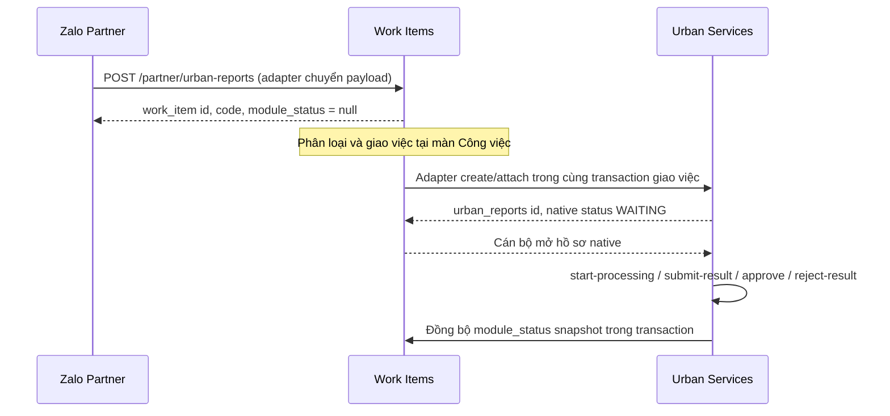

# Tích hợp Dịch vụ đô thị số với Công việc

## Lịch sử thay đổi

| Ngày | Phiên bản | Nội dung |
| --- | --- | --- |
| 2026-09-15 | v1 | Urban Services trở thành phân hệ xử lý native. Work Items sở hữu tiếp nhận nguồn, phân loại, giao việc, từ chối trách nhiệm và xử lý trùng. |

## 1. Ranh giới trách nhiệm

`work_items` là cổng vào duy nhất của sự vụ. `urban_reports` chỉ được tạo khi một công việc đã được phân loại là `URBAN_SERVICES` và được giao việc thành công.

| Work Items sở hữu | Urban Services sở hữu |
| --- | --- |
| Tiếp nhận camera, người dân, cán bộ; nhiều nguồn của một sự vụ; phân loại; giao việc; từ chối trách nhiệm; phát hiện/xác nhận/tách trùng; lịch sử assignment | Hồ sơ `urban_reports` đã materialize; trạng thái native; ảnh trước/sau; timeline native; comment native; bắt đầu xử lý; nộp kết quả; duyệt hoặc trả kết quả |

Không được tạo hoặc tự nhận `urban_reports` trực tiếp từ màn hình Urban Services. Endpoint `start-processing` yêu cầu người gọi đang có assignment được tạo từ Work Items.

## 2. Lĩnh vực Urban Services

Chỉ có hai `category_code` hợp lệ cho `module_code = URBAN_SERVICES`:

- `CAY_XANH` — Cây xanh.
- `HA_TANG_DO_THI` — Hạ tầng đô thị.

`VE_SINH_MOI_TRUONG`, `AN_NINH_TRAT_TU`, `NGAP_UNG` được chuyển đến phân hệ riêng. Không dùng `KHAC`: sự vụ chưa xác định được giữ ở Work Items với `module_code = null`.

## 3. Luồng API

### 3.1. Nguồn người dân Zalo

`POST /partner/urban-reports` được giữ như một endpoint tích hợp của Zalo, nhưng **không còn tạo `urban_reports`**.

- Payload request vẫn dùng `SubmitUrbanReportDto`: `title`, `content`, `address`, `latitude`, `longitude`, `field_id?`, thông tin người phản ánh, `attachment_urls`; nên gửi `source_reference` ổn định để retry cùng một request không tạo nguồn mới.
- `field_id` được adapter đổi sang `category_code`. Nếu không gửi `field_id`, Work Item chưa phân loại.
- Response đổi sang `WorkItemMutationDto`: `id`, `code`, `module_status`, `module_status_label`, `is_assigned`, `is_duplicate`.
- `code` là mã sự vụ dùng tiếp cho API theo dõi; không còn trường `report_code` tại thời điểm vừa gửi.

`GET /partner/urban-reports/tracking` và `GET /partner/urban-reports/mine` được giữ tạm thời để Zalo theo dõi. Hai API này đọc cả Work Item chưa materialize lẫn Urban report đã được giao.

### 3.2. API FE dùng tại màn Công việc

FE dùng API common trong [work_items_workflow_technical_design.md](work_items_workflow_technical_design.md):

- `POST /work-items/intake` cho nguồn đã xác thực nội bộ/tích hợp chung.
- `GET /work-items` để hiển thị danh sách.
- `POST /work-items/classify` để chọn `module_code`, `category_code`, ưu tiên và payload riêng.
- `POST /work-items/assign` để materialize/giao Urban report.
- `POST /work-items/decline` để cán bộ từ chối trách nhiệm.
- Nhóm `/work-items/duplicates/*` và `/work-items/sources/*` để xử lý nguồn/trùng.

### 3.3. API Urban Services còn lại

| Method | Endpoint | Mục đích |
| --- | --- | --- |
| GET | `/urban-reports` | Danh sách hồ sơ native đã materialize |
| GET | `/urban-reports/detail` | Chi tiết, timeline/comment/ảnh native |
| POST | `/urban-reports/start-processing` | Cán bộ đã được giao bắt đầu xử lý |
| POST | `/urban-reports/submit-result` | Nộp kết quả xử lý |
| POST | `/urban-reports/approve` | Duyệt kết quả |
| POST | `/urban-reports/reject-result` | Trả kết quả để làm lại |
| POST | `/urban-reports/comments` | Bình luận nội bộ native |

## 4. API đã gỡ khỏi Urban Services

Các endpoint sau không còn tồn tại; FE phải chuyển sang Work Items:

- `POST /urban-reports/manual-intake`
- `POST /urban-reports/reject`
- `POST /urban-reports/classify`
- `POST /urban-reports/decline-processing`
- `POST /urban-reports/assign`
- `POST /urban-reports/merge`
- `POST /urban-reports/unmerge`
- `POST /urban-reports/merge-suggestions/dismiss`

## 5. Dữ liệu và migration

Không có migration mới trong lần refactor này. Local seed đã được dọn các field Urban cũ và các Work Item/Urban report seed liên quan. Khi chạy seed lại, catalog Urban chỉ tạo `CAY_XANH` và `HA_TANG_DO_THI`.
